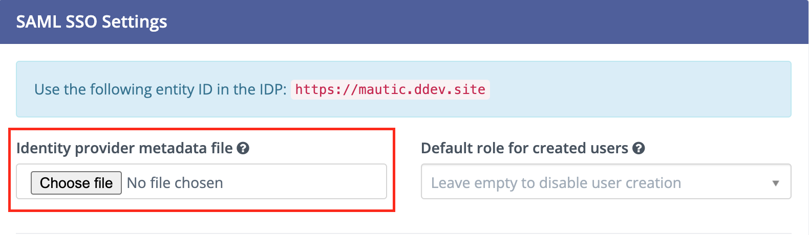
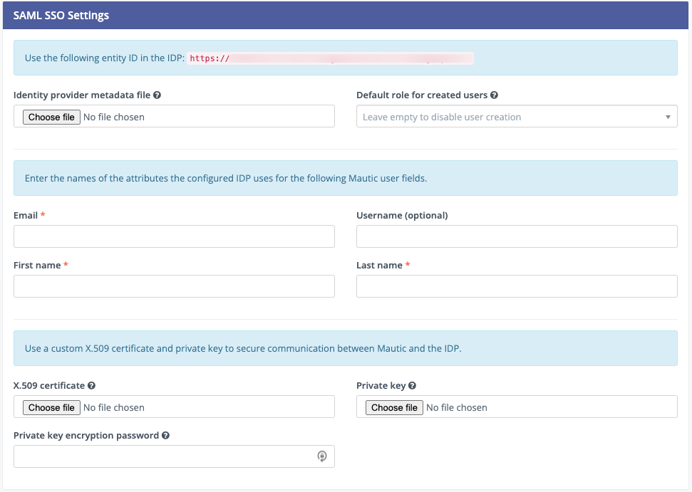

Authentication
##############

Mautic uses basic authentication for Users, however there is the ability to integrate with a SAML SSO - Single Sign-On - provider.

.. vale off

SAML Single Sign On
*******************

.. vale on

SAML is a single sign on protocol that allows single sign on and User creation in Mautic using a third party User source called an identity provider (IDP).

Turning on SAML
===============
To turn on SAML support in Mautic, you first need the IDP's metadata XML which they provide. If it's a URL, browse to the URL then save the content into an XML file.

1. Click the settings wheel in the top right corner to open the **Settings** menu.

2. Navigate to **Configuration** > **User/Authentication** Settings. 

3. Upload this file as the Identity Provider Metadata file.

4. It's recommended to create a non-Admin Role as the default Role for created Users. Select this Role in the '**Default Role for created Users**' dropdown. For more information, see :doc:`Users and Roles</users_roles/managing_users>`.

.. image:: images/roles-permissions.png
  :width: 800
  :alt: Screenshot of the User Role Permission

Configuring the IDP
===================
The IDP may ask for the following settings:

#. Entity ID - this is site URL, displayed at the top of User/Authentication Settings. Copy this exactly 'as is' to the IDP.

#. Service Provider Metadata - if the provider requires a URL, use ``https://example.com/saml/metadata.xml``. To use as a file rather than a URL, browse to that URL and save the content as an XML file.

#. Assertion Consumer Service - Use ``https://example.com/s/saml/login_check``.

#. Issuer - this should come from the IDP but is often configurable. If it's a URL, be sure that the scheme - ``http://`` and ``https://`` - aren't part of it.

#. Verify request signatures or a SSL certificate - If the IDP supports encrypting and validating request signatures from Mautic to the IDP, generate a self signed SSL certificate. Upload the certificate and private key through Mautic's Configuration > User/Authentication Settings under the 'Use a custom X.509 certificate and private key to secure communication between Mautic and the IDP' section. Then upload the certificate to the IDP.

#. Custom attributes - Mautic requires three custom attributes in the IDP responses for the User Email, first name and last name. Username is also supported but is optional. Configure the attribute names used by the IDP in Mautic's Configuration > User/Authentication Settings under the 'Enter the names of the attributes the configured IDP uses for the following Mautic User fields' section.

Azure specific configuration
============================

For Azure you need to enter the complete XML schema including the path, rather than just the attribute name. For example, within ``Attributes`` don't enter the values as ``emailaddress`` or ``surname``.  Instead, see the following example:
Email: http://schemas.xmlsoap.org/ws/2005/05/identity/claims/emailaddress
First Name: http://schemas.xmlsoap.org/ws/2005/05/identity/claims/givenname
Last Name: http://schemas.xmlsoap.org/ws/2005/05/identity/claims/surname

For other properties you can get these values from the metadata XML file that you download from Azure while doing the SIngle SIgn on configuration.

The error that you get when you simply use simple attribute names is: "Invalid Login. Please verify credentials".

Logging in
==========

Once configured with the IDP and the IDP with Mautic, Mautic redirects all logins to the IDP's login. ``/s/login`` is still available for direct logins but you have to access it directly.

Login to the IDP, which then redirects you back to Mautic. If the exchange is successful Mautic creates a User if it doesn't already exist, and logs the User into the system.

Turning off SAML
================

To turn off SAML, click the Remove link to the right of the Identity provider metadata file label.

