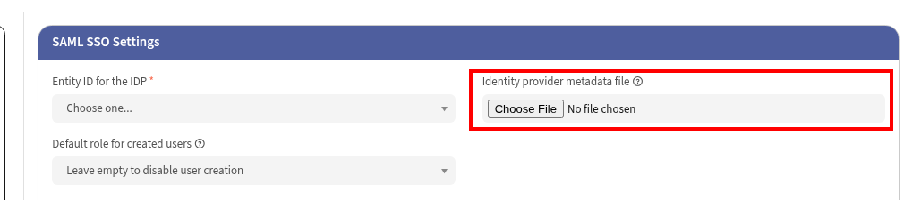
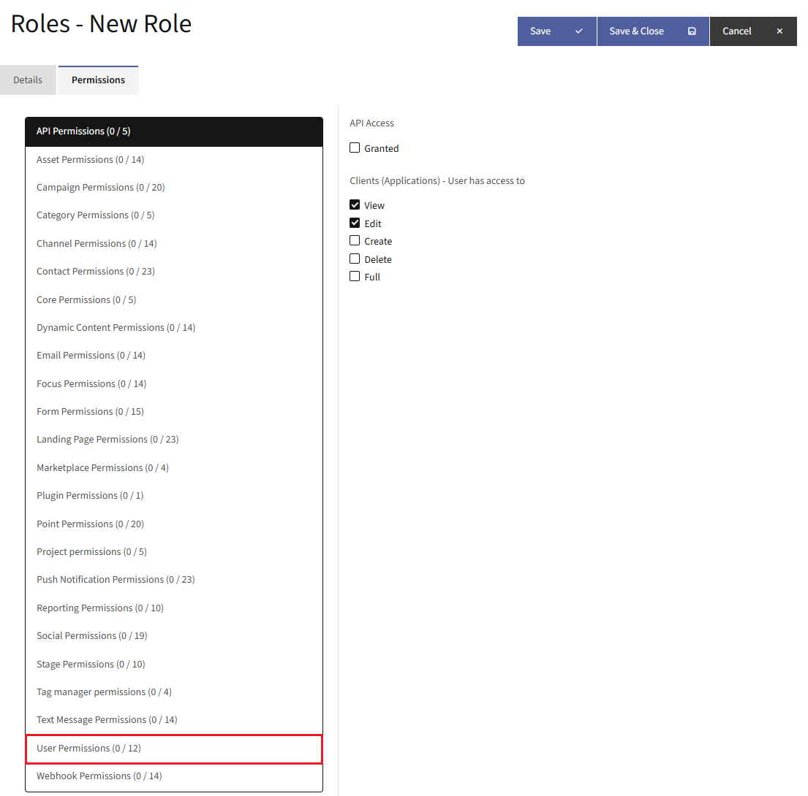
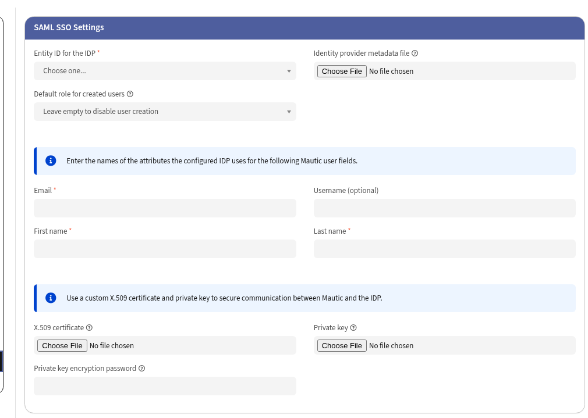

Authentication
##############

Mautic uses basic authentication for Users, however there is the ability to integrate with a SAML SSO - Single Sign-On - provider.

.. vale off

SAML Single Sign On
*******************

.. vale on

SAML is a single sign on protocol that allows single sign on and User creation in Mautic using a third party User source called an identity provider (IDP).

Turning on SAML
===============
To turn on SAML support in Mautic, you first need the IDP's metadata XML which they provide. If it's a URL, browse to the URL then save the content into an XML file.

1. Click the settings wheel in the top right corner to open the **Settings** menu.

2. Navigate to **Configuration** > **User/Authentication** Settings. 

3. Upload this file as the Identity Provider Metadata file.

4. It's recommended to create a non-Admin Role as the default Role for created Users. Select this Role in the '**Default Role for created Users**' dropdown. For more information, see :doc:`Users and Roles</users_roles/managing_users>`.

.. vale off

Configuring the IDP
===================

.. vale on

The IDP may ask for the following settings:

.. vale off

#. **Entity ID** - This is the site URL, displayed at the top of **User/Authentication Settings**. Copy this exactly as is to the IDP.
#. **Service Provider Metadata** - If the provider requires a URL, use ``https://example.com/saml/metadata.xml``. If it needs a file instead of a URL, open the URL in a browser and save the content as an XML file.
#. **Assertion Consumer Service** - Use ``https://example.com/s/saml/login_check``.
#. **Issuer** - It should come from the IDP but is often configurable. If it's a URL, be sure that the scheme - ``http://`` or ``https://`` - isn't part of it.
#. **Verify request signatures or an SSL certificate** - If the IDP supports encrypting and validating request signatures from Mautic to the IDP, generate a self-signed SSL certificate. Upload the certificate and private key through Mautic's **Configuration** > **User/Authentication Settings** under the "**Use a custom X.509 certificate and private key to secure communication between Mautic and the IDP**" section. Then upload the certificate to the IDP.
#. **Custom attributes** - Mautic requires three custom attributes in the IDP responses - email, first name, and last name - and can optionally include a username. Configure the attribute names used by the IDP in Mautic's **Configuration** > **User/Authentication Settings** under the "**Enter the names of the attributes the configured IDP uses for the following Mautic User fields**" section.

.. vale on

.. vale off

Example - Azure SAML SSO
========================

#. Register a new application by going to **Enterprise Applications**, clicking **Create your own application**, and selecting **Integrate any other application you don't find in the gallery (Non-gallery)**.
#. Go to the **Single sign-on** menu.
#. **Entity ID** - This is the site URL, displayed at the top of **User/Authentication Settings**. Copy this exactly as is to the IDP.
#. **Reply URL (Assertion Consumer Service URL)** - Use ``https://example.com/s/saml/login_check``.
#. In the **SAML Certificates** section, download the **Federation Metadata XML**.
#. Upload the downloaded **Federation Metadata XML** file to the **Identity provider metadata file** field in Mautic, and leave the **X.509 Certificate** field blank.
#. Use the following for the custom attributes fields:

   * **E-Mail**: ``http://schemas.xmlsoap.org/ws/2005/05/identity/claims/emailaddress``
   * **First Name**: ``http://schemas.xmlsoap.org/ws/2005/05/identity/claims/givenname``
   * **Last Name**: ``http://schemas.xmlsoap.org/ws/2005/05/identity/claims/surname``
   * **Username (optional)**: ``http://schemas.xmlsoap.org/ws/2005/05/identity/claims/emailaddress``

.. vale on

Logging in
==========

Once configured with the IDP and the IDP with Mautic, Mautic redirects all logins to the IDP's login. ``/s/login`` is still available for direct logins but you have to access it directly.

Login to the IDP, which then redirects you back to Mautic. If the exchange is successful Mautic creates a User if it doesn't already exist, and logs the User into the system.

Turning off SAML
================

To turn off SAML, click the Remove link to the right of the Identity provider metadata file label.

