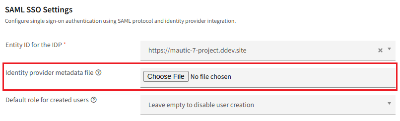
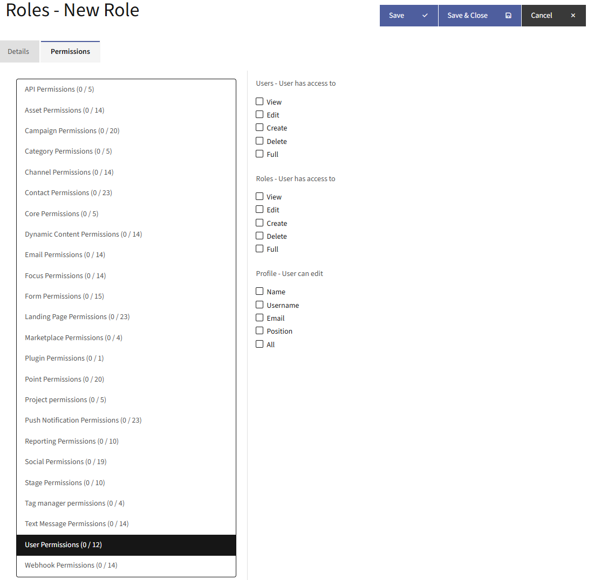
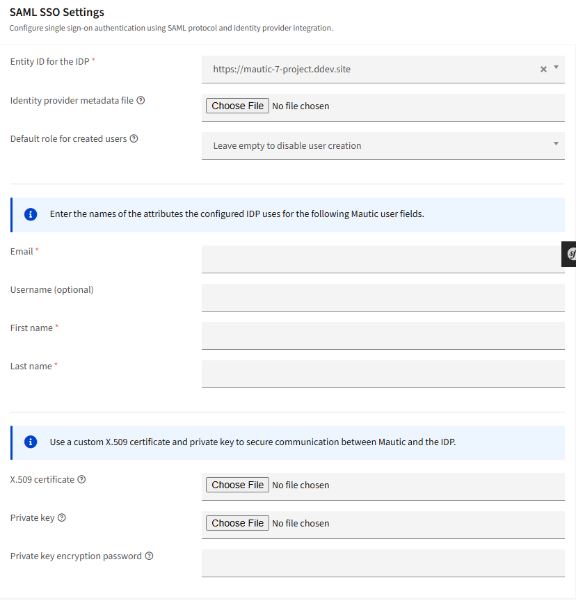

Authentication
##############

Mautic uses basic authentication for Users. You can also let Users log in through a Single Sign-On - SSO - provider using OpenID Connect or SAML.

.. vale off

.. _openid connect authentication:

OpenID Connect
**************

.. vale on

OpenID Connect - OIDC - is an authentication protocol built on OAuth 2.0. When you connect Mautic to an OIDC provider such as Auth0, Users log in with their provider account instead of a Mautic password. Mautic links each provider account to one Mautic User, and can create new Users the first time someone logs in.

.. vale off

Setting up the OIDC provider
============================

.. vale on

Before you turn on OpenID Connect in Mautic, create an app for Mautic in your OIDC provider. Use these settings:

* **Redirect or callback URL** - Use ``https://example.com/s/open_id/login_check``, replacing ``https://example.com`` with your Mautic site URL.
* **Scopes** - Mautic requests the ``openid``, ``email``, and ``profile`` scopes.
* **Claims** - Mautic reads the ``email``, ``preferred_username``, ``given_name``, and ``family_name`` claims, plus the claim set as the identifier field. Mautic needs the email claim to create new Users.

The provider gives you the client ID and client secret that you enter in Mautic.

.. vale off

Turning on OpenID Connect
=========================

.. vale on

#. Click the settings wheel in the top right corner to open the **Settings** menu.
#. Navigate to **Configuration** > **User/Authentication Settings**.
#. In the **OpenID Connect Settings** section, set **Enable** to **Yes**.
#. Fill in the remaining settings. For a description of each setting, see :ref:`OpenID Connect settings <OpenID Connect configuration options>`.
#. Click **Save**.

When you save with OpenID Connect turned on, Mautic tests the connection to the provider. If the test fails, Mautic doesn't save the settings and shows an error next to **Enable**. Check the **Client URL**, **Client ID**, and **Client Secret** values, and the redirect URL configured in the provider.

.. warning::

   Keep the default **Identifier field** value of ``sub`` unless your provider uses a different claim as the unique, permanent ID for each account. When you change this value, Mautic deletes the links between all Mautic Users and their provider accounts, and every User has to link their account again.

.. vale off

Logging in with OpenID Connect
==============================

.. vale on

When OpenID Connect is on, the login page shows a **Sign In with OpenID Connect** button below the Mautic login form. Select the button to log in through the provider, which then redirects you back to Mautic.

When the provider redirects back, Mautic looks for the Mautic User linked to that provider account:

* If a linked User exists, Mautic logs in as that User.
* If no linked User exists and **Allow new user registration** is on, Mautic creates a User with the Role set in **Role for new users**, links it to the provider account, and logs in. Mautic takes the email address, username, first name, and last name from the provider. If the provider doesn't send a username, or another User already has it, Mautic uses the email address as the username.
* If no linked User exists and registration is off, the login fails.

Mautic doesn't link a provider account to an existing Mautic User by matching email addresses. If a Mautic User with the same email address exists but isn't linked, registration fails because the email address is already in use. Link the existing User instead.

.. vale off

Linking existing Users
======================

.. vale on

You can link an existing Mautic User to a provider account in two ways:

* **As an administrator** - Open the User in **Settings** > **Users** and enter the User's ID from the provider in the **OpenID Connect identifier** field. This is the value of the claim set as the identifier field, ``sub`` by default. Mautic shows this field only when OpenID Connect is on.
* **As the User, when Mautic requires OpenID Connect** - Log in with the Mautic username and password. Mautic then asks you to link your account. Select **Link Account** and log in to the provider.

Each provider account can link to only one Mautic User, and each Mautic User can link to only one provider account.

To remove the link, clear the **OpenID Connect identifier** field on the User's edit page and save. Removing the link doesn't log out a User who's already logged in. To remove a User's access completely, deactivate the Mautic User or delete it. If registration is on, also remove the User's access in the provider so they can't create a new Mautic User.

.. vale off

Requiring OpenID Connect
========================

.. vale on

Turn on **Require users to authenticate with OpenID** to make every User log in through the provider before they can use Mautic. The login page then tells Users that the administrator requires OpenID Connect.

The Mautic login form stays on the page. When a User logs in with a Mautic username and password, Mautic doesn't open the app. It shows a page that asks the User to log in through the provider:

* If the account isn't linked yet, select **Link Account** to log in to the provider and link the two accounts.
* If the account is already linked, select **Sign in with OpenID Connect** to log in again through the provider.
* To use a different account, select **Log out**.

.. vale off

SAML Single Sign On
*******************

.. vale on

SAML is a single sign on protocol that allows single sign on and User creation in Mautic using a third party User source called an identity provider (IDP).

Turning on SAML
===============
To turn on SAML support in Mautic, you first need the IDP's metadata XML which they provide. If it's a URL, browse to the URL then save the content into an XML file.

1. Click the settings wheel in the top right corner to open the **Settings** menu.

2. Navigate to **Configuration** > **User/Authentication** Settings. 

3. Upload this file as the Identity Provider Metadata file.

4. It's recommended to create a non-Admin Role as the default Role for created Users. Select this Role in the '**Default Role for created Users**' dropdown. For more information, see :doc:`Users and Roles</users_roles/managing_users>`.

.. vale off

Configuring the IDP
===================

.. vale on

The IDP may ask for the following settings:

.. vale off

#. **Entity ID** - This is the site URL, displayed at the top of **User/Authentication Settings**. Copy this exactly as is to the IDP.

   .. note::

      If you use a custom domain, set the site URL in **Configuration** > **System Settings** to match it. This keeps your SAML setup working correctly.

#. **Service Provider Metadata** - If the provider requires a URL, use ``https://example.com/saml/metadata.xml``. If it needs a file instead of a URL, open the URL in a browser and save the content as an XML file.
#. **Assertion Consumer Service** - Use ``https://example.com/s/saml/login_check``.
#. **Issuer** - It should come from the IDP but is often configurable. If it's a URL, be sure that the scheme - ``http://`` or ``https://`` - isn't part of it.
#. **Verify request signatures or an SSL certificate** - If the IDP supports encrypting and validating request signatures from Mautic to the IDP, generate a self-signed SSL certificate. Upload the certificate and private key through Mautic's **Configuration** > **User/Authentication Settings** under the "**Use a custom X.509 certificate and private key to secure communication between Mautic and the IDP**" section. Then upload the certificate to the IDP.
#. **Custom attributes** - Mautic requires three custom attributes in the IDP responses - email, first name, and last name - and can optionally include a username. Configure the attribute names used by the IDP in Mautic's **Configuration** > **User/Authentication Settings** under the "**Enter the names of the attributes the configured IDP uses for the following Mautic User fields**" section.

.. vale on

.. vale off

Example - Azure SAML SSO
========================

#. Register a new application by going to **Enterprise Applications**, clicking **Create your own application**, and selecting **Integrate any other application you don't find in the gallery (Non-gallery)**.
#. Go to the **Single sign-on** menu.
#. **Entity ID** - This is the site URL, displayed at the top of **User/Authentication Settings**. Copy this exactly as is to the IDP.
#. **Reply URL (Assertion Consumer Service URL)** - Use ``https://example.com/s/saml/login_check``.
#. In the **SAML Certificates** section, download the **Federation Metadata XML**.
#. Upload the downloaded **Federation Metadata XML** file to the **Identity provider metadata file** field in Mautic, and leave the **X.509 Certificate** field blank.
#. Use the following for the custom attributes fields:

   * **E-Mail**: ``http://schemas.xmlsoap.org/ws/2005/05/identity/claims/emailaddress``
   * **First Name**: ``http://schemas.xmlsoap.org/ws/2005/05/identity/claims/givenname``
   * **Last Name**: ``http://schemas.xmlsoap.org/ws/2005/05/identity/claims/surname``
   * **Username (optional)**: ``http://schemas.xmlsoap.org/ws/2005/05/identity/claims/name``

.. vale on

Logging in
==========

Once configured with the IDP and the IDP with Mautic, Mautic redirects all logins to the IDP's login. ``/s/login`` is still available for direct logins but you have to access it directly.

Login to the IDP, which then redirects you back to Mautic. If the exchange is successful Mautic creates a User if it doesn't already exist, and logs the User into the system.

.. vale off

Managing passwords for SAML-authenticated Users
===============================================

.. vale on

.. vale off

Mautic hides the password fields on the Account page and User edit form for SAML-authenticated Users. SAML-authenticated Users log in through the identity provider, so they manage their passwords there, not in Mautic.

.. vale on

Recovering from a login error
=============================

.. vale off

A SAML login can fail if the session expires or if Mautic receives an unexpected response from the IDP, such as the intermittent 'Unknown Response' error. When this happens, Mautic clears the session and shows a retry screen. Select the login button to try again. If the error keeps happening, contact your administrator.

.. vale on

Turning off SAML
================

To turn off SAML, click the Remove link to the right of the Identity provider metadata file label.

