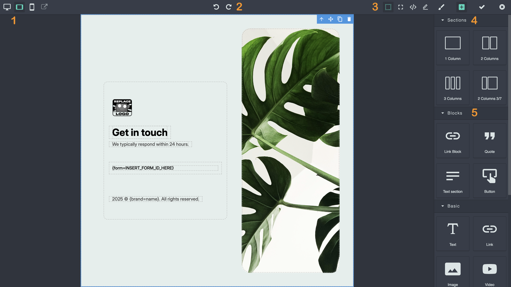
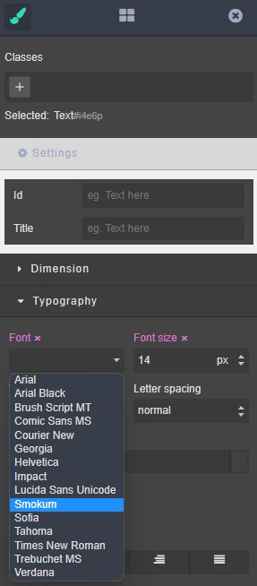

.. vale off

Email & Landing Page Builder
############################

.. vale on

Since :xref:`Mautic 3`, Mautic has shipped with an updated, modern Builder for creating Emails and Landing Pages.
In :xref:`Mautic 4` it's the default Builder.

.. attention:: 
    To use your existing templates with the new Builder, you need to add one line to your configuration file. Read on for further details.

.. vale off

About GrapesJS
**************

.. vale on

:xref:`Webmecanik` initiated the new Email and landing page as an MVP. After developing and improving it using the open source :xref:`GrapesJS` framework, :xref:`Aivie` kindly made it available to the Mautic community.

GrapesJS is an open source, multi-purpose, Web Builder Framework which combines different tools and features with the goal to help build HTML templates without any knowledge of coding.

.. vale off

Available end-user features
***************************

Drag & drop built-in blocks
===========================

.. vale on

GrapesJS comes with a set of built-in blocks, in this way you're able to build your templates faster. If the default set isn't enough you can always add your own custom blocks.

Limitless styling
=================

GrapesJS implements a simple and powerful Style Manager module which enables independent styling of any Component inside the canvas. It's also possible to configure it to use any of the CSS properties.

Responsive design
=================

GrapesJS gives you all the necessary tools you need to optimize your templates to look awesomely on any device. In this way you're able to provide various viewing experiences. In case you require more device options, you can easily add them to the editor.

The structure always under control
==================================

You can nest Components as much as you can but when the structure begins to grow the Layer Manager comes very handy. It allows you to manage and rearrange your elements extremely fast, focusing always on the architecture of your structure.

The code is there when you need it
==================================

You don't have to care about the code, but it's always there, available for you. When it's done, you can grab it and use it wherever you want. Developers could also implement their own storage interfaces to use inside the editor.

Asset manager
=============

With the Asset Manager is easier to organize your media files and it's enough to double click the image to change it.

About the builder
*****************

Enabling the builder
====================

Since Mautic 3.3-RC1 the Builder is available to enable in the Plugins section of Mautic. Go to the Settings by clicking the cog wheel at the top right > Plugins > GrapesJS and click the GrapesJS icon. Change the slider to Yes.

Now you need to **clear your Mautic cache** located in ``var/cache`` and refresh the Landing Page before you can work with the new GrapesJS Builder. Some browsers may also require you to clear the browser cache.

By default, Mautic 4 activates the new Builder. Follow the previous steps to revert to the legacy Builder, remembering to clear the cache and reload the Landing Page.

Email builder overview
**********************

The functions of the Email Builder are as follows:

#. You can select different screen size to preview your Emails.

#. You have the ability to undo and redo your changes.

#. Editor functions from left to right: display grids, Full screen view, export MJML / HTML code, Edit code, display customization options, display blocks, close editor.

#. Layout sections. These objects function as the basic structure of your design. Create your Email structure from sections, and pull in the different blocks you want to use.

#. Content blocks. You can populate your newsletter with these content blocks. Each block has specific layout, settings and design.

Restoring unsaved changes
*************************

As you edit, the Builder keeps a local backup of your content in your browser's local storage. If you close the Builder without saving, for example because the tab crashes or you navigate away, Mautic can recover that work.

The next time you open the same Email or Landing Page in the Builder, Mautic compares the saved content with the local backup. If they differ, Mautic prompts you to restore the backup:

* Select **Restore the backup** to replace the Builder content with the local backup.
* Select **Dismiss** to discard the backup and keep the saved content.

Mautic only shows this prompt when the backup contains unsaved changes. Once you save and reopen the Builder, the backup matches what you saved, so no prompt appears.

Templates
*********

To use your existing templates with the new Builder, you need to add one line to your configuration file in the template folder:

``"builder": ["grapesjsbuilder"],``

If you wish to use the Theme in multiple builders, you can use this syntax:

``"builder": ["legacy", "grapesjsbuilder"],``

.. warning:: 

  This syntax changed between Mautic 3.3.* and Mautic 4 to enable support for multiple Builders - if you have been testing in the beta phase you need to update your configuration files to avoid a 500 error.

The blank Theme contains an example of a full configuration file:

.. code-block:: 

    {
      "name": "Blank",
      "author": "Mautic team",
      "authorUrl": "https://mautic.org",
      "builder": ["legacy", "grapesjsbuilder"],
      "features": ["page", "email", "form"]
    }

From the 3.3 General Availability release there are be three Email templates that support MJML.

Themes
*******

If you search through the list of available Themes, the new MJML Themes ``Brienz``, ``Paprika`` and ``Confirm Me`` display only with the new Builder.

To learn more about creating Themes please :doc:`check the documentation</builders/creating_themes>`. 

Custom fonts
************

From Mautic 5.x you can extend the Style Manager > Typography > Fonts list to include custom fonts.

You define options as elements of the ``'editor_fonts'`` array in the local configuration file - in most cases located in ``app/config/local.php``. The font should have a unique name and a valid CSS style URL. See example below:

.. code-block:: php

    <?php
    // Example local.php
    'editor_fonts' => array(
        '0' => array(
            'name' => 'Smokum',
            'font' => 'Smokum, cursive',
            'url' => 'https://fonts.googleapis.com/css2?family=Smokum&display=swap'
        ),
        '1' => array(
            'name' => 'Sofia',
            'font' => 'Sofia, sans-serif',
            'url' => 'https://fonts.googleapis.com/css?family=Sofia'
        )
    ),

Linking an image
****************

You can turn any image in a Landing Page or Email into a clickable link straight from the Builder, without editing the code. Select the image in the canvas, open the Settings panel on the right, and use the link fields below the **Alt** and **Title** fields.

* The ``href`` field sets the URL the image links to. When you set it, Mautic wraps the image in a link. Leave it empty and the image stays a plain image.
* The ``target`` field controls where the link opens. Choose **This window** to open the link in the current tab, or select a new window to open it in a new tab.
* The ``rel`` field sets the value of the link's ``rel`` attribute, such as ``nofollow`` or ``noopener``. This field is optional.

Because Mautic only wraps the image in a link when you set the ``href`` field, an image without a URL renders normally. The link settings persist when you save and reopen the Landing Page or Email.

Reporting bugs
***************

Known bugs / issues
===================

Please use the issue queue on the :xref:`GitHub repository` to find the latest updates and Report bugs with the Plugin. Be sure to search first in case someone has already reported the bug.

Switching back to the legacy Builder
************************************

In case you aren't happy with the Plugin at the moment, you can easily switch back to the legacy Builder (original Mautic Builder). You can do so very quickly:

#. Go to Mautic Settings > Click the cogwheel on the right-hand top corner

#. Open the Plugins Directory > click "Plugins" inside the menu

#. Find the GrapesJs Plugin and click it > Click "No" and then "Save and Close"

#. Clear the cache and reload the Landing Page - you may also need to clear your browser cache.

After unloading GrapesJs Plugin, the legacy Builder becomes active again.

Thanks and credits
******************

.. vale off

Thank you to everyone who contributed to this project. Special thanks to Adrian Schimpf from :xref:`Aivie` for all their hard work in leading the project, to :xref:`Webmecanik` for initializing this amazing new builder and to Joey from :xref:`Friendly Automate` for donating three Email Themes to the Community. Additional contributions: Alex Hammerschmied from :xref:`hartmut.io`, Dennis Ameling.

.. vale on

And of course a really big thank you to all the contributors who have helped to bring this project to this point.
