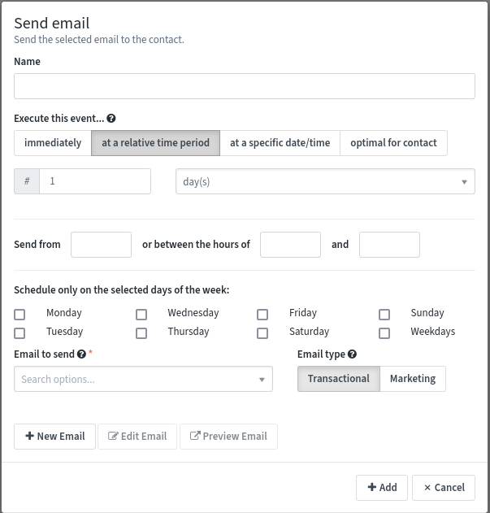

.. vale off

Using the Campaign Builder
##########################

.. vale on

The Campaign Builder provides a blank canvas on which you can build your Campaign workflow. The Campaign Builder allows the use of conditions, decisions, and actions. It enables you to create a simple workflow by dragging and dropping various decisions, actions, and conditions onto a canvas.

To build your Campaign, perform the following steps:

#. Click **Launch the Campaign Builder** on the New Campaigns wizard. The Contact Sources menu appears as shown in the following image.
   
   .. image:: images/campaign-sources.png
    :width: 400
    :alt: Screenshot of Campaign builder showing Contact sources

   In this step, you specify the Contacts to include in your Campaign. It's possible to trigger a Campaign when Contacts join a Segment, submit a Form, or a combination of the two.

#. Select where your Campaign pulls the Contacts from:

   -  **Contact Segments**: choose this option if you want to send your Campaign to a specific group of your Contacts that share certain attributes, for example, 'Located in the United States' or 'Visited Product A' and are in an existing Segment based on this criteria.

   Note that the Segment selection shows public Segments only. If you create a Segment marked as private, that Segment won't be available for use in Campaigns.

   -  **Contact Forms**: choose this option if you want to start the Campaign when the Contact completes a specified Form. Forms are the primary point of gathering information about a Contact. It's possible to take action in a Campaign based on the Form field values submitted.

   You can select a mix of both types of Contact sources for your Campaign. To use both, click the grey selector button on either the left or right side of the **Contact source** box to add whichever source type you didn't originally select.

  .. image:: images/multi-source-campaign.png
      :width: 600
      :alt: Screenshot of Campaign builder showing multiple sources selected.

#. After selecting one or more Contact sources, click the grey selector button to add at least one event to your Campaign. A Campaign event comprises of a combination of actions, decisions, and/or conditions as shown in the following image:

  .. image:: images/campaign-events.png
      :width: 600
      :alt: Screenshot of Campaign builder showing the available Campaign events.

  For more information about Campaign Actions, Decisions, and Conditions, see the following topics.

Actions
-------
Campaign actions are events that you initiate on your Contacts or Contact records. These can represent sending communications to the Contact or may automate operational tasks to keep your marketing running. A single Campaign can include more than one action. When you create a Campaign, you select one of these actions to begin the workflow.

The actions that Mautic offers in a Campaign include:

.. list-table:: Campaign Actions in Mautic
    :header-rows: 1
    :widths: 5, 95

   * - Action
     - Description
   * - **Add Do Not Contact**    
     - Adds the Contact to the Do Not Contact (DNC) list
   * - **Add to Company's score**
     - Adds or subtracts a designated number of Points to or from the score for all Companies associated with the Contact.
   * - **Add Company action**  
     - Associates a Contact with a Company and sets the Company as the primary Company for the Contact.
   * - **Adjust Contact Points**  
     - Adds or subtracts Points from the Contact’s Point total or Group.
   * - **Change Campaigns**  
     - Removes a Contact from the existing Campaign, moves them into another Campaign, restarts the current Campaign or a combination of these. You must remove a Contact from a Campaign before restarting the Campaign.
   * - **Change Contact's Stage**  
     - Moves a Contact to the specified Stage.
   * - **Delete Contact**  
     - Permanently deletes the Contact record along with all the information about that Contact, including the Campaign event log record about that Contact. See the :doc:`Segment docs</segments/manage_segments>` about how to use this action to delete all Contacts in a Segment.
   * - **Jump to Event**  
     - Moves Contacts from one point in a Campaign to another without rebuilding events. Use this action to send the Contact to a different path in the Campaign.
   * - **Modify Contact's Segments**
     - Adds or removes Contacts to/from Segments. When removing a Contact from a dynamic - filter-based - Segment via a Campaign action, they won't be re-added to the Segment based on meeting the filter criteria.
   * - **Modify Contact's tags** 
     - Overwrites or appends Tags on a Contact record. You can add or remove Tags, or do both, in the same action.
   * - **Push Contact to Integration** 
     - Sends the Contact record to the selected Integration, either creating a new Contact in the chosen Integration or updating the connected Contact record.
   * - **Remove Do Not Contact**  
     - Removes the Contact from the Do Not Contact (DNC) list.
   * - **Send a Webhook** 
     - Sends a Webhook to a defined URL, using the GET, POST, PUT, PATCH, or DELETE methods. Headers and data is customizable, and support the use of tokens, such as Contact fields and the Contact's IP address. For example, ``{contactfield=firstname}``
   * - **Send Email**   
     - Sends a transaction or marketing Email to the selected Contact. You can send a transactional Email to the Contact multiple times. You can only send a marketing Email to the Contact  once across multiple sources. If the Contact has already received this Email from another source or the current Campaign, they aren't sent the Email again and the Contact progresses through the Campaign.
   * - **Send Email to User** 
     - Sends an Email to an entity other than the Contact. This may be a Mautic User, the Contact's owner, or non-Users. Emails sent using this action don't generate any statistics for Contacts or Emails.
   * - **Send Marketing Message**
     - Sends a message using the Contact's preferred Channel.
   * - **Update Contact**
     - Updates the existing Contact's fields with the specified values.
   * - **Update Contact's primary Company**
     - Updates the existing Contact's primary Company fields with the specified value. See :doc:`documentation on Companies </companies/companies_overview>`.
   * - **Update Contact owner**
     - Updates the Contact's owner.

.. vale off

Notes on Campaign Actions
~~~~~~~~~~~~~~~~~~~~~~~~~

.. vale on

#. As the first step of your Campaign, you typically send out an Email to your Segments. When you add an Email to a Campaign, you can select a potential **delay** for Email delivery as shown in the following image.

When attaching an Action to a decision's **non-action** initiated decision path, the delay becomes how long the Contact has to take action before the Campaign progresses down the non-action path. Image showing delayed actions on a non-action decision path in a Campaign.

#. The Delete Contact action also deletes the Campaign event log record about that Contact. Therefore, though this action might always display 0% progress on the Campaign detail overview, it could have deleted some Contacts.

.. note::
    The Delete Contact action doesn't allow connection with other Campaign events. Since the Contact won't exist after triggering this action, Campaign events can't exist after this point.
   
After adding an action, you can place a decision on the Campaign.

Decisions
---------

Campaign Decisions are actions that your Contacts initiate. Downloading an Asset, opening an Email, or visiting a Landing Page are examples of Decisions. These Decisions can be either directly initiated or implied based on non-action. The options for Decisions change based on the Campaign Actions that you select.

A decision usually has two paths denoted by the red and green icons on the decision tree.

Green paths
~~~~~~~~~~~

Green paths indicate positive or affirmative actions. 

A Contact takes this path if the Contact has made a direct action such as opening an Email or submitting a Form. Execution of Actions that follow the green paths happen immediately - or scheduled immediately in the case of a delay on the following action - at the time the Contact takes the action.

Red paths
~~~~~~~~~

Red paths indicate non-action. 

A Contact takes this path if a Contact hasn't taken the action. Use an action's delay settings to define at what point the Campaign should send the Contact to the following steps on this path.

Depending on meeting - or not meeting - the criteria for the decision, the Contact takes either the green or the red paths in the decision tree. For example, consider an instance where the decision is to visit a Landing Page. There can be two outcomes. If the Contact chooses to visit the Landing Page, then the green decision path connects to the next action in the Campaign workflow. If, however, the Contact doesn't visit the Landing Page, then the red decision path connects to a different action - for example a delay of 7 days then the marketer may send a follow up Email.

.. image:: images/campaign-decisions.gif
    :width: 600
    :alt: Screenshot showing Campaign decisions available in Mautic

Here are the decisions that Mautic offers in the Campaign Builder:

.. list-table:: Decision Actions in Mautic
   :header-rows: 1
   :widths: 5, 95

   * - Decision
     - Description
   * - **Device visit**    
     - Set the options to track whether your Contact visits your resources from a specific device type, brand, or operating system.
   * - **Downloads Asset**    
     - Set the options to track whether your Contact downloads specified Asset/s.
   * - **Request Dynamic Content**    
     - Set options to push Campaign-based Dynamic Content if you have a webpage or Landing Page where you want to add Dynamic Content.
   * - **Submits Form**    
     - Set options to track whether the Contact has submitted any Mautic Forms. You can also limit this decision to track specific Forms.
   * - **Visits a page**    
     - Specify one or multiple pages you want the Contact to visit. Can be Mautic Landing Pages or pages on your website.
   * - **Email-Related Decisions**    
     - Some decisions in the Campaign Builder are available for use only if you select the Send Email Campaign action.		

Here are the decisions that are Email-related:

.. list-table:: Email-related Decision Actions in Mautic
   :header-rows: 1
   :widths: 5, 95

   * - Decision
     - Description
   * - **Opens Email**    
     - Tracks whether the Contact opens the Email.
   * - **Clicks Email**    
     - Tracks whether the Contact clicks a link within the sent Email. This infers that the Contact opened the Email.
   * - **Replies to Email**    
     - Tracks if a Contact has replied to an Email that you sent. For more information, see Contact replies.	
	
	
Conditions
----------

Campaign conditions execute different actions based on a Contact's data. For example, to execute an action if a Contact has a valid Email address or do something else if they don't.

A condition has two paths, denoted by red and green icons as explained in the previous section.

Here are the different conditions that Mautic offers in the Campaign Builder:

.. list-table:: Condition Actions in Mautic
   :header-rows: 1
   :widths: 5, 95

   * - Condition
     - Description
   * - **Contact Campaigns**    
     - Checks if the Contact is a member of another Campaign.
   * - **Contact device**    
     - Checks if the Contact has interacted with your Campaign from a specific device type, brand, or OS.
   * - **Contact field value**    
     - Checks if the information matches the selected criteria on the Contact record, the Contact's primary Company, or UTM tags.
   * - **Contact owner**    
     - Checks if the selected User is the Contact's owner.
   * - **Contact Segments**    
     - Checks if the Contact is a member of selected Segments.
   * - **Contact Tags**    
     - Checks if specified Tags are on the Contact record.
   * - **Contact Points**
     - Checks if the Contact has a certain number of Points or a Group score.
   * - **Form Field value**    
     - Checks if values submitted for a selected field on a selected Form matches specified criteria.
   * - **Has active notification**    
     - Checks if the Contact has an active web notification.	
   * - **Has valid Email address**    
     - Checks if the Contact's Email address has a valid syntax, for example name@example.com without spaces, other invalid characters or formats.	
	
Notes on delayed conditions and dates
~~~~~~~~~~~~~~~~~~~~~~~~~~~~~~~~~~~~~
Mautic respects delays set on the condition itself before passing down to a delay on any connected action. For example, if you are coming from a negative path on 'Opens Email', you can set a condition of 'has active notification' with a relative date of 1 day, followed by 'Send Email' on the negative path with a relative date of 2 days. Mautic checks after 1 day if there is an active notification and if there isn't, schedules the Email for two days later.

Using a custom date field to trigger a Campaign
~~~~~~~~~~~~~~~~~~~~~~~~~~~~~~~~~~~~~~~~~~~~~~~
In the condition based on a Contact field value, select the required date field. Then select date as the operator and select the required value from the drop-down list.

In the Anniversary option, you can only enter the day and month values.

Mautic evaluates Campaign conditions immediately, therefore if the date in the field matches the condition, Mautic executes then the positive action. If the date doesn't match, Mautic executes the negative action. The Contact doesn't wait for the condition to be TRUE.

In order to run Campaigns based on a particular date where a Contact may or may not be "included" today:

- create a Segment with a filter where the date field = ``TODAY``.
- initiate the Campaign based on that Segment.
- as Contacts move in and out of the Segment, the Campaign runs.
- you can eliminate the condition since the Segment is changing daily.

This **doesn't work** for the Anniversary option.

If a Contact appears again at a later date in that Segment because the value of the date has changed, then the Contact passes through the Campaign only once, and hence isn't included in the Campaign again.

.. vale off

Triggering Campaign events
--------------------------

.. vale on

Actions and Decisions in Mautic require a :doc:`cron job</configuration/cron_jobs>` which executes the following command at the desired interval:

.. code-block:: shell

   php /path/to/mautic/bin/console mautic:campaigns:trigger

If you want to execute the command at different intervals for specific Campaigns, you can pass the ``--campaign-id=ID`` argument to the command.

.. vale off

Cloning Campaign events
-----------------------

.. vale on

Since Mautic 5.1, the Campaign builder includes a feature that allows Users to clone - copy and paste - Campaign events, making it easier to replicate complex workflows or reuse specific actions, decisions, or conditions across different Campaigns. This feature supports cloning events within the same Campaign as well as between different Campaigns.

To clone an event:

1. Hover over the Campaign event that you want to clone and click the copy icon button to store the event in the clipboard:

.. image:: images/clone-campaign-event.png
  :width: 277
  :alt: Screenshot of hovering over a Campaign event to reveal the clone option

2. Click on the anchor of the event after which you want to insert the cloned event. This opens up a modal window.

3. In the modal window, click the "Insert" button to paste the stored event:

.. image:: images/paste-cloned-event-modal.png
  :width: 583
  :alt: Screenshot of the modal window with the insert option to paste the cloned event

The cloned event is now inserted in the Campaign workflow.