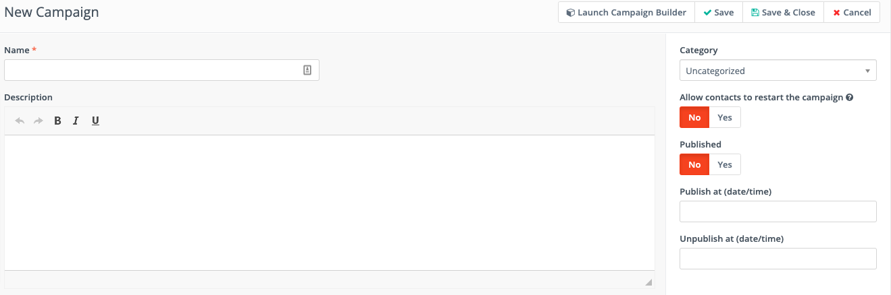

.. vale off

Creating Campaigns
##################

.. vale on

Creating Campaigns is a central part of the marketing automation process. When you create a new Campaign, you perform the basic administrative tasks such as choosing a name for the Campaign, creating a description, assigning a Category and defining publishing information for the Campaign.

At the heart of any marketing automation Campaign is the Campaign Builder. This allows you to specify how Contacts enter the Campaign, and what happens at every point after they enter the workflow.

After establishing the basics, the Campaign Builder handles the finer details of building a Campaign workflow using Conditions, Decisions, and Actions.

Prerequisites
*************

Before you start creating Campaigns, you must ensure that you have the
following set up:

#. Create a Contact Segment or a Form to initialize your Campaign. If you already have an existing Segment or Form to use, ensure that they're up-to-date.

#. Create any custom field that you need for your Contact profile.
#. Set up and configure any Integration that you intend to use in your Campaign.
#. Set up appropriate Channels such as Text Messages, Email, Focus items to communicate with your Contacts.
#. Create Assets, Landing pages, or other Components that you want to use for your Campaign. If using Assets, ensure that you upload them before creating your Campaign.

Although you can set up Channels and create Components during the process of creating the Campaign, it's ideal to have them ready beforehand as it makes the Campaign building process faster and more efficient.

.. vale off

Create your first Campaign
**************************

.. vale on

After you have the prerequisites in place, you are ready to create your
first Campaign.

To begin creating Campaigns, perform the following steps:

#. Launch your Mautic instance.
#. Click **Campaigns** in the left navigation menu. The Campaigns page appears.
#. Click **New** on the Campaigns page. The New Campaign wizard appears as shown in the following image. Screenshot of the New Campaign screen

#. Enter a name and a brief description for your Campaign.
#. Optionally, you can set the following properties:

-  **Category** - Choose a Category to assign your Campaign to. Categories help you organize your Campaigns. To learn more about creating and managing Categories, see `Categories </categories>`__.
-  **Allow Contacts to restart the Campaign** - Click the toggle switch to allow Contacts to restart the Campaign if you’re building a Campaign for a recurring message - for example birthdays, subscriptions - or transactional operations - for example activity notifications, updating data. Enabling this option allows Contacts to go through the same Campaign multiple times.
-  **Published** - Click the toggle switch to publish or un-publish the Campaign. Ensure that you don't publish a Campaign until you're actually ready for it to go live. You can also schedule to publish or un-publish a Campaign at a future date by selecting a time and date.

#. Click **Launch Campaign Builder** to start building your Campaign,
   and add at least one event. For information about how to use the
   Campaign Builder, see `Using the Campaign
   Builder </campaigns/campaign-builder>`__.

#. After adding events to your Campaign, close the Campaign Builder and
   click **Save & Close** to save your changes.

Add or remove Contacts in batch
*******************************

After creating your Campaign, you can add or remove Contacts in batch
for Campaigns using the following command:

.. code-block:: shell

   php /path/to/mautic/bin/console mautic:campaigns:update

See documentation on `cron jobs </set_up/cron-jobs>`__ for further
details.
