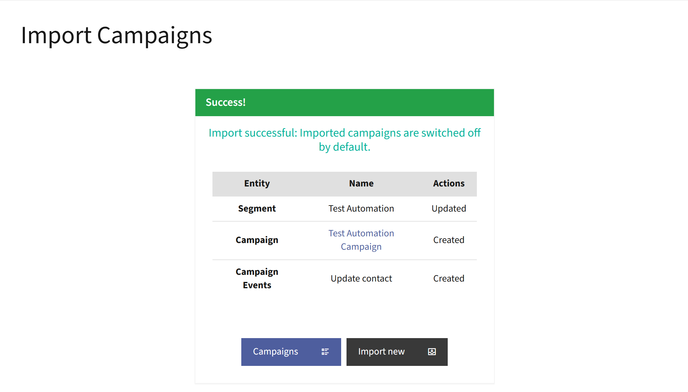

Importing Campaigns
###################

The import feature allows you to add pre-configured Campaigns to your Mautic instance using ZIP files that contain all the relevant data needed to construct a Campaign.

How the importing Campaign works
********************************

During the import process, Mautic performs a comprehensive analysis of the data:

Permissions
    Checks that the logged-in User has the correct permissions to import.

Entities
    Identifies required entities for the Campaign to function.

Plugin validation
    The import function verifies Plugin installation. It checks if a Campaign template depends on an external Plugin. If a required Plugin is missing, the import process halts and prompts the User to install the necessary Plugin before continuing.

Conflict resolution
    Validates for potential ID conflicts in imported entities. Where conflicts exist, Mautic provides options to:
    
    * Update existing entities, allowing Administrators to update existing Campaigns.
    * Create new entities using a new ID.

Automatic data mapping
    Mautic maps imported data to the correct locations and automatically creates any necessary dependent entities.

Campaign activation
    After a successful import, the Campaign remains inactive by default.

.. vale off

Importing a Campaign
********************

.. vale on

You can import a Campaign in three ways.

1.\ Using Mautic instance
=========================

#. Click on the **Campaigns** menu to view existing Campaigns.

#. Click the **Options** button that resembles a cog icon in the top-right corner.

#. Select **Import** from the dropdown menu.

   |

   .. image:: images/import_campaign.png
      :alt: Import Campaign button in the Mautic Campaigns section

   |

#. Choose the Campaign ZIP file\* you wish to import, then click the **Upload** button.

   |

   .. image:: images/upload_zip_file.png
      :alt: Choose file and Upload buttons to import Campaigns

   |

   .. tip::

      \* Use a ZIP file created from the Mautic export function - **recommended**

#. Ensures inclusion of Campaign data, external Assets, and Dynamic Content.

#. Select an **Actions** option from the dropdown menu for the **Campaign** and **Segment** entities. Choose either **Update entity** or **Create new entity**.

#. Click the **Proceed** button.

   |

   .. image:: images/select_actions_import_campaigns.png
      :alt: Highlight of Actions dropdown menu and Proceed buttons in Mautic Import Campaigns 

   |

Once the import is successful, you should see a success notification.

.. important::

   The Mautic instance only supports importing ZIP files. You can use both the command line and API endpoints to import correctly structured JSON files.

Activating an imported Campaign
-------------------------------

Follow the steps below to activate an imported Campaign:
      
#. Click on the **Campaigns** menu
#. Locate the newly imported Campaign
#. Click the red toggle button next to the Campaign's name to change the status to active

   |

   .. image:: images/campaign_inactive_toggle_button.png
      :alt: Highlight of a Campaign's inactive toggle button

   |

#. Click **Yes** when a prompt message appears

   |

   .. image:: images/campaign_activation_prompt_message.png
      :alt: A prompt message with text: All scheduled events will execute according to the Republish Behavior setting. Currently set to: Count delay regardless of publish state. 

   |

#. The toggle button automatically changes to green, indicating that the Campaign is active
      
   |

   .. image:: images/campaign_active_toggle_button.png
      :alt: Highlight of a Campaign's active toggle button 

   |

2.\ Using the command line
==========================

You can import Campaigns using the command line:

.. code-block:: bash

   bin/console mautic:entity:import \
   --entity=campaign \
   --file=/tmp/entity_data.zip \
   --user=<user_id>

**Command parameters**

* ``--entity=campaign``: specifies the type of entity to import, in this case, ``campaign``.

* ``--file=/tmp/entity_data.zip``: the path to the ZIP file containing the Campaign data.

* ``--user=<user_id>``: the ID of the User performing the import.

.. important::

   * Ensure the ZIP file is a valid Mautic Campaign export
   * The specified User must have appropriate import permissions
   * Verify the path is correct before running the command

3.\ Using Mautic API
====================

You can import Campaigns programmatically using the Mautic API.

#. **cURL example with ZIP file**

   .. code-block:: bash

      curl -X POST 'https://example.com/api/campaigns/import' \
      -H 'Authorization: Bearer YOUR_ACCESS_TOKEN' \
      -H 'Content-Type: multipart/form-data' \
      -F 'file=@/path/to/campaign_export.zip'

#. **Python example with JSON data**

   .. code-block:: python

      import requests

      # API Endpoint
      url = 'https://example.com/api/campaigns/import'

      # Authentication
      headers = {
          'Authorization': 'Bearer YOUR_ACCESS_TOKEN',
          'Content-Type': 'application/json'
      }

      # Campaign import data
      payload = {
          'name': 'Imported Campaign',
          'description': 'Campaign imported via API',
          # Add other campaign details as needed
      }

      # Send import request
      response = requests.post(url, headers=headers, json=payload)

      # Handle response
      if response.status_code == 200:
          imported_campaign = response.json()
          print("Campaign imported successfully")

API import methods
------------------

Mautic supports two primary methods of API-based Campaign import:

#. **ZIP File Import**
   
   * Use ``multipart/form-data`` content type
   * Upload the complete Campaign export ZIP file
   * Includes all Campaign assets and dependencies from the ZIP file

#. **JSON Data Import**
   
   * Use ``application/json`` content type
   * Send Campaign details directly in the request body
   * Useful for creating new Campaigns or updating existing Campaigns

.. important::
    
   * Replace ``example.com`` with your actual Mautic instance domain
   * Ensure you have a valid access token by accessing the API Credentials section within Mautic's settings.
   * The imported Campaign must comply with Mautic's Campaign structure
   * Verify import permissions and data integrity
