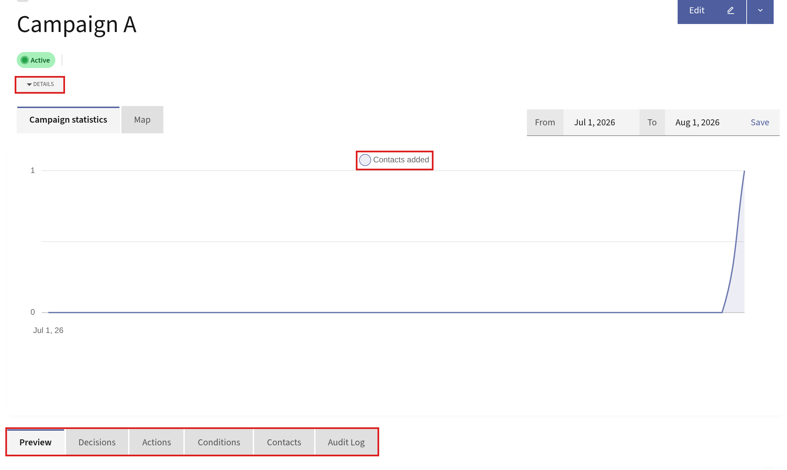

.. vale off

Managing Campaigns
##################

.. vale on

You can manage your Campaigns from the Campaigns overview.

Click any Campaign name on the Campaigns list to take you to the Campaign overview. Each tab displays details of your Campaign, including the number of Contacts added to the Campaign, the number of Emails sent, the number of page views resulting from the Campaign, and more.

Additional information includes a quick overview of what decisions and actions are available in the Campaign, as well as a grid layout overview of all the Contacts in the Campaign.

The following image shows a sample Campaign overview with its highlighted panels:

The **Details** drop-down menu gives a quick overview of the most important information about your Campaign. This information includes the name of the User who created the Campaign, Category of the Campaign, creation date and time, activating date and time, Contact Segments in your Campaign and more.

The **Campaign Statistics** panel shows the number of Contacts added to the Campaign over the specified period of time in graphical format. To specify the time period, use the From and To date selectors, and click Apply.

The **Preview** tab displays a diagrammatic preview of your Campaign.

The **Decisions** tab displays a tabular list of all the decisions that you have added to your Campaign.

The **Actions** tab displays a tabular list of all the actions that you have added to your Campaign.

The **Conditions** tab displays a tabular list of all he conditions that you have added to your Campaign.

The **Contacts** tab displays a grid view of all the Contacts that you have added to your Campaign.

The **Recent Activity** panel on the right displays the recent activities that have taken place in the Campaign.

.. vale off

.. _campaign reactivate behavior:

Campaign reactivation behaviour
*******************************

.. vale on

When you deactivate and then reactivate a Campaign, Mautic provides control over how scheduled events with relative delays - such as "Send Email 5 days after joining" - should behave. This feature gives you flexibility in managing Campaign timing based on your specific use case.

.. note::
    This setting only affects events that use relative delays - interval-based scheduling. Events with absolute dates aren't affected by this setting.

Configuring reactivation behaviour
==================================

You can configure the reactivation behaviour at two levels:

1. **Global default** - Set in Configuration > Campaign Settings > Campaign Reactivation Behaviour. This applies to all Campaigns unless overridden.
2. **Per Campaign** - Set when creating or editing a Campaign. This overrides the global default for that specific Campaign.

Reactivation behaviour options
==============================

There are three options available for how scheduled events should behave after reactivation:

Count delay regardless of activation state
------------------------------------------

This is the default behaviour. The original trigger date is used and inactive time doesn't affect scheduling.

**Example scenario:**

- Campaign trigger date: January 1
- Event delay: 10 days
- Calculated event date: January 11
- Campaign deactivated: January 5
- Campaign reactivated: January 7

**Result:** the event still executes on January 11, as originally scheduled.

**When to use:** this option maintains the original scheduled timing, treating the Campaign's activation state as irrelevant to the delay calculation. Use this when you want consistency with the original schedule, or when temporarily deactivating a Campaign shouldn't affect when events execute.

Restart on reactivation
-----------------------

The delay counter resets completely when you reactivate the Campaign.

**Example scenario:**

- Campaign trigger date: January 1
- Event delay: 10 days
- Original calculated event date: January 11
- Campaign deactivated: January 5
- Campaign reactivated: January 7

**Result:** the event is rescheduled to execute 10 days after reactivation, on January 17.

**When to use:** this option is useful when you want to ensure all Contacts receive the full intended delay after any Campaign changes. For example, if you deactivate a Campaign to make significant updates and want everyone to experience the complete updated workflow timing.

Count delay only while active
-----------------------------

Events only count days when the Campaign is active. Inactive periods don't count toward the delay.

**Example scenario:**

- Campaign trigger date: January 1
- Event delay: 10 days
- Original calculated event date: January 11
- Campaign deactivated: January 5 (after 4 days active)
- Campaign reactivated: January 10 (after 5 days inactive)

**Result:** the event is rescheduled to execute on January 16. The 4 days while active (January 1-5) count toward the 10-day delay, leaving 6 more days needed after reactivation (January 10 + 6 days = January 16).

**When to use:** this option is ideal when you want precise control over the actual time Contacts spend in an active Campaign state. Use this for compliance scenarios, trial periods, or when you need to pause Campaigns without affecting the intended engagement timeline.

Viewing last activation date
============================

On the Campaign details page, you can see the **Last Publish Date** which indicates when the Campaign was most recently activated. This date is used as the reference point for the "Restart on reactivate" option to recalculate scheduled event timings.

Activate and deactivate Campaigns
=================================

When you activate or deactivate a Campaign, Mautic displays a confirmation message that shows the current reactivation behaviour setting. This helps you understand what happens to scheduled events before you confirm the action.

For example: "All scheduled events execute according to the reactivation behaviour setting. Currently set to: Count delay regardless of activation state"

.. warning::
    When you deactivate a Campaign, all processing of Contacts and Campaign events - including scheduled events - stops immediately. Scheduled events remain in the queue but won't execute until you reactivate the Campaign.

.. note::
    The recalculation of scheduled events happens when the Campaign event log is being evaluated by the Cron job, not at the moment you reactivate the Campaign. This means that if a recalculated trigger date is still in the past when evaluated, the event executes immediately. If it's in the future, the event is rescheduled accordingly.

Tracking rescheduled events
===========================

Mautic records all changes to scheduled event trigger dates in the ``campaign_lead_event_log.metadata`` column. This audit trail allows you to investigate when and why events were rescheduled, providing transparency and helping with troubleshooting.

You can view this information in the Contact's timeline under **Campaign Event Scheduled** entries, where rescheduled events show the updated trigger date and the reason for the change.