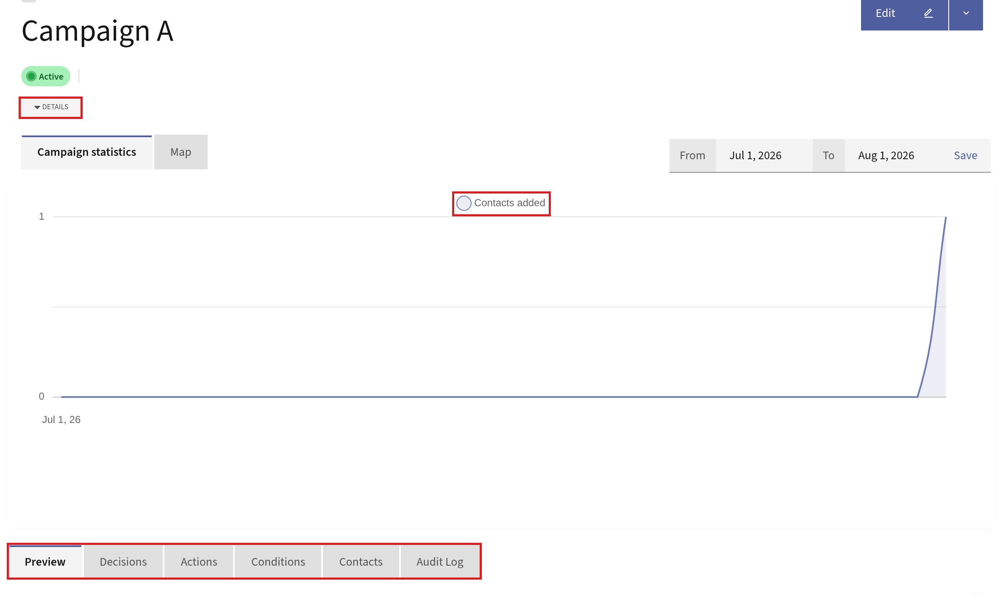

.. vale off

Managing Campaigns
##################

.. vale on

You can manage your Campaigns from the Campaigns overview.

Click any Campaign name on the Campaigns list to take you to the Campaign overview. Each tab displays details of your Campaign, including the number of Contacts added to the Campaign, the number of Emails sent, the number of page views resulting from the Campaign, and more.

Additional information includes a quick overview of what decisions and actions are available in the Campaign, as well as a grid layout overview of all the Contacts in the Campaign.

The following image shows a sample Campaign overview with its highlighted panels:

The **Details** drop-down menu gives a quick overview of the most important information about your Campaign. This information includes the name of the User who created the Campaign, Category of the Campaign, creation date and time, activating date and time, Contact Segments in your Campaign and more.

.. vale off

The **Total contacts** card at the top of the page shows how many Contacts are currently in the Campaign. Click the card to open the Contacts list filtered to that Campaign. The card only appears if you have permission to view Contacts.

.. vale on

The **Campaign Statistics** panel shows the number of Contacts added to the Campaign over the specified period of time in graphical format. To specify the time period, use the From and To date selectors, and click Apply.

The **Preview** tab displays a diagrammatic preview of your Campaign.

The **Decisions** tab displays a tabular list of all the decisions that you have added to your Campaign.

The **Actions** tab displays a tabular list of all the actions that you have added to your Campaign.

The **Conditions** tab displays a tabular list of all he conditions that you have added to your Campaign.

The **Contacts** tab displays a grid view of all the Contacts that you have added to your Campaign.

The **Recent Activity** panel on the right displays the recent activities that have taken place in the Campaign.

.. vale off

Campaign reactivation behavior
******************************

.. vale on

When you deactivate and then reactivate a Campaign, Mautic provides control over how scheduled events with relative delays - such as 'Send Email 5 days after joining' - should behave. This feature gives you flexibility in managing Campaign timing based on your specific use case.

.. note::

   This setting only affects events that use relative delays - interval-based scheduling. Events with absolute dates aren't affected by this setting.

Configuring reactivation behavior
=================================

You can set **Campaign Reactivation Behaviour** in two places:

* **Global default** - Open **Configuration**, select **Campaign Settings**, and choose a **Campaign Reactivation Behaviour** option. Click **Save & Close** to save the default.
* **Per Campaign** - Create or edit a Campaign and choose a **Campaign Reactivation Behaviour** option. Select **Use global setting** to follow the global default, or select another option to override it for that Campaign. Click **Save & Close** to save the Campaign.

The global default is **Count delay regardless of activation state**. The **Use global setting** option is available only when creating or editing a Campaign.

.. vale Mautic.FeatureList = NO

.. note::

   **Restart on reactivation** restarts the delay for pending events. It doesn't restart the entire Campaign or repeat events that have already executed. To allow Contacts to re-enter a Campaign after exiting, use **Allow contacts to restart the campaign** instead. See :doc:`Creating Campaigns</campaigns/creating_campaigns>`.

.. vale Mautic.FeatureList = YES

Reactivation behavior options
=============================

There are three options available for how scheduled events should behave after reactivation:

Count delay regardless of activation state
------------------------------------------

This is the default behavior. Mautic keeps the originally calculated event date, and inactive time doesn't affect scheduling.

**Example scenario:**

.. vale off

* Contact reaches the event: January 1
* Event delay: 10 days
* Calculated event date: January 11
* Campaign deactivated: January 5
* Campaign reactivated: January 7

.. vale on

**Result:** the event remains scheduled for January 11. It executes when the Campaign event Cron job processes it on or after that date. If the Campaign remains inactive past January 11, the event is overdue and can execute on the next Cron job run after reactivation.

**When to use:** this option maintains the original scheduled timing, treating the Campaign's activation state as irrelevant to the delay calculation. Use this when you want consistency with the original schedule, or when temporarily deactivating a Campaign shouldn't affect when events execute.

Restart on reactivation
-----------------------

The delay counter resets completely when you reactivate the Campaign.

**Example scenario:**

.. vale off

* Contact reaches the event: January 1
* Event delay: 10 days
* Original calculated event date: January 11
* Campaign deactivated: January 5
* Campaign reactivated: January 7

**Result:** Mautic recalculates the event date as January 17, 10 days after reactivation. The event executes when the Campaign event Cron job processes it on or after that date.

.. vale on

**When to use:** this option is useful when you want to ensure all Contacts receive the full intended delay after any Campaign changes. For example, if you deactivate a Campaign to make significant updates and want everyone to experience the complete updated workflow timing.

Count delay only while active
-----------------------------

Events only count days when the Campaign is active. Inactive periods don't count toward the delay.

**Example scenario:**

.. vale off

* Contact reaches the event: January 1
* Event delay: 10 days
* Original calculated event date: January 11
* Campaign deactivated: January 5 - after 4 days active
* Campaign reactivated: January 10 - after 5 days inactive

**Result:** Mautic reschedules the event to January 16. The 4 days of active status from January 1 to January 5 count toward the 10-day delay. After reactivation on January 10, the system adds the remaining 6 days to set the new event date for January 16.

.. vale on

**When to use:** this option is ideal when you want precise control over the actual time Contacts spend in an active Campaign state. Use this for compliance scenarios, trial periods, or when you need to pause Campaigns without affecting the intended engagement timeline.

Scheduling activation and deactivation
======================================

Scheduled activation and deactivation dates follow the same policy. **Count delay only while active** excludes time before the scheduled activation date and after the scheduled deactivation date. **Restart on reactivation** starts the full delay from the scheduled activation date.

Viewing reactivation details
============================

On the Campaign overview, expand **Details** to view these settings:

.. vale off

* **Campaign Reactivation Behaviour** - Shows the Campaign's selected option. If it inherits the global default, this row displays **Use global setting**.
* **Last Activation Date** - Shows when you most recently activated the Campaign, or its scheduled activation date. Mautic uses this date to calculate pending event delays for **Restart on reactivation**. If the Campaign has never been active, this row shows 'N/A'.

Activating and deactivating Campaigns
=====================================

.. vale on

When you activate an existing Campaign using its status toggle on the Campaigns list or the **Active** toggle when editing it, Mautic displays a confirmation message with the effective reactivation behavior. If the Campaign uses **Use global setting**, the message shows the global option. Review the message before confirming activation. This confirmation doesn't appear when creating a new Campaign.

.. vale off

For the default option, the message reads: 'All scheduled events will execute according to the Reactivation Behaviour setting. Currently set to: Count delay regardless of activation state.'

.. vale on

Mautic also asks for confirmation when you deactivate an existing Campaign.

.. warning::

   When you deactivate a Campaign, all processing of Contacts and Campaign events - including scheduled events - stops immediately. Scheduled events remain in the queue but won't execute until you reactivate the Campaign.

.. note::

   The :ref:`Campaign event Cron job<Campaign Cron jobs>` recalculates a pending event when its original scheduled date arrives and the Campaign is active, rather than at the moment you reactivate the Campaign. If the recalculated date is in the future, Mautic reschedules the event. If the date has already passed, the event can execute during that Cron job run. Ensure that your Campaign Cron jobs are running before expecting events to execute.

Tracking rescheduled events
===========================

To view the current scheduled date, open the Contact's **History** tab. Expand the **Campaign event scheduled** entry for the event. The details show the date and time when Mautic plans to execute the event. After the Campaign event Cron job reschedules an event, this date reflects the updated schedule. For instructions on manually rescheduling or canceling an event, see :ref:`Contact History<History>`.

.. vale off

Deleting a Campaign
*******************

.. vale on

You can delete a single Campaign or several Campaigns at once from the Campaigns list.

.. warning::

   Deleting a Campaign permanently deletes its events, scheduled actions, and execution history. You can't undo this action.

.. note::

   Deleting a Campaign doesn't remove independent Contact activity such as sent Emails, page hits, and Form submissions, because Mautic doesn't tie that activity to the Campaign.

To delete a single Campaign:

#. Go to the Campaigns list.
#. Open the Campaign's **Options** menu and select **Delete**.
#. Confirm the deletion in the dialog that appears.

To delete multiple Campaigns at once:

#. Select the checkbox next to each Campaign you want to delete.
#. Select **Delete selected** and confirm.
