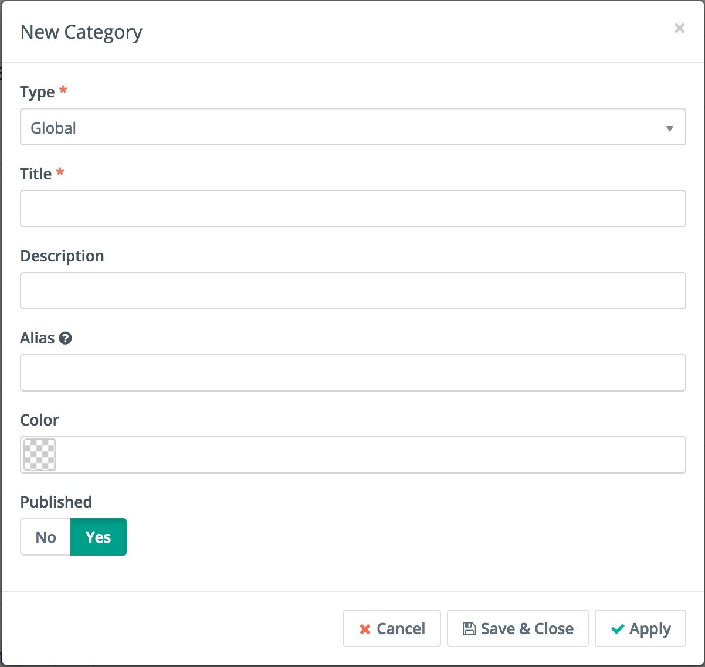
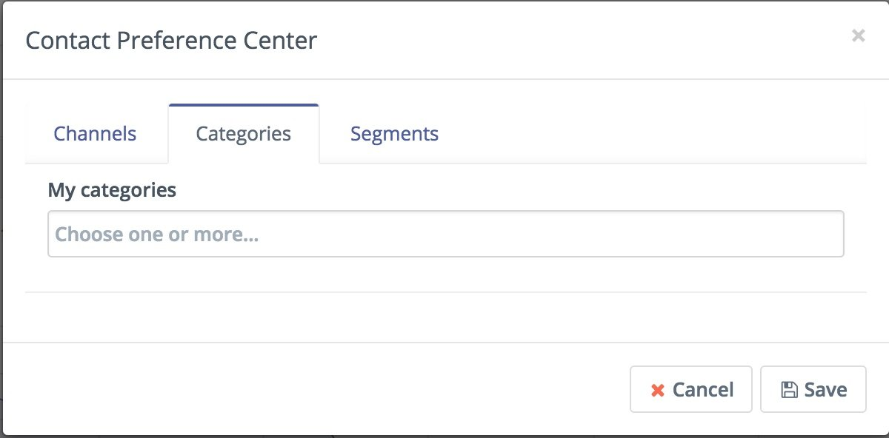

.. vale off

Categories
##########

.. vale on

Categories are a way to organize Mautic elements. They're available for Assets, Campaigns, Emails, Focus Items, Forms, Pages, Points, Social Monitoring and Stages. There are two ways to use Categories:

1. Create element-specific Categories for example only for Assets, Emails or Forms.
2. Create global Categories for all Mautic elements.

.. vale off

Creating and managing Categories
********************************

.. vale on

To create new Categories, go to settings menu in the top right corner of Mautic. There choose Categories.

.. vale off

When creating a new Category you can select type, title, description, alias, color and published status. The color will be helpful to quickly find Mautic elements by their appropriate Category when viewing things like the Calendar or other areas within Mautic.

Using Categories for Contacts
******************************

.. vale on

In addition to organizing various Mautic elements Categories can be used to organize Contacts. In Contact details use the Preference menu to open Contact Preference Center.

Contact Categories can be used in Segment and dynamic content filters.

