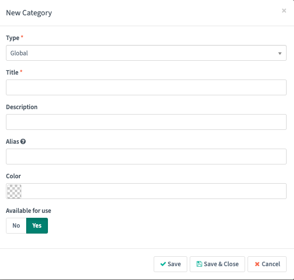
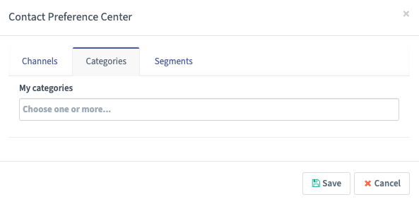

.. vale off

Categories
##########

.. vale on

Categories are a way to organize Mautic elements. They're available for Assets, Campaigns, Emails, Focus Items, Forms, Pages, Points, Social Monitoring and Stages. There are two ways to use Categories:

1. Create element-specific Categories for example only for Assets, Emails or Forms.
2. Create global Categories for all Mautic elements.

.. vale off

Creating and managing Categories
********************************

.. vale on

To create new Categories, go to settings menu in the top right corner of Mautic. There choose Categories.

.. vale off

When creating a new Category you can select type, title, description, alias, color and availability status. The color will be helpful to quickly find Mautic elements by their appropriate Category when viewing other areas within Mautic.

.. vale on

.. vale off

Deleting Categories
*******************

.. vale on

Deleting a Category doesn't delete the items assigned to it. Those associated items, for example, Assets, Campaigns, Emails, and Forms, remain in Mautic and become uncategorized. This applies both when you delete a single Category and when you batch delete multiple Categories.

.. vale off

.. note::

   Mautic asks you to confirm before deleting. The confirmation message states: 'Delete the category, [name]? Associated items will not be deleted; they will be assigned as uncategorized.'

.. vale on

.. vale off

Using Categories for Contacts
******************************

.. vale on

In addition to organizing various Mautic elements, Categories can help you organize Contacts. In Contact details use the Preference menu to open Contact Preference Center.

Mautic allows the assignment of Contact Categories in Segment and Dynamic Content filters.

