Emails
######

Mautic enables marketers to automatically send Emails directly to a group of Contacts in a Segment by using a Campaign, or send Emails on a one-time basis. Emails provide a means for direct interaction with potential customers, clients, and Contacts.

Email types
***********

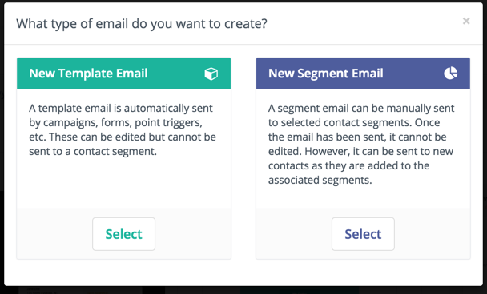

There are two types of Emails: template and Segment - broadcast - Emails.

.. vale off

Template Emails
===============

.. vale on

Template Emails are transactional by default. They're used in Campaigns, Form submit actions, Point Triggers, etc. It's possible to send template Emails to the same Contact multiple times. You can't send template Emails to a Contact outside of another Mautic Component except when sending an Email directly to a Contact - in this case Mautic clones the content.

.. note::
    For this reason, template Emails sent directly to a Contact aren't associated with the template Email itself and thus stats aren't tracked against it.

.. vale off

Segment (Broadcast) Emails
==========================

.. vale on

Segment Emails are marketing Emails by default. On creation the marketer assigns Segments to the Email. This determines which Contacts receive the communication. Note that each Contact can only receive the Email once - it's like a mailing list.

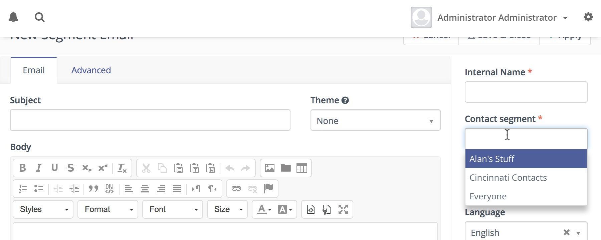

This entry field is a multi-select which allows you to choose several Segments if necessary.

.. vale off

Excluding Segments
==================

.. vale on

There is a multi-select field that allows excluding Contacts belonging given Segments.

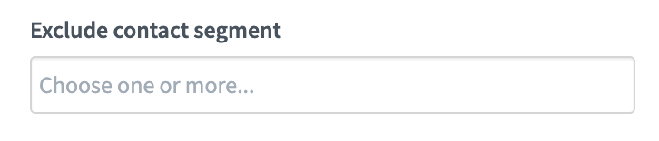

Mautic initiates the sending of these Emails with a :doc:`/configuration/cron_jobs` - see section on Send Scheduled Broadcasts - for example, Segment Emails - for more details on this.

Email formats
*************

In Mautic, it's possible to create Emails in both full HTML as well as basic text format - delivered as necessary to Contacts based on what their client supports. This is an important part of creating a strong relationship with Contacts by providing relevant information in the correct format.

.. vale off

Managing Emails
***************

.. vale on

Email overview
==============

The Email overview allows at-a-glance information regarding the success or failure of a particular Email. You can quickly see relevant information in regards to opens, bounces, successful click-throughs and other important statistics.

.. _Email content preview:

Email content preview
======================

.. vale off

The Email details page shows a rendered preview of the Email content in the right column, so you can see how an Email looks without opening the Builder or a separate tab. This is handy when you're comparing several Emails to find the one you want.

The preview reflects your selection in the **Preview URL** panel below it. Choose an A/B variant from **Show preview for A/B variant**, a translation from **Show preview for translation**, or enter a Contact in **Show preview for contact** to see the Email as that Contact would receive it. Mautic reloads the preview automatically to match the version you've selected.

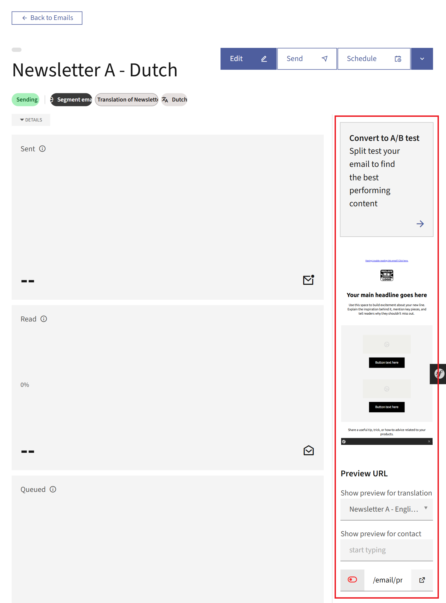

|

.. vale on

.. vale off

Email Drafts
============

Creating a draft Email
----------------------

.. vale on

Mautic allows the creation of Email Drafts using the 'Save as Draft' button in the Email editor.

This feature needs turning on by adding the configuration parameter ``email_draft_enabled`` to your ``local.php`` configuration file as detailed below.

.. code:: php

  'email_draft_enabled' => 1  

Once turned on, the 'Save as Draft' button appears on the Email edit interface.

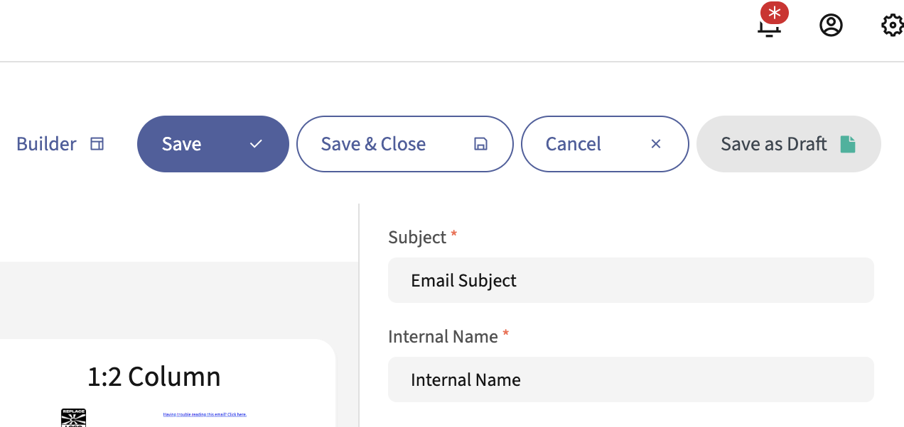

Only one Draft at a time can exist for any given Email. When working with a Draft, the 'Save as draft' button instead displays two buttons, 'Apply Draft' and 'Discard Draft'.

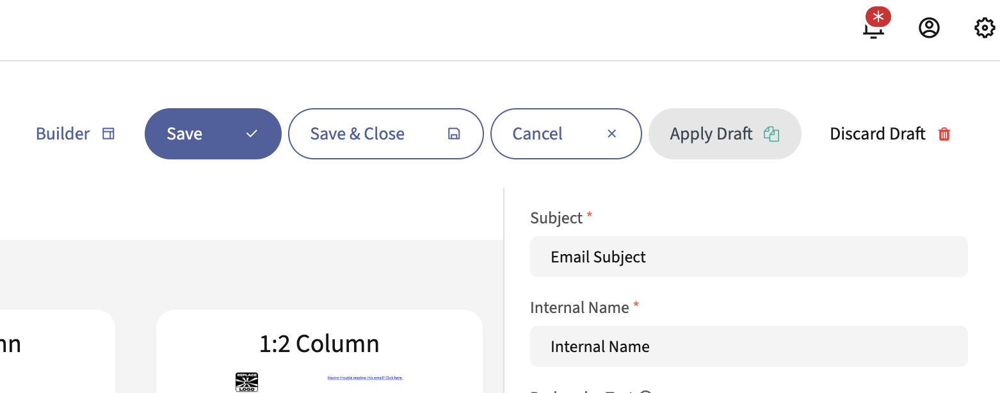

An Email Draft allows changes to the content of the Email only. Changes to the Subject, Internal Name, selected Segment, etc. apply to the original Email even when editing a Draft version of it. The Draft content exists separately from the original Email.

.. vale off

Previewing a Draft Email
------------------------

.. val on

An Email Draft may be previewed by appending ``/draft`` to the end of the Email preview URL. If an Email has a Draft version, a Draft Preview URL will be present on the Email details page below the regular Preview URL.

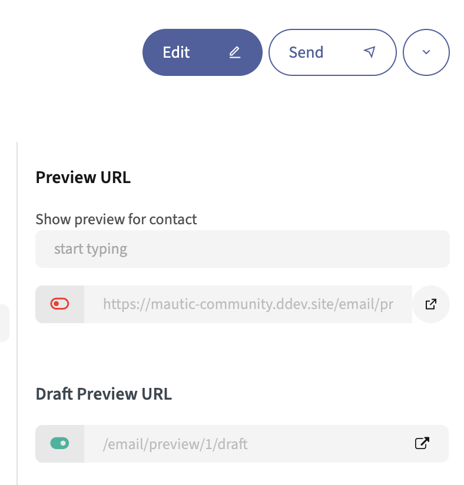

Translations
============

When creating the Email, there is an option to assign a language and a translation parent. By selecting a translation parent, the current item is then considered to be a translation in the selected language of that parent item. If a Contact has a preferred language set, they receive the translated version in their preferred language if it exists. Otherwise, they receive the parent in the default language.

It's also possible to have translations of A/B test variants.

From Mautic 5.1 it's possible to preview A/B and Translation variants:

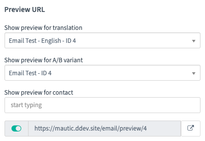

The rendered preview on the Email details page reloads automatically when you switch between variants and translations. For more information, see :ref:`Email content preview`.

.. vale off

Cloning Emails
==============

.. vale on

Cloning an Email creates an editable copy that you can adjust and save as a new Email. This is useful when you want to reuse the content and settings of an existing Email as a starting point.

There are two ways to clone an Email:

* **From the Email listing**:

  #. In the Email row, click the three-dots icon next to the checkbox to open the **Options** menu.
  #. Select **Clone**.

     |

     .. image:: images/emails/email_overview_clone.png
        :width: 800
        :align: center
        :alt: Options menu open on an Email row in the Email listing, with Clone highlighted.

     |

* **From the Email detail view**:

  #. Click the down arrow button next to **Schedule** to open the **Options** menu.
  #. Select **Clone**.

     |

     .. image:: images/emails/email_clone.png
        :width: 800
        :align: center
        :alt: Expanded menu next to the Schedule button on the Email detail view, with Clone highlighted.

     |

Either way, Mautic opens the copy in the Email editor with the original content and settings pre-populated. Adjust the copy as needed, then save it to create the new Email.

.. note::

   Cloning requires permission to create Emails. If you don't have the permission, the **Clone** option doesn't appear.

.. vale off

Clone with translations and variants
------------------------------------

.. vale on

If an Email has translations or A/B variants, cloning the entire group in one step is possible using **Clone with translations and variants**.

To clone an Email with its translations and variants:

#. Click the parent Email to view the details.
#. Click the down arrow button next to **Schedule** to open the **Options** menu.
#. Select **Clone with translations and variants**.

   |

   .. image:: images/emails/email_clone_translations_variants.png
      :width: 800
      :align: center
      :alt: Expanded dropdown next to the Schedule button on the Email detail view with the Clone with translations and variants option highlighted.

   |

#. Click **Clone with translations and variants** in the confirmation dialog.

After confirmation, Mautic creates new Unavailable copies of:

* The parent Email
* All translation children
* All A/B variant children
* All translations of A/B variants

Each cloned Email has ``(copy)`` appended to its name and you can edit it independently. The cloned group maintains the same translation and variant structure as the original.

.. note::

   The **Clone with translations and variants** option is only available for parent Emails - not for translation children or variant children.

Base64 encoded images
=====================

It's possible to encode all images in the Email text as base64. It attaches the image inside the Email body. It has several implications:

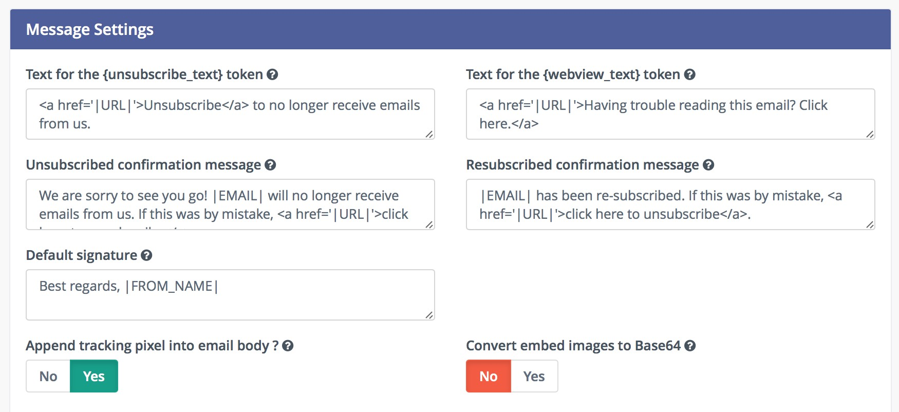

- The main idea with this option is that most of the Email clients display the images directly, without the need to allow images.
- Some Email clients like GMail require the approval to display Base64 encoded images due to the tracking pixel being an image, and won't display the Base64 encoded images as a result. See the next paragraph for possible solution.
- The Email body increases significantly if the Email contains many and/or large sized images. Some Email clients like GMail "clip" such messages and won't display it directly.

.. _Email tokens:

Tokens
======

Mautic allows the use of tokens in Emails which gives the marketer the possibility to integrate a number of Contact fields in your Emails. These can be easily placed within your Emails and are automatically replaced with the appropriate text once sent.

Check the :doc:`/configuration/variables` documentation for a list of all the available default fields.

.. vale off

Tokenized From addresses
------------------------

.. vale on

Mautic allows you to use Contact field tokens in the **From address** and **From name** fields. This makes Emails appear as though they're coming from a Contact-specific sender, such as their assigned Company.

You can use tokens in:

* The **Name to send mail as** and **Email address to send mail from** fields in the system-wide **Email Settings**
* The **From Name** and **From Address** fields on an individual Email's **Advanced** tab

For example, to send Emails from the Contact's Company:

.. code-block:: php

   {contactfield=companyname|Default Name}
   {contactfield=companyemail|info@default.com}

The token format follows the standard Contact field syntax. You can include an optional default value after the ``|`` character. If Mautic can't resolve the token to a value, it uses the default value instead.

.. note::

   The Contact field used in the Email address must contain a valid Email address. If using a Custom Field, ensure it's configured as an Email field type to guarantee proper validation.

.. _sender resolution hierarchy:

Sender resolution hierarchy
^^^^^^^^^^^^^^^^^^^^^^^^^^^

When sending Emails, Mautic determines the **From address** using the following priority order:

#. **Tokenized Email Advanced From** - If the Email's **Advanced** tab has a **From address** with a Contact field token, and that token resolves to a valid value for the Contact, Mautic uses that address.
#. **Owner sender** - If you enable **Mailer is owner** and the Contact has an assigned owner, Mautic uses the owner's Email address.
#. **Plain Email Advanced From** - If the Email's **Advanced** tab has a standard Email address, without tokens, Mautic uses that address.
#. **System default sender** - Mautic falls back to the system default from **Email Settings**. If the system default contains tokens, Mautic resolves them. If token resolution fails, Mautic uses the token's default value.

This hierarchy ensures Emails always have a valid sender while allowing personalization when Contact data is available.

.. _reply-to resolution hierarchy:

``Reply-To`` resolution hierarchy
^^^^^^^^^^^^^^^^^^^^^^^^^^^^^^^^^

Just as it resolves the From address, Mautic determines the ``Reply-To`` header for queued and batch Email sends - such as Campaign Emails and Segment broadcasts - using the following priority order:

#. **Email Reply to address** - If the Email's **Advanced** tab has a **Reply to address**, Mautic uses that address.
#. **Contact Owner address** - If you enable **Use owner as mailer**, Mautic uses the Contact Owner's Email address for each owner group in the batch.
#. **Email From address** - If you haven't configured a global ``reply-to`` in **Email Settings**, Mautic uses the Email's **From address**.
#. **System fallback** - Mautic falls back to the global **Reply to address** in **Email Settings**, or the system From address when that's blank.

This means replies to queued Emails route back to the Contact Owner when you send as the Owner, matching how Mautic already resolves the From address.

Default value
-------------

A token can have a default value for cases when the Contact doesn't have the value known. You must specify the default value after a ``|`` character, for example:

.. code-block:: php

    Hello {contactfield=firstname|friend}

The ``|friend`` tells Mautic to use 'friend' if there is no first name present in the Contact field.

Encoded value
-------------

It's possible to encode values used in a token using the following syntax:

.. code-block:: php

    Hello {contactfield=firstname|true}

The ``|true`` tells Mautic to encode the value used, for example in URLs.

Date formats
------------

To use custom date fields in tokens, use the following format:

.. code-block:: php

    {contactfield=DATEFIELDALIAS|datetime}
    {contactfield=DATEFIELDALIAS|date}
    {contactfield=DATEFIELDALIAS|time}

The date outputs in a human-readable format, configured in the settings in your Global Configuration > System Settings under 'Default format for date only' and 'Default time only format'.

Label modifier for select and boolean fields
--------------------------------------------

For select and boolean field types, you can display the human-readable label instead of the stored value by using the ``|label`` modifier:

.. code-block:: php

   {contactfield=select_alias|label}
   {contactfield=bool_alias|label}

This is particularly useful when these fields contain technical values, but you want to show user-friendly labels in your Emails. For instance:

* A country selection field storing ``us`` can display ``United States``
* A boolean field storing ``1`` can display ``Yes``

The modifier also works with Company fields:

.. code-block:: php

   {contactfield=company_select_alias|label}
   {contactfield=company_bool_alias|label}

Contact replies
===============

To make use of monitoring replies from Contacts, you must have access to an IMAP server **other than Google or Yahoo** as they overwrite the return path, which prevents this feature from working.

.. note::
  To use the Monitored Email feature you must have the PHP IMAP extension enabled - most hosts already have this turned on.

#. Configure all Mautic sender/reply Email addresses to send a copy to one single inbox - most Email providers support this feature in their configuration panel.

.. note::
  It's best to create an Email address specifically for this purpose, as Mautic reads each message it finds in the given folder.

#. Go to the Mautic configuration and set up the inbox to monitor replies.

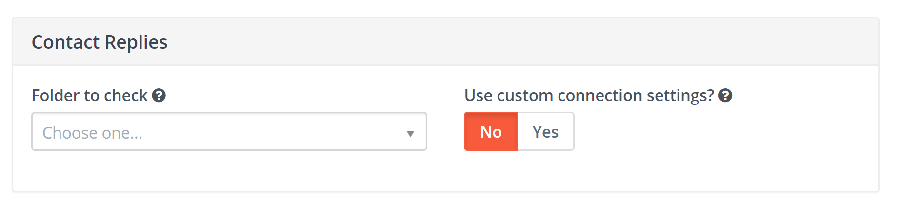

#. To fetch and process the replies, run the following Cron command:

``php path/to/mautic/bin/console mautic:email:fetch``

Usage
-----
Contact replies within Campaigns function as decision after an Email Send action, to take further action based on whether the Contact has replied to the Email. Mautic tries to read the inbox, parse messages, and find replies from the specified Contact. The Contact, when matched with an incoming reply, proceeds down the positive path immediately after the reply detection.

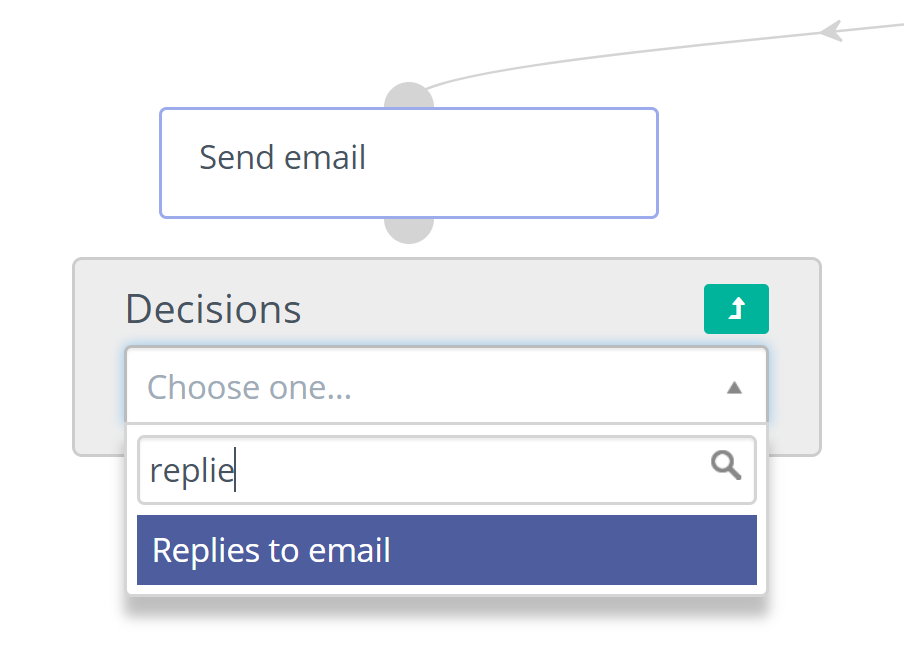

.. _mailer as owner:

.. vale off

Mailer as Owner
***************

.. vale on

This feature allows Mautic to automatically personalize Emails sent to a Contact who has an owner (Mautic User) assigned to them. This feature changes the from Email, from name and signature by changing the default setting to the Mautic Contact owner's User setting.

.. vale off

Sending from the Contact owner
==============================

.. vale on

#. Open the Admin menu by clicking the cog icon in the top right corner.
#. Select the Configuration menu item.
#. Select the Email Settings tab.
#. Switch the Mailer is owner to Yes.
#. Save the configuration.

Overriding the mailer as owner setting
======================================
It's possible to override the global setting on a per-Email basis.

There is a switch under the advanced settings of the Email, which allows you to decide whether to take the global mailer as owner setting, or the specified from address, into account.

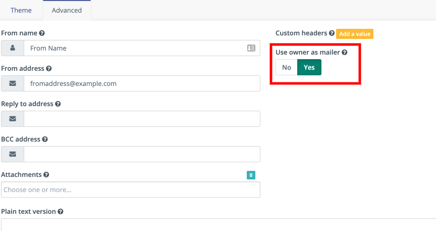

If set to Yes, the global setting takes precedence.

If set to No, Mautic uses the address and name supplied in the Email 'From' fields.

.. vale off

.. _send to unsubscribed Contacts:

Send to unsubscribed contacts
*****************************

The **Send to unsubscribed contacts** toggle allows you to send Emails to Contacts who have unsubscribed from your communications. This feature is available in the **Advanced** tab for both Template and Segment Emails.

.. vale on

Use this option for truly transactional communications that Contacts must receive regardless of their subscription status, such as:

* Terms and conditions updates
* Legal notifications
* Account-related communications
* Service announcements

Enabling the toggle
===================

.. vale off

#. Open the Email you want to edit.
#. Click the **Advanced** tab.
#. Set **Send to unsubscribed contacts** to **Yes**.
#. A warning message appears asking you to confirm this action, as sending Emails to unsubscribed Contacts may have legal implications.
#. Confirm to enable the setting, then save the Email.

.. vale on

.. warning::

   **In many countries, sending marketing Emails to Contacts who have unsubscribed is illegal.** This feature exists solely for genuinely transactional communications such as receipts, password resets, legal notices, and account updates—not marketing content.

   .. vale off

   Misusing this feature to send marketing or promotional Emails to unsubscribed Contacts can result in serious legal consequences, including fines and penalties under data protection regulations such as the General Data Protection Regulation - GDPR, the Controlling the Assault of Non-Solicited Pornography And Marketing Act - CAN-SPAM Act, or Canada's Anti-Spam Legislation - CASL.

   .. vale on

.. vale off

.. note::

   Enabling this toggle requires the **Send to unsubscribed contacts** Email permission assigned to your Role. See :ref:`Setting Role permissions <setting granular permissions>` for details on configuring permissions.

.. vale on

Frequency rules behavior
========================

.. vale off

The **Send to unsubscribed contacts** setting configured in the Email's Advanced tab determines whether an Email counts towards the Contact's :doc:`frequency rules </contacts/frequency_rules>` limits.

* When you set **Send to unsubscribed contacts** to **No**, the Email counts towards the Contact's frequency rule limits. If a Contact has reached their limit, Mautic postpones the Email until the limit resets.
* When you set **Send to unsubscribed contacts** to **Yes**, the Email doesn't count towards frequency rule limits. Mautic delivers important transactional communications regardless of how many other Emails the Contact has received.

.. vale on

Signatures
**********

Setting a signature happens in two places:

#. The default signature is in the **Configuration** > **Email Settings** tab. The default text is:

   .. code-block:: html

      Best regards, |FROM_NAME|.

   Mautic replaces the ``|FROM_NAME|`` token with the name defined in the Email Settings tab.

   Mautic uses this signature when the Email doesn't have **Use owner as mailer** enabled.

#. Each Mautic User can configure their own signature in their account settings. Mautic uses this signature when the Email has **Use owner as mailer** enabled and the Contact has an owner assigned.

   .. important::

     For the ``{signature}`` token to use the owner's signature, you must enable **Use owner as mailer** in the Email's advanced settings. Enabling only the global **Mailer is owner** setting in Configuration isn't sufficient.

     If the owner hasn't configured a signature, the ``{signature}`` token resolves to empty when you enable owner-as-mailer.

.. note::

   .. vale off

   When a User sends an Email directly from a Contact's profile, Mautic uses the logged-in User's signature with the 'From' name and email address specified in the **Send email** form, not the Contact owner's signature. Mautic pre-fills these values with those of the logged-in User.

   .. vale on

   This applies regardless of whether the Contact has a different owner assigned, or no owner at all. The same behavior applies when sending test Emails.

.. vale off

Using the Email signature
=========================

.. vale on

Marketers can place the signature into an Email using the ``{signature}`` token.

.. vale off

Tracking Opened Emails
**********************

.. vale on

Mautic automatically tags each Email with a tracking pixel image. This allows Mautic to track when a Contact opens the Email and execute actions accordingly. Note that there are limitations to this technology - the Contact's Email client supporting HTML and auto-loading of images, and not blocking the loading of pixels. If the Email client doesn't load the image, there's no way for Mautic to know the opened status of the Email.

By default, Mautic adds the tracking pixel image at the end of the message, just before the ``</body>`` tag. If needed, one could use the ``{tracking_pixel}`` variable within the body content token to have it placed elsewhere. Beware that you shouldn't insert this directly after the opening ``<body>`` because this prevents correct display of pre-header text on some Email clients.

It's possible to turn off the tracking pixel entirely if you don't need to use it, in the Global Settings.

.. vale off

Tracking links in Emails
========================

.. vale on

Mautic tracks clicks on each link in an Email, with stats displayed at the bottom of each Email detail view under the ``Click Counts`` tab. You can sort tracked links by clicking the ``Click Count`` column header. The first click sorts highest to lowest, and a second click reverses the order. This helps you identify which links get the most engagement.

You can turn off tracking for a certain link by adding the ``data-mautic-disable-tracking="true"`` HTML attribute.

For example:

.. code-block:: html
  
  <a href="https://mautic.example.com/" data-mautic-disable-tracking="true">Non tracked link</a>

.. note::

   Use ``data-mautic-disable-tracking="true"`` for all new Emails and templates, as Mautic has deprecated the ``mautic:disable:tracking`` attribute.

Link validation
***************

.. vale off

When you save an Email, Mautic checks every link it contains. If a link contains a malformed ``href``, such as ``://example.com``, Mautic blocks the save and shows an error such as 'The email contains an invalid URL: ://example.com'. This stops broken links from going out and disrupting email delivery. To save the Email, fix the link so its ``href`` is a valid, absolute URL that starts with ``http://`` or ``https://``, a ``mailto:`` link, or a Mautic token such as ``{unsubscribe_url}``.

.. vale on

Unsubscribing
*************

Mautic has a built in means of allowing a Contact to unsubscribe from Email communication. You can insert various tokens into your Email to provide unsubscribe options at your desired location:
- ``{unsubscribe_text}``: inserts a sentence with a link instructing the Contact to click to unsubscribe.
- ``{unsubscribe_url}``: inserts the URL to the preferences center when it's activated, or to the unsubscribe page if not.
- ``{resubscribe_url}``: inserts the URL to the resubscribe page regardless of whether there's a preference centre in use. It resubscribes the Contact. Useful for double opt out Campaigns.
- ``{dnc_url}``: inserts the URL to unsubscribe from all Marketing Messages when you activate the preference center.

The unsubscribe URL token inserts the URL into your custom written instructions. 

For example:

.. code-block:: html

        <a href="{unsubscribe_url}" target="_blank">Manage your email preferences</a>
        <a href="{dnc_url}" target="_blank">Unsubscribe from all emails</a>

You can find the configuration of the unsubscribe text in the global settings.

Online version
**************

Mautic also enables the hosting of an online version of the Email sent. To use that feature, simply add the following as URL on text to generate the online version link ``{webview_url}``.

For example:

.. code-block:: html

    <a href="{webview_url}" target="_blank">View in your browser</a>

Bounce management
*****************

Mautic provides a feature which allows monitoring of IMAP accounts to detect bounced Emails and unsubscribe requests.

Note that Mautic makes use of "append" Email addresses. The return-path or the list-unsubscribe header uses something like ``youraddress+bounce_abc123@example.com``. The bounce or unsubscribe allows Mautic to determine what type of Email it's when it examines the inbox through IMAP. The ``abc123`` gives Mautic information about the Email itself, for example which Contact it was it sent to, what Mautic Email address it originated from, etc.

Some Email services overwrite the return-path header with that of the account's Email (GMail, Amazon SES). In these cases, IMAP bounce monitoring won't work.

Elastic Email, SparkPost, Mandrill, Mailjet, SendGrid and Amazon SES support Webhook callbacks for bounce management. See below for more details.

.. vale off

Monitored inbox configuration
=============================

.. vale on

To use the Monitored Email feature you must have the PHP IMAP extension enabled (most shared hosts already have this turned on).  Go to the Mautic configuration and fill in the account details for the inbox(es) you wish to monitor.

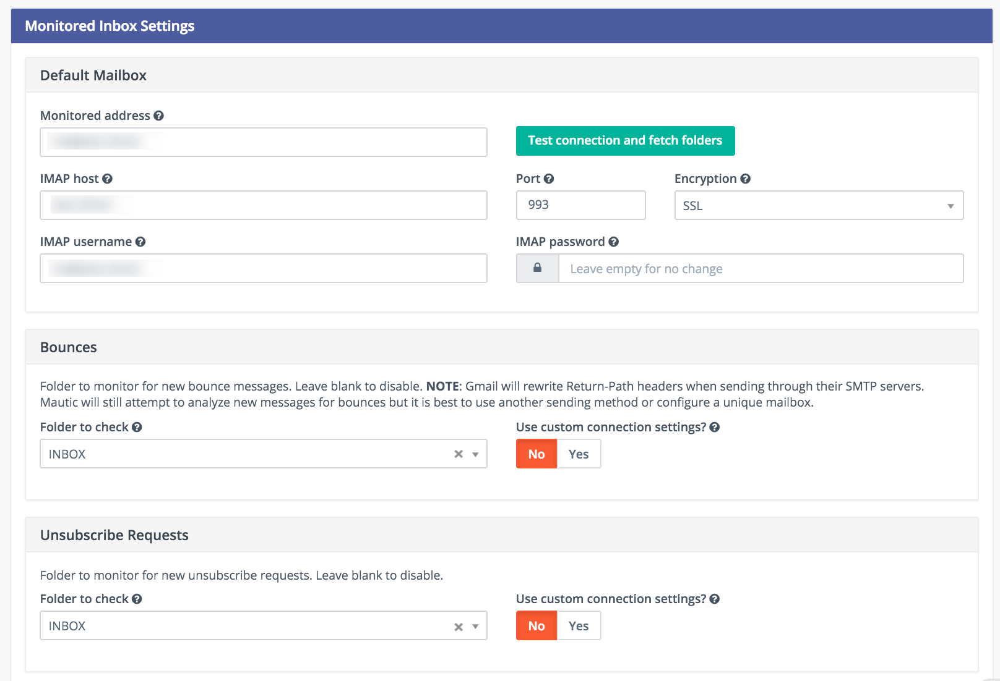

It's possible to use a single inbox, or to configure a unique inbox per monitor.

To fetch and process the messages, run the following command:

.. code-block:: shell
  
  php /path/to/mautic/bin/console mautic:email:fetch

Note that it's best to create an Email address specifically for this purpose, as Mautic reads each message it finds in the given folder.

If sending mail through GMail, the Return Path of the Email is automatically rewritten as the GMail address. It's best to use a sending method other than GMail, although Mautic can monitor a GMail account for bounces.

If you select an Unsubscribe folder, Mautic also appends the Email as part of the "List-Unsubscribe" header. It then parses messages it finds in that folder and automatically unsubscribe the Contact.

Webhook bounce management
=========================

Since Mautic 5 all the Email transports use the same Webhook - sometimes called callback - URL: ``https://mautic.example.com/mailer/callback``. Please follow the documentation for the specific Email transport you've installed to get more information about the Webhook configuration.

.. vale off

Create a Segment with bounced Emails
=====================================

.. vale on

This isn't required, but if you want to be able to select the Contacts with bounced Emails easily - for example to delete all bounced Contacts - create a Segment with bounced Emails.

1. Go to Segments > New.
2. Type in the Segment name. For example Bounced Emails.
3. Select the Filters tab.
4. Create new Bounced Email equals Yes filter.
5. Wait for the ``bin/console mautic:segments:update`` command to be automatically triggered by a Cron job or execute it manually.
6. All Contacts with bounced Emails should appear in this Segment.

Troubleshooting Emails
**********************

.. vale on

Email open tracking
===================

Mautic tracks Email opens using a tracking pixel. This is a 1 pixel GIF image in the source code of Email messages sent by Mautic.

When a Contact opens an Email using an Email client like Outlook, Thunderbird, or GMail, the client tries to load the images in it. The image load request is what Mautic uses to track the Email open action.

Some Email clients have auto loading images turned off, and Contacts have to selectively "Load Images" inside an Email message. Some automatically open all images before delivering the Email to the Contact.

If the images aren't loaded for this reason or another, or if they're opened automatically before sending the Email on to the Contact, Mautic doesn't know about the open action. Therefore, Email open tracking isn't very accurate.

Email link tracking
===================

Before sending an Email, Mautic replaces all links in the Email with links back to Mautic including a unique key. If the Contact clicks on such a link, the link redirects the Contact to Mautic, which then tracks the click action and redirects the Contact to the original location. It's fast, so the Contact doesn't usually notice the additional redirect.

If the Email click doesn't get tracked, make sure that:

1. Your Mautic server is on an accessible URL. 
2. You sent it to an existing Contact via a Campaign or a Segment Email. Emails sent by the Send Example link, direct Email from the Contact profile, or Form submission preview Emails won't replace links with trackable links.
3. Make sure the URL in the href attribute is absolute and valid. It should start with ``http://`` or ideally ``https://``.
4. You've opened the link in a incognito browser (not in the same session where you're logged into Mautic)
5. Check if Mautic replaced the link in the Email with a tracking link.

Unsubscribe link doesn't work
=============================
The unsubscribe link **doesn't work in test Emails**.

This is because Mautic sends test Emails to a Mautic User and not to a Mautic Contact.

Mautic Users can't unsubscribe and therefore the unsubscribe link looks like this: ``https://mautic.example.com/|URL|``. However, the link **does** work correctly when you send the Email to a Contact.

Best practice is to create a Segment with a small number of Contacts to receive test Emails - for example, yourself - which ensures that you can fully test features such as unsubscribe behaviour.
