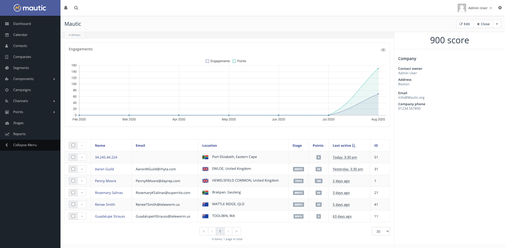
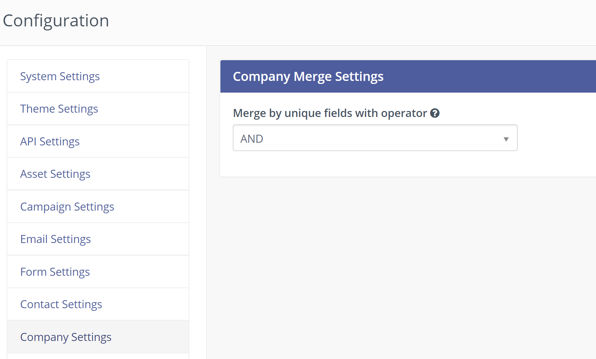
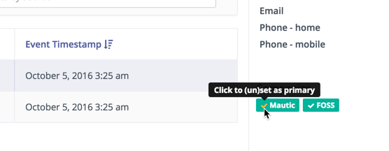

Companies
#########

Companies are a way to group Contacts based on association with organizations.

  
Engagements/Points chart
*************************

Engagements shown on the chart include any tracked action the Contacts made. Some examples might include page hits, Form submissions, Email opens and so on. The engagements line chart displays how active the Contacts of the Company were in the past 6 months. The chart displays also the sum of Points the Contacts received.

.. vale off

List of Contacts assigned
*************************

.. vale on

You can find a table with the list of the assigned Contacts displaying the date of their last activity, preceding the information of the Company which includes the Company name, address, and all the custom Company fields, and the engagement chart. This is good way to have a view of the recent activity of the Contacts you know in this Company.

Company duplicates
*******************
The Company name field is a unique identifier by default. You can choose any other Company field as unique identifier in the **Custom Fields** section.

In *Configuration > Company Settings* you can choose the operator used when merging Companies with multiple identifiers - either **AND** or **OR**.

These settings allow  Mautic to find and merge duplicate Companies during the import, using the Integrations Framework and in other parts of Mautic.

Batch changes
*************

To apply changes to several Companies at once, select the checkboxes next to the Company names. A selection bar appears at the top of the table, showing **Delete selected** and a three-dot icon for more options.

The following batch actions are available:

* **Delete Selected** - Deletes the selected Companies.
* **Find and Replace** - Replaces a value in a chosen field across all selected Companies.

   #. Click the three-dot icon to open this option and select **Find and Replace**. This opens a dialog.
   #. Choose the Company field to update. Search or scroll to find it in the list.
   #. Enter the value to find in **Find value**.
   #. Enter the new value in **Replace with**.

  Only Companies that match the **Find value** get updated.

  |

  .. image:: images/companies_batch_selection_bar.png
     :width: 600
     :alt: Two selected Companies in the list with the selection bar showing Delete selected and the three-dot menu open on Find and Replace

  |

  You can also use this option without selecting any rows. Click the gear icon at the top of the table, then select **Find and Replace**. This applies the replacement to all Companies matching your current search.

  |

  .. image:: images/companies_find_and_replace_list_view.png
     :width: 600
     :alt: Companies list view with the gear icon menu open, showing the Find and Replace option

  |

  .. note::

     To use **Find and Replace**, Users need these Role permissions under **Contacts**:

     * View permission - **View Own** or **View Others**
     * Edit permission - **Edit Own** or **Edit Others**

       Users with only **Edit Own** can update Companies they own, and those with **Edit Others** can update any Company.

Company actions
***************

.. vale off

Merging Companies
=================

.. vale on

When editing a Company, you can merge this Company into another existing Company by using the **Merge** button.

Search for the Company you wish to merge into, then click to start the merge. Contacts associated with the merged Companies now become associated with the remaining Company.

After completion of the merge process, Mautic redirects you to the remaining Company, as the old Company no longer exists.

.. vale off

Company Custom Fields
*********************

.. vale on

By default, a set of fields exist for Companies, but you can customize these fields to meet your needs.

#. Go to **Custom Fields** and create a new field
 
#. Change the dropdown select box from Contact to Company objects

#. Save the Custom Field

.. vale off

Company Segments
****************

.. vale on

You can create a Segment based on a Company record. Select any Company field to filter with and the matching criteria for it, and Mautic lists any Contacts that match the selected fields in the Segment.

.. vale off

Identifying Companies
*********************

.. vale on

Mautic identifies Companies strictly through a matching criteria based on **Company Name**, **City**, **Country or State**. If  a city or a country isn't delivered as an identifying fields to identify a Contact, the Company won't match.

.. vale off

Company actions in Campaigns
****************************

.. vale on

It's possible to add a Contact to a new Company based on a Campaign action.

.. vale off

Creating and managing Companies
*******************************

.. vale on

To create or manage Companies, go to the Companies menu identified by the building icon in the left hand navigation. In this area you can create, edit, or delete Companies.

.. vale off

Deleting Companies
==================

.. vale on

Deleting a Company updates the Contact-Company relationships for all Contacts associated with that Company:

* If a Contact has multiple Companies, Mautic assigns the most recently attached Company as the new primary Company.
* If a Contact has only that Company, the Contact no longer has any Company association.

A confirmation dialog explains this behavior before you delete a Company or multiple Companies.

.. vale off

Renaming a Company
==================

.. vale on

When you rename a Company, Mautic updates the displayed Company name on every Contact that has it as their primary Company. Contacts that have the Company assigned but not as their primary Company keep their existing displayed Company name, since that name comes from their own primary Company.

.. vale off

Processing Company updates in the background
============================================

.. vale on

By default, Mautic applies Company renames and deletions to the related Contacts immediately, within the same request. On instances with a large number of Contact-Company relationships, this can slow down editing or deleting a Company.

To run this work in the background instead, add the following option to your ``config/local.php`` file:

.. code-block:: php

    'update_company_mapping_data_in_background' => true,

When you turn on this option, Mautic no longer updates the related Contacts during the request. Instead, you run two commands - typically as Cron jobs - to apply the changes:

* ``mautic:company:update_lead_company`` updates the Company name on Contacts after you rename a Company.
* ``mautic:company:delete_company_leads`` reassigns the primary Company and removes the Company references on Contacts after you delete a Company.

Each command processes all pending Companies by default. To limit a run to a single Company, pass its ID with the ``--company-id`` option.

.. vale off

Assigning Companies to Contacts
*******************************

.. vale on

There are different ways to assign a Company to a Contact as explained below:

Contact profile
===============

You can assign a Contact to Companies in the Contact's profile, while creating or editing an existing Contact. Mautic considers the latest Company assigned as the primary Company for the Contact.

Contacts list view
==================

You can batch assign Companies to selected Contacts in the Contact's list view.

.. vale off

Via a Campaign
==============

.. vale on

You can assign a Company to identify Contacts through a Campaign by selecting the **Assign Contact to Company** action.

.. vale off

Through a Form
==============

.. vale on

When identifying a Contact through a Form, you can also associate an existing Company or create a new one if:

- The Form includes Company name as a Form Field - mandatory for Company matching/creation,
- The Form includes City as a Form Field - mandatory for Company matching/creation,
- The Form includes Country as a Form Field - mandatory for Company matching/creation,
- The Form includes State as a Form Field - optional for Company matching/creation.
  
Company scoring
================

It's possible to change the Company score through a Campaign action or a Form action. When using these actions, it's necessary to identify the Contact first, and then alter the score of the Companies assigned to that Contact.

#. Select the **Change Company score** action in either a Form or a Campaign
#. Once submitted or triggered, Mautic identifies Companies in the Campaign or Form to change their score.

.. vale off

Setting the primary Company
===========================

.. vale on

You can set the primary Company through the Contact details interface.

