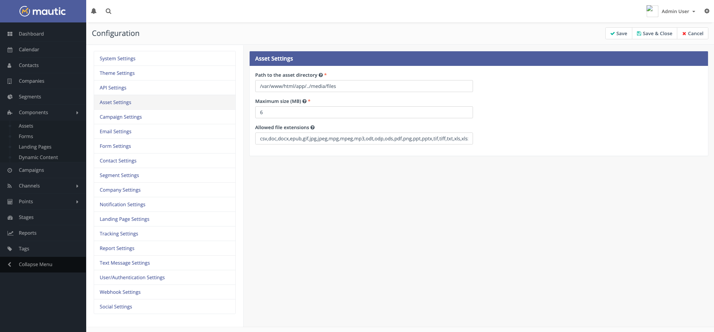
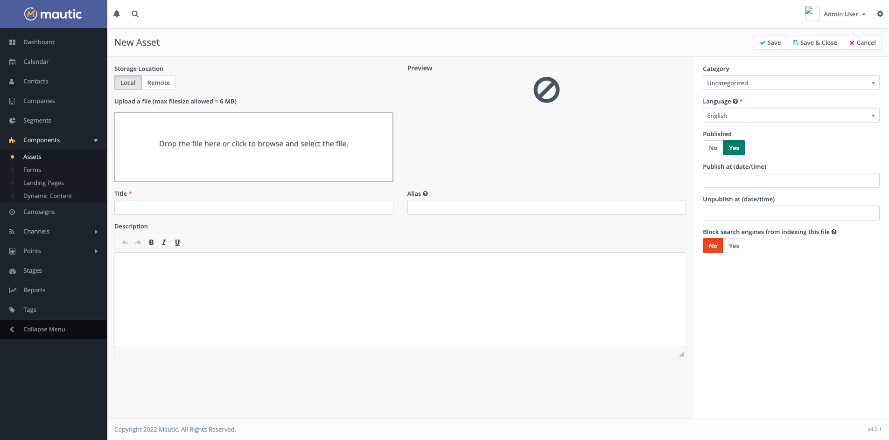

Assets
######

Assets are pieces of content you want to make available for your contacts to access. You want to track and report on who is viewing or downloading your assets. You also may want to personalize the contact's journey based on what assets they interacted with. You may also do lead scoring based on interaction with assets.

.. vale off

Managing Assets
***************

Asset Categories
================

.. vale on

Assets can be organized into Categories, which allows you to easily locate resources. To create a new Category, review the :doc:`/categories/categories-overview` documentation.

.. vale off

Working with Assets
===================

.. vale on

Before creating an Asset, first establish and publish any Categories that may be needed. It is not possible to assign Assets to unpublished Categories.  If you wish to use an integration such as the Amazon S3 plugin to host your files, set this up before creating an Asset.

.. vale off

Creating a new Asset
====================

.. vale on

Navigate to Components > Assets.  Any assets you have previously created will be listed on this page. Click New to begin creating an Asset.

Assets are created by uploading local resources on your computer, or by locating the Asset from a remote storage host such as Amazon S3. Local uploads will be restricted by size due to the settings of your server - any such restriction may be advised as a warning above the file upload area.

.. vale off

Uploading an Asset
~~~~~~~~~~~~~~~~~~

.. vale on

To upload an Asset, either drag the file into the box, or click in the box to open a file upload window. On selection of the file, it is automatically uploaded and appears in the boxed area.

By default the following file types are accepted:

csv,doc,docx,epub,gif,jpg,jpeg,mpg,mpeg,mp3,odt,odp,ods,pdf,png,ppt,pptx,tif,tiff,txt,xls,xlsx,wav

If you need to add extra file types, configure the maximum size of upload or the directory where Assets are located, navigate to Configuration > Asset Settings.

The following fields are available:

- **Title** - the title for the Asset
- **Alias** - used to create the slug on the download URL. Created from the title automatically if not provided.
- **Description** - an internally used description to inform other Mautic users what the Asset is and/or where it's used.
- **Category** - used to organize resources - see :doc:`/categories/categories-overview` for more information
- **Language** - the language of this Asset - can be helpful in multilingual marketing campaigns and for reporting purposes
- **Published** - Whether the Asset is available for use - published - or not available - unpublished

.. vale off

**Publish at (date/time)** - This allows you to define the date and time at which this Asset is available

**Unpublish at (date/time)** - This allows you to define the date and time at which this Asset ceases to be available

.. vale on

- **Block search engines from indexing this file** - If you don't want to index files like PDF, DOCx and so forth, setting this switch to Yes will send the X-Robots-Tag no-index http header. If set to No, the header will not be sent and your files could become indexed by search engines.

Depending on the type of file that is uploaded, a preview may be displayed after the upload completes.

.. vale off

Using remote Assets
~~~~~~~~~~~~~~~~~~~

Instead of uploading a file from your computer, you can either provide a link to a file on a cloud storage provider or browse your integrated cloud storage provider (for example an Amazon S3 bucket) by selecting the Remote tab, rather than Local. 

Viewing an Asset
~~~~~~~~~~~~~~~~

.. vale on

Once you've uploaded an Asset, you'll want to make it available for your Contacts to access it. Using the Download URL from the Asset page in Mautic, you can track which contacts are downloading or viewing the Assets.

Copy and paste the link into your website, on a landing page, or as a link in an email. 

.. note:: 
    In a Mautic Email or Landing Page, append ``?stream=1`` to the end of the URL to open the Asset in a new tab.

Whether the Asset downloads or opens in a new tab from a web page depends on the contact's browser settings. To gate an Asset by requriring them to submit some information before downloading, you may have a Form submit action to download an Asset.

To ensure that Contacts are providing you with valid Email addresses for high-value Asets, attach the Asset to an Email and use the send Email Form submit action rather than instantly downloading the Asset.

Editing an Asset
~~~~~~~~~~~~~~~~

An Asset can be edited by clicking on the 'edit' button while viewing the Asset, or by selecting the arrow next to the checkbox for the Asset, and selecting 'edit'. The edit screens are the same as the view screens, however content will be populated in the fields.

Deleting an Asset
~~~~~~~~~~~~~~~~~

An Asset can be deleted by clicking on the 'delete' button while viewing the Asset, or by selecting the arrow next to the checkbox for the Asset, and selecting 'delete'. A confirmation screen will be displayed, prompting confirmation that the Asset should be deleted.

.. warning:: 
    Once an Asset has been deleted, it cannot be retrieved, and statistics relating to the number of downloads for that Asset are no longer be available. Contact Points that have been accumulated as a result of accessing the resource remain. It's recommended where possible to unpublish Assets which are no longer in use - in future there may be an archive feature.

