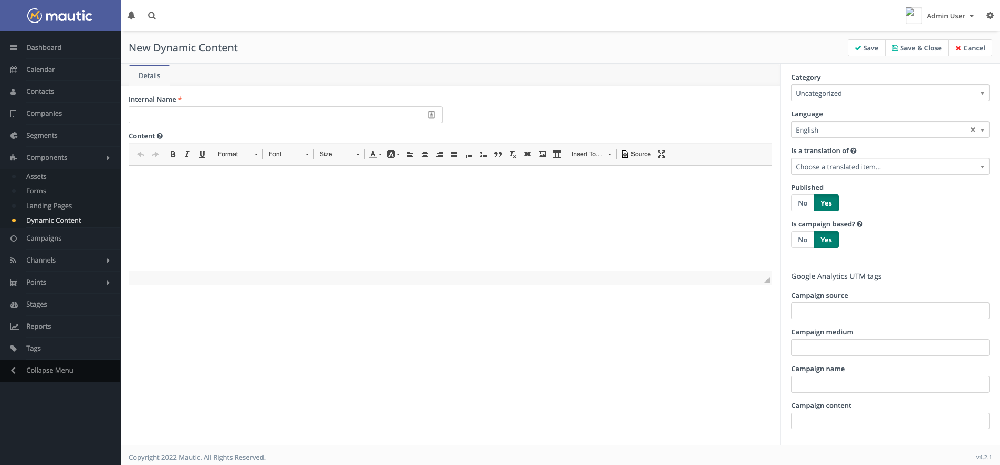
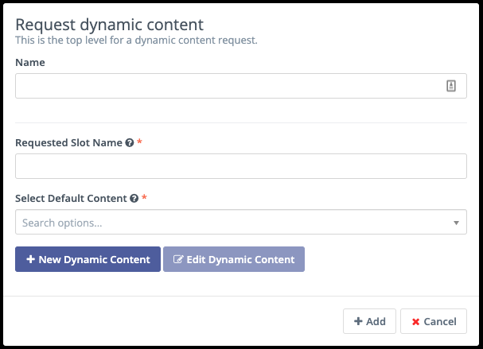
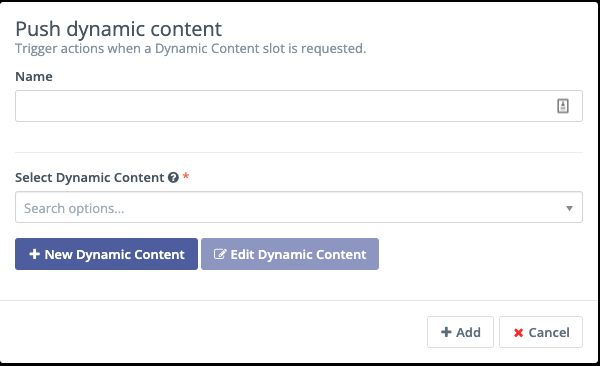
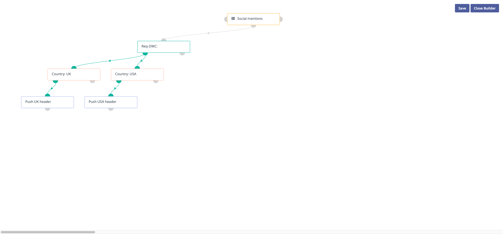

Dynamic Web Content
###################

Dynamic Web Content is one of several methods Mautic uses to personalize the web experience for Contacts. Marketers can display different content to different people in specific areas of a webpage. Mautic Users may want to personalize content based on data collected about the website visitor. Even anonymous Contacts may see Dynamic Content, if you've collected any information about them - such as location data.

Preparation
***********

Before you consider using Dynamic Web Content, consider:

- where on your website would you include personalized content?
- What audience/s do you plan to personalize content for?
- Do you collect the information required to accurately filter your Contacts in this way?

Website configuration
*********************

Once you've decided where on your website to display the content, you must create an area to add the content. Mautic is platform-agnostic - you can add slots into any website you have created. To do this, create an HTML slot to display the Dynamic Web Content.

Change ``myslot`` in ``data-param-slot-name="myslot"`` to the Requested Slot Name of your Dynamic Web Content item:

.. code-block:: 

    

    <h1>Dynamic web content for myslot</h1>
    

You can add your own default content between the ``
`` tags to ensure that content displays when the filters aren't matching - for example with new anonymous visitors or a Contact that doesn't match the criteria you have specified.

Content Management System Plugins for Mautic also have specific ways to embed the content, for example:

- **Joomla** - ``{mautic type="content" slot="slotname"} Insert default content {/mautic}``
- **WordPress** - ``[mautic type="content" slot="slotname"] Insert default content [/mautic]``

Mautic configuration
********************

.. warning:: 
    It's important to ensure that you configure your CORS settings correctly when using Dynamic Web Content - if this isn't set up your content won't display. Read more in :ref:`CORS Settings`.

.. vale off

Creating Dynamic Web Content slots
~~~~~~~~~~~~~~~~~~~~~~~~~~~~~~~~~~

.. vale on

Mautic provides both Campaign-based and filter-based Dynamic Web Content. To create either type:

#. Navigate to the Components > Dynamic Content section
#. Click New to create a new slot

The following values are available:

- **Internal name** - This is how the slot displays in your list of Dynamic Web Content slots. You should include information on what you're personalizing - for example, country - and the content in the slot - for example, United States. If you're creating a personalized slot for people in the United States, you can name the slot Country - United States. If you plan to have more than one personalized content slot for the same audience across your website, include the page title or other identifying information for the particular slot.
  
.. vale off 

#. **Content** - Use the WYSIWYG editor to create the Dynamic Web Content slot. You may include images and videos. If you prefer HTML, click the ``</> Source`` icon in the toolbar to switch to the code view. Mautic's Dynamic Web Content supports tokens in the same way as Landing Pages or Emails. To add a token, start typing with the ``{`` character and available tokens are displayed. These include:

   *  Contact field: {contactfield=fieldalias}
   *  Landing page link: {pagelink=ID#}
   *  Asset link: {assetlink=ID#}
   *  Form: {form=ID#}
   *  Focus item: {focus=ID#}

.. vale on

**Category** - Assign a Category to help you organize your Dynamic Web Content items. See :doc:`/categories/categories-overview` for more information.

- **Language** - the language of this Dynamic Web Content - can be helpful in multilingual marketing Campaigns and for reporting purposes

- **Is a translation of** - If you're creating a slot in a second language translation - for example to use on a multilingual website - select the original base language Dynamic Web Content item which you're translating. The same slot displays the appropriate language based on the Campaign or filters set, but Mautic shows the translated content if a visitor is viewing the page in a different browser language.

- **Published** - Whether the Dynamic Web Content item is available for use - published - or not available - unpublished

- **Is Campaign based** - if set to Yes, Mautic pushes this Dynamic Web Content to Contacts through a Campaign. When set to No, you can specify filters for visitors to see the content.

- **Requested slot name** - shown if using non-Campaign based Dynamic Web Content, this allows you to specify the slot name on your website in which the Contact sees the content.

.. vale off

**Publish at (date/time)** - This allows you to define the date and time at which this Dynamic Web Content item is available for displaying to Contacts

**Unpublish at (date/time)** - This allows you to define the date and time at which this Dynamic Web Content item ceases to be available for displaying to Contacts.

.. vale on

**UTM tags** - Mautic can append UTM tags to any links and Form submissions. See :doc:`/channels/utm_tags` for more information.

.. vale off

Campaign-based Dynamic Web Content
**********************************

.. vale on

Creating the request
====================

Use a Campaign Decision for ``Request Dynamic Content`` to use Campaign-based dynamic content. The Campaign Decision checks if a Campaign member visits a page where a Dynamic Content slot is. Visitors to a page with a Dynamic Content slot receive the Dynamic Content.

The following fields are available:

- **Name** - the Campaign event. Start the name with something like Req-DWC: so when you're looking at Campaign Reports, you can see the event type.

- **Requested Slot Name** - Mautic checks for the slot name. You can see how many Contacts got to the Campaign event where you're checking if their visits request the slot.

As an example, these two fields might look like: ``Req-DWC: Country-Header`` in the Contact history. The requested slot name is the slot Mautic looks for on the page. If it's on a 3rd-party page, it'll be in the code you use to add the Dynamic Content slot to your page. If it's on a Mautic Landing Page, define the slot name on the Landing Page.

- **Select Default Content** - choose the content which displays to visitors who don't meet the conditions set at the next step of the Campaign. Users may see the default content first, before Mautic pushes the Dynamic Content.

Creating the filters
====================

Once created, you can add filters on the affirmative path to determine which Contacts see the different variations. This happens with Conditions - read more in :doc:`/campaigns/creating_campaigns`.

As an example, you might use the condition of ``Country = United States of America`` to filter only people located in the country.

Pushing the Dynamic Web Content
===============================
Once the relevant filters are in place, you can add the Campaign action of 'Push Dynamic Content' which triggers Mautic to send the relevant content to the Contacts matching the filters.

With all this in place, it might look something like this:

You may wish to decide on a naming convention for your Campaigns, for example prefixing with ``DWC:`` when you're pushing Dynamic Web Content.

.. vale off

Filter-based Dynamic Web Content
********************************

.. vale on

Filters are often easier to work with and can be more reliable, as they don't rely on the triggering of a Campaign cron job.

Creating filters
================

#. When creating the Dynamic Web Content item, select No for the 'Is Campaign based' switch which displays the filters tab.

#. Use the filters to configure the criteria that Contacts must meet to see the Dynamic Web Content slot.

#. Provide the content in the slot within the text editor area. Mautic displays this content when the filters match.

.. vale off

Implementing Dynamic Web Content
********************************

.. vale on

Default content
===============

Mautic displays the default content when the visitor doesn't match any of the filter criteria, or the visitor isn't a tracked/identified Contact. It's important to have something in the default content, rather than an empty space.  

For Campaign-based Dynamic Web Content, you specify the default content when you configure the Request Dynamic Content decision. In filter-based Dynamic Web Content, you create the default content on the page where you are inserting the slot, and Mautic replaces it with the Dynamic Content if the filter match.

.. note:: 
    If you're using Focus Items as your Dynamic Web Content and only showing specific Focus Items to specific audiences, you don't need to have any default content, as Focus Items don't physically take up space on your page.

.. vale off

