Forms
#####

Mautic subscribers use Forms for lead generation and data collection. With Mautic Forms, marketers can convert anonymous web visitors to known Contacts and build a Contact's profile with progressive profiling. The more data you can gather without appearing intrusive or annoying, the more effective your personalization strategy.

.. vale off

Creating a new Form
*******************

.. vale on

To create a new Form:

#. Go to Components > Forms and click New
#. Select the type of Form you wish to create
    * **Campaign Form** - Mautic allows you to trigger a Campaign with the submission of this type of Form. Campaign Forms have less actions directly associated with the Form submit actions - which happen immediately after Form submission - as most actions trigger as part of a Campaign workflow.
    * **Standalone Form** - A more commonly used Form, this allows the execution of many submit actions immediately at the point of Form submission. 

.. warning:: 
    Forms with a lot of submit actions - particularly when submitting to third party systems such as a Customer Relationship Management system - can have an impact on the Form submission time. This is especially the case if there are a lot of fields. Consider using a Campaign Form if you can wait for the cron job to trigger the actions.

The following fields are available:

- **Category** - Assign a Category to help you organize your Forms.

- **Available** - Whether the Form is available for use or not available. Unavailable Forms won't be visible when you've added the Form using JavaScript. If you used the manual method to copy and paste the Form HTML, the Form remains visible but visitors **won't** be able to submit it - an error message prevents them from submitting if they try to submit an unavailable Form.

.. vale off

- **Activate at (date/time)** - This allows you to define the date and time at which this Form is available for submissions.

- **Deactivate at (date/time)** - This allows you to define the date and time at which this Form ceases to be available for submissions.

.. vale on

- **Disable search indexing** - If Yes, Mautic prevents search engines from finding and displaying the Form in search results by sending the ``noindex`` http header.

- **Kiosk mode** - If Yes, Mautic turns off tracking of Contacts created through the Form, so that the Form doesn't generate cookies or associate any IP address with the Contact record. Marketers may refer to this as 'data entry mode'. It's ideal for using at conferences or events where several Contacts may enter their information using the same device, as it prevents associating the activity on the device to Contacts.

- **Render style** - If Yes, the Form displays with the styling from either the selected Mautic Theme or the Attributes tab of the Form Fields. When No, the Form adopts the styling of where it's embedded.

- **Theme** - Select a Mautic Theme which has styling for a Form. This dictates the styling of the Form when added to an external website or Application if 'Render style' is Yes.

.. note:: 
    Not all Themes include Form styling. Check the Features column on your Themes listing in the Theme Manager to see which Themes include styling for Forms.

.. vale off

Configuring Forms
*****************
.. vale on

Once you have selected the type of Form, you have some additional options to set.

Details
=======

The available details fields are:

- **Name** - Title your Form, including any terms you may want to use to search for the Form.
- **Description** - Add a description, so other Mautic Users can see what the goal of the Form is. It may help to include information like any location where the Form appears.
- **Successful Submit Action** - Options include:
   * **Remain at Form** - nothing appears to happen, the Form remains as is
   * **Redirect URL** - directs the Contact to another location, such as a thank you Landing Page, after submission
   * **Display message** - shows a message over the Form once the Contact has submitted the Form.
- **Redirect URL/Message** - If you decide to use the Redirect URL successful submit action, paste the URL where you'd like to direct submitters. If you use Display message, enter the message to display.

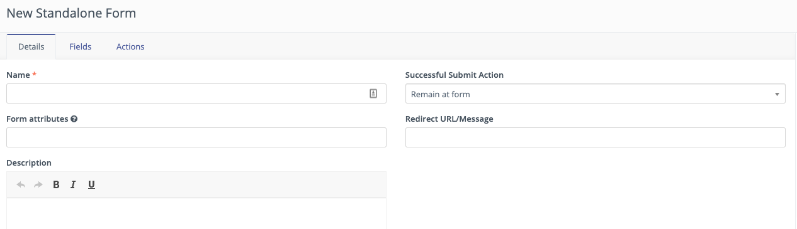

Fields
======

To control the maximum number of fields shown on a Form:

- **Maximum fields displayed at a time** - This setting applies progressive profiling across multiple Forms. Select the maximum number of fields to display on a single Form.

To add a new field to your Form:

#. Click the Add a new field dropdown and select the type of field you wish to use. Available fields include:

   - **CAPTCHA** - A basic tool for spam protection requiring the Form submitter to answer a question, or detecting when spambots try to submit data in a hidden CAPTCHA field - sometimes referred to as a honeypot. It's recommended to use some kind of CAPTCHA on every Form. It's also possible to support reCAPTCHA and other tools with third-party Plugins.

   - **Checkbox Group** - This field allows a visitor to select one or more options from a list using checkboxes. This field type can also provide a single checkbox - for example to gain consent to use cookies and send marketing Emails or other messages to the Contact.

   .. note:: 
      You can associate checkbox group fields with *boolean* and *select - multiple* fields, but not *select* fields.

   - **Date** - This field allows the visitor to select a date with a calendar picker. The formatting of the date applies the default setting in your Configuration.

   - **Date/time** - Similar to the date field, this allows the visitor to select both the date and the time using a calendar picker.

   - **Description** - A basic header field, most often used to provide a visual title for the Form. The header field acts as the field name or label. The description area - accessed under the Properties tab - is a free text WYSIWYG editor, where you can add a description of the Form. By default, the description shows immediately below the header field in paragraph text format.

   - **Email** - This field requires the visitor to provide a valid Email address using the correct syntax expected from an Email address - ``name@domain.com``. It's recommended to have at least one Email field on your Form, as by default the Email field is the default identifier of a Contact in Mautic.

   - **File** - This allows visitors to upload a file on the Form.

   .. warning:: 
      When using the file upload field there is a limit of 1,000 submissions using the same filename. Note that you can attach the submitted files in the "Send Form result" action.

   - **HTML area** - This field allows marketers to add custom HTML to their Form.

   - **Hidden** - This field won't be visible on the Form, but include default values, saved along with the Form submission, for reporting or internal tagging purposes.

   - **List - Country** - This populates Mautic's default, non-editable country list. To use a custom list you should make use of the Select field type and manually enter the countries you would like to include.

   - **Page break** - This allows marketers to break up the Form into multiple parts or field groupings.

   - **Number** - This field validates that the entered values are digits. The field allows decimals and negative numbers, but no other non-numerical values - including commas. On a mobile device, the keyboard changes to a number pad when a visitor clicks into this field.

   - **Password** - This allows the visitor to create a password. Use this field if the Form creates an account and Mautic posts the results to another system/Form. You must not save the entered field value to the Contact profile for security reasons.

   - **Phone** - This field maps by default to the Phone field, and validates numbers using the international format for phone numbers. The validation requires a country code - for example +1 for the United States of America or +44 for the United Kingdom).

   - **Radio group** - This field provides a group of single-select options with a radio button, sometimes referred to as an option button group.

   - **Select** - This option shows a dropdown list where a visitor may choose one option. This field also allows multiple selections, which changes the display to a box with the options listed. On a mobile device, a single select box shows a dialog box with radio buttons, and with checkboxes for a multi-select field.

   - **Social login** - This allows the visitor to connect their Twitter, Facebook or LinkedIn profiles with their Contact record. You must configure the Plugin for the social network before using this field.

   - **Text** - This field shows a text box with 255 characters available. Common uses include specifying the visitor's first name, last name, city, and so forth.

   - **Text area** - Similar to the text field, but without the 255 character limitation. The text area field has a character limit of 65,535 characters.

   - **URL** - This field validates the entry as being in the expected format for a URL, including ``https://`` or ``http://``

Field options
=============

Based on the field selected, Mautic displays various tabs in the fields editor interface. The available tabs are:

- :ref:`General`
- :ref:`Mapped field`
- :ref:`Validation`
- :ref:`Properties`
- :ref:`Attributes`
- :ref:`Behavior`

General
~~~~~~~

- **Label** - This is the title of your field, telling the visitor what you'd like them to enter in the field. The label shows before the Form Field by default.

- **Show label?** - When No, Mautic won't display the label on the Form.

- **Save result** - When No, Mautic won't save the data entered in the Form to the Form submissions table. When Yes, the submissions  are accessible in the Form submission results. If mapped to a Contact field, Mautic still saves the data to that field.

- **Default value** - This allows the marketer to provide a default value for a field. The default value is useful when setting a value as a hidden field, or when you expect the visitor to enter a certain value. The Contact can change the default value when they complete the Form if the field is visible.

- **Help message** - This allows the marketer to add information for the visitor about what they should enter in the field, or why they should provide the information.

- **Input placeholder** - This allows the marketer to add text within the Form Field, which gives the visitor an idea of what they should enter. The text disappears as soon as they click into the field, whereas default values don't. This can be particularly helpful in prompting the visitor if you require the data in a particular format, for example ``@Twitter`` for a Twitter account, including the ``@`` symbol.

Mapped field
~~~~~~~~~~~~

The mapped field tab allows the marketer to connect a field with an existing Contact or Company field in Mautic. This allows the data from the Form submission to automatically populate into the mapped field. Without the mapping, this information won't save in the Contact profile.

The data type for the Form Field should match the data type of the mapped field. For example, a date/time field should map to a Contact or Company field which uses the date/time field.

Validation
~~~~~~~~~~

The validation tab allows you to set whether the field is mandatory or not. If the field is mandatory and it's not completed by the visitor, the Form displays an error and the visitor sees a message informing them that they must complete the field before submitting the Form.

Switch the slider to ``Yes`` to make the field mandatory.

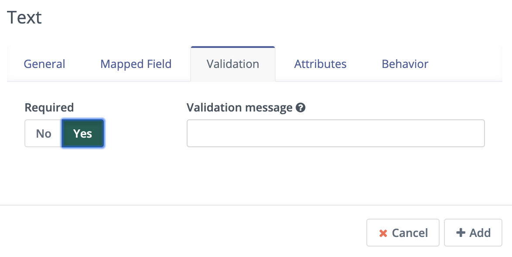

It's also possible to add a validation message specific to this field, giving the visitor a prompt when they submit the Form and haven't included this field.

Properties
~~~~~~~~~~

The properties tab won't show on every field type. Different field types have different associated properties to configure.

CAPTCHA
-------

.. image:: images/forms/captcha_form_properties.png
  :width: 600
  :alt: Screenshot showing CAPTCHA Form properties

With a CAPTCHA field, the answer field should be blank if you are using this as a honeypot to trap spam submissions. This hides the field, and spambots try to populate the field with data. 

Mautic recognizes if there's data in a honeypot CAPTCHA field and understands that it can't be a human submitting the Form. 

To have a human answer a basic question or statement - for example ``What's 2+2`` or ``Enter 'CAPTCHA' here`` - you would enter the expected input in the answer field, in this case, ``4`` or ``CAPTCHA``.  The field's label should be the question, or you can use the label CAPTCHA and then have the question as the input placeholder.

The custom error message allows you to display something which informs the human if they have entered the wrong information. The default message is ``The answer to "{label}" is incorrect. Please try again``.

Checkbox group, radio group and select
--------------------------------------

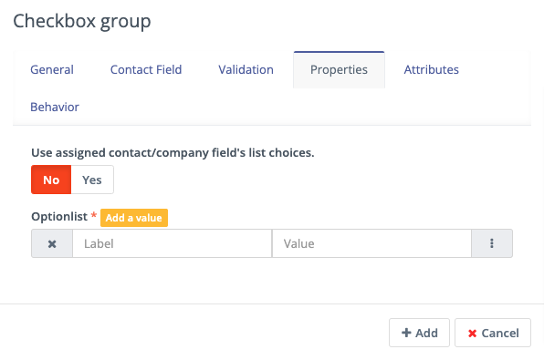

With the checkbox, radio box and select fields, the properties tab allows you to choose what should be available for the visitor to select.

If you have mapped the Form Field to a Custom Field in Mautic, there is also the option to use the values provided in the Custom Field rather than listing them separately. This helps to prevent duplication and errors in the Form options.

If you prefer to create your own field options, the ``Optionlist`` allows you to add options with a label and value pair.

The label field controls the display of the field to the visitor completing the Form, and the value field controls the data saved to the database and stored against the Contact record. While they often match this might not always be the case. For example with a GDPR checkbox, the label might be ``Yes I accept that I may receive Email communications from this Company`` whereas the value stored to the database may be ``Yes`` or ``1``.

In select fields, there are two additional settings to allow for setting the Empty Value - which serves the same purpose as the Input Placeholder and isn't saved to the database - and to determine whether to allow multiple values, which changes the field from ``Select`` to ``Select - Multiple``.

Description area
----------------

Use the text entry field in the properties tab of the Description field to enter the information you would like to show with the Form - for example why the visitor should complete the Form. Often this information might display on the website, but you can also include it in the Form itself with this field.

File
----

.. image:: images/forms/form_file_upload.png
  :width: 600
  :alt: Screenshot showing file upload properties

When uploading a file within a Form there are several options under the properties tab:

- Allowed file extensions: it's possible to set the file extensions permitted by providing a comma separated list.
- Maximum file size: the maximum size of attachment - also limited by server settings.
- Public accessible link to download: can you access the file via a public link?
- Set as Contact profile image: set the image uploaded to be their Contact avatar

Attributes
~~~~~~~~~~

   Attributes are CSS tags which change the styling of a particular Form. 

.. note:: 
   Setting the Render Style to No on the Form means that Mautic ignores the styling in these fields.

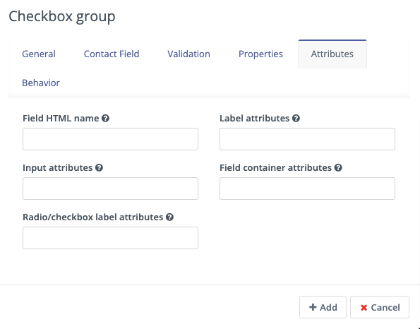

- **Field HTML name**: this is the machine name of the field, populated automatically from the label. You can customise this field if the label is long. You reference this field is when connecting Mautic Forms to other Forms, or when using the Manual Copy function to manually add the Form to your website or app.
- **Label attributes**: this field changes the way the label text appears. You should use the format ``style="attribute: descriptor"`` to change the style. For example, to change the label to red, use ``style="color: red"`` or ``style="color: #ff0000"``.
- **Input attributes**: changes the way any text inside the Form Field appears. This applies to the input placeholder text, text entered by the visitor submitting the Form, and the options for the select fields when Allow Multiple is Yes - including List - Country.
- **Field container attributes**: this changes the Form Field. Use this to change the size of the box, fill color, rounded edges, or any other properties of the actual field.
- **Radio/Check box label attributes**: similar to input attributes, when available this field allows you to customize the way that radio buttons and checkboxes appear.

Behavior
~~~~~~~~

Text
----

The Behavior tab helps marketers to improve the experience for the visitor completing the Form. It also helps marketers implement progressive profiling, to gather more data from the Contact which helps in optimized personalization.

- **Show when value exists**: if Mautic knows the Contact and they're tracked, when a value exists for a field Mautic hides the field when this setting is No. This prevents the Contact answering the same question multiple times. You may want to display the field even if it's already known when you want to ensure you have the most up to date information about the Contact.
- **Show after X submissions**: this allows the marketer to show certain fields only when the Contact has submitted the Form a specified number of times. Enter a value between ``1`` and ``200``.  When left undefined, the field shows every time the Contact views the Form. The goal is to minimize the number of fields shown to the Contact, so it's recommended to hide fields if it's not necessary to verify the values.
- **Auto-fill data**: this allows you to pre-populate Contact data with known Contacts where the information exists in the Contact profile. Auto-fill works with Mautic Landing Pages, and data won't pre-populate when placing the Form anywhere else. Even if you're hiding this field, you may wish to turn on auto-fill to ensure saving of the information with the Form submission.

Field order
-----------

To change the order of fields on your Form:

#. Click the field you would like to move
#. Drag the field to a new location

Form actions
************

You may want to trigger certain actions to happen immediately after Form submission - this is what Form actions are for. This might include communications with the Contact, tracking, internal notifications, or other Contact management tasks.

.. note:: 
   The Form actions available in Mautic are also available in Standalone Forms, which include more options as they're not associated with Campaigns. Campaigns tend to trigger most actions through Campaign actions so Forms associated with Campaigns only have a basic set of Form actions.

- **Add to Company's Score**: if a Contact associated with a Company record in Mautic has submitted the Form, you can add or subtract Points to the Company's overall score. Company scoring in Mautic doesn't aggregate Points for all its associated Contacts. Any actions that you want to contribute to a Company's score must be explicitly set. Negative numbers are valid if you want to subtract from a Company's score based on a Contact submitting a Form. If the Contact isn't tracked and the Form doesn't include a field mapped to Company or Company Name - on the Company object - the Company has no Points awarded.

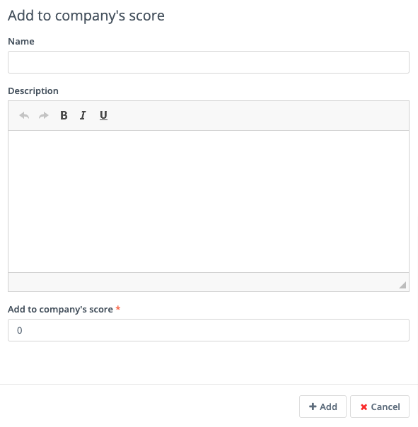

- **Adjust Contact's Points**: this action allows you to add, subtract, multiply or divide a Contact's score. Select the operator and the amount to change the Points by - for example: add 10, subtract 5, multiply by 3, divide by 2. If the Form is collecting information which doesn't identify the Contact, Mautic saves the Points to the anonymous Contact record. If that anonymous Contact record converts to or merges with a know Contact record based on some identifying event such as a Form submission, the Points stay with the Contact.

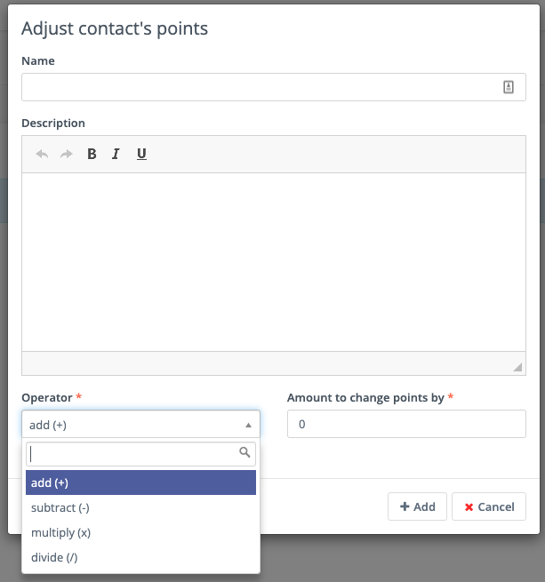

- **Modify Contact's Segments**: this action allows you to change a Contact's Segment membership when they submit a Form. Type in the name of the Segment to add the Contact to or remove the Contact from. You can use both fields at the same time, and can include multiple Segments in either or both fields.  

Dynamic Segments based on filters update based on information in the Contact record automatically - you don't need add them to the Segment in a Form action.

Typically you would use a Form action to populate static Segments - Segments which don't have any filters set. An example of when you might want to remove a Contact from a Segment in a Form action is for an event registration. You can build a filter-based Segment for the invitation Campaign, but once the Contact submits the registration Form you remove them from that Segment and added to a Segment for event attendees, so that they don't receive any more invitation Emails.

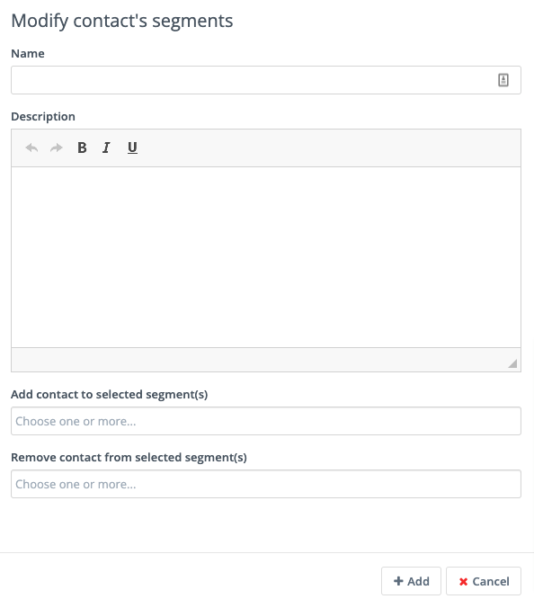

- **Modify Contact's Tags**: if you use Tags in Mautic, you might want to add or remove Tags from a Contact following a Form submission. To add or remove a Tag you have used before, select the Tag from the list displayed when clicking into the field. To find a Tag, start to type the name in the box. To add a new Tag, type the full name and press Enter on your keyboard to save the Tag.

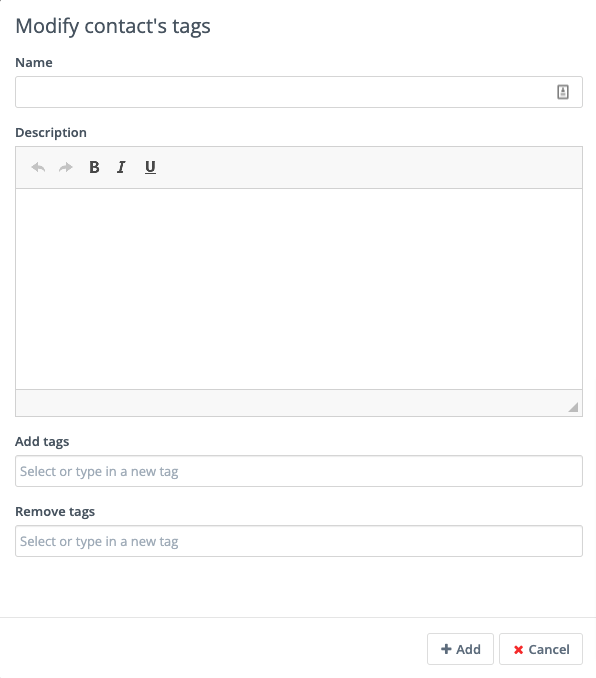

- **Record UTM Tags**: if the page your Form is on has UTM tags, whether it's a Mautic Landing Page or an external website, Mautic can record those UTM Tags and save them to the Contact record for reporting. This is useful if you want to run Reports on where your new Contacts and Form submissions are originating from.

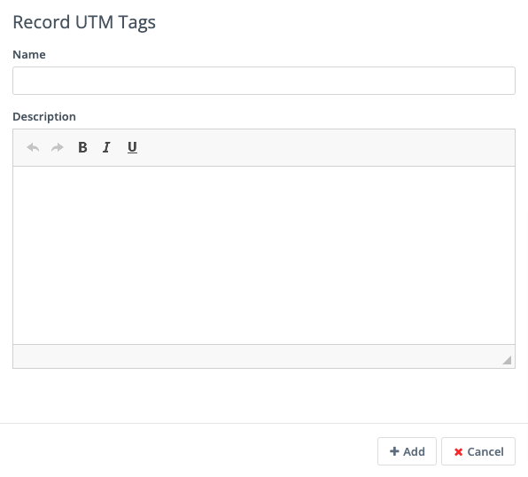

.. vale off

- **Remove Contact from Do Not Contact list**: this Form action allows you to remove a Contact from the Do Not Contact list when they submit a Form. Use this if a Contact has at some time unsubscribed from your Email list, and by filling out the Form, are giving you permission to Email them again.

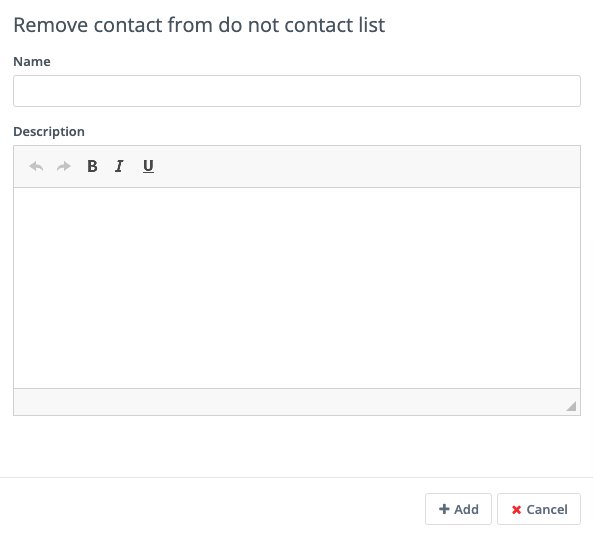

.. vale on

- **Download an Asset**: this option triggers an immediate download of the selected file when the Contact submits the Form. If you use Categories to organize your Assets, you can elect to have them download the most recently enabled Asset in a selected Category. If you prefer, you can link to a specific Asset.

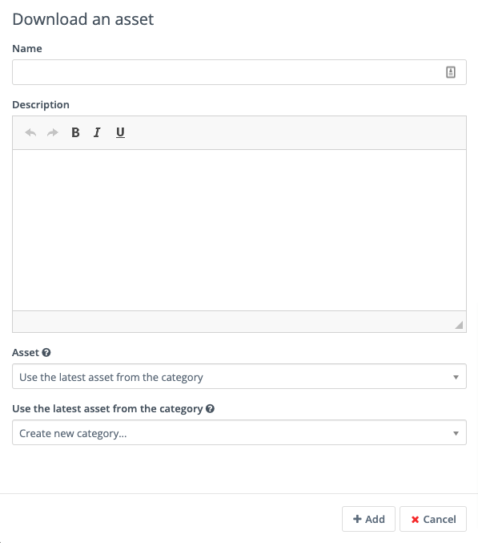

- **POST results to another Form**: use this option to connect your Mautic Form with some other Form. You may have Forms in other tools which you use for tracking and reporting, or back-end Forms triggering software instance creation.

Enter the URL where the Form should post to, and Email address/s for anyone who should receive error notifications. If the Form you are posting to is behind a firewall, also enter the authorization header. If the field aliases - machine names - for any fields don't match, enter the alias the other Form uses for any fields on the Mautic Form.

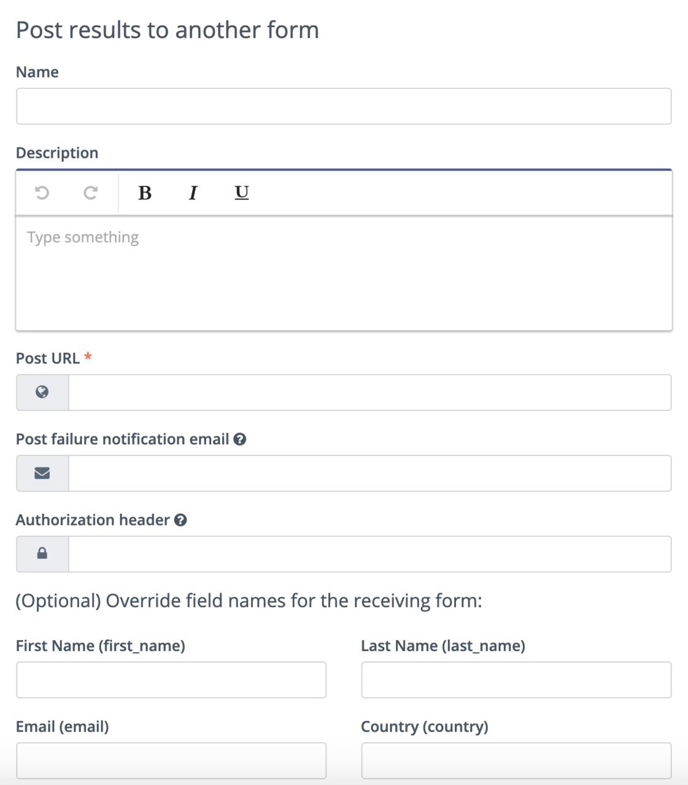

- **Push Contact to Integration**: once a Contact submits the Form, you may need to push them into another piece of software you are using for Contact management - such as a CRM. Ensure that the Plugin you want to use to push the Contacts is already configured and published, then select it in the dropdown field.

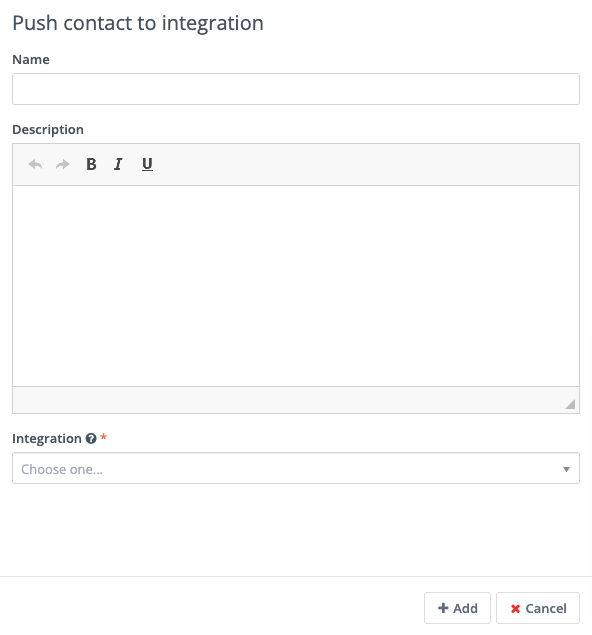

- **Send Email to Contact**: to directly Email the Contact after they submit the Form, use this option. Select a Template Email from the list, or click New Email to build a new one. After selecting an Email, you can also make edits to the Email in a popup window and preview the Email.

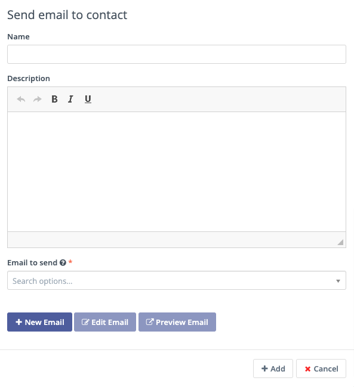

- **Send Email to User**: to Email an internal User of Mautic after a Contact submits a Form. Select the Mautic User from the dropdown. Similar to the Send Email to Contact option, select the Template Email or create a new one. Mautic replaces any tokens in the display with the data from the Contact, not the User.

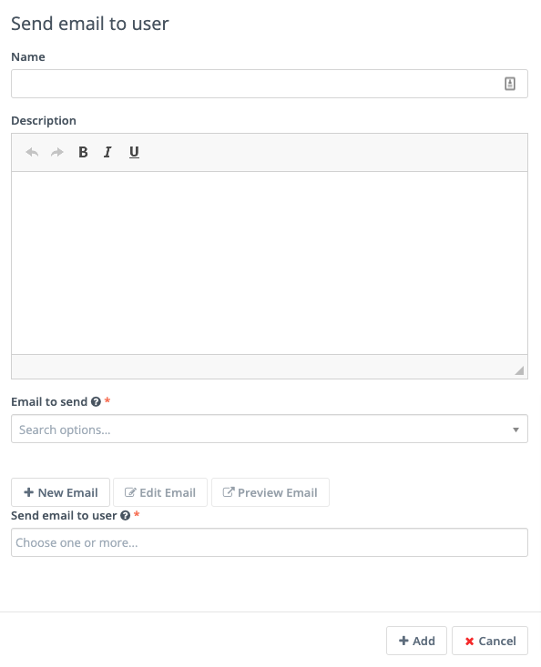

- **Send Form results**: this feature is commonly used for the purposes of a notification when a Contact submits a Form. It can also send a notification to the Contact of the data provided. Be sure to customize the subject line to state which Form the submission relates to. The Reply to Contact option sets the ``reply-to`` address to the Contact's address, so that if the notification is sent to your team, replying will go to the Contact automatically.

If you have Contact Owners set in Mautic, you can also send the notification directly to the Contact's owner. It's also possible to send a copy of the Email to the Contact.

You can style the message itself as you like, and you can click to insert the submitted values from the Form using tokens. You must add the fields to the Form before creating the action. If adding new fields after creating the Form action, edit the Form action and add the new tokens to the Email.

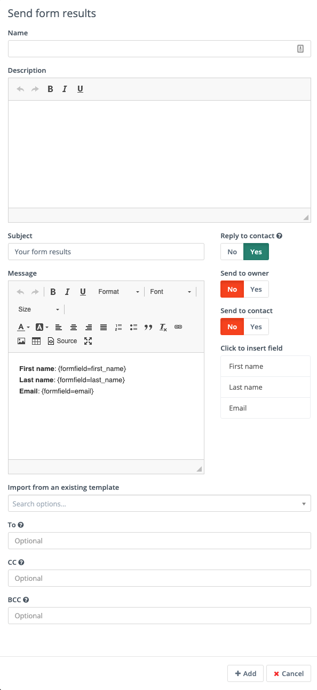

.. vale off

Adding Forms to Pages
*********************

.. vale on

There are several ways to add your Mautic Forms to Landing Pages or Websites.

.. vale off

Shortcodes
==========

.. vale on

When working with Mautic Landing Pages or common Content Management Systems (CMS) including **Drupal**, **Joomla!** or **WordPress**, you can use a shortcode. In each case, replace ``ID#`` with the Mautic Form's ID number, found in the list of Forms or when viewing or editing a Form, the ID is at the end of the URL. This option uses JavaScript, which means that your embedded Form is always up to date with any changes made on your Mautic Form.

- **Mautic Landing Page**: ``{form= ID#}``
- **Drupal 7.x**: ``{mauticform id =ID# width=300 px height=300 px}`` - be sure to change the width and height to the appropriate size for your website.

.. warning:: 
  This shortcode doesn't work for Drupal 8.x - it's recommended to use the Automatic Copy option instead.

- **Joomla!**: ``{mauticform ID#}``
- **WordPress**: ``[mautic type="form" id=ID#]``

Automatic copy
==============

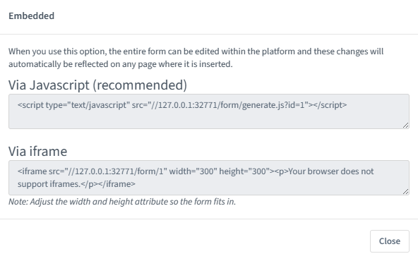

The Automatic option for embedding Mautic Forms uses JavaScript and ensures that the Forms on your website are always up to date with what you have set in Mautic. If you make changes to the Form in Mautic, you don't have to worry about re-copying the Form code everywhere you use the Form. Features including auto-fill and progressive profiling **only** works with the Automatic option.

.. note:: 
  Before copying the code to embed your Mautic Forms, ensure that you are on the correct domain name - not a staging area or internal reference for example - as the Form embed code references the URL.

Via JavaScript
~~~~~~~~~~~~~~

Other than using shortcodes with a CMS Plugin, this is the recommended method for embedding your Mautic Forms. Copy the line of code in the box and paste it into your website where you want the Form to display.

.. vale off

Via IFrame
~~~~~~~~~~

.. vale on

IFrames can be more difficult to use, and blocking by browsers is more likely, however there are sometimes where using an IFrame is preferable. Be sure to adjust the width and height for the space required to fit the Form. The visitor may need to scroll within the IFrame depending on the resolution of their browser. It's possible to display an error message in the event that the visitor's browser doesn't support IFrames, by editing the text between the ``
`` and ``
`` tags before copying the code and pasting it into your website.

Manual copy
===========

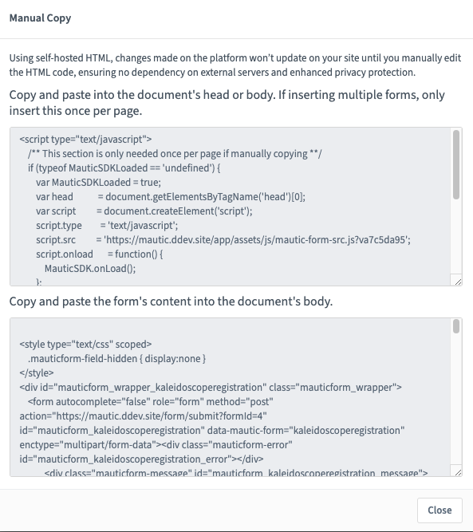

The manual copy option does provide more flexibility to extend Forms with JavaScript snippets and custom styling, however it's a manual process and any changes made within Mautic after copying the code won't be automatically reflected on your website unless you re-copy and paste the new HTML code.

.. note:: 
  Before copying the code to embed your Mautic Forms, ensure that you are on the correct domain name - not a staging area or internal reference for example - as the Form embed code references the URL.

#. Copy the JavaScript code in the first box, and paste it into the head or body of your page. If you have multiple Mautic Forms on the same page, add this once only.
#. Copy the HTML code in the second box, and paste it where you wish to display the Form.
#. If you have Render Style set to Yes in the Form, the code includes the styling. If you have Render Style set to No, there is no styling included with the code, and the Form styling comes from the CSS from your website.

.. vale off

Creating conditional Form fields
********************************

.. vale on

Mautic allows you to create conditional fields within Forms. This allows you to manage a set of dependencies between fields, so that the fields display only with certain conditions.

To create conditional fields, you must first create any :doc:`/contacts/custom_fields` and use these fields within a Form.

.. vale off

Creating Custom Fields
======================

.. vale on

Using an example of wanting to show specific types of car based on the manufacturer, you would create the following Custom Fields:

- **Car manufacturer**: this field should be of the Select data type. In this example, the options for this field are Ford, Nissan, Peugeot, and Fiat.
- **Ford cars**: this field should be of the Select - Multiple data type. In this example, the available options for this field are Focus, Mustang, Fiesta, and Galaxy.

Adding conditional fields to a Mautic Form
==========================================

Once you have created the required Custom Fields, add the parent field to the Form as detailed previously, and add the relevant information in the tabs.

.. note:: 
  When using conditional fields, only ``Select``, ``Select - Multiple`` and ``Boolean`` field types are valid as the parent field.

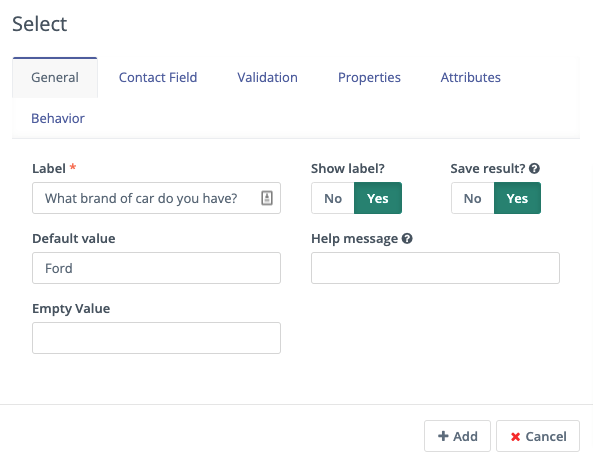

If you have defined the values in the Custom Field, turn the first switch to Yes to use those values. Otherwise, create the labels and values in the Properties tab. You can also associate the Form Field with a Contact field where appropriate.

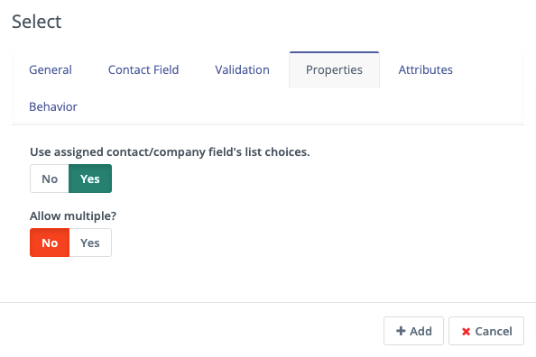

Once saved, an option displays to add a conditional field.

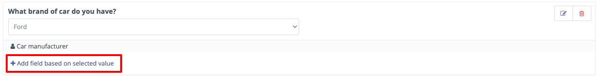

In this example, select the ``Checkbox Group`` option, and under the Condition tab, choose ``including`` and ``Ford``.  

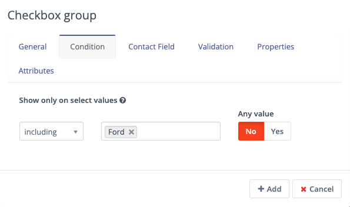

This means that when the visitor selects Ford, the Form displays this field. 

There are two options:

- **including**: if you want the child field to appear only if the selected value on the Form for the parent field **does match** the value/s specified
- **excluding**: if you want the child field to appear only if the selected value on the Form for the parent field **doesn't match** the value/s specified

It's possible to set Any value to Yes, then the child field shows for any value of the parent field. This removes the filters to select an option.

Map the field to a Contact field as appropriate, and under the Properties tab, either select to use the options in the Custom Field, or specify labels and options.

Once saved, the Form displays the conditional field nested underneath the parent field.

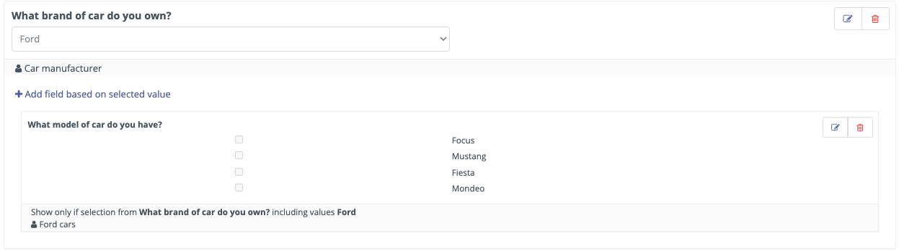

Blocking Form submissions from specified domains
************************************************

Sometimes it's necessary to block certain domains from submitting Forms - for example to restrict access to proprietary content and reduce the volume of unqualified leads.

Configuring blocked domains
===========================

To configure globally blocked domains - applying to all Forms in your Mautic instance - go to the Forms section in :doc:`/configuration/settings`.

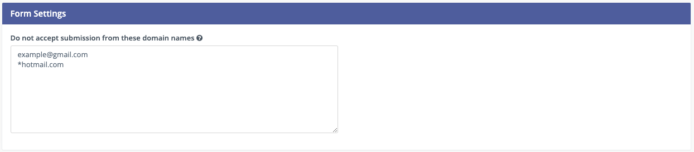

Specify domains, one per line, using either full Email addresses or entire domains using an asterisk before the domain name, which acts as a wildcard. Ensure you save your changes.

Applying domain name filtering to a Form
========================================

To apply domain name filtering on a Mautic Form, add an Email field to the Form - after setting up the domain exclusions in the previous step - and under the Validation tab, set the Domain name submission filter switch to Yes.

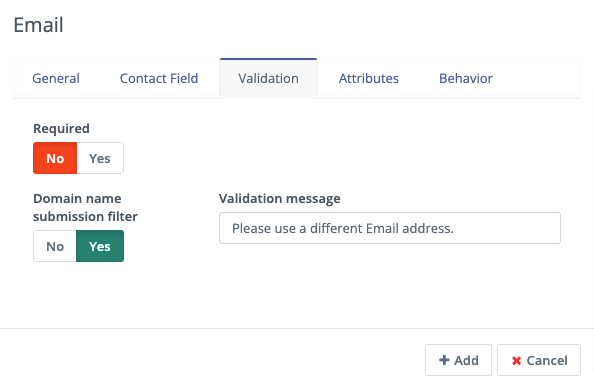

It's advised to provide a helpful message to display if the visitor tries to use an Email address from a blocked domain, to help them understand what the problem is.