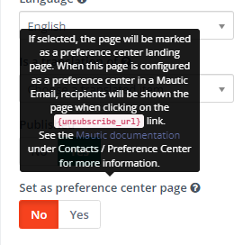
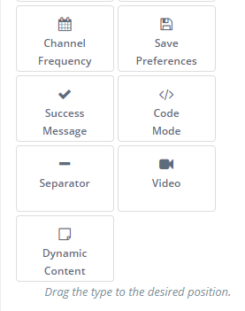

.. vale off

Landing Pages
#############

Landing pages within mautic are a powerful tool for quickly compelling content with a single focus.
Landing pages can be used for directing contacts from form or providing a way for downloading an assets, or merely tracking interest in a particuar subject. 

There are many great features with Mautic landing pages. These pages allow you to create an A/B testing environment (more on this later), multilingual pages, and templated pages unique to a variety of pre-defined templates.

Managing Pages
**************

When viewing a page within Mautic, you can find a tremendous amount of information on a single page overview.

.. _customize preference center:
Customizing the Preference Center
*********************************
It is possible to customize the personal Preference Center/unsubscribe page and edit text labels, format and apply themes using the landing page builder.

Creating Preference Center Landing Page 
=======================================

When creating/editing a landing page, there is a toggle switch labeled *Set as preference center page*. If selected, the page :ref:`customize preference center` a preference center landing page.

When this page is configured as a preference center in a Mautic Email, recipients will be shown the page when clicking on the :code:`{unsubscribe_url}` link. It also shows or hides the Preference Center slots in the builder.
It also shows or hides the Preference Center slots in the builder.

Builder Slots
=============

These slots in the builder are used to customize the page:

.. image:: images/landing_page/builder.png
  :align: center  
  :alt: builder

Tokens
======

Optionally, you can use tokens to insert the different slots. Keep in mind that if you use tokens, you lose the ability to customize the labels and styles of the slots because it uses the default ones.

.. vale on