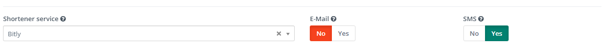

.. vale off

URL shortener service
#################

.. attention::

    Mautic 5 introduces a new shortening feature, replacing the previous legacy shortening system found in the settings. If you utilized the shortening service in Mautic 4, upon upgrading to Mautic 5, please follow the steps below to reconfigure it.

The new URL shortener service allows developers to create Plugins for any shortener service, with any type of authorization. By default, Mautic does not provide a URL shortener service Plugin; you must install it either from the Marketplace or manually.

Example of setup Bitly plugin
=================

1. Install the Bitly bundle from the marketplace or using Composer:

.. code-block:: bash

    composer require webmecanik/mautic-bitly-bundle

2. Obtain an access key from https://app.bitly.com/settings/api and set up/enable the Bitly plugin.

3. Navigate to Configuration > System Settings > Shortener Service and designate Bitly as the default shortener service.

