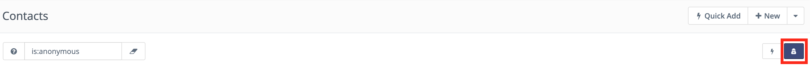

.. vale off

Contacts
#########

.. vale on

Contacts are the central factor of a marketing automation platform. 
These are all the individuals who have visited your websites or interacted with you in some way.

Contact types
**************

There are two types of Contacts:

Visitors (formerly anonymous leads)
===================================

Unidentified visitors to your site who haven't yet completed a Form or otherwise interacted with your site.

Mautic tracks these Contacts, but usually keeps them hidden so as not to clutter up your Segment.
  
Visitors are worth tracking, because these could be future customers. By tracking them before they have any interaction, you can retain a log of when they visited your site, which allows you to get a picture of their activity prior to engaging with you.

You can use the filter in the Contacts screen to display only visitors by using the this command ``is:anonymous`` in the search bar above the Contacts list.

**What you see** - Switching to the anonymous Contacts view displays the IP addresses for visitors to Landing Pages tracked with your Mautic tracking code. 
If you have an IP lookup service :ref:`configured<miscellaneous settings>` in **Settings > System Settings > Miscellaneous Settings**, you will also see an approximate location of these Contacts. Mautic uses MaxMind Geolite2 City by default. The location is based on the Contact’s Internet Service Provider, and may not be the exact location of the Contact.

**Individual Contacts** - Click an IP address to display a Contact record, similar to known Contacts. If there’s any information on an anonymous Contact, you can see it here. This data can include:

* Landing Pages the Contact has visited

* Forms submitted

* Scoring

* Data from Forms (which don’t include the unique identifier, since that would make the contact known) etc.

.. note:: 

    * In **Settings > Configuration > Tracking Settings**, you can enable the **Do Not Track 404 error for anonymous Contacts** option to not track page hits on any 404 error page tracked by the tracking code. This option helps prevent tracking pages you're not interested in and filling the Contact logs with bot activity. See :ref:`Tracking settings<tracking settings>`

    * Data for anonymous Contacts isn't available for segmentation or reporting. Once the Contact is known, the data is available, which applies to non-campaign based dynamic web content filters.

.. vale off

Standard Contacts
=================

.. vale on

The second type of Contact is a known Contact. These Contacts have identified themselves via a Form or other source. You may also have more information about them from previous interactions, or from a third-party system such as a Customer Relationship Management (CRM) tool.

As a result, these Contacts typically have a name, Email, and other identifying information associated with the Contact.

These are Contacts which may have started as a visitor, but at some point provided additional information such as a name, Email address, social network handle, or other identifying characteristics which have enabled you to connect up the activity on your website with a known person. You can nurture these Contacts through the Mautic marketing automation platform, learn more about their behaviour, and take specific actions as a result of this information.

Changing the view
-----------------

The Segment is the default tabular view of all the Contacts in the system - by default the **list view** is enabled, but you can also choose to switch to the **card view** also known as **grid view** which uses avatars to depict the Contacts visually using cards. 
If you’d like to see your Contacts in the card view, click the **C** button while you’re looking at the Contact list. To go back to the table or list view, press the **T** key.

The :ref:`Manage Contacts<managing contacts>` section provides more information on how you can work with Contacts in Mautic.
