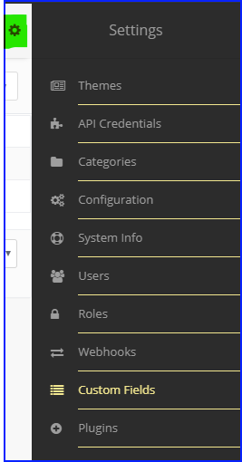
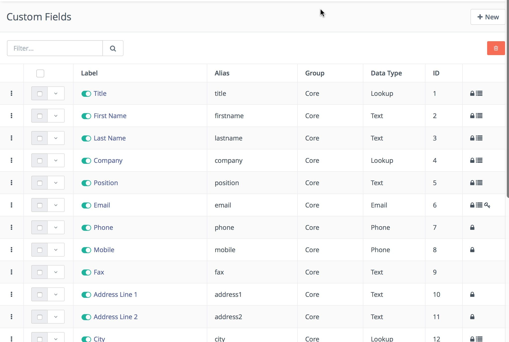
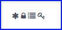
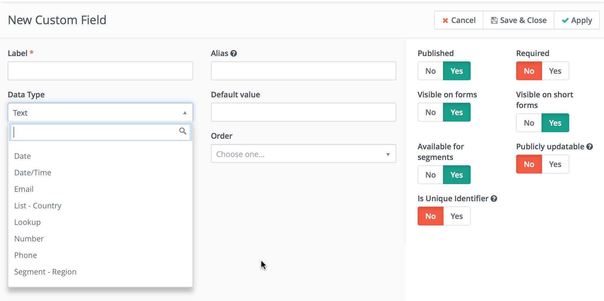

.. vale off

Manage Custom Fields
####################

.. vale on

You can manage Custom Fields through the Admin menu - click the cogwheel upper right-hand side of Mautic.

Custom Fields
*************

The **Custom Fields** page lets you view all existing Contact fields as well as any custom Contact fields you have created.

|

You'll notice the group column shows the specific field on the Contact profile. In the last column, you may see several icons which signify various properties of the field:

|

1. **Lock icon** -  The core installation uses these fields, you can't remove them.

2. **List icon** - You can use these fields as filters for Segments.

3. **Asterisks icon** - These are mandatory when filling in the Contact Form

4. **Globe icon** - You can update these fields publicly through the :doc:`tracking pixel</configuration/variables>` URL query see :doc:`Contact Monitoring</contacts/manage_contacts>` for more details.

It's important to note that from Mautic 5, you won't be able to edit the default value for any Fields used to identify a Contact or Company, including:

* Email

* Company

* First name

* Last name

* Social profiles

* Unique identifier fields

* Company name

* Company Email

* Company website

* State

* Country

* City

Published fields
*****************

There is a toggle switch which shows before each label title. You can find this type of switch throughout the Mautic UI for publishing and unpublishing items.

.. only:: html

   .. figure:: images/unpublish-fields.gif

|

.. vale off

Adding a new Custom Field
*************************

.. vale on

You can create additional Custom Fields and define the data type you want that field to hold. In addition to the data type you select the group for that particular field. This defines where the field displays on the Contact edit and detail view.

|

Creating Custom Fields via a command
************************************

When you create a new Custom Field for Contacts or Companies in Mautic, the system adds a new column to the database. For larger instances of Mautic, this operation can slow down, and the table remains locked while running. As a result, you can't make any changes until the system creates the field. The ``HTTP`` request may time out, causing the User Interface to report that the column exists even though Contact/Company updates may fail because the column is still missing.

There is a way around this when you configure the processing of field creation in the background.

Since :xref:`Mautic 3` there is an option you can set in your ``app/config/local.php`` file: ``'create_custom_field_in_background' => true``,.

If you configure this option, the new Custom Field becomes visible in the list of Custom Fields. The Custom Field remains unpublished until you run the command ``bin/console mautic:custom-field:create-column``. This command creates the actual column in the table and publishes the field metadata.

This configuration helps prevent **http** request timeouts because it handles the long-running SQL query to create the new table column as a background task.

To mitigate the table lock issue, run the command only once daily when you know that most of your audience is offline. With less traffic going into Mautic, the chances of encountering a problem are lower.

Analyzing Custom Fields to optimize tables
******************************************

Since Mautic 5.1 there is a command which allows you to analyze the Custom Fields and optimize the tables. This command is useful when you have a lot of Custom Fields and you want to optimize the size of VARCHAR fields.  

Using this command allows you to optimize the VARCHAR columns so that you can create more Custom Fields if you hit the hard limit on the Leads table and can't create more.

Use the command:

.. code-block:: bash

    bin/console mautic:fields:analyse -t

Use the -t argument to see the output in tabulated form in the console.

Use the following to export the data to a file:

.. code-block:: bash

    bin/console mautic:fields:analyse > path/to/file.csv

Locally defined countries and regions
*************************************

Since Mautic 5.1 it's possible to define custom countries and regions via locally hosted JSON files. This is useful when you have a specific set of countries or regions that you want to use in your Mautic instance. You can define these in a file called ``countries.json`` or ``regions.json`` located in your defined ``upload_dir`` which is ``media/files`` by default. Example code snippets are below:

.. code-block:: json

  [
  "Middle Earth",
  "Fillory"
  ]

.. code-block:: json
  
  {
  "Middle Earth": [
    "The Shire",
    "Mordor"
  ],
  "Fillory": [
    "Castle Whitespire",
    "Ember's Tomb"
  ]
  }

