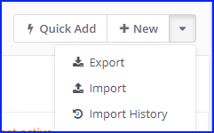
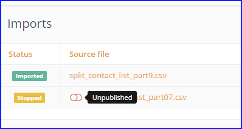
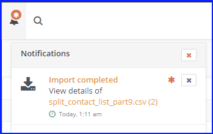
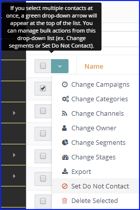

.. vale off

Import Contacts
###############

.. vale on

Contact importing is possible through the User Interface in Mautic. For larger imports it's recommended to complete the import in the background via a cron job.

Since Mautic 2.9, Mautic shows in a Contact's event history when an import job creates or updates a Contact.

Import file requirements
************************

* The CSV file must use UTF8 encoding. Other encodings may cause failures while importing. Read the documentation of your spreadsheet program on how to export a spreadsheet to UTF8. Google Sheets encodes to UTF8 automatically, Libre/Open Office lets you choose before export.

* For boolean values like ``doNotEmail`` or custom boolean field, use values ``true``, ``1``, ``on`` or ``yes`` as TRUE values. Mautic considers anything else ``false``.
* To import multiple Tags for a Contact separate them with ``|`` like ``tag-a|tag-b|tag-c``
* For date/time values, use ISO8601 notation ``i.e. YYYY-MM-DD hh:mm:ss``.  Other formats may work too, but they could be problematic.

  * Example: ``2019-01-02 19:08:42``.
    
    Other formats may work too, but they could be problematic.

Tips
====

* Use a header row with the column names matching the Mautic Contact Custom Field names. This way Mautic automatically pre-selects the mapping for you. For example, if you name the first name column as ``firstname``, Mautic maps this automatically to ``{contactfield=firstname}``.

* When you set up your mapping, you have an option to skip the import on fields where a value already exists on the Contact record. This setting allows you to avoid erasing data which already exists in your Mautic Contacts.

* If your CSV contains more than a few thousand Contacts, divide the file into several smaller CSV files to avoid memory issues and slow import speeds.

.. tip:: 
  If using a Linux system, see the ``GNU`` parallel command ``sudo apt install parallel``.
  
  ``cat big_contact_list.csv | parallel --header : --pipe -N 1000 'cat > split_list_part{#}.csv'``
  
  This generates files: ``split_list_part1.csv ...split_list_part9.csv, split_list_part10.csv``.

Types of import
***************

Browser import
==============

You must import larger CSV files in batches to avoid hitting server (PHP) memory and execution time limits. When importing in the browser, your browser is controlling the batches. When one finishes, the JavaScript starts a new one. This means the browser window has to stay opened and connected to the internet the whole time.

Use the browser import method only if you don't have any other choice. You should default to using the background import.

Background import
=================

Background import jobs - triggered manually or via a cron job - have the advantage of benevolent time limits. A CSV background import isn't restarted every batch - 1 batch = 100 rows by default - Mautic saves the last row imported, and the next batch continues from that point. Background imports are always faster and more reliable than browser imports.

.. warning:: 

  Background import requires the command ``php /path/to/mautic/bin/console mautic:import`` to run periodically. Add it to your :doc:`cron jobs</configuration/cron_jobs>`.

Successful results of the :doc:`background job</configuration/cron_jobs>` look like this:

.. code-block:: shell

  $ bin/console mautic:import
  48/48 [============================] 100%
  48 lines were processed, 0 items created, 48 items updated, 0 items ignored in 4.78 s

If there is no import waiting in the queue, there won't be any messages. You can also use ``--quiet`` to prevent messages showing.

Automatic import type configuration
-----------------------------------

There is an option in the Global Mautic Configuration > Contact settings to define the optimal limit of browser import vs background import. 

If you enter 500, that means that if there's less than ``500`` rows, the browser imports it. If there's more than 500 rows, Mautic queues it for processing when the background import cron job next runs.

 The default value is zero, which means it shows two import buttons instead of one, and you have to decide what import option to use during every import.

Parallel imports
----------------

The import can take several minutes. One import might be running when you start another. There is the ``parallel_import_limit`` configurable option to prevent running out of server resources. By default, only 1 import runs at a time. You can change this option by adding it to your ``app/config/local.php`` file.

Import job list
***************

You can access the list of imports by going to the Contacts area, clicking the Action menu at the top right of the Contacts table, and then selecting the Import History option.

|

.. tip:: 

  The direct URL is ``https://example.com/s/contacts/import/1``

The table shows you:

* basic statistics about all imports
* their :ref:`current status<import job status>`
* original CSV file names
* who created the import
* Created date
* when the background job last updated the statistics

There is also a toggle switch which enables you to :ref:`stop and start<starting and stopping imports>` queued or **In Progress** imports.

Import job status
=================

There are several potential statuses for import jobs:

* **Queued** - Mautic has queued the import for background processing. It's waiting for the background job to start the import.

* **In Progress** - The background job started the import and hasn't finished yet. You can see the progress in the list of imports.

* **Imported** - The import has been successfully processed.

* **Failed** - The import failed for some reason. The most common cause may be that the uploaded CSV file no longer exists, Mautic doesn't have permission to read it, or the import was unresponsive for more than 2 hours.

* **Stopped** - The User stopped the import when it was in the **Queued** or **In Progress** states.

* **Manual** - The User selected to import in the browser ``manually``. It's similar to In Progress.

* **Delayed** - The background job wanted to start the import, but the import process couldn't. So it's delayed for later. The reason when this could happen is when it hits the parallel import limit. The import starts as soon as it's able to do so.

Import job detail
=================

Clicking on a filename opens the import job detail page.

The main content area displays information about ignored rows - if any. The table tells you what row in the CSV file it was and what was the reason, so you can fix those rows and :ref:`start the import<how to start an import>` again.

There are two charts:

1. The pie chart shows the ratio between created, updated and failed rows.

2. The line chart shows the Contacts added per minute.

More detailed statistics and the import job configuration are available if you click *Details*. This includes import speed, field mappings, and job timestamps.

Starting and stopping imports
*****************************

How to start an import
======================

1. Go to **Contacts**.

2. In the top right corner of the Contacts page, open the sub menu of actions and select the **Import** option.

.. tip:: 

  The direct URL is ``https://example.com/s/contacts/import/new``

3. Select the CSV file with Contacts you want to import.

4. Adjust the CSV settings if your file uses a non-standard delimiter or :ref:`encoding<import file requirements>` and so on.

5. Upload your CSV file.

6. The field mapping page should show up. The first set of options lets you select owner, Segment and tags to assign globally to all imported Contacts. The second set of options lets you map the columns from your CSV file to Mautic Contact :ref:`Custom Fields<manage custom fields>`. The third set of options lets you map columns from your CSV file to special Contact attributes like *Date Created* and so on.

7. When your field mapping is ready, click one of the Import buttons described previously.

How to stop a background import
===============================

1. Go to *Contacts*.

2. In the top right corner of the Contacts page, open the sub menu of actions and select the :ref:`Import History<import job list>` option.

3. Unpublish the import job you want to stop. The import changes :ref:`status<import job status>` to Stopped. It finishes importing the current batch and then stops.

4. To start the import again, publish it, and the background job continues with the next :doc:`cron job execution</configuration/cron_jobs>`.

|

When the background job finishes, either successfully or if it fails, you'll get a notification in Mautic's notification area about it.

|

FAQ
***

Q. The import times out.  

A. Either use the background job to import, or change the batch limit to smaller number than 100.

Q: Are imported *Do Not Contact* values stored as a bounce or a ``unsubscription``? 

A. It's stored as a ``Manual Unsubscription``. It's the same as marking the Contact *Do Not Contact* from the Contact's page.

