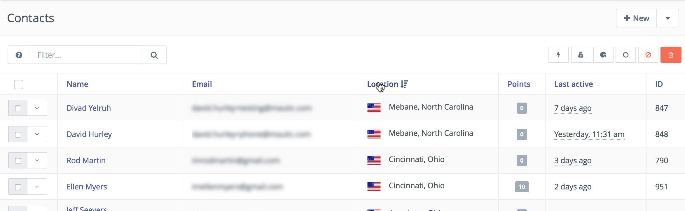
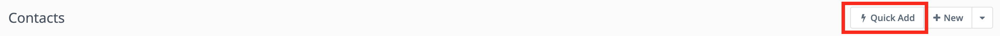
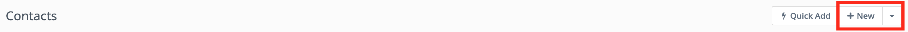
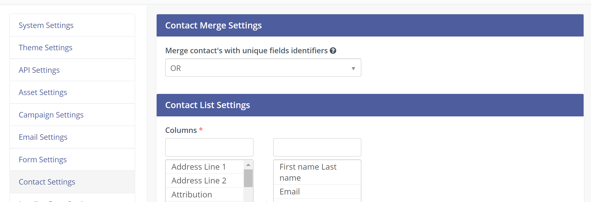
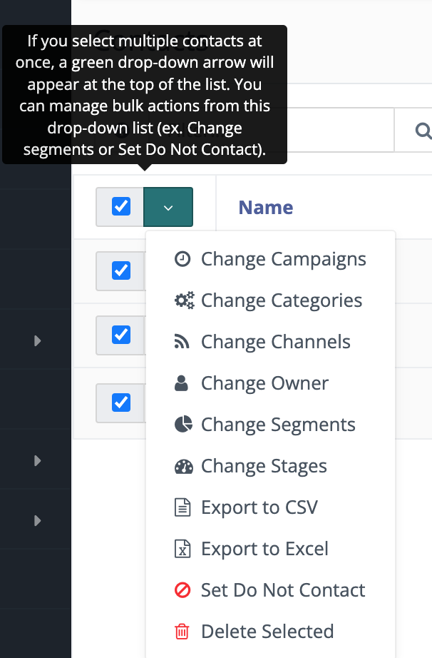
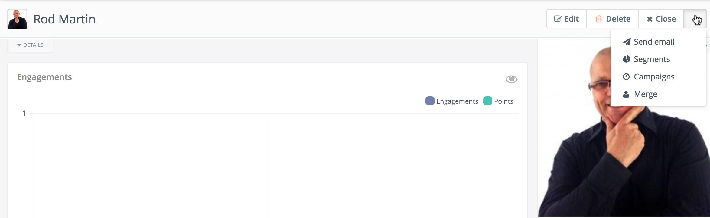
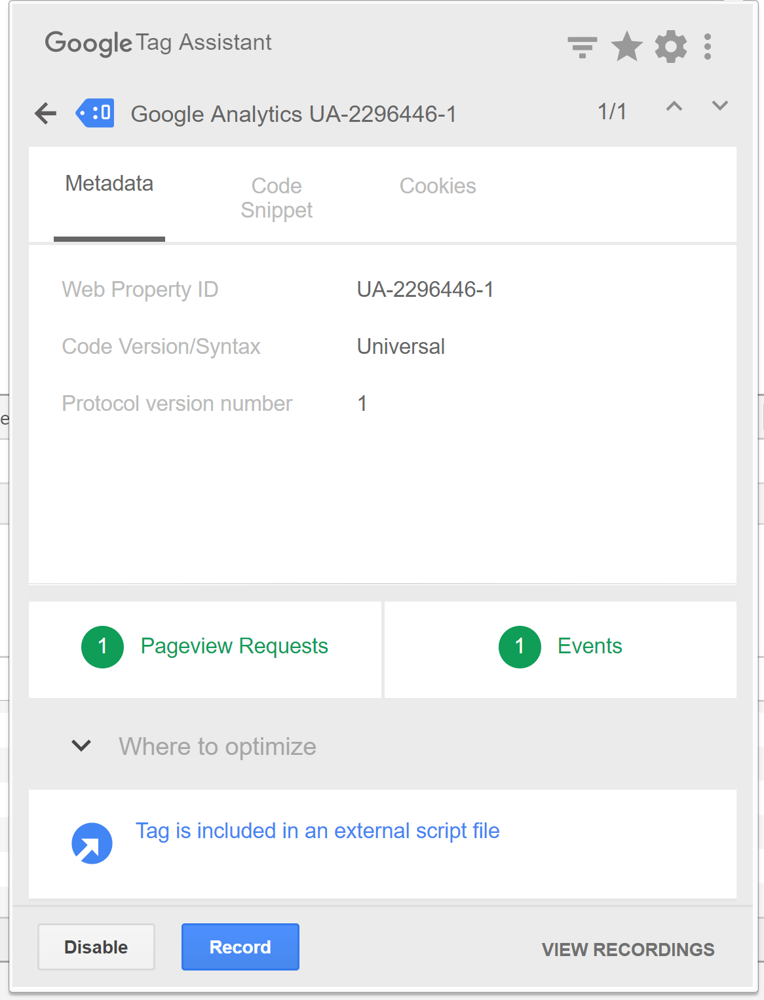
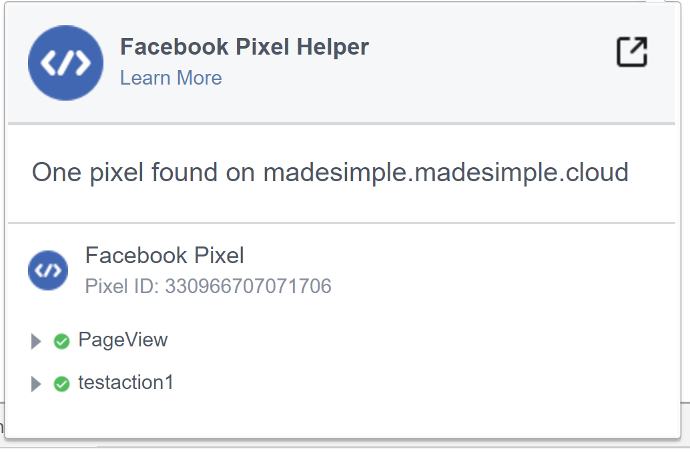

.. vale off

Managing Contacts
#################

.. vale on

The manage Contacts page is the main interface through which you can view and interact with your Contacts - both visitors and standard Contacts.

.. vale off

Searching for Contacts
**********************

.. vale on

You can search within a Segment using the box at the top of the list, or order Contacts by using the table headings - click on the relevant table heading.



|

The search box allows many different search types and follows the same search process and variables as found in all other search layouts.

.. vale off

Adding Contacts
***************

.. vale on

Quick add
=========



|

Quick Add is a short Form with the fields you deem most important. To display fields in the **Quick Add** Form, make them available on short Forms in the Custom Fields configuration.

You can add the Contact through the New Contact Form and include much more detail, but for quick entry this is the easiest and fastest way to get the Contact into the system.

Add new Contact
=======



|

This opens the new Contact screen, where you can enter all the information you have about the Contact. It also displays all published Contact fields when creating a new Contact. 

Use the tabs at the top to populate existing Custom Fields and social network profiles. 

.. note:: 

    Before you start adding Contacts, you may need to add :doc:`custom fields</contacts/custom_fields>` to capture all the information you require.

.. vale off

Importing Contact lists
***********************

.. vale on

Mautic offers the ability to import Contacts from other sources via CSV file - this is a great way to get up and running quickly if you need to import a lot of Contacts at once.

To import your CSV file:

1. :doc:`Create custom fields</contacts/custom_fields>` to match the fields in your list.

2. On the Contacts page, click **Import** next to **+New**.

3. Choose your UTF-8 encoded CSV file.

4. Adjust the value in **Delimiter**, **Enclosure**, and **Escape**, if necessary.

5. Click on **Upload**

When you click **Upload**, you can match the fields found in the CSV file to the fields that you have in Mautic, which allows the data to be correctly imported.

Following values results in **TRUE** when importing a ``Boolean`` value: ``1``, ``true``, ``on`` and ``yes``. Those values can be also capitalized and still taken as TRUE. **Mautic saves any other value as FALSE**.

.. vale off

Exporting Contact lists
***********************

.. vale on

Mautic supports exporting Contact lists in CSV and Excel formats.

* **Export to CSV** - Sends a downloadable link containing the CSV file of the Contact list to the Email address on your Mautic User profile.

.. note:: 

    This feature currently supports the export of a maximum of one million Contacts. After clicking the link in the Email, Users must log into Mautic via the login screen. Users must login as the same authorized User that received the Email, after which the file download commences. Once downloaded, Users can share the file with other non-Mautic Users.

* **Export to Excel** - Exports Contact lists to Excel directly from the system.

.. vale off

Editing Contacts
****************

.. vale on

To edit a Contact, click the name of the Contact - or the IP address if the visitor is anonymous - to open the Contact screen.

From this screen, you can view the recent events and any notes saved against the Contact.

To edit the Contact, click the '**edit**' button on the top-right menu.

Contact duplicates
******************

When Mautic tracks a Contact's actions - such as page hits or Form submissions - Contacts are automatically merged based on their unique identifiers, which are:

* Email - *or any other Contact field you mark as unique identifier*

* Cookie

Mautic merges all actions to the Contact with the same cookie or creates a new cookie if it knows the unique cookie.

If a Contact sends a Form with an Email address, it merges the submission with the Contact having the same Email address. This happens even if the IP address or the cookie matches another Contact.

So, Mautic takes care of duplicate Contacts created by the event tracking. You can, however, still potentially create a duplicate Contact via the Mautic administration. As of Mautic 2.1.0, Mautic notifies you if there's already a Contact with the same unique identifier.

``AND`` is the default operator to find duplicates by unique identifiers. You can choose to use the ``OR`` operator in the Contact Merge :doc:`Settings configuration</configuration/settings>`.



|

Batch actions
*************

To make updates to several Contacts at once, select those Contacts then click the green arrow at the top of the checkbox column. 

A modal window displays when you click one of the actions, with more configuration details. 


You can use this feature to quickly update large volumes of Contacts, but it might be better to use a Campaign action - for example add all the Contacts you need to update into a segment and use a campaign to trigger the change - if you need to change more than a few hundred Contacts at a time.



|

The following batch actions are currently available:

* **Change Campaigns** - Allows you to add/remove the selected Contacts to/from Campaigns.

* **Change Categories** - Allows you to add/remove the selected Contacts to/from global Categories.

* **Change Channels** - Allows you to subscribe/unsubscribe the selected Contacts to/from communication Channels (Email, SMS, etc.) and also define frequency rules.

* **Change Owner** - Allows you to assign/unassign the selected Contacts to/from an owner (a Mautic User).

* **Change Segments** - Allows you to add/remove the selected Contacts to/from Segments. Note that if you add or remove a Contact to or from Segment manually, then Segment filters won't apply for them in that particular Segment.

* **Change Stages** - Allows you to add/remove the selected Contacts to/from a specified Stage.

* **Export** - Allows you to export selected Contacts to CSV.

* **Set Do Not Contact (DNC)** - This action sets all selected Contacts as DNC for the Email Channel, and it allows you to provide a custom message as "reason" for why the Contacts were manually unsubscribed by a Mautic User.

* **Delete Selected (batch delete)** - The batch delete action in the Contact table allows the deletion of up to 100 Contacts at a time. This limit is there as a performance precaution, since deleting more Contacts at a time could cause performance degradation issues.

If you need to delete large numbers of Contacts, visit the :doc:`segment docs</segments/manage_segments>` which explains how to delete thousands of Contacts easily.

Contact details
***************

Each Contact has a detail page where you can see what Mautic knows about them.

Engagements chart
=================

The Engagements line chart display how active the Contact was in the past 6 months. Engagement is any action the Contact made. For example: page hit, Form submission, Email open and so on. The chart displays also the Points which the Contact received.

Image
=====

* **Gravatar** - By default, Mautic pulls images from Gravatar. If there’s a :xref:`Gravatar` associated with the Contact’s Email address, Mautic will add the Gravatar photo to the contact record.

* **Custom** - To add a custom image file to a Contact, edit the Contact record and look for **Preferred profile image** under the image placeholder.

* **Social** - If you’ve enabled social Plugins and the record includes a social profile, you’ll see options to pull in profile images.

History
=======

Event history tracks any engagements between Mautic and a Contact. To find certain event types, search in the **Include events by source** text box. To exclude event types from the history while you’re looking at it, use **Exclude events by source**.

**Accessed from IP** - IP addresses which the Contact has opened or clicked Emails, visited your tracked pages, etc. from.

**Added through API** - Contact created through API.

**Asset Downloaded** - Lists which Assets a Contact downloaded from your Landing Pages or website. Combining this information with other data can help with analyzing what led a Contact to download the Asset.

**Campaign Action Triggered** - Actions within Campaigns which have already happened.

**Campaign Event Scheduled** - Actions within Campaigns which take place in the future. Expand the details to see the event’s scheduled date and time. Click the clock icon to reschedule the event, or click **X** to cancel the event. A warning icon means an execution error on the first try caused a rescheduling of the event.

**Campaign Membership Change** - Changes to which Campaign a Contact is a part of.

**Contact Created** - This is the first event, showing the date and time the Contact first entered your database - either as a known or anonymous Contact.

**Contact Created By Source** - The source from which the Contact originated.

**Contact Identified** - The date and time of Contact identification, moving the Contact from an anonymous to a known Contact.

**Contact Identified By Source** - How the Contact became identified.

**Do Not Contact** - The date and time the Contact unsubscribed from your messaging on a particular Channel.

**Dynamic Content sent** - When the Contact has a Dynamic Content slot pushed to them through a Campaign action.

**Email Failed** - If an Email to the Contact reports back as the Email address being an invalid address or the Email being undeliverable, Mautic displays an Email failed event with the internal name of the Email shown.

**Email Read** - The date and time when a specific Email was first read. If the Contact opens the Email multiple times, expanding details on the event type displays the additional opens.

.. note:: 

    To avoid performance issues, Mautic has a limit of displaying a maximum of 1,000 **Email Read** event details.

**Email Replied** - If a Contact replies to an Email sent through Mautic, the reply displays on the Contact record with this event type. To see this, you must have the **Contact Replies** inbox configured in **Settings** > **Configuration** > **Email Settings**.

**Email Sent** - When sending a specific Email to a Contact, Mautic lists the internal name of the Email and the time & date of that send.

**Form Submitted** - Along with showing the name and time and date of the Form submission, expanding the details on this event type shows the data collected on the Form and the location of the Form - called the referrer.

**Imported** - Dates, times, and file names for all CSV imports that included a Contact.

**Integration Sync Notice** - Information about connections with Integrations.

**Message Queue** - When exceeding a Contact’s frequency limits for a Channel and a message on that Channel later triggers to send, a Message Queue event displays with the Channel and the ID for the message that's queued. Expanding details displays:

* originally scheduled send date
* rescheduled send date
* current status

If the message is ``Pending``, clicking the X button cancels it.

**Page Hit** - Time and date of page visits, and the URL if it’s a tracked page on your site or the internal name of a Mautic Landing Page. You may view more information, if tracked, by expanding the details of this event type.

**Point Gained** The ID number of either:

* The global point action (in the **Points** section of Mautic)

* The Campaign where the point action exists, along with the name of the global point action or the Campaign, the number of Points added or subtracted, and the time & date of the point change

**Segment Membership Change** - When adding or removing Contacts from Segments by any method, those changes display in the event history.

**Stage Changed** - If you are using **Stages** in Mautic, changes to those Stages displays in the event history

**Text Message Received** - This event type is for SMS replies, if you are using SMS and have SMS reply tracking configured. Outbound SMS display as ``Campaign Event Scheduled`` or ``Campaign Action Triggered``.

**UTM Tags Recorded** - If you’re using UTM tags and record them from a Form submission, landing page hit, etc., Mautic displays them here. Expanding the details displays the recorded tags.

**Video View Event** - Details in this event type include the length of time a prospect watched the video, the percentage of the video watched, the page where the video displays - known as Referrer - and the URL of the video file.

Some Plugins contain specific events. The events display and are searchable after installing and configuring the Plugin.

Notes
=====

It's possible to use Mautic as a basic Customer Relationship Management system (CRM). You or your teammates can write notes for a specific Contact. It's possible to mark a note with a specific purpose; General, Email, Call, Meeting. It's also possible to define a date of a meeting or a call.

Social
======

If a Contact record includes social profiles, you can see them in the **Social** tab. You must have the respective profiles set up in **Settings** > **Plugins**.

Integrations
============

If the Contact exists in other tools has connections through Plugin or API Integrations, you’ll see those here. This helps identify where a Contact came from, or what other internal systems the Contact exists in.

Map
===

If Mautic knows the coordinates of the Contact from a geolocation IP lookup service, it displays a fourth tab with a map so you can easily see the Contact's location. If Mautic knows more locations for this Contact as they travel, you'll see all the locations there. If Mautic doesn't know any location, the tab won't show up.

.. vale off

Change Contact Segments
=======================

.. vale on



|

1. Click the **drop down box arrow** in the top right hand corner of the Contact detail. 

2. Select **Segments**. A modal box shows up where you'll see all the Segments. The green switch means that the Contact belongs to the Segment, the orange switch means the opposite. 

3. Click the **switch** to add/remove the Contact to/from the Segment.

.. vale off

Change Contact Campaigns
========================

.. vale on

1. Click the **drop down box arrow** in the top right hand corner of the Contact detail. 

2. Select **Campaigns**. A modal box shows up where you'll see all the Campaigns. The green switch means that the Contact belongs to the Campaign, the orange switch means the opposite. 

3. Click the **switch** to add/remove the Contact to/from the Campaign.

.. vale off

Merge two Contacts
==================

.. vale on

If you have 2 Contacts in the Mautic database who are physically one person, you can merge them with the Merge feature. 

1. Click the drop down box arrow in the top right hand corner of the Contact detail, 

2. Select the Merge item, a modal box shows up. 

3. Search for the Contact you want to merge into the current Contact. The select box updates as you search. 

4. Select the right Contact and hit the **Merge** button.

.. vale off 

Send Email to Contact
=====================

.. vale on

This option enables Users to send an individual Email, either manually created with the builder or from a template Email. The **From Name** and **From Email Address** default to the User sending the individual message.

Contact tracking
****************

The act of monitoring the traffic and activity of Contacts can sometimes be somewhat technical and frustrating to understand. Mautic makes this monitoring simple and easy to configure.

Website monitoring
==================

It's possible to use Mautic to monitor all traffic on a website by loading a JavaScript file - recommended - or by adding a tracking pixel to resources. It's important to note that traffic isn't monitored from logged-in Mautic Users. To verify that the JavaScript/pixel is working, use an incognito or private browsing window or log out of Mautic prior to testing.

Note that by default, Mautic won't track traffic originating from the same :xref:`private network` as itself, but you can configure Mautic to track this internal traffic by setting the ``track_private_ip_ranges`` configuration option to ``true`` in ``app/config/local.php`` then and then :xref:`clearing the symfony cache`.

.. vale off

Tracking script (``JavaScript``)
--------------------------------

.. vale on

Since Mautic 1.4 the JavaScript tracking method is the primary way of website tracking. To implement it: 

1. Go to Mautic > *Settings* by clicking the cogwheel at the top right > *Configuration* > *Tracking Settings* to find the JS tracking code build for the Mautic instance

2. Insert the code before the ending ``<body/>`` tag of the website you want to track

Or, copy the code below and change the URL to your Mautic instance.

Mautic sets cookies with a lifetime of 1 year, with returning visitors identified exclusively by the cookie. If no cookie exists yet, Mautic creates a new Contact and sets the cookie.

Make sure you enter your website URL correctly as outlined in the :doc:`CORS settings</configuration/settings>`.

Note that if a browser doesn't accept cookies, this may result in each hit creating a new visitor.

.. code-block::

    <script>
        (function(w,d,t,u,n,a,m){w['MauticTrackingObject']=n;
            w[n]=w[n]||function(){(w[n].q=w[n].q||[]).push(arguments)},a=d.createElement(t),
            m=d.getElementsByTagName(t)[0];a.async=1;a.src=u;m.parentNode.insertBefore(a,m)
        })(window,document,'script','http(s)://example.com/mtc.js','mt');

        mt('send', 'pageview');
    </script>

*Don't forget to change the scheme (http(s)) either to http or https depending what scheme you use for your Mautic. Also, change [example.com] to the domain where your Mautic runs.*

The advantage of JavaScript tracking is that the tracking request - which can take quite long time to load - loads asynchronously, so it doesn't slow down the tracked website. JavaScript also allows you to track more information automatically:

* **Page Title** is the text written between ``</title>`` tags

* **Page Language** is the language defined in the browser.

* **Page Referrer** is the URL which the Contact came from to the current website.

* **Page URL** the URL of the current website.

mt() events
~~~~~~~~~~~

mt() supports two callbacks, ``onload`` and ``onerror`` accepted as the fourth argument. The ``onload`` method fires at loading of the pixel. If the pixel fails for whatever reason, it triggers ``onerror``.

.. code:: shell

     mt('send', 'pageview', {}, {
        onload: function() {
            redirect();
        },
        onerror: function() {
            redirect();
        }
    });

Local Contact cookie (first party cookie)
~~~~~~~~~~~~~~~~~~~~~~~~~~~~~~~~~~~~~~~~~
.. _local-contact-cookies:

If you've configured CORS to allow access from the domain where you've embedded the mtc.js, Mautic places a cookie on the same domain with the name of ``mtc_id``. This cookie has the value of the ID for the currently tracked Contact but isn't used to track the Contact. This enables the server side software to access the Contact ID, and thus providing the ability to integrate with Mautic's REST API as well.

Valid Domains for CORS must include the full domain name as well as the protocol. For example, ``http://example.com``, if you serve up secure and non-secure pages you should include both ``https://example.com`` as well ``http://example.com``. All subdomains will need to be listed as well for example, ``http://example.com`` and ``http://www.example.com`` , if your server allows this. If you would like to allow all subdomains, an asterisk can be used as a wildcard for example, ``http://*.example.com``.

Tracking of custom parameters
~~~~~~~~~~~~~~~~~~~~~~~~~~~~~~~~

You can attach custom parameters or overwrite the automatically generated parameters to the ``pageview`` action as you could to the tracking pixel query. To do that, update the last row of the preceding JS code like this:

``mt('send', 'pageview', {email: 'my@email.com', firstname: 'John'});``

This code sends all the automatic data to Mautic and adds also ``email`` and ``firstname``. Your system must generate the values of those fields.

The tracking code also supports Company fields. Mautic can assign a Company to your tracked Contact based on Company name. Then you have to add the **company** or ``**companyname**`` parameter to the tracking code, along with other Companies fields such as ``companyemail``, ``companyaddress1``, ``companyaddress2``, ``companyphone``, ``companycity``, ``companystate``, ``companyzipcode``, ``companycountry``, ``companywebsite``, ``companynumber_of_employees``, ``companyfax``, ``companyannual_revenue``, ``companyindustry``, ``companyindustry``, ``companydescription``.

You can also use Contact tags and UTM codes.

``mt('send', 'pageview', {email: 'my@example.com', firstname: 'John', company: 'Mautic', companyemail: 'mautic@example.com', companydescription: 'description of company', companywebsite: 'https://example.com', tags: 'addThisTag,-removeThisTag', utm_campaign: 'Some Campaign'});``

.. vale off

Load Event
~~~~~~~~~~

.. vale on

To have JS call a function on loading of a request, define an ``onload`` function in the options. This is possible due to the asynchronous loading of the JS tracking request. Here's how you do it:

``mt('send', 'pageview', {email: 'my@example.com', firstname: 'John'}, {onload: function() { alert("Tracking request is loaded"); }});``

Tracking pixel
==============

It's recommended to use the tracking script with CORS properly configured instead of the tracking pixel. If that's not possible for whatever reason, use the tracking pixel. The tracking pixel uses third party cookies for tracking.

``https://example.com/mtracking.gif``

Tracking pixel query
--------------------

To get the most out of the tracking pixel, it's recommended that you pass information of the web request through the image URL.

Page information
~~~~~~~~~~~~~~~~

Mautic currently supports ``page_url``, ``referrer``, ``language``, and ``page_title`` - note that the use of ``url`` and ``title`` is deprecated due to conflicts with Contact fields.

UTM code
~~~~~~~~

Currently, Mautic uses ``utm_medium``, ``utm_source``, ``utm_campaign``, ``utm_content``, and ``utm_term`` to generate the content in a new timeline entry.

``utm_campaign`` is the timeline entry's title.

``utm_medium`` displays using the following Font Awesome classes:

All the UTM tags are available in the time entry, just by toggling the entry details button.

Please note that Mautic records UTM tags only on a Form submission that contains the action "Record UTM Tags".

.. list-table:: 
   :widths: 100 100
   :header-rows: 1

   * - Values
     - Class
   * - social, ``socialmedia``
     - fa-share-alt if utm_source isn't available, otherwise Mautic uses utm_source as the class. For example, if utm_source is Twitter, the entry uses fa-twitter.
   * - email, newsletter
     - fa-envelope-o
   * - banner, ad
     - fa-bullseye
   * - ``cpc``
     - fa-money
   * - location
     - fa-map-marker
   * - ``device``
     - fa-tablet if utm_source isn't available otherwise Mautic uses utm_source as the class. For example, if utm_source is Mobile, Mautic uses fa-mobile.
  
All the UTM tags are available in the time entry, just by toggling the entry details button.

Please note that Mautic records UTM tags only on a Form submission that contains the action "Record UTM Tags".

Contact fields
~~~~~~~~~~~~~~

You can also pass information specific to your Contact by setting Mautic Contact ``field(s)`` to be publicly editable. Note that values appended to the tracking pixel should be ``url`` encoded - %20 for spaces, %40 for @, etc.

Tags
~~~~

You can change the Contact's Tags by using the ``tags`` query parameter. Multiple Tags can be separated by comma. To remove a Tag, prefix it with a dash (minus sign).

For example, ``mtracking.gif?tags=ProductA``,-ProductB would add the ProductA Tag to the Contact and remove ProductB.

Embedding the pixel
-------------------

If you're using a Content Management System, the easiest way is to let one of the available Plugins do this for you - see below. Note that the Plugins may not support all Contact fields, UTM codes or Contact tags.

Here are a couple code snippets that may help as well:

HTML
~~~~

.. code-block:: shell

    

PHP
~~~

.. code-block:: php

    $d = urlencode(base64_encode(serialize(array(
    'page_url'   => 'https://' . $_SERVER[HTTP_HOST] . $_SERVER['REQUEST_URI'],
    'page_title' => $pageTitle,    // Use your website's means of retrieving the title or manually insert it
    'email' => $loggedInUsersEmail // Use your website's means of user management to retrieve the email
    ))));

    echo '';

JavaScript
~~~~~~~~~~

.. code-block::

    <script>
        var mauticUrl = 'https://example.com';
        var src = mauticUrl + '/mtracking.gif?page_url=' + encodeURIComponent(window.location.href) + '&page_title=' + encodeURIComponent(document.title);
        var img = document.createElement('img');
        img.style.width  = '1px';
        img.style.height  = '1px';
        img.style.display = 'none';
        img.src = src;
        var body = document.getElementsByTagName('body')[0];
        body.appendChild(img);
    </script>

.. vale off

Available Plugins
~~~~~~~~~~~~~~~~~

.. vale on

Mautic makes this even easier by providing key Integrations to many existing Content Management Systems. You can download and use any of the following Plugins to automatically add that tracking pixel to your website.

.. vale off

* Joomla! 
* Drupal
* WordPress
* TYPO3
* Concrete5
* Grav

.. vale on

These are just a few of the Integrations already created by the Mautic community. It's expected that the list grows as developers submit their own Integrations.

.. note:: 

    It's important to note that you aren't limited by these Plugins and you can place the tracking pixel directly on any HTML page for website tracking.

Identify visitors by tracking URL
---------------------------------

There's a configuration section for identifying visitors by tracking URL although this isn't recommended for use as it's open to abuse with spoof tracking. If enabled, Mautic identifies returning visitors by tracking URLs from Channels - especially from Emails - when no cookie exists yet.

.. note:: 

    For this to work you must mark the Email Contact field as a unique identifier and it must be publicly editable in your Mautic configuration.

How are Contacts tracked with the tracking script?
==================================================

When using the tracking script, Mautic tracks Contacts with third party cookies on the Mautic instance's domain and/or the browser's local storage.

Although the script writes first party cookies to the tracked domain which expires with the session, they're **not** used for tracking. See :ref:`Local Contact cookie (first party cookie)<local-contact-cookies>`.

When a Contact visits the website for the first time, the tracking script makes a call to Mautic. Mautic looks for the ``mautic_device_id`` cookie on its domain. If Mautic finds the cookie and identifies the ``device_id`` in its database, it associates the request with the Contact tied to that specific device.

Mautic returns the Contact ID, the device ID, and a legacy session ID which is the same as the device ID. Mautic stores these values in the browser's local storage - if applicable - and it's written to the site's domain as a first party cookie - not used for tracking.```

The next time the tracking script sends a request to Mautic, it uses the device ID from the browser's local storage to identify the tracked Contact. If that can't be found, Mautic defaults to the cookies stored on it's own domain, using third party cookies to identify the Contact.

Mobile monitoring
=================

The essence of monitoring what happens in an App is similar to monitoring what happens on a website. Mautic contains the building blocks needed for native - or pseudo-native - and HTML5-wrapper based Apps, regardless of platform.

In short, use named screen views - for example, main_screen - in your App as your page_url field in the tracker, and the Contact's Email as the unique identifier, see next section for detailed instructions.

Steps in Mautic
---------------

1. Make the Email field publicly editable, this means that a call to the tracking GIF with the variable ``email`` gets properly recognized by Mautic.

2. Set up a Form, as the access point of your Campaign - for example, a new Contact Email. Make this Form as simple as you can, as you POST to it from your App. The typical Form URL you POST to is ``https://example.com/form/submit?formId=<form_id>``

You can get the ID from the Mautic URL as you view / edit the Form in the Mautic interface or in the Forms tables, last column. You can find the Form fields by looking at the HTML of the 'Manual Copy' of the HTML in the Forms editing page.

3. Define in your Campaigns the screens you want to use as triggers - for example, 'cart_screen' etc. Mautic isn't looking for a real URL in the Form 'https://' for page_url, any typical string would do. Like this: ``https://example.com/mtracking.gif?page_url=cart_screen&email=myemail@example.com``

.. vale off

In your App
-----------

.. vale on

A best-in-class approach is to have a class (say 'Mautic') that handles all your tracking needs. For example, this sample method call would POST to the Form with ID 3 - see previous section.

 .. note:: 
  
  For conciseness and ubiquity, these samples are in JavaScript / ECMAScript-type language, use similar call in your mobile App language of choice.

``mautic.addContact("myemail@example.com",3)``

And then, to track individual Contact activity in the App, this sample call would make an ``HTTP`` request to the tracker:

``mautic.track("cart_screen", "myemail@example.com")``

Which is nothing more than an ``HTTP`` request to this GET-formatted URL - as also shown in previous section:

``https://example.com/mtracking.gif?page_url=cart_screen&email=myemail@example.com``


.. important:: 

    Make sure in your App, that the ``HTTP`` request is using a cookie - if possible, re-use the cookie from the ``mautic.addcontact`` POST request prior - **and** that you reuse this cookie from one request to the next. This is how Mautic - and other tracking software - knows that it's really the same Contact. If you can't do this, you may run into the - unlikely but possible - case where you have multiple Contacts from the same IP address and Mautic will merge them all into a single Contact, as it can't tell who is who without a cookie.

.. vale off

Google Analytics and Facebook Pixel tracking support
====================================================

.. vale on

Mautic supports Contact tracking using Google Analytics and the Facebook pixel. Go to Mautic **Configuration** > **Tracking Settings** and set up:

* **Google Analytics ID**
* **Facebook Pixel ID**

Tracking codes support also Google Analytics USERID and Facebook Pixel Advanced Matching.

.. vale off

Campaign action Send tracking event
-----------------------------------

.. vale on

There is a Campaign action which allows you to send a custom event to Google Analytics or Facebook Pixel - it depends on there being a 'Visits a Page' decision immediately before it in the Campaign workflow.

.. vale off

How to test Google Analytics tracking code and campaign action
~~~~~~~~~~~~~~~~~~~~~~~~~~~~~~~~~~~~~~~~~~~~~~~~~~~~~~~~~~~~~~

.. vale on

* Install **Tag Assistant** and enable recording on your website
* Create Campaign with the 'Visits a Page' decision and 'Send tracking event' action
* Test it and verify in the Tag Assistant debug window that you see one ``Pageview`` request and one event



|

How to test Facebook Pixel tracking code and campaign action
------------------------------------------------------------

* Install the Facebook Pixel Helper
* Create Campaign with a 'Visits a Page' decision and a 'Send tracking event' action
* Test it and verify in the Facebook Pixel Helper debug window that you see one ``Pageview`` and one custom event action



|

You can use events for Remarketing with Analytics and Facebook Ads.

.. vale off

Other Online Monitoring
=======================

.. vale on

There are several other ways to monitor Contact activity and attach Points to those activities. Website monitoring is only one way to track Contacts. Other Contact monitoring activities can consist of forum posts, chat room messages, mailing list discussion posts, GitHub/Bitbucket messages, code submissions, social media posts, and a myriad of other options.

Troubleshooting
===============

If the tracking doesn't work, take a look at the :ref:`troubleshooting<troubleshooting>` section.

Cookies used by Mautic
======================

This is a list of cookies potentially used by Mautic when tracking Contacts. Note that if using the tracking script, Mautic uses the browser's local storage to store a device ID used to track the Contact.

Third party cookies
-------------------

.. list-table:: Campaign Actions in Mautic
    :header-rows: 1
    :widths: 20 25 30 25

   * - Name
     - Expiration
     - Used by Mautic for tracking?
     - Description
   * - mautic_device_id	
     - 1 year	
     - Yes	
     - Used by Mautic to track the Contact for either the tracking pixel or if the same key isn't found in the brower's local storage for the monitored site.
   * - ``mtc_id``	
     - session	
     - No	
     - Stores the Mautic ID of the tracked Contact. No longer used - deprecated in Mautic 2.13 - but retained for backwards compatibility.
   * - ``mautic_referer_id``	
     - session	
     - Yes	
     - Stores a reference to the last tracked page for the Contact and used by Mautic to determine when a Contact exists a page they visited.
   * - ``mtc_sid``
     - session	
     - No	
     - Deprecated cookie that's the same as mautic_device_id. It's no longer actively used by Mautic but kept for BC reads.
   * - ``mautic_session_id`` 
     - unknown	
     - No	
     - Deprecated in Mautic 2 - no longer supported - and removed from Mautic 3

First party 
-----------

.. list-table:: Campaign Actions in Mautic
    :header-rows: 1
    :widths: 20 25 30 25

   * - Name
     - Expiration
     - Used by Mautic for tracking?
     - Description
   * - mautic_device_id	
     - session	
     - No	
     - The monitored site may use this, but isn't used by Mautic to actively track the Contact.
   * - ``mtc_id``	
     - session	
     - No	
     - Stores the Mautic ID for the tracked Contact. It's not used for tracking. The monitored site can use this to leverage Mautic's REST API on the backend for the purposes of manipulating the Contact.
   * - ``mtc_sid``
     - session	
     - No	
     - Deprecated cookie that's the same as mautic_device_id. It's no longer used by Mautic but kept for BC reads.