Preference center
#################

.. vale off

Manage Contact preferences
**************************

.. vale on

When managing a Contact you can set the Contact's preference of communication. You can access the Contact's Preference Center when viewing a Contact's profile. From the dropdown menu click the preference menu. A new modal window should appear with a tab to set the preferred Channels and frequency of Contact, as well as the option to pause communication within a given period of time. 
The second tab gives the option to add or remove the Contact from global Categories used in Emails or Categories. 
The third tab allows you to add or remove the Contact from Segments they belong to.

.. vale off

Preferred Channels and frequency
================================

.. vale on

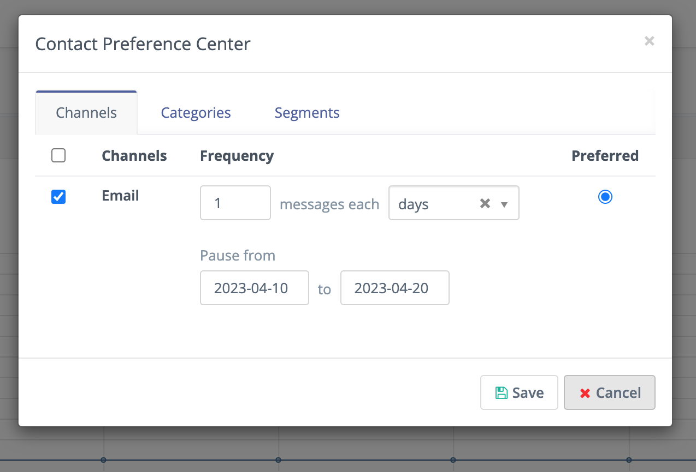

|

In this window you can switch Channels of communication, set the frequency of the communication via each Channel enabled, and set one of the Channels as a preferred Channel.

To prevent communications through a Channel, remove the check mark next to the Channel name in the first column. This sets a Do Not Contact (DNC entry) for only that channel.

When a Channel is selected, these will be used to send Marketing Messages if there is a message set for any of the Channels selected. You can also set the frequency of the communication, as in this example the frequency is set to "Send me emails twice a day" but pause them during the "``1st`` of November 2022 to the ``30th`` of November 2022" . Email is also set as the preferred Channel, so if the same message is set for both Email and ``sms``, it only sends the Email version of the message to the selected Contact

.. vale off

Contact Categories
==================

.. vale on

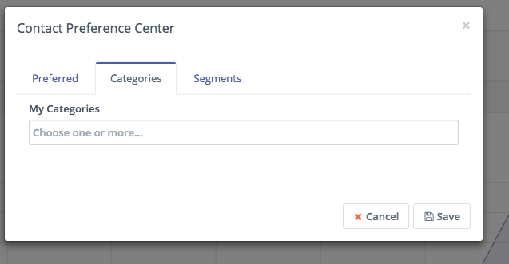

|

Use the Categories tab to add or remove a Contact from a global Category. Global Categories can be used in areas like Emails, Text Messages and, Campaigns. In combination with the new Subscribed Categories Segment filter, Contacts can be given the choice to opt out of categorized communications.

.. vale off

Contact Segments
================

.. vale on

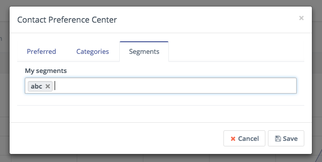

|

Use the Segments tab to add or remove a Contact from a Segment. Segments are used as a source for Campaigns and Emails. Any Contact in a particular Segment will be part of a Campaign that has that Segment as the source. You can also use a standalone Email to manually send an Email to a Segment. If a User has opted out of a Segment they will no longer receive Campaign actions or messages sent to that Segment.

.. vale off

Contact's unsubscribe Email preferences
=======================================

.. vale on

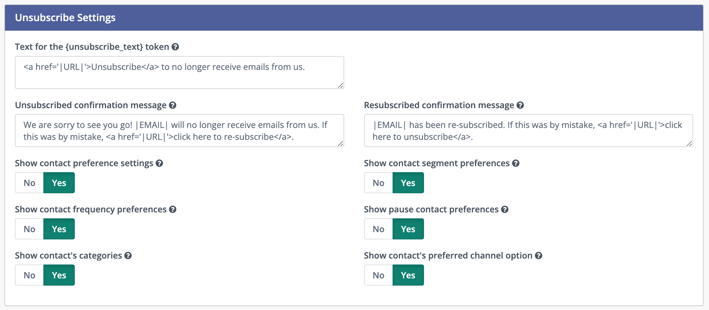

|

The Contact's preferences can be presented to the User in the unsubscribe page by selecting "Show Contact preference settings" in the Email configuration. You may also choose to hide or show different Segments of the User preferences. If any of these areas is set to no, it hides it from the contact's personal preferences page. The default unsubscribe message is shown if the preference setting option is set to no.

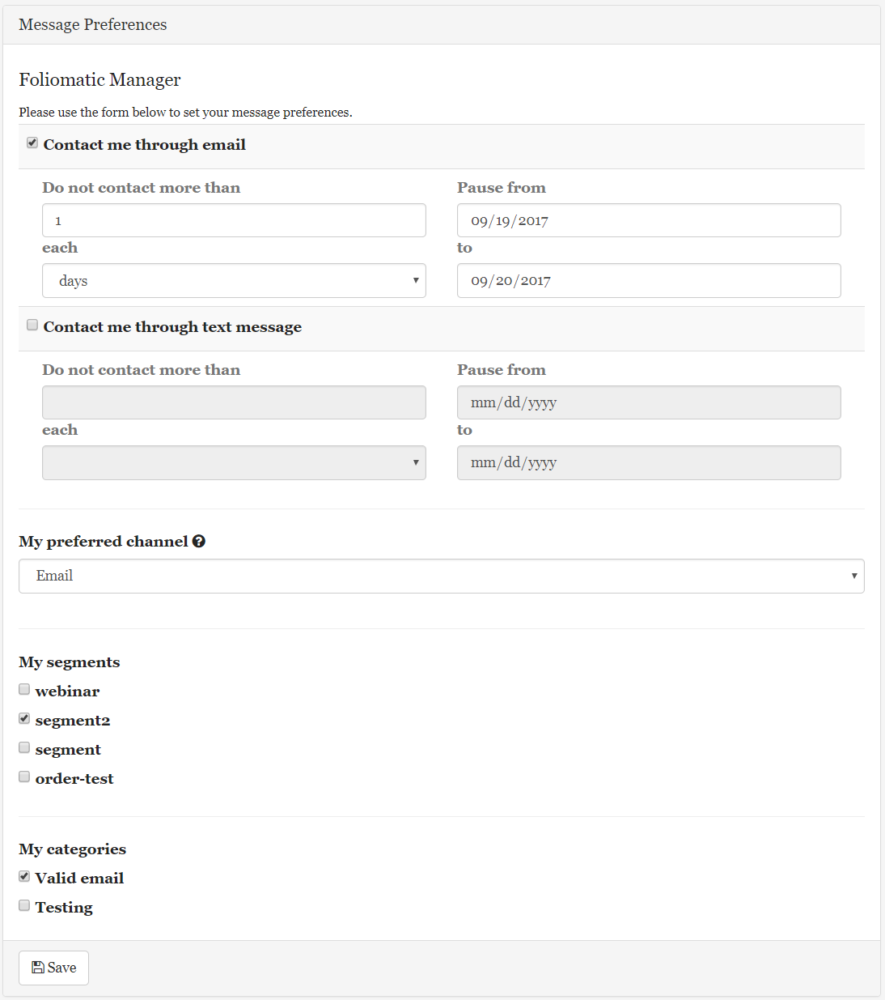

|

Customize preference center
***************************

It's possible to customize the personal Preference Center/unsubscribe page, edit text labels, format, and apply Themes using the landing page builder.

.. vale off 

Creating a Preference Center Landing Page
=========================================

.. vale on

When creating/editing a landing page, there is a toggle switch labeled Is *Preference Center*. If selected, the page will be marked as a preference center landing page.

When this page is configured as a preference center in a Mautic Email, recipients will be shown the page when clicking on the ``{unsubscribe_url}`` link. It also shows or hides the Preference Center slots in the builder.

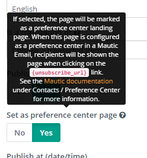

|

Builder slots
*************

These slots in the builder are used to customize the page:

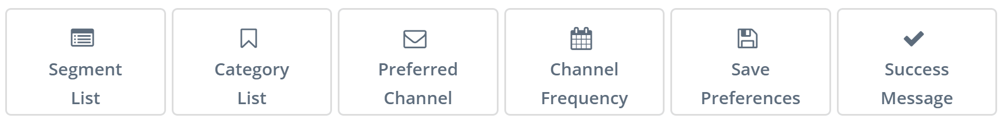

|

Preference tokens
******************

Optionally, you can use :doc:`tokens</configuration/variables>` to insert the different slots. Keep in mind that if you use :doc:`tokens</configuration/variables>`, you lose the ability to customize the labels and styles of the slots because it uses the default ones.

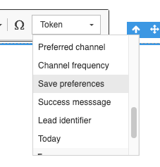

|

See the :doc:`VARIABLES</configuration/variables>` page for a full list of tokens.

In addition, add a **Save preferences** button if you wish to save the preferences, otherwise the preferences can't be saved:

Save the page and the Preference Center landing page is ready.

.. vale off 

Landing Pages
*************

.. vale on

Now in the landing pages list, the icon with the cog icon indicates that the page is a Preference Center.

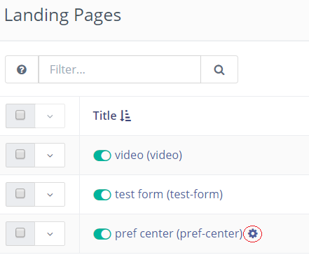

|

When viewing a Preference Center page, there is a header indicating its purpose and the page URL isn't available, only the preview URL.

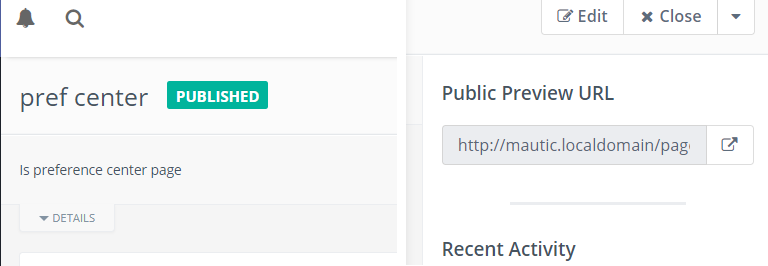

|

.. vale off 

Setting Preference Center Pages in Emails
*****************************************

.. vale on

When creating or editing an Email, you can select the Preference Center page from the list as shown:

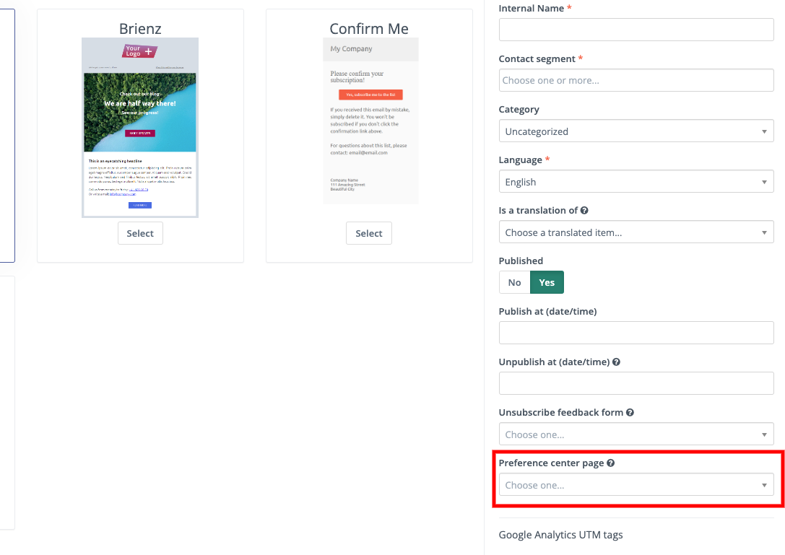

|

Keep in mind that your mail must use the same language as the Preference Center landing page - if not, default Preference Center will be shown.

Now when the email is sent, all recipients will be able to click the :doc:`Unsubscribe link</configuration/variables>` ``{unsubscribe_text}`` and ``{unsubscribe_url}`` and the new Preference Center page will be displayed.

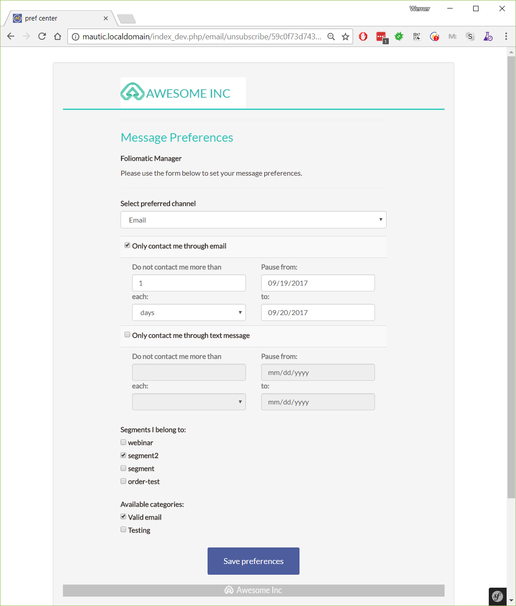

|

If no Preference Center page is selected in an Email, the default page is displayed.

