Preference center
#################

.. vale off

Manage Contact preferences
**************************

.. vale on

When managing a Contact in Mautic, you have the ability to customize their communication preferences. To access the Contact's Preference Center, follow these steps:

1. Open the Contact's profile - To access a Contact's profile, navigate to the Contacts section in Mautic and click the desired Contact's name.

2. Access the Preference Center - Once you are viewing the Contact's profile, locate the dropdown menu and click the **Preferences** option. A new modal window appears with various customization options.

In the Preference Center, you find three main tabs:

* Channels and Frequency - This tab allows you to set the preferred Channels for communicating with the Contact and how often they should receive messages. You can also pause communication for a specified period if needed.

* Categories - In this tab, you have the option to add or remove the Contact from global Categories used in Emails or other marketing materials. This helps to ensure that the Contact only receives content relevant to their interests.

* Segments - The third tab enables you to add or remove the Contact from specific Segments they belong to. This is useful for refining your audience and targeting Contacts based on their behavior, preferences, or other attributes.

.. vale off

Preferred Channels and frequency
================================

.. vale on

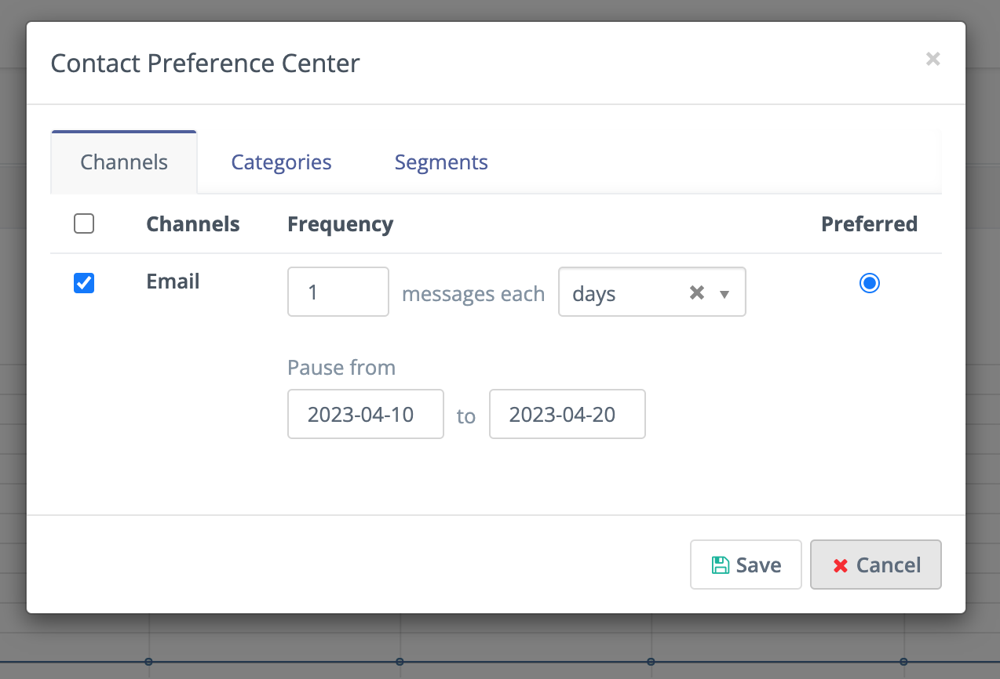

|

In this window you can switch Channels of communication, set the frequency of the communication via each Channel enabled, and set one of the Channels as a preferred Channel.

To prevent communications through a Channel, remove the select next to the Channel name in the first column. This sets a Do Not Contact (DNC entry) for only that Channel.

When selecting a Channel, Mautic uses this to send Marketing Messages if there is a message set for any of the Channels selected. You can also set the frequency of the communication, as in this example the set frequency is "Send Emails twice a day" but to pause them between November 1 2022 and November 30 2022. Email is also set as the preferred Channel, so if the Marketing Message has the same message for both Email and SMS, it only sends the Email version of the message to the selected Contact

.. vale off

Contact Categories
==================

.. vale on

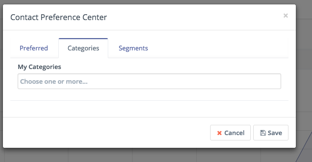

|

Use the Categories tab to add or remove a Contact from a global Category. Mautic uses Global Categories in areas like Emails, Text Messages and, Campaigns. In combination with the Subscribed Categories Segment filter, Contacts can opt out of categorized communications.

.. vale off

Contact Segments
================

.. vale on

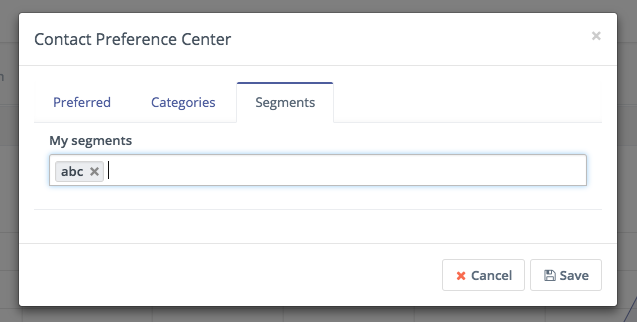

|

Use the Segments tab to add or remove a Contact from a Segment. Segments are a source for both starting Campaigns and sending Emails. Any Contact in a particular Segment is automatically part of a Campaign that has that Segment as the source. You can also use a standalone Email to manually send an Email to a Segment. If a User has opted out of a Segment they no longer receive Campaign actions or messages sent to that Segment.

Segments appear in the Preference Center in alphabetical order by **Public name**. If two Segments share the same **Public name**, Mautic orders them by their internal ID. Since Contacts see this order, set a clear **Public name** on each Segment to control how it appears.

.. vale off

Contact's unsubscribe Email preferences
=======================================

.. vale on

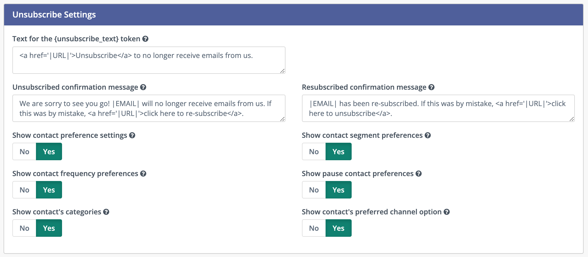

|

You can customize the unsubscribe page to display a Contact's preferences by adjusting the Email configuration settings in Mautic. This allows Contacts to manage their preferences when they unsubscribe, instead of being directly unsubscribed. Follow these steps:

1. In the left sidebar, click the gear icon to access the **Configuration** menu.

2. Navigate to the **Email Settings** tab.

3. Look for the "Show Contact Preference Settings" option and select the box to enable it. This displays Contact preferences on the unsubscribe page, allowing Contacts to manage their subscription settings.

4. Additionally, you can choose to hide or show different Segments in the User preferences by adjusting the corresponding settings.

Please note that if you turn off any of these options in the global settings, they won't appear on the Contact's personal preferences page. When the preference setting option is turn off, Mautic shows the default unsubscribe message, and the Contact gets directly unsubscribed without the ability to manage their preferences.

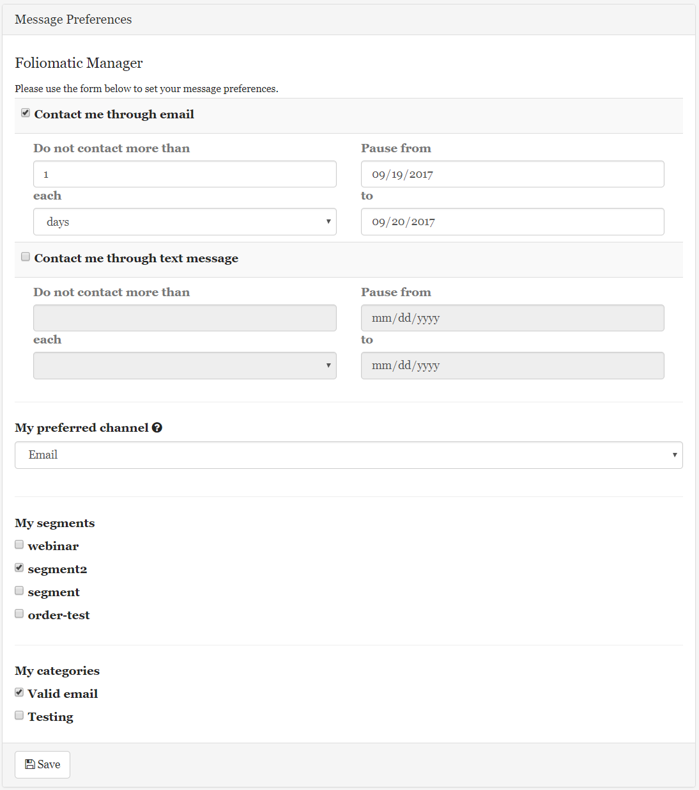

|

Customize Preference Center
***************************

It's possible to customize the personal Preference Center/unsubscribe page, edit text labels, format, and apply Themes using the Landing Page builder.

.. vale off 

Creating a Preference Center Landing Page
=========================================

.. vale on

When creating/editing a Landing Page, there is a toggle switch labeled *Is Preference Center*. If selected, Mautic marks the Page as a Preference Center Landing Page, making available the appropriate tokens.

When configured as a Preference Center in a Mautic Email, Mautic automatically directs recipients to this Preference Center when clicking on the ``{unsubscribe_url}`` link. It also shows or hides the Preference Center slots in the Builder.

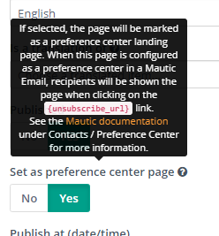

|

Preference tokens
******************

You can use :ref:`Preference Center Landing Page tokens` to insert the different slots. These are available as tokens in the editor in the GrapesJS Builder.

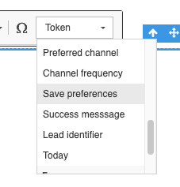

|

See the :ref:`Variables<preference center landing page tokens>` documentation for a full list of tokens available for use with a Preference Center.

In addition, add a **Save preferences** button if you wish to save the preferences, otherwise the Contact can't save their preferences:

Save your changes, and the Preference Center Landing Page is ready.

.. vale off

Customizing slot labels
=======================

.. vale on

When building custom Themes for Preference Center Landing Pages, you can override the default text labels for each slot. This lets you customize wording to match your branding or provide translations for different languages.

The following parameters are available for customizing slot labels in your Theme's Twig templates:

.. vale off

.. list-table::
   :widths: 30 30 40
   :header-rows: 1

   * - Slot
     - Parameter
     - Description
   * - Category List
     - ``categorylist['label-text']``
     - Label for the category list section heading
   * - Segment List
     - ``segmentlist['label-text']``
     - Label for the Segment list section heading
   * - Preferred Channel
     - ``preferredchannel['label-text']``
     - Label for the preferred channel dropdown
   * - Channel Frequency
     - ``channelfrequency['label-text']``
     - Label for the **I want to receive** checkbox
   * - Channel Frequency
     - ``channelfrequency['label-text1']``
     - Label for the **Do not contact more than** setting
   * - Channel Frequency
     - ``channelfrequency['label-text2']``
     - Label for the **Messages each** frequency option
   * - Channel Frequency
     - ``channelfrequency['label-text3']``
     - Label for the **Pause from** date setting
   * - Channel Frequency
     - ``channelfrequency['label-text4']``
     - Label for the **Pause to** date setting
   * - Save Preferences Button
     - ``saveprefsbutton['btnText']``
     - Text displayed on the save button

.. vale on

If you don't provide a custom value for these parameters, Mautic uses the default translated strings.

.. note::

   These customization parameters are for use in custom Theme development. See the :xref:`Themes` section of the Developer Documentation for implementation details on creating custom Themes for Preference Center Landing Pages.

.. vale off

Accessing Preference Center Pages
*********************************

.. vale on

Now in the Landing Pages list, the icon with the cog icon indicates that the Page is a Preference Center.

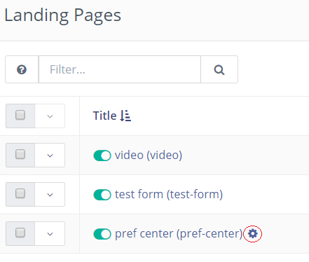

|

When viewing a Preference Center Page, there is a header indicating its purpose and the Page URL isn't available, only the preview URL.

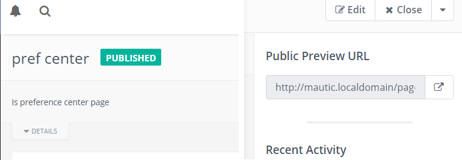

|

.. vale off 

Setting Preference Center Pages in Emails
*****************************************

.. vale on

When creating or editing an Email, you can select the Preference Center Page from the list as shown:

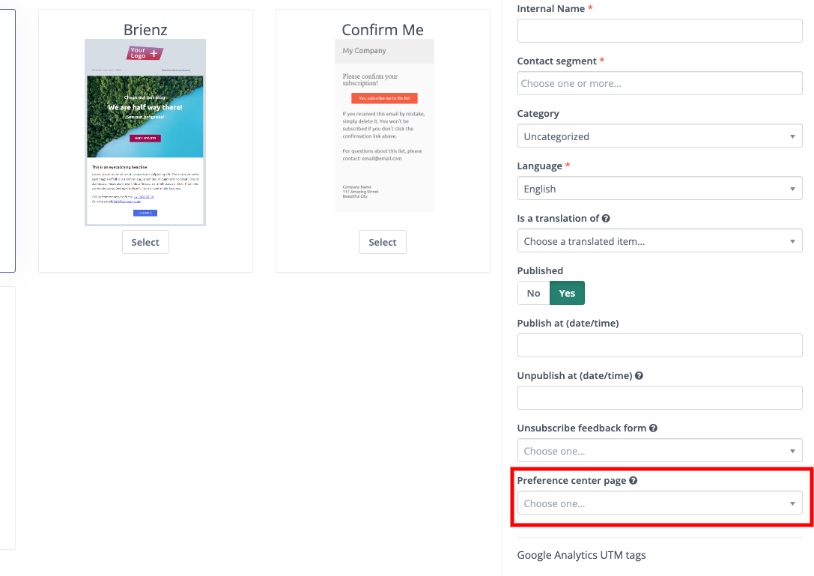

|

Keep in mind that your mail must use the same language as the Preference Center landing page - if not, Mautic shows the default Preference Center.

Now when sending the Email, all recipients can click the Unsubscribe link provided in the ``{unsubscribe_text}`` and ``{unsubscribe_url}`` variables, taking them to the new Preference Center.

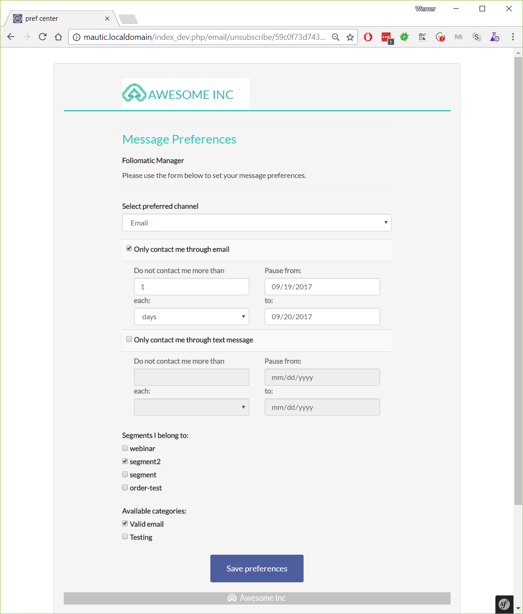

|

If you don't select a Preference Center in an Email, Mautic uses the global default Preference Center set in **Configuration > Email Settings**, resolved at the time a Contact unsubscribes. If you change the global default later, any Email without its own Preference Center, including Emails you've already sent, automatically uses the new default. If there's no valid global default, Mautic falls back to a default Preference Center styled with the default Theme.

