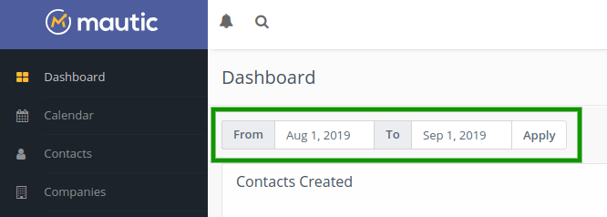

Dashboard
#########

Mautic 1.4.0 introduced a customizable dashboard where each User can compose widgets with information they want to track. Mautic 2.0 brought a number of enhancements to the Dashboard.

Date range filter
*****************

All the widgets display data in the selected global date range filter at the top of the widget list. Mautic sets the default date range from 30 days ago to today.

Line charts change the time unit automatically depending on the day count selected in the date range filter like this:

**Date range is equal 1 day:** data displays in hours 
**Date range is between 1 and 31 days:** data displays in days 
**Date range is between 32 and 100 days:** data displays in weeks 
**Date range is between 101 and 1000 days:** data displays in months 
**Date range is greater than 1001 days:** data displays in years

The only widget exceptions which display the same information independent on the date range are *Upcoming Emails* and *Recent activity*.

Widgets
*******

.. warning:: 

  Don't create too many widgets. It can slow the dashboard Landing Page load down. If you have performance issues, decrease the amount of widgets.

You can add a new widget to your dashboard when you click the "Add widget" button. The "Add widget" Form which appears after each widget allows you define:

- **Name:** describe what the widget displays. If not filled, Mautic calls it the same as the widget type you select.

- **Type:** select what information you want to display from the predefined widget types.

- **Width:** select how wide the widget should be. The options are 25%, 50%, 75%, 100%. The default option is 100%. The optimal width for line charts is 100%, for tables 50%, for pie charts 25%.

- **Height:** each widget can have different height. There are 5 heights predefined. The dashboard looks best if you select a consistent height for each widget in the same row.

Some widgets have additional options:

**Created Contacts over time**

- Show all Contacts: displays one line with all created Contacts.

- Only identified: displays one line with only created and identified Contacts.

- Only anonymous: displays one line with only anonymous visitors.

- All identified vs anonymous: displays 2 lines with anonymous visitors and known Contacts.

- Top Segments: displays up to 6 lines representing the number of Contacts added to the top 6 Segments. If no such Segment exists for the selected date range, the chart won't display.

- Top Segments with Identified vs Anonymous: displays up to 6 lines representing the top 3 Segments for the selected date range. Each Segment shows 2 lines with anonymous visitors and known Contacts.

**Emails in time**

- Only sent Email - Displays 1 line with sent Emails.

- Only opened Emails - Displays 1 line with opened Emails.

- Only failed Emails - Displays 1 line with failed Emails.

- Sent and opened Emails - Displays 2 lines with sent and opened Emails.

- Sent, opened and failed Emails - Displays 3 lines with sent, opened and failed Emails.

**Landing Page visits in time**

- Total visits - Displays 1 line with all visits (Landing Page hits).

- Unique visits - Displays 1 line with unique visits (Contacts).

- Total and unique visits - Displays 2 lines with unique and all visits.

Widget ordering
***************

You can move each widget can on the dashboard using the drag and drop interface. Click and hold on the name of the widget to move it to another position.

Dashboard export
****************

Each dashboard, once configured, is exportable to a single file and shared with others. You can make a backup, send it to a colleague or share it online. It exports only the widget configuration - the data which it pulls isn't included in the exported file.

Dashboard import
****************

If you export a dashboard, you can then upload it and import it again in the Dashboard Import page.

Mautic installations come pre-loaded with 3 pre-defined dashboards. Mautic imports the one called default.json automatically, when your dashboard doesn't contain any widgets. The other 2 predefined dashboards provide an example of alternate layouts. You can export and import any other dashboards and switch between them. 

Pre-defined dashboards can be:

**Previewed** - This displays the dashboard widgets for preview. The dashboard loads using your existing Mautic dat but doesn't save or change anything. 

**Applied** - This sets the dashboard as your primary dashboard. 

.. warning:: 

  This deletes your current widgets. Export the current dashboard if you want to go back to it later. 
  
**Deleted** - This deletes the predefined dashboard.

Widget cache
************

The ``WidgetDetailEvent`` automatically caches the widget detail data for a period of time defined in the configuration. The default cache expiration period is 10 minutes.

Dashboard permissions
*********************

If a Mautic User doesn't have the 'see others' or 'see own' permissions for a bundle, they won't be able to create widgets for that bundle. However, the widget can still be visible on their dashboard. 

For example if a User creates the widgets and then the administrator removes the permission for that bundle, or if a User imports a dashboard which has widgets for bundles they're not permitted to access. 

In these cases, Mautic displays the widget on the dashboard, but with a message that the User doesn't have permission to see the data.

If a Mautic User has permission to see only their own data from a bundle, they see only their own data in the Dashboard widgets. For example only Contacts which they own, Landing Page hits of the Landing Pages they created and so on.

