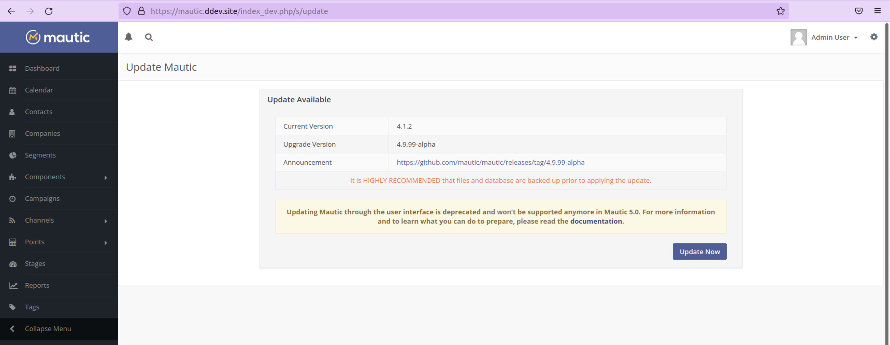

.. vale off

How to update Mautic
####################

.. vale on

There are two ways to update Mautic:

1. Using the Command Line - recommended
2. Through the User interface

If your instance is in production, has a large number of Contacts and/or is  on shared hosting, it's **strongly** recommended that you update at the command line.

.. warning::
    Updating in the User interface requires a significant amount of resources, and can be error-prone if the server restricts resource allocation. A failed update or corrupted data can result from this. It's planned to remove this feature in Mautic 5.0, requiring updating at the command line.

Updating at the command line (non-Composer based installations)
***************************************************************

Before you commence updating Mautic, **please ensure that you have a tested backup of your Mautic instance**. 

This means that you have downloaded the files and database of your Mautic instance, and you have re-created it in a test environment somewhere and tested that everything is working as expected. This is your only recourse if there are any problems with the update. Never update without having a working, up-to-date backup.

Updating Mautic (Composer based installs)
*****************************************

The Recommended Project attempts to keep all of your Mautic core files up-to-date.

The project ``mautic/core-composer-scaffold`` updates your scaffold files whenever there is an update to ``mautic/core-lib``.

If you customize any of the 'scaffolding' files - commonly ``.htaccess`` - you may need to merge conflicts if new release of Mautic results in changes to your modified files.

Follow the steps below to update your core files.

1. Backup your ``composer.lock`` and ``composer.json`` file. If something doesn't work as expected during the ``composer update`` command, restore them and run ``composer install`` to return your codebase to the state it was in before attempting to update.

2. Edit the ``composer.json`` file, and change all previous versions with the version you wish to update to for all Mautic packages.

    * If you are running ``5.0.4`` and want to update to ``5.1.0``, replace ``5.0.4`` with ``5.1.0`` for all packages that start with ``mautic/`` and currently use ``5.0.4``.
    * You may also need to increase the versions of any other packages you have either manually added or added through :ref:`Mautic Marketplace`.
    * If you haven't added any extra packages, you can also replace the entire ``composer.json`` file with the newer version from the `repository <https://github.com/mautic/recommended-project>`_ that matches your desired target version.

3. Run ``composer update --with-dependencies`` to update all packages.

4. Run ``git diff`` to determine if any of the scaffolding files have changed. Review the files for any changes and restore any customizations to ``.htaccess`` or others.

5. Commit everything all together in a single commit, so the ``docroot`` remains in sync with the core when checking out branches or running ``git bisect``.

6. In the event that there are non-trivial conflicts in step 2, you may wish to perform these steps on a branch, and use ``git merge`` to combine the updated core files with your customized files. This facilitates the use of a three-way merge tool such as :xref:`kdiff3`. This setup isn't necessary if your changes are simple - keeping all of your modifications at the beginning or end of the file is a good strategy to keep merges easy.

7. Run the following commands to update your database with any changes from the release:

.. code-block:: shell

    bin/console cache:clear
    bin/console mautic:update:apply --finish
    bin/console doctrine:migration:migrate --no-interaction
    bin/console doctrine:schema:update --no-interaction --force
    bin/console cache:clear

Checking for updates at the command line
========================================

From Mautic 6, the default way to install, update and manage Mautic changes to Composer. 

Since Mautic 4.2 deprecated the update feature within the Mautic User interface, you still receive a notification when a new version of Mautic is available until removal of this feature but it's recommended to update via the command line. 

.. warning::
    Before starting to upgrade, it's highly recommended to take a backup of your instance. If updates are available, an update notification displays, followed by step-by-step instructions in the command-line interface to complete the process.

Log in via the command line, and change directory to the Mautic directory using the command:

.. code-block:: shell

    cd /your/mautic/directory

The first step is to find out if there are any updates available using the following command:

.. code-block:: shell

   php bin/console mautic:update:find

The output from this command tells you if there are any updates to apply. The notification links to an announcement post which explains what the release includes, and the recommended environment requirements if they're not met - for example, a higher version of PHP required or Plugins needing updates.

.. note::
    It's a good idea to review the announcement link for information about the release. There may be important information or steps that you may need to take before updating.

After confirming system readiness, you can apply the updates.

Installing updates at the command line
======================================

If there are updates available, run the following command to apply them:

.. code-block:: shell

   php bin/console mautic:update:apply

Next, a prompt displays asking you to run the command again with this additional argument:

.. code-block:: shell

   php bin/console mautic:update:apply --finish

Updating in the browser
***********************

When updating Mautic, there are several tasks which can take a long time to complete depending on the size of your Mautic instance.

.. warning::
    
    If you have a lot of Contacts and/or use shared hosting, you might run into problems when updating with the notification 'bell' icon in older versions of Mautic. 

When updating within the browser, problems usually manifest as the update hanging part way through, or crashing with an error. They often arise as a result of resource limitation, particularly on shared hosting environments. 

For this reason, it's **always recommended** that you :ref:`update at the command line<installing updates at the command line>` wherever possible. From Mautic 5.0 the ability to update in the browser is completely removed, and you have to update at the command line.

Before you commence updating, **please ensure that you have a tested backup of your Mautic instance**.

This means that you have downloaded the files and database of your Mautic instance, and you have re-created it in a test environment somewhere and tested that everything is working as expected. This is your only recourse if there are any problems with the update. Never update without having a working, up-to-date backup.

Checking for updates in the browser
===================================

When Mautic makes a new release, a notification appears in your Mautic instance.

The notification links to an announcement post which explains what the release includes.

.. note::
    It's a good idea to read the announcement link for information about the release. There may be important information or steps that you may need to take before updating.

Once you have thoroughly read the release notes, and have tested your backup Mautic instance, you can click the notification to complete the update.

The update takes time to complete, and each step updates in the browser as it proceeds. Be patient and allow it to finish. On completion, a message confirms that the update has completed successfully.

The update wasn't successful
~~~~~~~~~~~~~~~~~~~~~~~~~~~~

If this has happened to you, head over to the Troubleshooting section for a step-by-step walk-through of how to complete the update. Maybe consider using the command line next time.

Stability levels
****************

By default, Mautic receives notifications both in the User Interface and at the command line for stable releases only.

If you wish to help with testing early access releases in a development environment, do the following

- Edit your configuration and set the stability level to Alpha, Beta, or Release Candidate. This allows you to receive notifications for early access releases. 
- Always read the release notes before updating to an early access release.
- Never enable early access releases for production instances.

What to do if you need help updating Mautic
*******************************************

If you need help, you can ask for it in several places. You should remember that most members of the Community Forums, Slack, and GitHub are volunteers.

- The :xref:`Mautic Community Forums` is the place where you can ask questions about your configuration if you think it's the cause of the problem. Please search before posting your question, since someone may have already answered it.

- The live :xref:`Mautic Community Slack` is also available, but you must post all support requests on the forums. Create your request there first, then drop a link in Slack if you plan to discuss it there.

In all cases, it's important to provide details about the issue, as well as the steps you have taken to resolve it. At a minimum, include the following:

- Steps to reproduce your problem - a step-by-step walk-through of what you have done so far
- Your server's PHP version.
- The version of Mautic you are on, and the version you are aiming to update to
- The error messages you are seeing - if you don't see the error message directly, search for it in the var/logs folder within your Mautic directory and in the server logs. Server logs are in different places depending on your setup. Ubuntu servers generally have logs in ``/var/log/apache2/error.log``. Sometimes your hosting provider might offer a graphical interface to view logs in your Control Panel.

If you don't provide the information requested as a minimum, the person who might try to help you has to ask you for it, so please save them the trouble and provide the information upfront. Also, importantly, please be polite. Mautic is an open source project, and people are giving their free time to help you.

.. vale off

If you are sure that you have discovered a bug and you want to report it to developers, you can :xref:`Mautic Github New Issue` on GitHub. GitHub isn't the right place to request support or ask for help with configuration errors. Always post on the forums first if you aren't sure, if a bug report is appropriate this can link to the forum thread.

.. vale on
