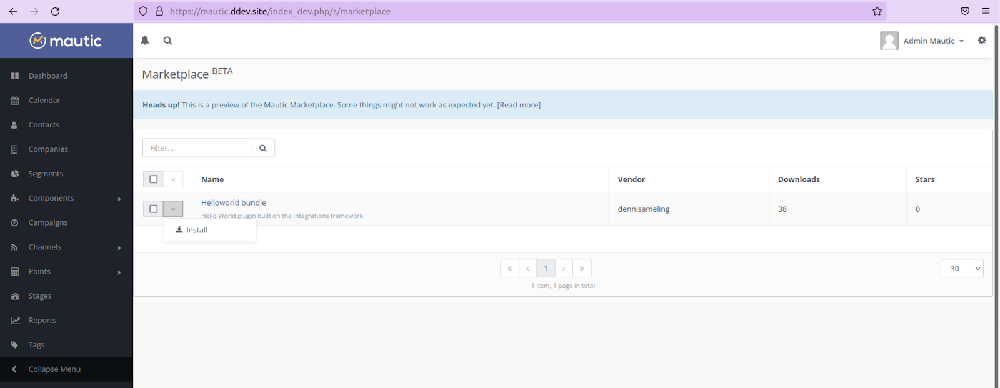
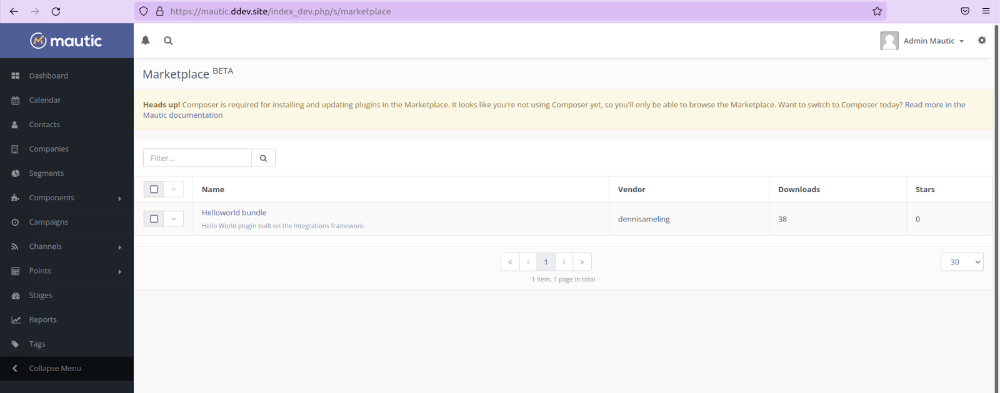
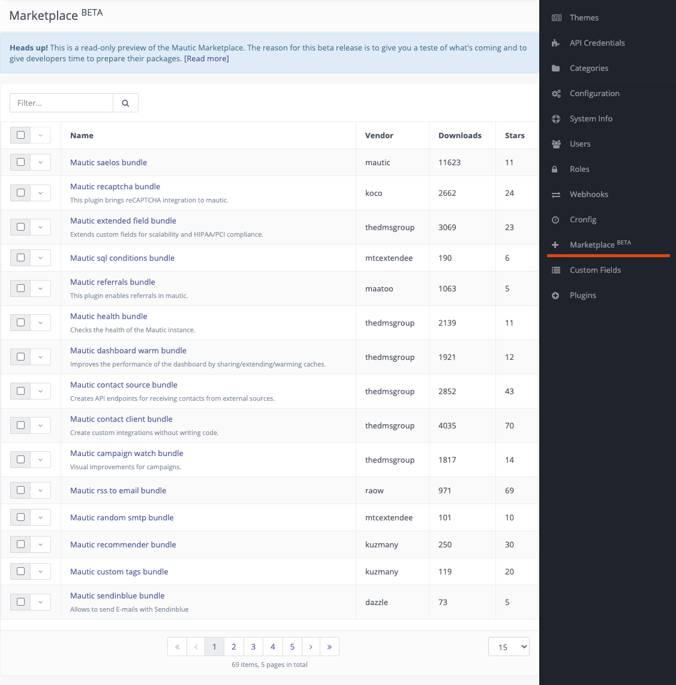

.. vale off

Mautic Marketplace
##################

.. vale on

.. warning:: 

    The current Marketplace version doesn't verify Mautic version compatibility of Plugins yet, as this requires a change in each existing Plugin.

    Please don't blindly manually install Plugins you see in the Mautic Marketplace, as they may not work with your version of Mautic. Always verify if they support your Mautic version before installing. Developers can refer to the :xref:`Developer Documentation Marketplace` for how to make your Plugin compatible with the Mautic Marketplace.

.. vale off

Using the Mautic Marketplace
****************************

.. vale on

From Mautic 4.2, a setting in the Mautic Configuration specifies that the instance uses Composer, which allows the installation, update, and removal of Plugins in the Mautic Marketplace. This is a requirement due to the technology which underpins the Mautic Marketplace.

.. image:: images/switch-enable-composer.png
  :width: 800
  :alt: Screenshot of switch enable Composer

Once configured, you can search the Marketplace using the filter, and install Plugins by selecting the option from the dropdown.

If you haven't correctly set the Composer setting, Mautic displays a warning that the Mautic Marketplace is available in read-only mode, with a link which explains how to transition to a :doc:`Composer-managed</getting_started/switching_composer>` installation.

.. vale off 

List of Plugins
***************

.. vale on

The list of Plugins available in the Marketplace is accessible from your Mautic administration menu. Click the **cog icon** in the top right hand corner to display the menu.

The list view allows you to search for specific keywords. It displays quick stats including Plugin downloads and how many stars it has in :xref:`Packagist`. It also shows the vendor who has developed the Plugin. Sadly, the sorting by columns isn't available at the moment because it's not supported by the Packagist API. It's planned to add this in a future release.

* Click a Plugin name to view details.

Plugin detail page
******************

The detail page gives you enough information together with links to additional resources to decide whether you want to install the Plugin or not.

.. image:: images/marketplace-detail.png
  :width: 800
  :alt: Screenshot of marketplace detail

Latest stable version
=====================

The first information you see is the latest stable version. *From Mautic 4.2, this includes the currently installed - if any - version and the ability to upgrade.*

All Plugins should follow :xref:`semantic versioning` so you can see from the first glance whether it's a breaking change version, feature version or bug fix - patch - version. In short, it's more risky to install breaking change versions and less risky to install a bug fix version.

The license should be GPLv3 mostly as Mautic uses this license, and it's a viral license. This means anything using Mautic's code base should also use the same license.

Required packages are dependencies. The bigger is the list of dependencies, the bigger the size of the Plugin. More dependencies also means more security risks and incompatibility issues with future upgrades.

All versions
============

The next table shows the list of all versions. *In the future versions of the Marketplace it should be possible to select which version you want to install or upgrade to*.

From the list you can see Plugin versions, and the release cadence. When you click a specific version, a new window opens where the Plugin maintainers should provide a changelog. This tells you what's added or bugs fixed in the specific version.

Maintainers
===========

In this section is a list of maintainers of the Plugin on Packagist. There may be more contributors in the GitHub repository. There is also a link to the maintainer's Packagist detail page where you can browse other PHP packages by the same maintainer.

GitHub information
==================

:xref:`Github` is where many developers host their code. The majority of Mautic Plugins are available on GitHub. There are some stats available directly in this section, but you can find much more if you follow the link to the repository.

Packagist information
=====================

:xref:`Packagist` is a PHP package repository. It's not related specifically to the Mautic Community, but to the PHP community.

All the PHP packages listed in Packagist are installable by Composer which is a tool for dependency management used under the hood when you install a Mautic Plugin. The Packagist section shows download stats of Plugin installations in different time frames.

Context menu
============
The context menu shows actions you can take.

* Close takes you to the List View

* Install installs the Plugin

* Issue tracker opens a new window with the issue tracker for the Plugin. It shows only if the Plugin has this information available. Use this option to search for issues with the Plugin and to report new issues to the maintainers.

Command line (CLI) command
**************************

The Marketplace has commands for those who prefer using the command line to the user interface, or for automation of processes.

.. vale off

List Plugins
============

.. vale on

``bin/console mautic:marketplace:list`` lists the first page of available Plugins like so:

.. code:: shell

  +-------------------------------------------------------+-----------+--------+
  | name                                                  | downloads | favers |
  +----------------------------------------------------+--------+-----+
  | mautic/mautic-saelos-bundle                           | 11623     | 11     |
  | koco/mautic-recaptcha-bundle                          | 2662      | 24     |
  |     This plugin brings reCAPTCHA integration to       |           |        |
  |     mautic.                                           |           |        |
  | thedmsgroup/mautic-extended-field-bundle              | 3069      | 25     |
  |     Extends custom fields for scalability and         |           |        |
  |     HIPAA/PCI compliance.                             |           |        |
  | mtcextendee/mautic-sql-conditions-bundle              | 190       | 6      |
  | maatoo/mautic-referrals-bundle                        | 1063      | 5      |
  |     This plugin enables referrals in mautic.          |           |        |
  | thedmsgroup/mautic-health-bundle                      | 2139      | 11     |
  |     Checks the health of the Mautic instance.         |           |        |
  | thedmsgroup/mautic-dashboard-warm-bundle              | 1921      | 12     |
  |     Improves the performance of the dashboard by      |           |        |
  |     sharing/extending/warming caches.                 |           |        |
  | thedmsgroup/mautic-contact-source-bundle              | 2852      | 43     |
  |     Creates API endpoints for receiving contacts from |           |        |
  |     external sources.                                 |           |        |
  | thedmsgroup/mautic-contact-client-bundle              | 4035      | 70     |
  |     Create custom integrations without writing code.  |           |        |
  | thedmsgroup/mautic-campaign-watch-bundle              | 1817      | 14     |
  |     Visual improvements for campaigns.                |           |        |
  | raow/mautic-rss-to-email-bundle                       | 971       | 69     |
  | mtcextendee/mautic-random-smtp-bundle                 | 101       | 10     |
  | kuzmany/mautic-recommender-bundle                     | 250       | 30     |
  | kuzmany/mautic-custom-tags-bundle                     | 119       | 20     |
  | dazzle/mautic-sendinblue-bundle                       | 73        | 5      |
  |     Allows to send E-mails with Sendinblue            |           |        |
  +-------------------------------------------------------+-----------+--------+
  Total packages: 69
  Execution time: 388 ms
    
There are options allowing you to filter or go to next pages. To display the full list, add ``--help`` after the command, as used in other Mautic commands.

.. code:: shell

  -p, --page[=PAGE]      Page number [default: 1]
  -l, --limit[=LIMIT]    Packages per page [default: 15]
  -f, --filter[=FILTER]  Filter the packages [default: ""]
  -h, --help             Display this help message

Example usage how to search for a ``Captcha`` Plugin: ``bin/console mautic:marketplace:list --filter=captcha``

Planned features
================

Watch out for more features in future releases including:

* Automatic Plugin updates - a configuration that allows you to set globally whether you want to automatically upgrade Plugins and also have the possibility of configuring this at the Plugin level. Automatic upgrades make sense only for bug fix releases. Other releases are too risky and manual updates required. :xref:`API reference`

* List security advisories :xref:`API reference`,

* Notifications about new versions and security vulnerabilities that identified,

* Support also Theme installations and updates.

.. vale off

How to get your Plugin listed on the Mautic Marketplace
*******************************************************

.. vale on

Please review the resources on the :xref:`Developer Documentation Marketplace` for more information.