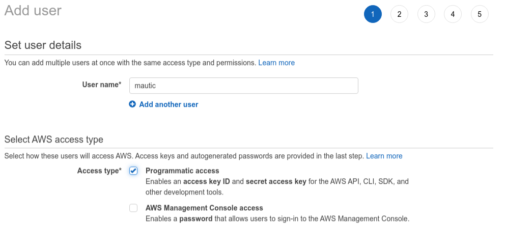
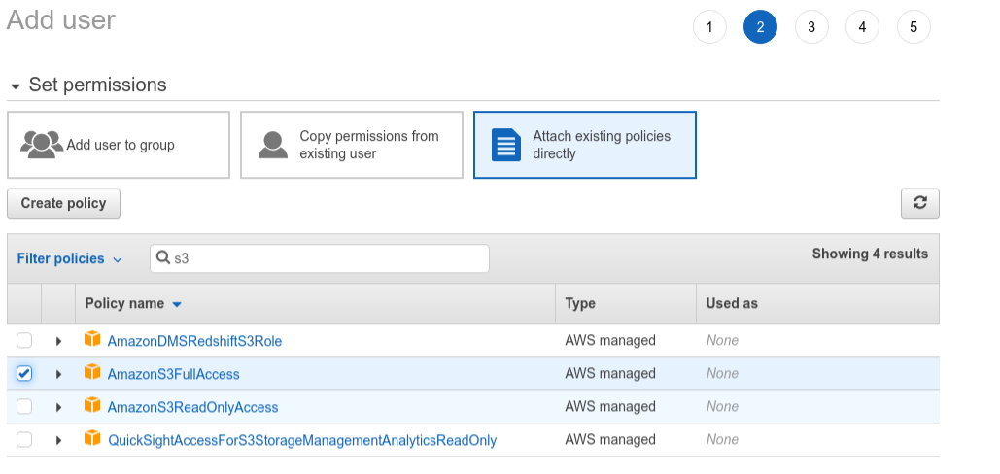
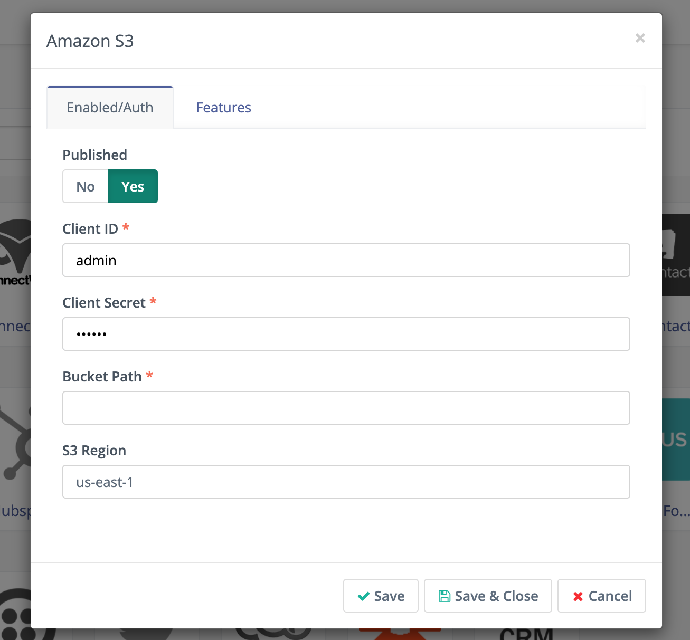
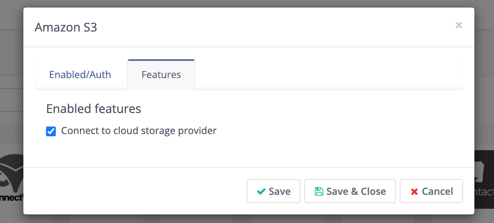

.. vale off

Amazon S3
#########

.. vale on

The Amazon S3 Plugin allows you to host your :doc:`Assets</components/assets>` on an Amazon S3 bucket instead of hosting them on your local server. When creating an Asset you select from your S3 bucket, rather than your local computer.

Setting up an S3 bucket
***********************

To get started, you need to sign up for an Amazon account. Ensure you are familiar with the :xref:`pricing tiers for S3` before you commit to using it.

If you are new to Amazon Web Services, follow these steps to set up your Amazon S3 account. The following steps are important to ensure you aren't using your root account for day-to-day tasks:

1. :xref:`Create an AWS account`
2. :xref:`Set up an IAM user`
3. :xref:`Sign in as IAM user`
4. :xref:`Set up your bucket`

.. note:: 

     The region you select for your bucket is important from a data protection perspective and you will need to copy this value to use when you set up Mautic. Consult your privacy policy and act accordingly.

Now that you have created a bucket, create a user who can access it. Instead of using the credentials for your master account which expose you to significant risk if they're ever exposed, use the credentials for this user in Mautic.

1. Select your **account name** in the top right corner.
2. Select **Security Credentials** from the drop-down list.
3. Select **Users** > **Add User** and provide a name.
4. Select **programmatic access**.

5. Select Attach existing policies directly, filter for S3 by typing it in the search box, and select AmazonS3FullAccess.

6. Click **Next** button to proceed through, as you don't need to assign any tags.
7. Create a user after reviewing the information submitted.

.. image:: images/screenshot-consoleawsamazoncom-20200413-214631-35da93f9.png
  :alt: Screenshot of Amazon S3

8.  Next, you can view the **Access Key ID** and the **Secret Access Key**.

.. note:: 

     You must make a copy of these credentials as you won't be able to access them again. Download them and/or save them securely.

Setting up S3 in Mautic
***********************

With the bucket details and a user with the correct credentials, it's time to set up Mautic to use this bucket.

1. Go to **Settings** > **Plugins**
2. Click the **Amazon S3** Plugin.
3. Click the **install/upgrade Plugins**, if you don't see the Amazon S3 Plugin.
4. Enter the **ID**, secret from your user, and the bucket name. 

5. Enter the **bucket location** as configured in Amazon S3.
6. Click **Save** to save your changes
7. Click the next tab, **Features**, to ensure that the option to use a cloud provider for Assets is selected.

8. Click **Save & Close**, and refresh the Plugins page - the Amazon S3 Plugin icon will be in color rather than ``Grayscale``, indicating that it's active.

When you upload an Asset to your S3 bucket you can select it by creating a new Asset and choosing Remote Files > S3.

