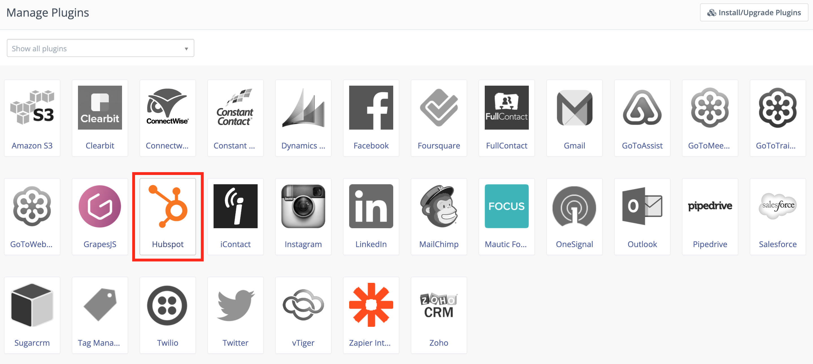

HubSpot
########

.. vale off

Mautic - HubSpot CRM Plugin
***************************

.. vale on

Mautic can push Contacts to :xref:`HubSpot CRM` based on :ref:`Contact actions<testing integrations>` or :doc:`Point Triggers</points/points>`.

HubSpot API key
===============

Getting Mautic connected to HubSpot requires integrating and configuring the HubSpot API key with the right credentials.

1. Sign in to your HubSpot CRM account or create an account if you don't already have one.

2. Access your HubSpot dashboard to generate your :xref:`HubSpot API key`.

3. Copy your generated HubSpot Key and save it somewhere safe. 

.. vale off

Configure the HubSpot CRM Plugin
================================

.. vale on

.. note:: 

    Be sure to complete all steps before you publish the Plugin.

1. Log in to Mautic instance.

2. Go to **settings**.

3. Click the **Plugins** option.

.. image:: images/plugins.png
  :width: 200
  :align: center
  :alt: Screenshot of settings

4. Select the **HubSpot** Plugin configuration.  

5. In the configuration box, paste your **API key** in the HubSpot API key input field. 

6. Configure the **Feature Specific Settings** to synchronize Contacts, Companies, or both  from HubSpot.

7. Click **Save & Close**, then edit the Plugin to configure the field mapping..
  
.. note:: 

    In the default setting, it's checked. The Plugin won't push Contacts to HubSpot CRM if you un-select it.

8. Configure the :ref:`field mapping<field mapping>`.

9. Click **Save** to save the Plugin configuration.
    
   * If you want to use the Plugin, set the *Publish* switch to **Yes**. Only do this when you have fully configured the Plugin settings.

10. Set up the :ref:`cron job<configure mautic integration cron jobs>` if you haven't already configured it.

.. tip:: 

    Script to configure in your cron job: ``php $PATH_TO_MAUTIC_DIRECTORY/bin/console mautic:integration:fetchleads --integration=Hubspot --fetch-all``

.. vale off

Test the Plugin
***************

.. vale on

Follow :ref:`these steps<testing integrations>` to test the Integration.

.. vale off

Troubleshooting HubSpot Integration
***********************************

.. vale on

When creating the Contact, ensure the email address you used to test is valid. HubSpot only creates a new Contact when the email address is valid.

Note, despite ``--fetch-all`` flag, the HubSpot API endpoints used in Mautic primarily leverage the following endpoints:

* ``/companies/v2/companies/recent/modified/``

* ``/contactslistseg/v1/lists/recently_updated/contacts/recent``
  
If you intend to do a full sync of your HubSpot Contacts, you need to modify an attribute of each so that they appear in HubSpot's recent/modified endpoints. 
When connecting to a long-lived HubSpot instance, these endpoints pull only Contacts modified in the last 30 days, resulting in an incomplete sync. :xref:`Source`

Credit
******

:xref:`@gpassarelli` had developed this Plugin.