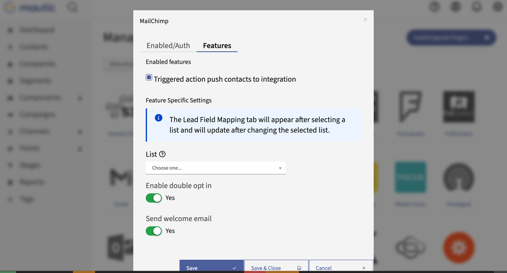

MailChimp
#########

This Plugin can send Contacts to MailChimp lists based on Contact actions or Point Triggers.

Authorize
*********

Get MailChimp API key
=====================

1. Create a MailChimp account.
2. Go to *Account* / *Extras* / *API Keys* and create a new one.
3. Copy the created API Key.
   
  .. image:: images/plugins-mailchimp-create-api-key-1-and-2.png
   :alt: Screenshot of MailChimp dashboard with arrows pointing at the Extras tab and the API Keys section
   :align: center

  .. image:: images/plugins-mailchimp-create-api-key-3a.png
     :alt: Screenshot of MailChimp dashboard with an arrow pointing at the Create API Key button
     :align: center

  .. image:: images/plugins-mailchimp-create-api-key-3b-and-3c.png
     :alt: Screenshot of the Name New API Key section with arrows pointing at the test and Generate Key button
     :align: center

.. vale off

Authorize Mautic - MailChimp Plugin
===================================
1. Fill in with your MailChimp's account **username** 
2. Add the **API key**
3. Click on ***Save & Close***  

Configure the Plugin
********************

.. vale on

Navigate to the **Features** tab in the Plugin configuration modal box. The fields on the **Contact Mapping** tab depend on the list you select.

1. Select the **List** - your MailChimp Audience - to add Contacts to.

   If you don't have an Audience yet, create one in the MailChimp dashboard.

2. Save the Plugin configuration
3. Open it again.

   The **Contact Mapping** tab now appears.

4. Configure the field mapping.

Other configuration options
===========================

.. vale off

- **Triggered action push contacts to integration**

.. vale on

Mautic enables this option by default. If you turn it off, the Plugin doesn't push Contacts to MailChimp.

- **Enable double opt in** - If MailChimp should send a confirmation Email to the Contacts added by this Plugin. The Contacts must confirm that they really want to join the list.
- **Send welcome Email** - Whether MailChimp should send the welcome Email.