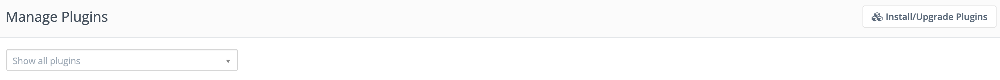
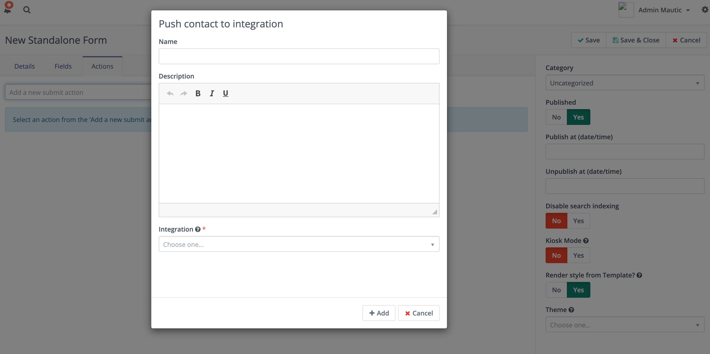

Plugin resources
################

Mautic Plugins are installable packages which can extend Mautic feature or integrate it with another system. You can find more information about how to create a Mautic Plugin in the :xref:`Plugins developer documentation`. 

You can find the Plugins in the right Admin menu.

.. image:: images/plugins.png
  :width: 800
  :alt: Screenshot of Plugins settings

.. vale off

Install Plugins
***************

.. vale on

If you are on a freshly installed Mautic instance, there is a chance that you don't have the default Plugins installed yet. Click on the *Install/Upgrade Plugins* button in the top right corner and all the Plugins should appear.

If you are trying to install a new Plugin that didn't come with the original Mautic installation files and it doesn't appear after you click ``Install/Upgrade plugins``, clear your Mautic cache and try the *Install/Upgrade Plugins* button again.

.. vale off

Testing Integrations
********************

How to test an Integration
==========================

.. vale on

If you want to test an Integration Plugin to ensure that it's configured properly, you have three options for how to do that. An Integration can push a Contact via these actions:

* The **Campaign Builder** has the *Push Contact to Integration* action which can be used in the Campaign configuration.
* The **Standalone Form** has the *Push Contact to Integration* action which can be used after a standalone Form is submitted.
* The **Points Trigger** has the *Push Contact to Integration* action which can be triggered when a Contact achieves a configured point limit.
  
Use any of those actions to test the Plugin and see if the Contact appears in the Integration. Here is an example of how you can configure the Standalone Form action:

1. Create a Form with some fields. For example, an ``email`` and a ``firstname`` field.

2. Add the Push Contact to Integration action. For example, ``Hubspot CRM``.

3. Browse to the Form's public URL ``https://example.com/form/[formID]``

4. Fill in the fields with sample Contact information and submit

5. Ensure that the new Contact was created in the Integration.

Troubleshooting
~~~~~~~~~~~~~~~

If the ``firstname`` value wasn't saved to the Integration:

1. Confirm that the Form General configuration tab enables the ``Save result`` option.

2. In the Form Contact Field configuration tab, confirm the field is: ``ContactFirst Name``.

3. Double select the Integration field mappings.

.. vale off

Field Mapping in a Plugin Integration
*************************************

.. vale on

At the *Contact Field Mapping* tab is the list of available fields from an Integration.

You have to select the Mautic Contact Field equivalent so each field gets the right value.

.. note:: 

    You don't have to map every field. Map only those you want to push into the Integration.

