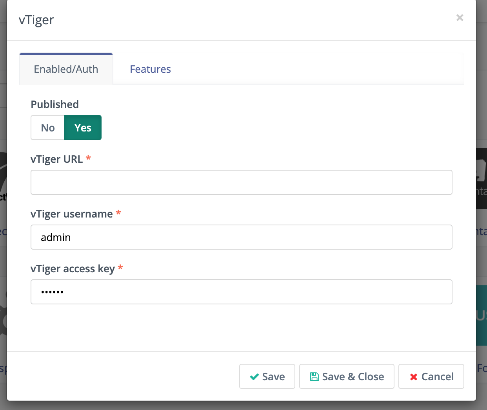
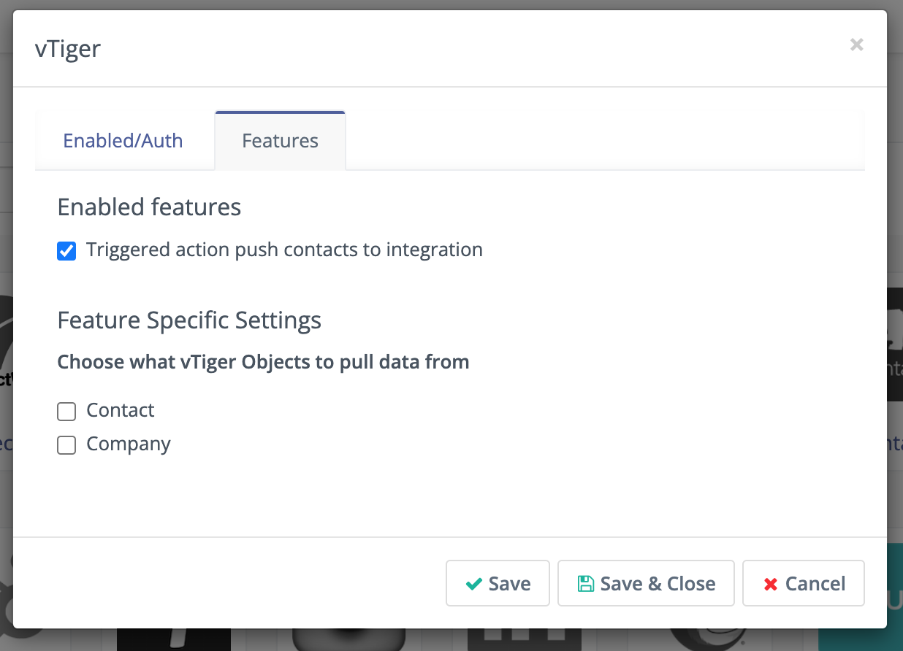

Vtiger
######

.. vale off

Mautic - Vtiger CRM Plugin
**************************

.. vale on

This Plugin can push a Contact to the Vtiger CRM when a Contact makes some action.

Create a :xref:`Vtiger` CRM account if you don't already have one.

.. warning:: 

    The cloud Vtiger instances have the Contacts module turn off by default. This causes error message ``Permission to perform the operation is denied`` on Plugin edit Form. Enable the Contacts module and the Plugin load the custom field mapping Form.

.. vale off

Authenticate the Vtiger Plugin
******************************

.. vale on

To authenticate the Mautic Plugin to be able to communicate with Vtiger CRM you'll need these credentials:

* Vtiger Cloud URL - the base (root) URL starting with ``http://`` or ``https://`` where your Vtiger instance runs. For example, ``https://your_Vtiger.od2.Vtiger.com.``

* Vtiger Open Source URL If you are using Open Source Vtiger you must use the base (root) URL starting with ``http://`` or ``https:// and followed by /webservice.php``. For example ``https://your_Vtiger.od2.Vtiger.com/webservice.php``.

* Vtiger username - The username, email address usually, which you use to log in to your Vtiger.

* Vtiger access key - The access key published in your Vtiger profile. To get it, go to Vtiger's **My Preferences**. The Access Key hash is at the bottom of the page.

|

Fill these 3 credentials to the Mautic Plugin and click **Save**.

.. vale off

Configure the Vtiger CRM Plugin
*******************************

.. vale on

If you want to use the Plugin, you have to publish it. 

1. Set the *Publish* switch to **Yes**.

2. In the **Features tab** is Push Contacts to this Integration checkbox and it's checked by default.

|

3. You can also configure whether you want to map Vtiger's Leads to Mautic's Contacts and/or Vtiger's Organizations to Mautic's Companies.

4. Configure the :ref:`field mapping<field mapping>`.

5. Click **Save & Close**.

.. vale off

Test the VTiger CRM Plugin
**************************

.. vale on

Follow :ref:`these steps<testing integrations>` to test the Integration.