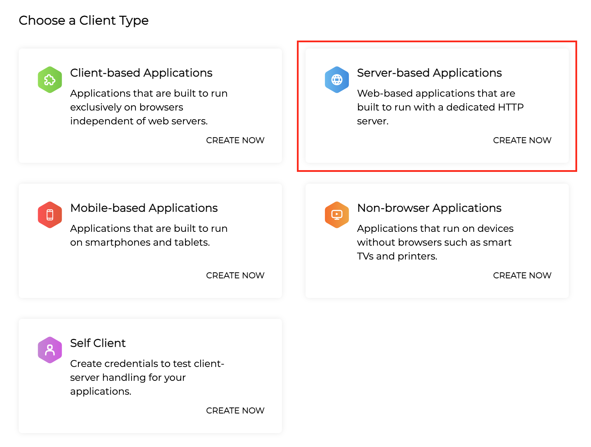
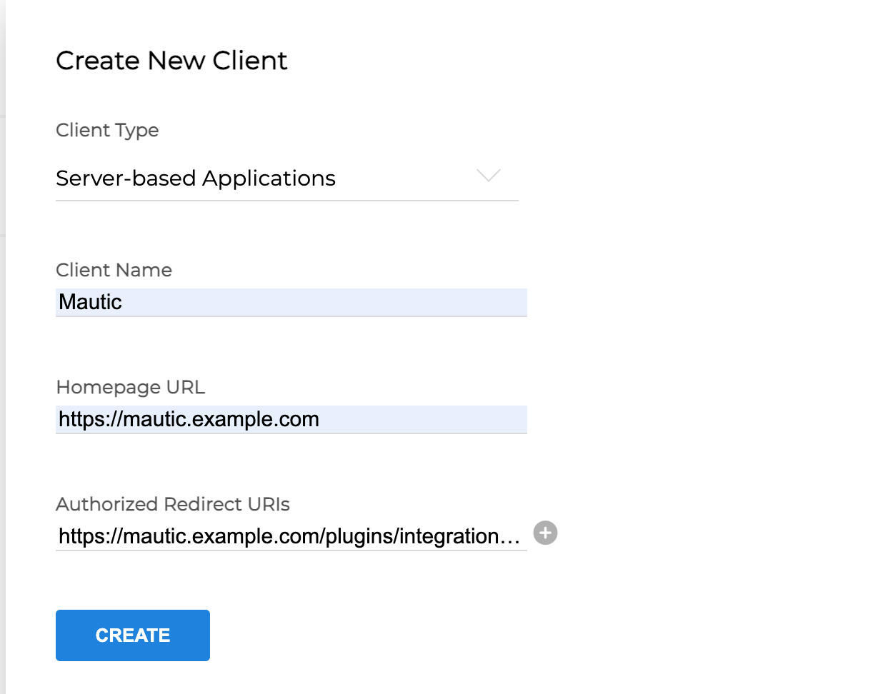
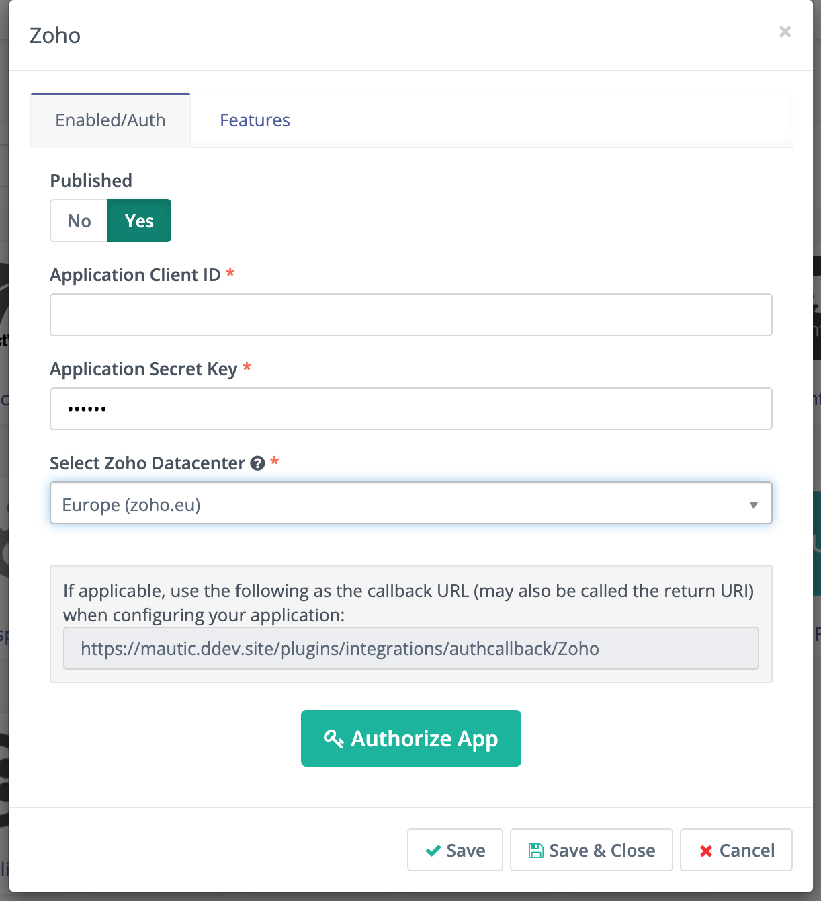
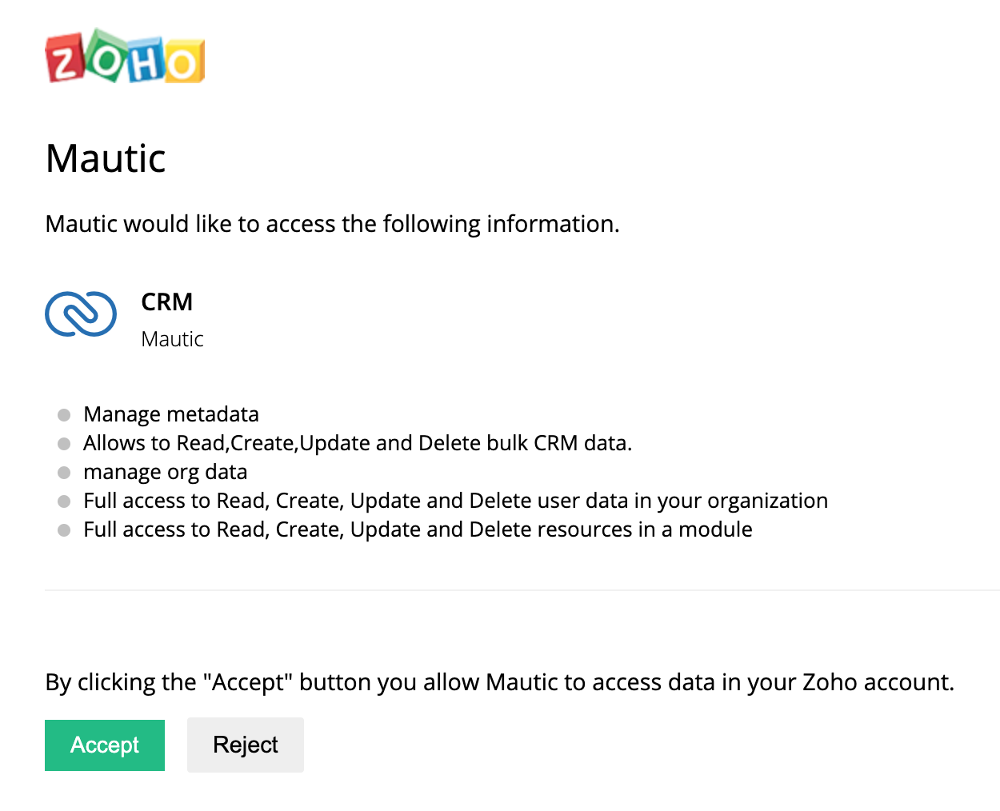
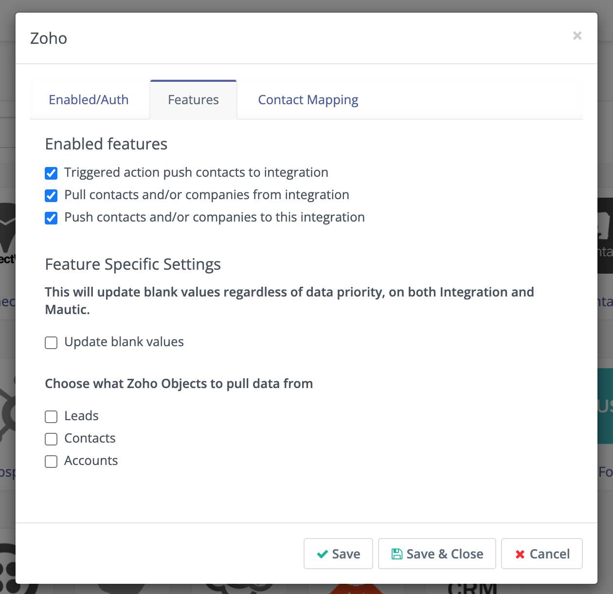

.. vale off

Zoho CRM
#########

.. vale on

Mautic can push a Contact to :xref:`Zoho CRM` based on :doc:`Actions<Campaign actions> ` or :doc:`points trigger<Points Triggers>`.

Language configuration warning
******************************

.. warning:: 

    You must **configure the Zoho and Mautic accounts in** English in order for the synchronization to work. Zoho changes the alias of each of the Contact fields depending on the language, which generates unmatched fields and errors on sync.

.. vale off

Configure the Zoho CRM Plugin
*****************************

.. vale on

1. Create a :xref:`Zoho CRM` account if you don't have one already.
2. Generate a key pair by going to the :xref:`Zoho API Console`. 
3. Select **Server Based Applications** and provide a name for the client; the URL of your Mautic instance, and the callback URL (which you can access by going to Plugins > ZohoCRM in Mautic and copying the callback URL, usually in the format ``https://mautic.example.com/plugins/integrations/authcallback/Zoho``). 

4. Enter the Client ID and Client Secret you created the Zoho API Console into the Mautic Zoho Integration Plugin.

|

.. note:: 

    You must select the correct data centre corresponding to your CRM instance - for example, if you access your CRM at ``crm.zoho.com`` you should choose the .com option in the dropdown.

|

1. Select the correct data centre based on the URL of your Zoho CRM instance, and click the button to authorize the Plugin to access your instance. A popup window prompts you to log into Zoho and to authorize access - select Accept.

Once you have authorized successfully, the button updates to show 'Reauthorize'.

6. In the Features tab you can select the behaviour that you wish to have happen with this Integration:

   * Triggered action push Contacts to Integration - when triggered, Mautic pushes Contacts to Zoho
   * Pull Contacts and/or Companies from Integration - pull all Contacts and/or Companies from ZohoCRM into Mautic
   * Push Contacts and/or Companies to this Integration - push all Contacts and/or Companies from Mautic into ZohoCRM

Note this still requires a :ref:`cron job<cron jobs>` to function

You can also configure other options:

* Update blank values - This updates blank values regardless of data priority, on both ZohoCRM and Mautic.
* Choose what Zoho Objects to pull data from - Here you can specify which objects you want to pull from ZohoCRM - Leads, Contacts and/or Accounts

|

7. Configure the :ref:`field mapping<field mapping>`.

|

.. note::

    If the values are empty for the Mautic object, a value of 'Unknown' is sent. If the ZohoCRM field is a pick list, be sure the list values of Mautic's field match those of the field in ZohoCRM.

8. Set the Publish switch to **Yes**.
9. Click **Save & Close**.

.. vale on

Test the Plugin Zoho CRM
************************

.. vale off

Follow :ref:`these steps<testing integrations>` to test the Integration.