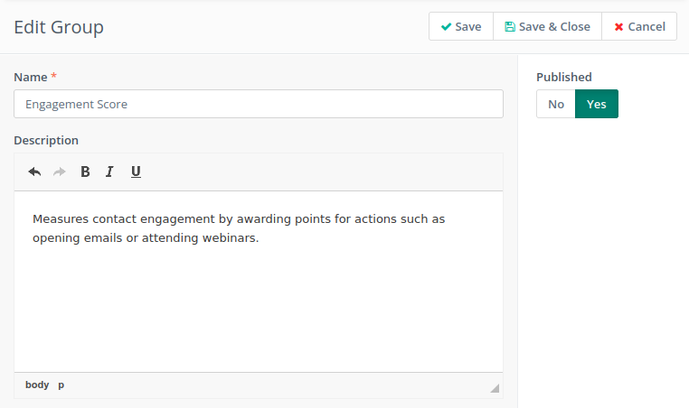
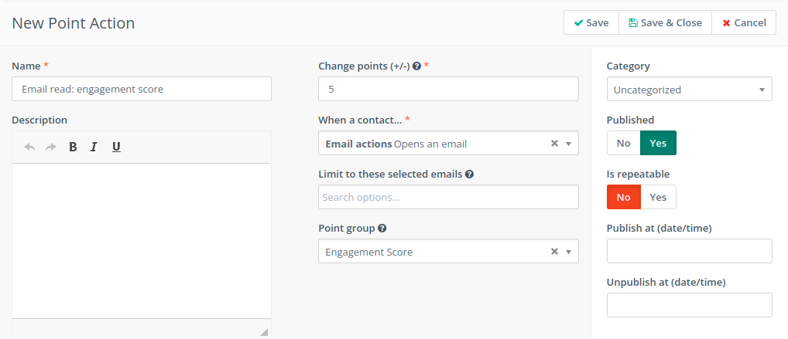
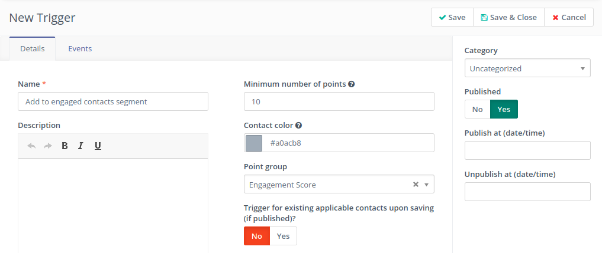
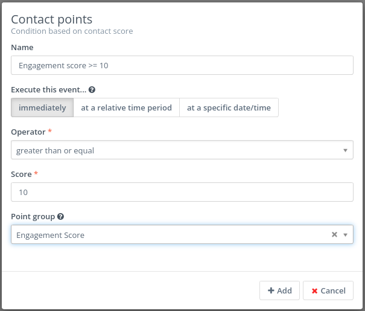
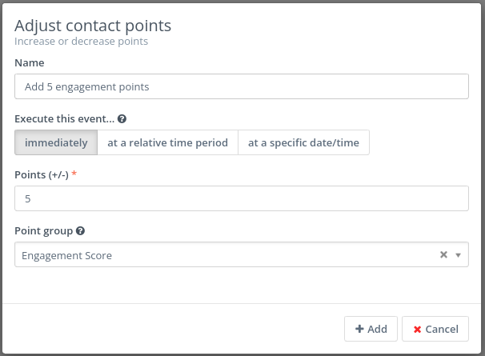
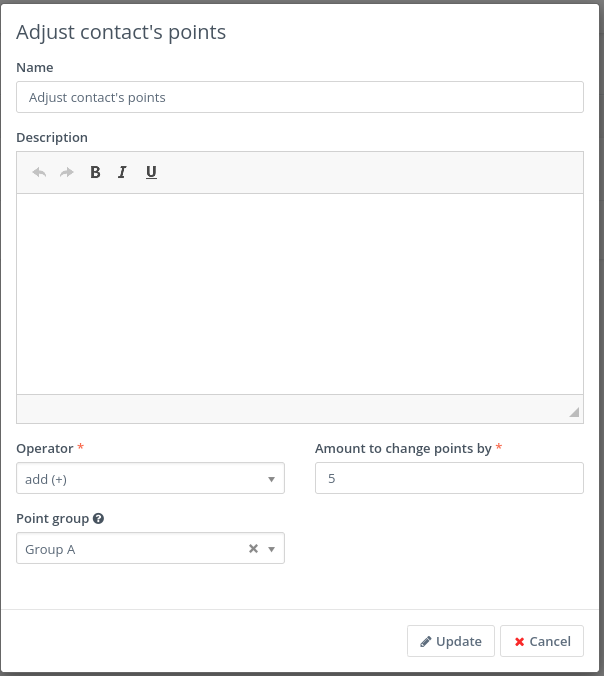
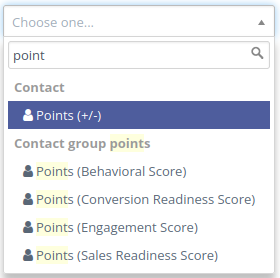
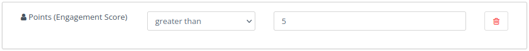
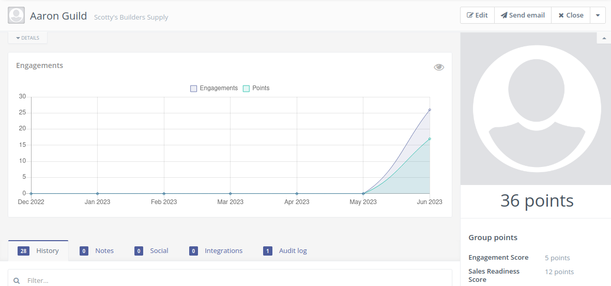
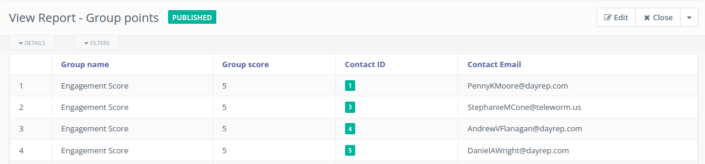

.. vale off

Point Groups
#############

.. vale on

Point Groups is a feature that allows Users to categorize the score of their Contacts. By setting up Point Groups, Users can assign a specific number of Points to each action taken by a Contact, such as opening an Email, visiting a Landing Page, or downloading an Asset.

.. vale off

Managing Point Groups
======================

.. vale on

To access the currently defined Point Groups in Mautic, navigate to the Points Menu and click the "Manage Groups" link. To create a new Group, simply click the "New" button.

Enter a name and a description for the Group and click the "Save & Close" button to create the Group.

.. vale off

Point Groups usage
===================

Using Point actions
-------------------
You can change Contact's Points within a Points Group by using Points Actions.

Using Point triggers
--------------------
You can use Point triggers based on Point Groups to automatically trigger specific events within the system.

Campaign condition
------------------
You can use a condition based on Group Contact score in a Campaign.

Campaign action
---------------
You can use a Campaign action to increase or decrease the Group Contact score.

Form action
---------------
You can use a Form action to increase or decrease the Group Contact score.

Segment filters
---------------
Each Point Group adds a new filter for configuring the Segment.

Contact details
---------------
You can display Point Groups in the Contact details.

.. vale off

Group Report
-------------

.. vale on

You can generate a Report that contains information about Contact Point Groups.

Webhooks
--------
Changing the Contact Group Points doesn't trigger the Contact Points Changed Event Webhook