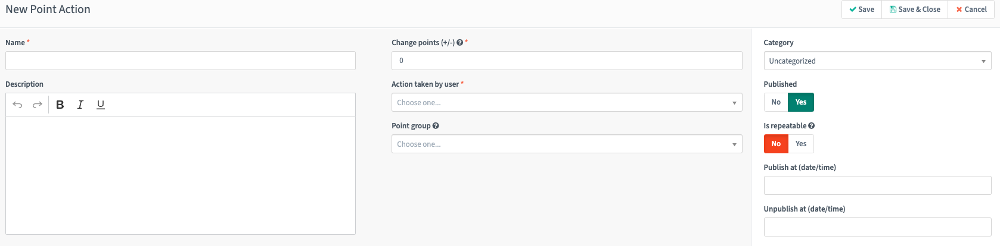
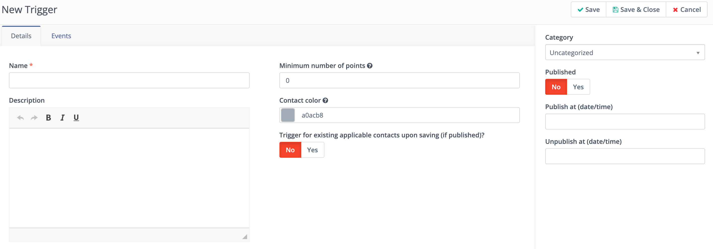
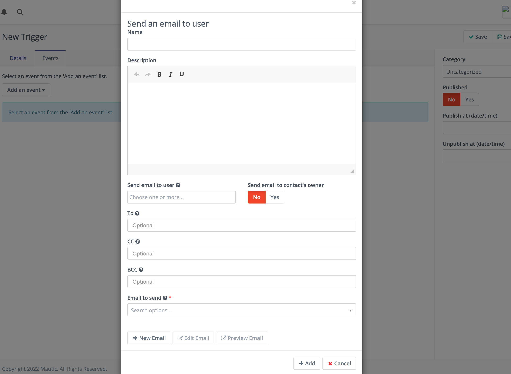

.. vale off

Points
######

.. vale on

Points provide a way for properly weighing Contacts. These Points have both triggers and actions. The following section outlines all the relevant term definitions, and a thorough understanding of how Points function. This helps make your overall marketing automation process successful using Points

Point actions
*************

Point actions are those times when a Contact receives a change in their Point total. These actions can be either positive or negative Point changes and occur based on a particular action as you determine.

To add a new action:

1. Click **Points > Point Actions > + New**  - located in the top right corner.

2. In the main panel, there are four boxes for key information. Enter the appropriate information.

   * **Name** - The name of your action. This is how the action displays in your list of actions, so choose an identifiable name.

   * **Description** - Add a description to help you find certain actions. There may be more actions which are similar or more in-depth.

   * **Change Points (+/-)** - The value change to set for the action. The ``+`` isn't necessary when adding Points. When subtracting Points, add the ``-`` symbol.

   * **When a Contact…** - This is the behavior or action the Contact must complete to trigger the action.

3. On the right side is more information:

   * **Category** - Organize your Point actions based on their goals, Campaigns, etc. For more information, see :doc:`Categories</categories/categories-overview>`. All Points accumulate on a Contact record, regardless of Category. There is one Points score for each Contact.

   * **Active and Activate/Deactivate at date/time** - Once you have a Point action, Mautic awards Points when a Contact completes the action. Points aren't given for unactive actions. If you have target behaviors that you want to award Points for within a certain time period, you can set the activate and deactivate dates

   * **Is repeatable** - To award Points each time a Contact completes an action, select **Yes**. If you want to award Points **only** the first time someone completes the action, select **No** - this is the default.

4. Click **Save** or **Save & Close**.

Point triggers
**************

Once a Contact has accumulated a Point total, you may want to trigger an action with the Contact. You may create multiple triggers for different Point values.

Creating Point Triggers is like creating Point Actions. The **Name**, **Description**, **Category**, and **Active** options are all the same. The trigger fires based on the minimum number of Points. Set a number and decide if you want to **Trigger for existing applicable Contacts upon saving - if activated**. 

Once you have decided and entered those options, go to the **Events** tab. Here, you can trigger one or more events once a Contact has reached your predetermined Point total. These Point triggers and associated events are also fully customizable.

.. image:: images/trigger-events.png
    :alt: Screenshot of Points trigger events

Campaign triggers
=================

**Modify Contact's Campaigns** - Add a Contact to or remove a Contact from any Campaigns you have activated.

Contact triggers
================

**Modify Contact's Segments** - Add a Contact to or remove a Contact from any Segments you have activated.

**Modify Contact's tags** - Add or remove any Tags on the Contact record. If a Tag doesn't exist, you may create a new one in the edit window for this event.

Add-on triggers
===============

**Push Contact to Integration** - To only push Contacts to an Integration after hitting a minimum Point total, use this option. You must have the **Triggered action push Contacts to Integration** option selected in the Integration. After selecting this event, the system displays a dialog box where you can choose which Integration to push the Contact to. For example, if you base your definition of a Marketing Qualified Lead (MQL) on Point values, you may decide to only push Contacts who are MQLs to your CRM. Once a Contact meets the Points requirement to be an MQL, use this action to push the Contact to your CRM.

.. note:: 

    The Push Contact to Integration action isn't supported with the Salesforce Plugin.

Email triggers
==============

**Send an Email** - Send a template Email to the Contact based on their engagement. This may be some sort of special offer, congratulations, etc.

**Send an Email to User** - Tell a team member that a Contact has reached a minimum number of Points. There is an option in this event to send the Email to the Contact's owner. You may either write a basic Email in the editor, or use a template Email.
  * Selecting a User and selecting the option of **send Email to Contact's owner** notifies both Contacts.

  * If User has no owner or if the owner is same as the Mautic User, this sends only one Email.

  * You can add more Emails to 'to', 'cc' and 'bcc' fields - separated by a comma. You can add space after each comma if needed.

  * Sends Notification to all address - User's Email, owner's Email, to, cc and bcc.