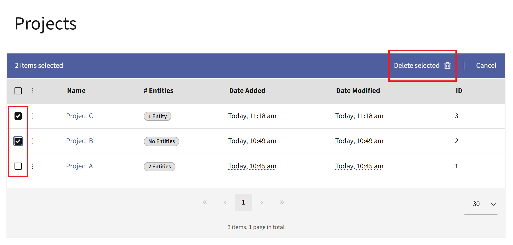

.. vale off

Projects
########

.. vale on

Projects give you one place to group everything that belongs to a single marketing initiative. Instead of hunting for the Campaigns, Emails, Segments, and other items behind a launch, you assign them all to a Project and manage them together. A Project works like a folder that spans item types, so you can see how the pieces of an initiative fit together and find related items quickly.

You can assign many item types to a Project, including Asset, Campaign, Company, Dynamic Content, Email, Focus Item, Form, Landing Page, Marketing Message, Point, Point Trigger, Segment, Stage, and Text message.

.. vale off

Managing Projects
*****************

.. vale on

To open the Projects list, select Projects in the left main menu. From here, you can create a new Project, open an existing one, and delete Projects you no longer need. The list shows each Project along with the number of items assigned to it.

.. image:: images/projects_list_view.png
   :align: center
   :alt: Projects list showing the New button and the Projects item in the left menu

|

.. vale off

Creating Projects
=================

.. vale on

To create a Project:

* Select **New**.
* Give it a name and an optional description.

.. image:: images/create_new_project_form.png
   :align: center
   :alt: Create new Project screen with Name and Description fields

|

Each Project name must be unique. If you enter a name that's already in use, Mautic displays 'A project with this name already exists.' and asks you to choose another.

.. vale off

Deleting Projects
=================

.. vale on

To delete one or more Projects:

* Select the checkbox of the Projects you want to delete. Selecting a checkbox automatically opens a blue banner on top of the table.
* Click **Delete selected**.

|

Deleting a Project removes the references to it from every assigned item, but it doesn't delete the items themselves.

.. vale off

Assigning items to a Project
============================

.. vale on

There are two ways to assign items to a Project.

* **From the item** - When you create or edit a supported item, such as an Email or a Campaign, use the Projects field to assign it to one or more Projects. If you have permission to create Projects, you can also type a new name in this field and select **Hit enter to create** to make a new Project on the spot.

  |

  .. image:: images/assign_project_from_email.png
     :align: center
     :alt: Email edit view with the Projects field used to assign the Email to a Project

  |

* **From the Project**:

  #. Open a Project and select **Add Entities to Project**.

     |

     .. image:: images/add_entities_to_project_button.png
        :align: center
        :alt: Project detail view highlighting the Add Entities to Project button

     |

  #. Choose the type of item you want to add.
  #. Select the item you want to add to the Project.

.. vale off

Deleting items from Projects
============================

.. vale on

To delete an item from a Project:

* Click the three-dots icon next to the item you want to remove to open the Options menu.
* Click the **Remove from project** button.
* Confirm the removal.

.. image:: images/remove_item_from_project.png
   :align: center
   :alt: Options menu on a Project item showing the Remove from project action

|

.. vale off

Finding items by Project
========================

.. vale on

There are two ways to see which items belong to a Project.

The most reliable way is from the Projects list. In the '# Entities' column, select the count next to a Project to open its detail view, where Mautic lists every assigned item grouped by type. From this view, you can also remove items or add new ones.

You can also use the ``project`` search command on supported list views. In the search box, enter ``project:name`` to show only the items assigned to that Project. For example, ``project:"Summer Launch"`` returns every item assigned to the 'Summer Launch' Project. The command matches the Project name exactly, including capitalization, so a value that doesn't match a Project name returns 'No Result Found'. This command is available on the Emails, Campaigns, Segments, Forms, Landing Pages, Assets, Text messages, Marketing Messages, Companies, Points, Point Triggers, Stages, Dynamic Content, and Focus Items lists. It isn't available on the Contacts list.

.. vale off

Permissions
***********

.. vale on

Projects use their own permission set, which you can grant per Role. To configure these permissions, go to **Settings** > **Roles**, open or create a Role, and find the **Project permissions** section. Alongside the standard View, Edit, Create, Delete, and Full permissions, there's a separate **Associate with other entities** permission that controls whether a User can attach items to and detach items from Projects. A User needs this permission to use the Projects field on an item or the add and remove actions on a Project.

For more information on creating Roles and configuring their permissions, see :ref:`Roles overview` and :ref:`Setting Role permissions <setting granular permissions>`.
