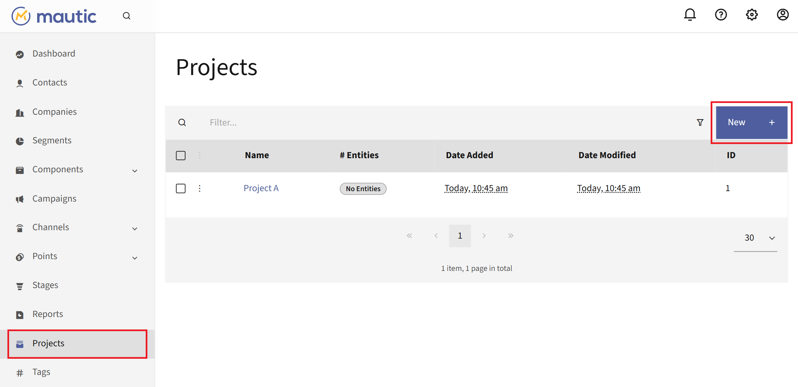
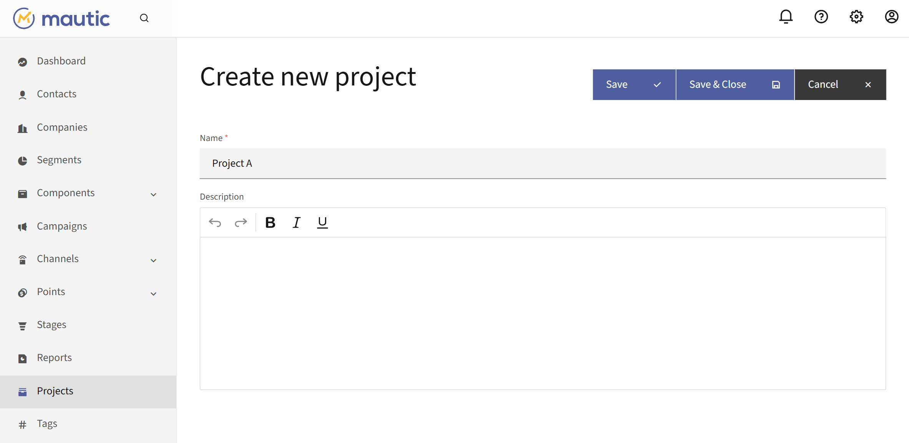
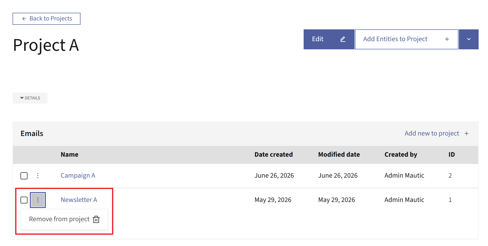
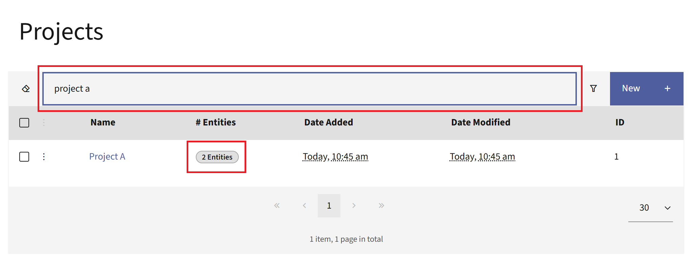

.. vale off

Projects
########

.. vale on

Projects give you one place to group everything that belongs to a single marketing initiative. Instead of hunting for the Campaigns, Emails, Segments, and other entities behind a launch, you assign them all to a Project and manage them together. A Project works like a folder that spans entity types, so you can see how the pieces of an initiative fit together and find related entities quickly.

You can assign many entity types to a Project, including:

.. vale off

* :doc:`Assets </components/assets>`
* :doc:`Campaigns </campaigns/campaigns_overview>`
* :doc:`Companies </companies/companies_overview>`
* :doc:`Dynamic Web Content </components/dynamic_web_content>`
* :doc:`Emails </channels/emails>`
* :doc:`Focus Items </channels/focus_items>`
* :doc:`Forms </components/forms>`
* :doc:`Landing Pages </components/landing_pages>`
* :doc:`Marketing Messages </channels/marketing_messages>`
* :doc:`Points </points/points>`
* :doc:`Segments </segments/manage_segments>`
* :doc:`Stages </stages/stages>`
* :doc:`Text messages </channels/sms>`

.. vale on

.. vale off

Managing Projects
*****************

.. vale on

To open the Projects list, select Projects in the left main menu. From here, you can create a new Project, open an existing one, and delete Projects you no longer need. The list shows each Project along with the number of entities assigned to it.

|

.. vale off

Creating Projects
=================

.. vale on

To create a Project:

#. Select **New**.
#. Give it a name and an optional description.

|

Each Project name must be unique. If you enter a name that's already in use, Mautic displays 'A project with this name already exists.' and asks you to choose another.

.. vale off

Editing Projects
================

.. vale on

You can edit a Project's name and description at any time. There are two ways to do this.

#. **From the Projects list:**

   #. Click the three-dots icon next to the Project you want to edit.
   #. Click **Edit** to open the Edit Project screen.
   #. Edit the Project and click **Save** or **Save & Close** to save it.

   .. image:: images/edit_project_from_dashboard.png
      :align: center
      :alt: Projects list with the Options menu open and the Edit action highlighted

   |

#. **From the Project's detail view:**

   #. Click the Project name to open its detail view.
   #. Click **Edit** at the top to open the Edit Project screen.
   #. Edit the Project and click **Save** or **Save & Close** to save it.

   .. image:: images/edit_project_from_detail.png
      :align: center
      :alt: Project detail view with the Edit button highlighted at the top

   |

.. vale off

Deleting Projects
=================

.. vale on

There are two ways to delete Projects.

#. **To delete one or more Projects at once:**

   #. Select the checkbox of the Projects you want to delete. Selecting a checkbox automatically opens a blue banner on top of the table.
   #. Click **Delete selected**.
   #. Confirm the deletion.

   .. image:: images/delete_selected_projects.png
      :align: center
      :alt: Projects list with two Projects selected and the Delete selected banner

   |

#. **To delete a single Project:**

   #. Click the three-dots icon next to the Project you want to delete.
   #. Select **Delete**.
   #. Confirm the deletion.

   .. image:: images/delete_single_project.png
      :align: center
      :alt: Projects list with the Options menu open and the Delete action highlighted

   |

Deleting a Project removes the references to it from every assigned entity, but it doesn't delete the entities themselves.

.. vale off

Assigning entities to a Project
===============================

.. vale on

There are two ways to assign entities to a Project.

#. **From the entity** - When you create or edit a supported entity, such as an Email or a Campaign, use the Projects field to assign it to one or more Projects. If you have permission to create Projects, you can also type a new name in this field and select **Hit enter to create** to make a new Project on the spot.

   |

   .. image:: images/assign_project_from_email.png
      :align: center
      :alt: Email edit view with the Projects field used to assign the Email to a Project

   |

#. **From the Project**:

   #. Open a Project and select **Add Entities to Project**.

      |

      .. image:: images/add_entities_to_project_button.png
         :align: center
         :alt: Project detail view highlighting the Add Entities to Project button

      |

   #. Choose the type of entity you want to add.
   #. Select the entity you want to add to the Project.

.. vale off

Deleting entities from Projects
===============================

.. vale on

To delete an entity from a Project:

#. Click the three-dots icon next to the entity you want to remove.
#. Click the **Remove from project** button.
#. Confirm the removal.

|

.. vale off

Finding entities by Project
===========================

.. vale on

To see entities assigned to a Project, go to the Project dashboard. From the Projects list, select the Project's name or the entities label in the **# Entities** column. Both open the Project's detail view, where Mautic lists every assigned entity grouped by type. From here, you can also remove entities or add new ones.

If you have many Projects, use the search bar at the top of the Projects list to find one quickly:

#. Type the Project's name.
#. Press **Enter**.
#. Select the Project's name or its entities label to open it.

|

.. vale off

Permissions
***********

.. vale on

Projects use their own permission set, which you can grant per Role. To configure these permissions:

#. Go to **Settings** > **Roles**
#. Open or create a Role
#. Find the **Project permissions** section.

Alongside the standard **View**, **Edit**, **Create**, **Delete**, and **Full permissions**, there's a separate **Associate with other entities** permission that controls whether a User can attach entities to and detach entities from Projects. A User needs this permission to use the Projects field on an entity or the add and remove actions on a Project.

For more information on creating Roles and configuring their permissions, see :ref:`Roles overview` and :ref:`Setting Role permissions <setting granular permissions>`.
