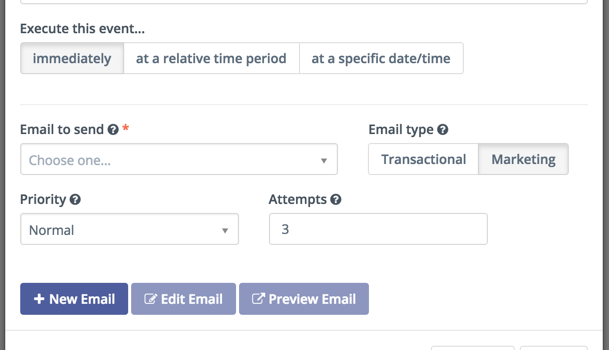

.. vale off

Message queue
#############

.. vale on

A Campaign **marketing** Email can be triggered or sent as part of an Email broadcast (Segment Email), and when a Contact has a frequency rule defined or a default set in Configuration, the email is sent to a queue, where it will be handled later.

Priority and number of attempts
*******************************

* You can select priority as **High** or **Normal**. When processing messages for a given date, high priority messages are placed at the top of the queue. Broadcasts are always treated as a normal priority.

* Once the number of attempts has been reached, an attempt is made to send the email again if it has been rescheduled. Even if the message is pending, the message won't be sent if the number of attempts has been reached.

Processing a message queue
**************************

This command processes all pending messages that haven't reached their maximum number of attempts and are in the pending queue.

Setup your :ref:`cron<processing a message queue>` as followed: ``php bin/console mautic:messages:send``

