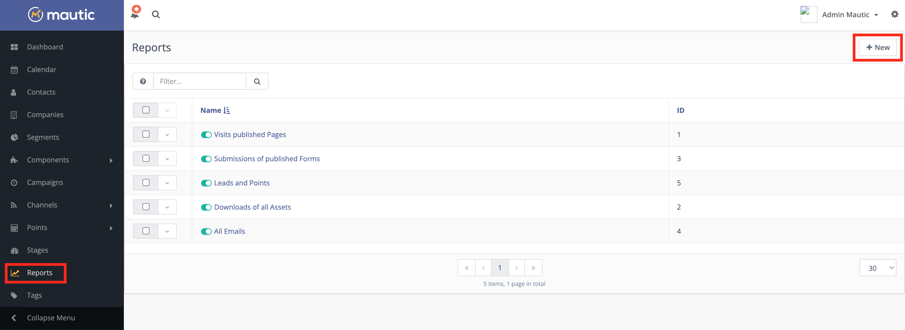
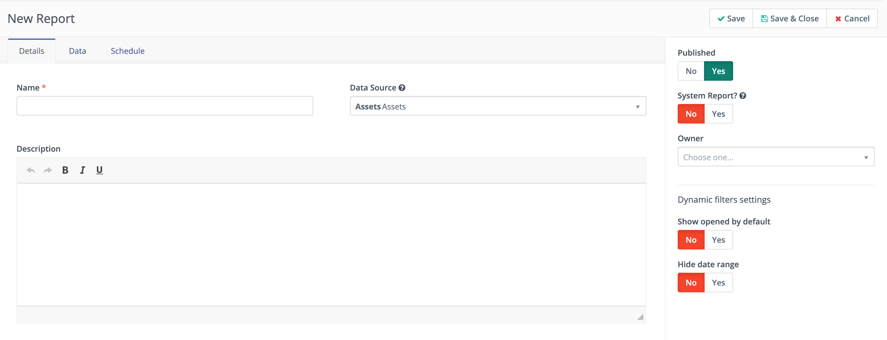
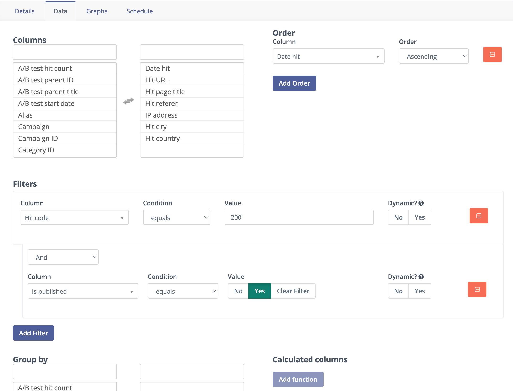
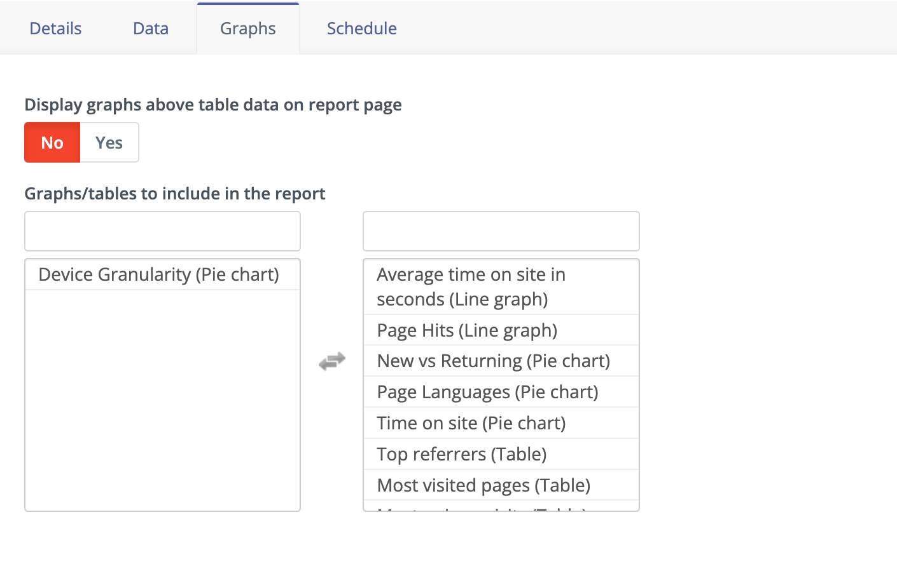
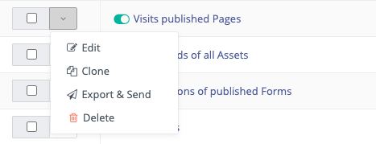
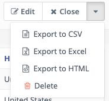

Reports
#######

Mautic's Reports menu allows you to generate highly customizable Reports.

You can use the reporting tools to track marketing metrics, identify marketing activities that are effective or need improvement, and troubleshoot or investigate if you are curious about why something is happening.

To get to Reports, click the Reports link from the menu on the left side of your instance. To create a new Report, click the **+New** button in the top right corner.

|

Data sources
============

The **Details** tab on a Report contains the same options across all Reports and provides some general options for your Report.

* **Name** - Specify a Report name that makes it easy for you and other Users to identify the purpose of the Report.

* **Data source** - Select the data source appropriate to the Report that you are building. Note that each data source has a different set of available columns, filters, and graphs. The available data sources are:

1. :doc:`Assets</components/assets>`

   * Assets
   * Asset Downloads

2. :doc:`Campaigns</campaigns/campaigns_overview>`
   
   * Campaign Events

3. :doc:`Channels Messages</queue/message_queue>`
   
   * Message Queue

4. Audit Logs

   * Audit Logs

5. :doc:`Emails</channels/emails>`
    
   * Emails
   * Emails Sent

6. :doc:`Forms</components/forms>`
   
   * Forms
   * Form Submissions

7. :doc:`Contacts</contacts/manage_contacts>`
   
   * Contacts
   * Multi Touch Attributions
   * First Touch Attributions
   * Last Touch Attributions
   * Contact Point Log
   * Frequency Rules
   * Segment Membership
   * Do Not Contact
   * UTM Codes
   * Group score

8. :doc:`Companies</companies/companies_overview>`
   
   * Companies

9. :doc:`Mobile Notifications</channels/marketing_messages>`
   
   * Mobile Notifications
   * Mobile Notifications Sent

10. :doc:`Pages</components/landing_pages>`
    
   * Landing Pages
   * Page hits

11. Videos

    * Video hits

As demonstrated, Mautic displays the data sources in the format: ``<Parent data source> <Child data source>``

The parent data source provides a high-level summary of the data while the child data source provides a more granular view of Contact behavior that includes your Custom Fields and values.

* **Description - optional** - Add detailed information about the Report, helping you and other Users better understand what the Report is for. You may want to include more information about filters, people, or departments.
  
* **Published** - Select **Yes** to ensure that the Report is active, ready to send when scheduled in the Report options.

* **System Report** - Select **Yes** so that all Users can access the Report. If set to No, only the owner of the Report and Users with permission to view others' Reports can see the Report.

* **Owner** - Select the owner of the Report to determine who can see the Report if the System Report setting is No.

* **Dynamic filters settings**

  - Show opened by default - If you want to ensure that the date filters and filter options for any other Report filters are visible on a Report detail page without needing to open the filters drop-down, select Yes. For example, for an Emails Report, you might want to view dynamic filters for subject or sent date.
  - Hide date range - To hide the date range filter so that Users can’t change the dates that the Report displays data for, select to **Yes**.

Data
====

You can customize each Report to include the columns of choice, filter data based on set criteria, and/or set a specific order for the data. In addition you can also group by specific fields, and select different function operators to calculate fields. Note that when you select functions operators, Mautic adds a totals row to the Report. Choosing to export a Report **won't** include this totals row.

* **Columns** - Select the columns of data that you want to appear in the table of data in the Report. Click the column name in the left column to have it show in the Report. You can remove a column from the Report by clicking on its right column. The column returns to its original position on the left side. For example, if you select ID, it refers to the **ID** for the parent data source Category that you selected earlier Contact ID, Email ID, Asset ID, etc. It's recommended that you include **ID** in all Reports.
* **Order** - For sorting the data in the Report, select data Points. The available sort options are **Ascending** and **Descending**. To add multiple columns, click **Add Order**. For fields that use text, an **Ascending** order lists values starting with B after values starting with A and so on. For number or date fields, the higher the number or later the date, the lower on the list the row is. Descending order is the opposite.

.. note:: 

   Adding multiple fields to order by uses the last one in the Order list first. Ordering by **First Name Ascending** and adding **Email Ascending**, for instance, sorts the Email column first and duplicate rows are then sorted by first name ascending.

* **Filters** -  Filter the data using conditions and values. This allows the generation of very granular Reports. This option helps you to narrow down the data included in the Report. The data Points used for filters don’t have to be columns that appear in the Report table. A commonly used filter for any Reports that include Contact record data is Email Not Empty, which displays only identified Contacts in the Report. Additional use cases can include Contacts or items that match a certain value, events happening within a certain date range, etc.

.. note:: 

   Setting the **Dynamic** option to **Yes** makes it easier for Users viewing the Report to change the data they see without actually editing the Report. Users can see the filter by opening the **Filters** drop-down from the top of the Report page.

* **Group by** - Select the columns for which you want to group data. By default, Reports show all items individually. In many Reports, you may see the same Contact, Company, or item appear multiple times. To only see each record listed once, you can add a grouping based on some attribute for the record. 

You can use Email or Contact ID to display a single row per Contact record. For example, you can group by **Contact ID** to view the unique number of Asset Downloads or Form Submissions for a single Form, instead of total Asset Downloads or Form Submissions, which could include duplicates.

* **Calculated columns** - Select the function that you want to apply to individual columns. Calculated columns display count, average, sum, or the minimum or maximum values from a selected field. They're only available when using a grouping to show a calculation for that grouping. Continuing with the previous example of grouping by a Contact ID number or Email address, a COUNT calculation displays how many times that Contact record appears on the Report if not for the grouping.
  
Graphs
======

Some Report types display graphs for visualization purposes. You can include such graphs in Reports and use them in Dashboard widgets.

* To select an available graph and add it to the Report, click the name of the graph to move it from the left column to the right.
* To remove a graph from a Report, click the name in the right column to move it to the left.
  
The availability and types of graphs vary by Report type. 

Schedule
========

Mautic allows scheduling Emails to send downloadable links containing the Report data in the ``.csv`` file format.

Use the toggle switch to turn on or off sending Reports via email.

* Email Report - Select **Yes** to see additional options.

* To - Specify the email addresses that should receive the Report. To send to multiple recipients, separate their email addresses with a comma. For example, ``example1@example.com``, ``example2@example.com``. 

* **Every** - Select the frequency with which you'd like to automatically send the Report:

  - **now** - Sends the Report once, when it's saved.
  - **day** - Sends the Report every day at midnight in your time zone.
  - **week** - After selecting week, select the day of the week you'd like to send the Report. Mautic sends the Report at midnight in your time zone every week on the selected day.
  - **month** - After selecting month, select either the first or last and a day of the week. For example, set your Report to be automatically sent on the first Monday or last Friday of each month. 

Alternatively, you can select Weekdays to send the Report on the first or last weekday of each month.

Once you've set all of the options you'd like in the **Details**, **Data**, **Graphs**, and **Schedule** tabs, click **Save & Close** to save the Report. Clicking **Apply** saves the progress you've made on building the Report and keeps you in the edit mode.

.. vale off

Cron job to schedule Reports
~~~~~~~~~~~~~~~~~~~~~~~~~~~~

.. vale on

Mautic requires the following cron command to be able to send scheduled Reports:

``php /path/to/mautic/bin/console mautic:reports:scheduler [--report=ID]``

The ``--report=ID`` argument allows you to specify a Report by ID if required. For more information, see :ref:`Cron jobs<send scheduled reports cron job>`.

Report options
==============

Once you've saved the Report, it's listed under the Reports section in Mautic.

To view additional options for Report, click the drop-down menu next to the checkbox.

* **Edit** takes you directly to the edit mode, rather than clicking on the view page and editing from there.

* **Clone** copies the Report so that you can make small adjustments in a similar but new Report, while maintaining the original Report.

* **Export & Send** sends a link containing the ``.csv`` file with the Report data to the email address on your User profile.

* **Delete** deletes the Report immediately.

.. vale off

Exporting Reports
=================

.. vale on

In addition to the **Schedule** and **Export & Send** features, Mautic supports exporting Reports in ``.csv,`` Excel, or HTML format. From the Reports list, click any Report. Open the drop-down menu in the top right corner and select the preferred export format.

To download the Report immediately:

1. On the Schedule tab, do one of the following:

   * Select **No**.
   * In the **Every** field, set the value to now.

2. Click **Save & Close**.

3. On the Report details page, click the dropdown on the top right and click **Export to CSV**.

4. Reset the schedule as needed.

Reporting data is also available to export by API. For more information, see the :xref:`Reports API documentation`.