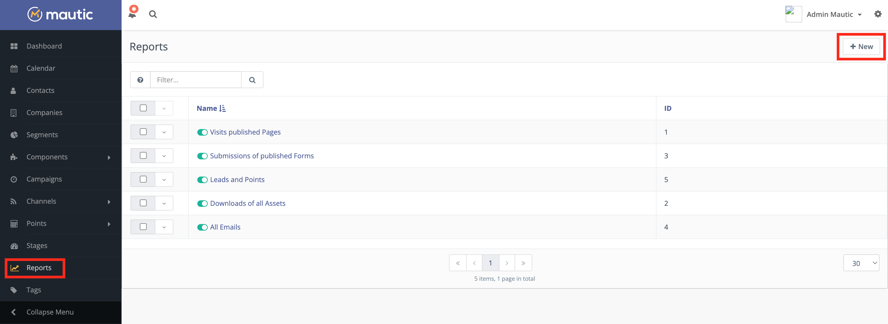
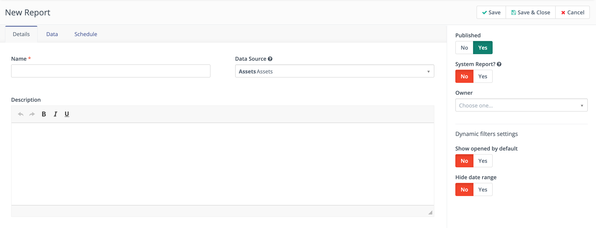
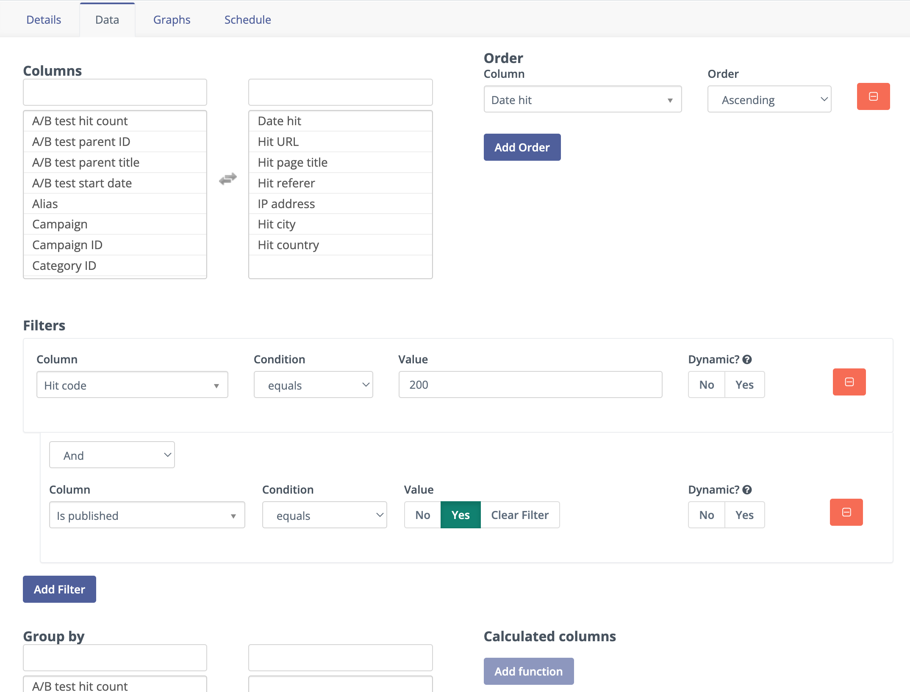
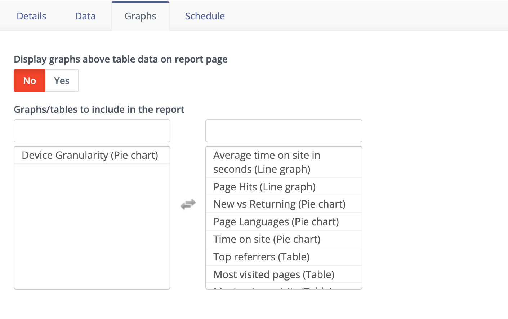
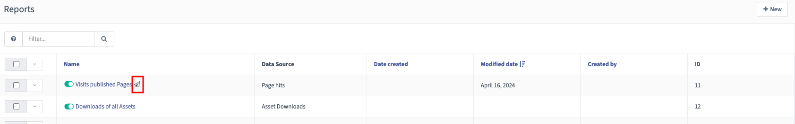
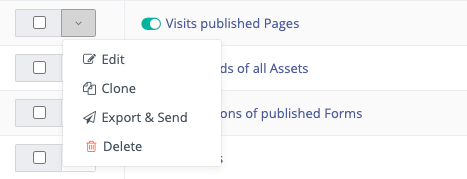
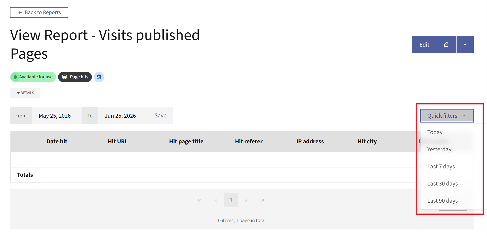
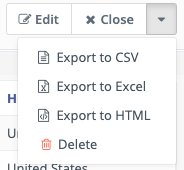

Reports
#######

Mautic's Reports menu allows you to generate highly customizable Reports.

You can use the reporting tools to track marketing metrics, identify marketing activities that are effective or need improvement, and troubleshoot or investigate if you are curious about why something is happening.

To get to Reports, click the Reports link from the menu on the left side of your instance. To create a new Report, click the **+New** button in the top right corner.

|

Data sources
============

The **Details** tab on a Report contains the same options across all Reports and provides some general options for your Report.

|

.. vale off

* **Name** - Specify a Report name that makes it easy for you and other Users to identify the purpose of the Report.
* **Data source** - Select the data source appropriate to the Report that you are building. Note that each data source has a different set of available columns, filters, and graphs. The available data sources are:

  #. :doc:`Assets</components/assets>`

     * Assets
     * Asset Downloads

  #. :doc:`Campaigns</campaigns/campaigns_overview>`

     * Campaign Events

  #. :doc:`Channels Messages</queue/message_queue>`

     * Message Queue

  #. :doc:`Emails</channels/emails>`

     * Emails
     * Emails Sent

  #. :doc:`Forms</components/forms>`

     * Forms
     * Form Submissions

  #. :doc:`Contacts</contacts/manage_contacts>`

     * Contacts
     * Multi Touch Attributions
     * First Touch Attributions
     * Last Touch Attributions
     * Contact Point Log
     * Frequency Rules
     * Segment Membership
     * Do Not Contact
     * UTM Codes
     * Group score

  #. :doc:`Companies</companies/companies_overview>`

     * Companies

  #. :doc:`Mobile Notifications</channels/marketing_messages>`

     * Mobile Notifications
     * Mobile Notifications Sent

  #. :doc:`Pages</components/landing_pages>`

     * Landing Pages
     * Page hits

  #. Videos

     * Video hits

  As demonstrated, Mautic displays the data sources in the format: ``<Parent data source> <Child data source>``

  The parent data source provides a high-level summary of the data while the child data source provides a more granular view of Contact behavior that includes your Custom Fields and values.

* **Description - optional** - Add detailed information about the Report, helping you and other Users better understand what the Report is for. You may want to include more information about filters, people, or departments.
* **Published** - Select **Yes** to ensure that the Report is active, ready to send when scheduled in the Report options.
* **Visible for all logged-in users** - Select **Yes** so that all Users can access the Report. If set to **No**, only the owner of the Report and Users with permission to view others' Reports can see the Report.
* **Owner** - Select the owner of the Report to determine who can see the Report if the **Visible for all logged-in users** setting is **No**.
* **Dynamic filters settings**

  * Opened by default - Select **Yes** to display dynamic filter options on the Report detail page without requiring Users to open the Filters panel. For example, in an Emails Report, you might want quick access to filters for subject or sent date. The Filters panel only appears when the Report has dynamic filters configured.
  * Hide date range - Select **Yes** to hide the date range filter, preventing Users from changing the dates for the Report data. When visible, the date range filter appears at the top of the Report table.

.. vale on

.. vale off

Email Report columns
--------------------

.. vale on

When using 'Emails' as the data source, you can add the following columns to measure Email engagement:

.. vale off

* **Sent count:** the number of Emails sent to Contacts.
* **Read count:** the number of Emails that Contacts opened.
* **Read ratio:** the percentage of sent Emails that Contacts opened.
* **Click-through count:** the number of unique Contacts who clicked any link in the Email.
* **Click-through rate:** the percentage of sent Emails that resulted in at least one click.
* **Click-to-open rate:** the percentage of opened Emails that resulted in at least one click. This helps you understand how engaging the Email content is to recipients who already opened it.
* **Unsubscribed:** the number of Contacts who unsubscribed after receiving the Email.
* **Unsubscribed ratio:** the percentage of sent Emails that resulted in an unsubscribe.
* **Unsubscribe-to-Open Ratio:** the percentage of unsubscribed Contacts relative to those who opened the Email. This helps you understand how Email content affects unsubscribe rates among engaged recipients.
* **Bounced:** the number of Emails that bounced.
* **Bounced ratio:** the percentage of sent Emails that bounced.
* **Clicks:** the total number of link clicks across all recipients - non-unique.
* **Clicks ratio:** the percentage of sent Emails that resulted in a click, based on total clicks rather than unique Contacts.
* **Unique clicks:** the total number of unique clicks across all trackable links. Each link counts separately, so a Contact clicking multiple different links adds multiple unique clicks. If you need the number of unique Contacts who clicked any link, use **Click-through count** instead.
* **Unique clicks ratio:** the percentage of sent Emails that resulted in a unique click, based on summed per-link unique hits.
* **DNC Preferences:** summary of all Do Not Contact preferences for the Contact across all Channels and Emails.

.. vale on

.. tip::

   Use the Unsubscribe-to-Open Ratio to compare the unsubscribe impact of different Emails. A high ratio may indicate that the Email content didn't meet recipient expectations, while a low ratio suggests it resonated with those who read it.

Data
====

You can customize each Report to include the columns of choice, filter data based on set criteria, and/or set a specific order for the data. In addition you can also group by specific fields, and select different function operators to calculate fields. Note that when you select functions operators, Mautic adds a totals row to the Report. Choosing to export a Report **won't** include this totals row.

|

* **Columns** - Select the columns of data that you want to appear in the table of data in the Report. Click the column name in the left column to have it show in the Report. You can remove a column from the Report by clicking on its right column. The column returns to its original position on the left side. For example, if you select ID, it refers to the **ID** for the parent data source Category that you selected earlier Contact ID, Email ID, Asset ID, etc. It's recommended that you include **ID** in all Reports.
* **Order** - For sorting the data in the Report, select data Points. The available sort options are **Ascending** and **Descending**. To add multiple columns, click **Add Order**. For fields that use text, an **Ascending** order lists values starting with B after values starting with A and so on. For number or date fields, the higher the number or later the date, the lower on the list the row is. Descending order is the opposite.

  .. note::

     Adding multiple fields to order by uses the last one in the Order list first. Ordering by **First Name Ascending** and adding **Email Ascending**, for instance, sorts the Email column first and duplicate rows are then sorted by first name ascending.

* **Filters** -  Filter the data using conditions and values. This allows the generation of very granular Reports. This option helps you to narrow down the data included in the Report. The data Points used for filters don’t have to be columns that appear in the Report table. A commonly used filter for any Reports that include Contact record data is Email Not Empty, which displays only identified Contacts in the Report. Additional use cases can include Contacts or items that match a certain value, events happening within a certain date range, and so on. On ``date`` and ``datetime`` columns, a filter value can be a relative date expression that Mautic re-evaluates on every run, regardless of the **Dynamic** filter setting - see :ref:`relative date filters`.

  .. note::

     .. vale off

     Setting **Dynamic** to **Yes** allows Users to change the data they see in a Report without editing it. They can access the filter from the **Filters** panel at the top of the Report page. The Filters panel only appears when a Report has at least one dynamic filter configured.

     .. vale on

* **Group by** - Select the columns for which you want to group data. By default, Reports show all items individually. In many Reports, you may see the same Contact, Company, or item appear multiple times. To only see each record listed once, you can add a grouping based on some attribute for the record.

  You can use Email or Contact ID to display a single row per Contact record. For example, you can group by **Contact ID** to view the unique number of Asset Downloads or Form Submissions for a single Form, instead of total Asset Downloads or Form Submissions, which could include duplicates.

* **Calculated columns** - Select the function that you want to apply to individual columns. Calculated columns display count, average, sum, or the minimum or maximum values from a selected field. They're only available when using a grouping to show a calculation for that grouping. Continuing with the previous example of grouping by a Contact ID number or Email address, a ``COUNT`` calculation displays how many times that Contact record appears on the Report if not for the grouping.

Relative date filters
---------------------

In a filter on a ``date`` or ``datetime`` column, you can enter a relative date expression in the value field instead of a fixed calendar date. Mautic re-evaluates the expression against the current date each time the Report runs, so a Report you build once stays current on every run and schedule instead of freezing to the date when you saved it. The Report runs whenever Mautic generates it - when you view it, when you export it, and when Mautic sends it on a schedule - and each of those re-evaluates the expression. For scheduled sends, see the Cron job to schedule Reports section below.

The value field shows no hint, autocomplete, or dropdown for these expressions, so use this reference when you build or troubleshoot such a filter.

Relative date expressions apply only to filters on ``date`` and ``datetime`` columns. They don't apply when the operator is a string comparison. The **Like**, **Not like**, **Starts with**, **Ends with**, and **Contains** operators all treat the value as literal text. Fixed calendar dates, and text that Mautic can't parse, keep their existing literal behavior. Mautic uses an expression it doesn't recognize as literal text against the ``date`` or ``datetime`` column, which typically matches no rows and shows no validation error. If a Report that uses one of these filters comes back empty, compare the value against the syntax below.

The value field accepts these expressions:

.. vale off

.. list-table::
   :header-rows: 1

   * - Expression type
     - Examples
     - How it resolves
   * - Keywords
     - ``today``, ``tomorrow``, ``yesterday``
     - The named day.
   * - Relative periods
     - ``this week``, ``last month``, ``next year`` (``this`` / ``last`` / ``next`` with ``week``, ``month``, or ``year``)
     - The whole named period.
   * - Signed intervals
     - ``+1 week``, ``-2 days``, ``-3 months 2 days``, and ``datetime`` forms such as ``-2 days 12:34:56``
     - The current date and time shifted by the interval.
   * - "N ago"
     - ``5 days ago`` (generic form ``{n} {unit} ago``)
     - The current date shifted back by the interval.
   * - First or last day of a period
     - ``first day of next month``, ``last day of this year``
     - The first or last day of the named period.
   * - Anniversary or birthday, with optional offset
     - ``birthday``, ``anniversary``, ``birthday +2 days``
     - The matching month and day, in any year.

.. vale on

How an expression resolves depends on the operator and on whether the expression names a calendar period:

* Calendar periods - ``today``, and ``this``, ``last``, or ``next`` combined with ``week``, ``month``, or ``year`` - resolve to a whole-period range.
* Any filter on a ``date`` column also resolves to a whole-period range, regardless of expression type, because a ``date`` column has no time component.
* With **Is equal to**, any relative value resolves to a whole-period range - a day for a ``datetime`` interval such as ``-2 days 12:34:56`` - and the column value must fall within that period.
* With **Not equal**, the value resolves to the same whole-period range as **Is equal to**, and the column value must fall outside the period, or be empty.
* With **Greater than**, **Greater than or equal**, **Less than**, or **Less than or equal**, a ``datetime`` interval that isn't a calendar period, such as ``-2 days 12:34:56``, resolves to a single exact moment. When the value resolves to a whole-period range:

  * **Greater than** and **Less than or equal** use the end of the period.
  * **Greater than or equal** and **Less than** use the start of the period.

* ``N ago`` expressions, such as ``5 days ago``, resolve the same way as signed intervals: the same granularity, and the same per-operator rules - a whole-period range with **Is equal to** and **Not equal**, and a single exact moment on a ``datetime`` column with **Greater than**, **Greater than or equal**, **Less than**, or **Less than or equal**.
* ``birthday`` and ``anniversary`` match the month and day regardless of year, under any operator.

.. tip::

   On a ``date`` or ``datetime`` column, use a comparison operator to build a rolling window that stays current:

   * For everything from the start of the current month onward, set the operator to **Greater than or equal** and the value to ``first day of this month``.
   * For the last seven days, set the operator to **Greater than or equal** and the value to ``-7 days`` (equivalently ``7 days ago``).

   Don't use **Is equal to** for a rolling window: it resolves to a single whole period - for ``7 days ago``, just that one day - not a range up to now.

Mautic interprets relative date values in the User's local time zone.

Relative date filters differ from the **Quick filters** section below. Quick filters is a preset dropdown that sets the Report's date-range fields, while a relative date value is an expression you enter in a filter's value field that re-evaluates each time the Report runs.

To confirm that a relative date filter is active, reopen the filter and verify that it still shows the expression text, such as ``first day of this month``, rather than a fixed date. Mautic stores the expression exactly as you typed it.

Graphs
======

Some Report types display graphs for visualization purposes. You can include such graphs in Reports and use them in Dashboard widgets.

* To select an available graph and add it to the Report, click the name of the graph to move it from the left column to the right.
* To remove a graph from a Report, click the name in the right column to move it to the left.
  
The availability and types of graphs vary by Report type. 

Schedule
========

Mautic allows scheduling Emails to send downloadable links containing the Report data in the ``.csv`` file format.

Use the toggle switch to turn on or off sending Reports via email.

* Email Report - Select **Yes** to see additional options.

* To - Specify the email addresses that should receive the Report. To send to multiple recipients, separate their email addresses with a comma. For example, ``example1@example.com``, ``example2@example.com``. 

* **Every** - Select the frequency with which you'd like to automatically send the Report:

  - **now** - Sends the Report once, when it's saved.
  - **day** - Sends the Report every day at midnight in your time zone.
  - **week** - After selecting week, select the day of the week you'd like to send the Report. Mautic sends the Report at midnight in your time zone every week on the selected day.
  - **month** - After selecting month, select either the first or last and a day of the week. For example, set your Report to be automatically sent on the first Monday or last Friday of each month. 

Alternatively, you can select Weekdays to send the Report on the first or last weekday of each month.

Once you've set all of the options you'd like in the **Details**, **Data**, **Graphs**, and **Schedule** tabs, click **Save & Close** to save the Report. Clicking **Apply** saves the progress you've made on building the Report and keeps you in the edit mode.

You can identify scheduled Reports in the list of Reports from Mautic 5.1 and later by the paper aeroplane icon next to the Report name.

.. vale off

Cron job to schedule Reports
~~~~~~~~~~~~~~~~~~~~~~~~~~~~

.. vale on

Mautic requires the following Cron command to be able to send scheduled Reports:

.. code-block:: php

   php /path/to/mautic/bin/console mautic:reports:scheduler [--report=ID] [--cleanup-only]

* The ``--report=ID`` argument allows you to specify a Report by ID if required.

* The ``--cleanup-only`` argument runs only the cleanup operation to remove old exported files without sending Reports.

For more information, see :ref:`Send scheduled Reports Cron job<send scheduled Reports Cron job>`.

Report options
==============

Once you've saved the Report, it's listed under the Reports section in Mautic.

To view additional options for Report, click the drop-down menu next to the checkbox.

* **Edit** takes you directly to the edit mode, rather than clicking on the view page and editing from there.

* **Clone** copies the Report so that you can make small adjustments in a similar but new Report, while maintaining the original Report.

* **Export & Send** sends a link containing the ``.csv`` file with the Report data to the email address on your User profile.

* **Delete** deletes the Report immediately.

Quick filters
=============

|

.. vale off

On an individual Report's page, you can find the **Quick filters** dropdown located on the right, at the top of the data table and next to the date range filter. Use it to apply common date ranges with a single click. The available options are:

.. vale on

* **Today** - Shows data from today only
* **Yesterday** - Shows data from yesterday only
* **Last 7 days** - Shows data from the past week
* **Last 30 days** - Shows data from the past month
* **Last 90 days** - Shows data from the past quarter

Selecting a quick filter automatically updates the date range fields and refreshes the Report.

.. vale off

Exporting Reports
=================

.. vale on

In addition to the **Schedule** and **Export & Send** features, Mautic supports exporting Reports in ``.csv,`` Excel, or HTML format. From the Reports list, click any Report. Open the drop-down menu in the top right corner and select the preferred export format.

To download the Report immediately:

1. On the Schedule tab, do one of the following:

   * Select **No**.
   * In the **Every** field, set the value to now.

2. Click **Save & Close**.

3. On the Report details page, click the dropdown on the top right and click **Export to CSV**.

4. Reset the schedule as needed.

Reporting data is also available to export by API. For more information, see the :xref:`Reports API documentation`.