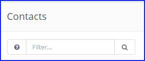
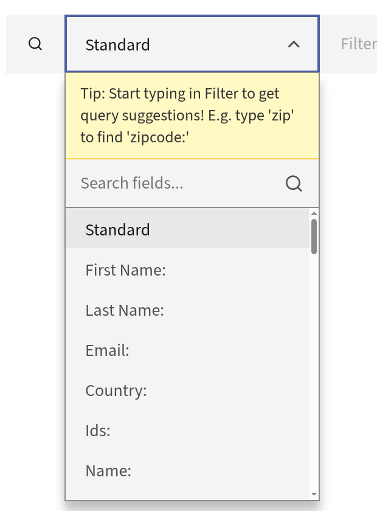
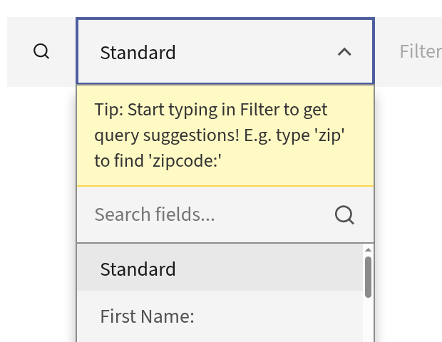

.. vale off

Searching Mautic
################

.. vale on

Search operators and filters
****************************

Mautic offers a variety of search operators and filters for drilling down into relevant resources. You can find the available search filters and operators by clicking on the button with a question mark next to the search input.

The search filters for that entity aren't available if such a button is missing.

   
|

Mautic also has a 'global search' feature. In the top left-hand corner, click the magnifying glass icon next to the Mautic logo/notifications icon. This opens a search input where you can search across multiple different entities.

|

Filter dropdown on list views
=============================

Most list views, including Contacts, Emails, Companies, and Segments, show a dropdown to the left of the filter input. Use it to scope a search to a single field without knowing the underlying query syntax.

|

'Standard' is the default option and keeps the usual free-text search behavior. To search within one field, pick it from the dropdown and type your term in the filter box. Mautic combines the two into the matching search filter. For example, selecting 'First Name' on Contacts and typing ``John`` runs the ``firstname:John`` search.

The available options differ by entity. On Contacts, you can scope to fields such as 'First Name', 'Last Name', 'Email', 'Company', 'Segment', 'Tag', 'Owner', and 'Country', and any Custom Fields you've created appear together under a Custom Fields heading. On Emails, you can scope to fields such as 'Subject', 'Name', 'Language', and 'Category'. Some options, such as ``is:mine`` or ``is:published``, apply on their own the moment you select them, without a typed term.

Choosing a field only changes which field your next term searches. It doesn't change how the search runs. The scoped search still appears in full in the URL, for example ``?search=subject:foo``, so you can bookmark or share a filtered view.

On the Contacts list, the dropdown also reminds you that you can type a filter directly. Start typing in the filter box to see query suggestions. For example, type ``zip`` to find the ``zipcode:`` filter. This helps when the field you want isn't in the dropdown.

|

The fields you select in the dropdown map to the same search filters and operators described in the following sections, so you can always type them directly instead.

Search operators
================

Here are some search operators you can use:

* ``+`` plus sign - Search for the exact string, for example, if you search for ``+admin``, then ``administrator`` won't match.

* ``!`` exclamation mark - Not equals string
  
* ``" "`` double quotes - Search by phrase
  
* ``( )`` parentheses - Group expressions together.
  
* ``OR`` - By default the expressions joins as ``AND`` statements. Use the OR operator to change that.

* ``%`` - Use the % as a wildcard to search for specific names or values in a phrase for example, to find all Companies with the word ‘Technologies’ then type %technologies%
  
Search operators filters
========================

Here are some search filters you can use:

Contacts search filters
-----------------------

.. code-block::
    
    is:anonymous
    is:unowned
    is:mine
    email:*
    segment:{segment_alias}
    name:*
    company:*
    owner:*
    ip:*
    ids:ID1,ID2 (comma separated IDs, no spaces)
    common:{segment_alias} + {segment_alias} + ...
    tag:*
    stage:*
    email_sent:EMAIL_ID
    email_read:EMAIL_ID
    email_queued:EMAIL_ID
    email_pending:EMAIL_ID

Companies search filters
------------------------

.. code-block:: 

    ids:ID1,ID2 (comma separated IDs, no spaces)
    is:published
    is:unpublished
    is:mine
    is:uncategorized
    category:{category alias}

Segments search filters
-----------------------

.. code-block:: 

    ids:ID1,ID2 (comma separated IDs, no spaces)
    is:global
    name:*
    category:category-alias

Assets search filters
---------------------

.. code-block:: 

    ids:ID1,ID2 (comma separated IDs, no spaces)
    is:mine
    is:published
    is:unpublished
    name:*
    is:uncategorized
    category:{category alias}

Forms search filters
--------------------

.. code-block:: 
   
    ids:ID1,ID2 (comma separated IDs, no spaces)
    is:mine
    is:published
    is:unpublished
    has:results
    name:*
    is:uncategorized
    category:{category alias}

.. vale off

Landing Pages search filters
----------------------------

.. vale on

.. code-block:: 

    ids:ID1,ID2 (comma separated IDs, no spaces)
    is:published
    is:unpublished
    is:mine
    is:uncategorized
    is:prefcenter
    category:{category alias}
    lang:{lang code}

.. vale off

Dynamic Content search filters
------------------------------

.. vale on

.. code-block:: 

    ids:ID1,ID2 (comma separated IDs, no spaces)
    is:published
    is:unpublished
    is:mine
    is:uncategorized
    is:prefcenter
    category:{category alias}
    lang:{lang code}

Emails search filters
---------------------

.. code-block:: 

    ids:ID1,ID2 (comma separated IDs, no spaces)
    is:published
    is:unpublished
    is:mine
    is:uncategorized
    category:{category alias}
    lang:{lang code}

Focus Items search filters
--------------------------

.. code-block:: 

    ids:ID1,ID2 (comma separated IDs, no spaces)
    is:published
    is:unpublished
    is:mine
    is:uncategorized
    category:{category alias}

Manage actions search filters
-----------------------------

.. code-block:: 

    ids:ID1,ID2 (comma separated IDs, no spaces)
    is:published
    is:unpublished
    is:mine
    is:uncategorized
    category:{category alias}

Manage triggers search filters
------------------------------

.. code-block:: 

    ids:ID1,ID2 (comma separated IDs, no spaces)
    is:published
    is:unpublished
    is:mine
    is:uncategorized
    category:{category alias}

Stages search filters
---------------------

.. code-block:: 

    ids:ID1,ID2 (comma separated IDs, no spaces)
    is:published
    is:unpublished
    is:mine
    is:uncategorized
    category:{category alias}

Reports search filters
----------------------

.. code-block:: 

    ids:ID1,ID2 (comma separated IDs, no spaces)
    is:published
    is:unpublished
    is:mine
    Categories
    ids:ID1,ID2 (comma separated IDs, no spaces) is:published is:unpublished

Users search filters
--------------------

.. code-block:: 

    ids:ID1,ID2 (comma separated IDs, no spaces)
    is:admin
    is:active
    is:inactive
    email:*
    name:*
    position:*
    role:*
    username:*
    Roles
    ids:ID1,ID2 (comma separated IDs, no spaces)
    is:admin
    name:*

Webhooks search filters
-----------------------

.. code-block:: 

    ids:ID1,ID2 (comma separated IDs, no spaces)
    is:published
    is:unpublished
    is:mine
    is:uncategorized
    is:prefcenter
    category:{category alias}
    lang:{lang code}