.. vale off

Managing Segments
#################

.. vale on

Segments in Mautic are lists or groups of Contacts. Use Segments to send Emails, trigger Campaigns, or for analysis. You can add and remove Contacts from a Segment into *static* and *dynamic* Segment types.

Segments provide ways to easily organize your Contacts. There are a variety of fields available for configuring these Segments.

When viewing all Segments, the **#contacts** column on the right shows the number of Contacts included in that particular Segment.

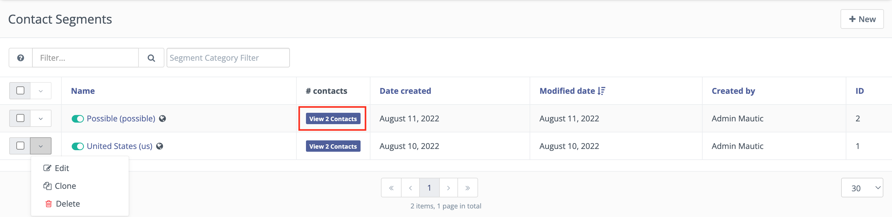

.. note:: 

  Lead lists were renamed to Segments in Mautic :xref:`1.4.0 release`

.. vale off

Creating a Segment
******************

.. vale on

1. To create a new Segment navigate to Segments in the menu, and click the **+New** button.
   
2. In the **Details** tab, add a **Name**, **Public name** and **Description** to your Segment.

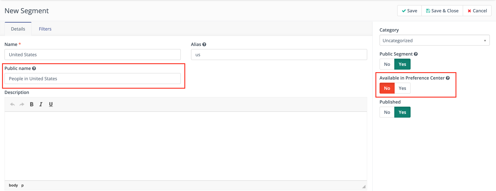

* **Public Segment** - This option determines if the Segment is available for all Users to see and use, or only the User who created the Segment.

* **Available in Preference Center** - If set to **Yes**, Contacts can see and opt into or out of the Segment on a **Preference Center** page. The Segments display if the Preference Center has the **Segment List** slot type.

* **Published** - If set to **No**, the Segment won’t be available for use in filters for other Segments, as a Contact source in Campaigns, modify Segment actions, etc. You’ll still see the Segment in your **Segment list**, but it essentially won’t exist anywhere else in Mautic.

On the Details tab, static, and dynamic Segments also have the option to display a different public name for a Segment.

* **Public name** - Users can set a different name for the Segment, which is visible to Contacts in Preference Center options.

Since :xref:`Mautic 3.2` it has been possible to provide a public name, in addition to an internal name, for a Segment.

.. vale off

Viewing and exporting Contacts in a Segment
===========================================

.. vale on

When viewing all Segments the **#contacts** column on the right shows the number of Contacts included in that particular Segment.

To view Contacts in a specific Segment, click **View X Contacts** from your Segment list or in the Contacts section of Mautic, enter ``segment:segment-alias`` in the search bar.

.. vale off

Static Segments
***************

.. vale on

Static Segments aren’t filter-based. Adding Contacts to a Segment in done in one of the following ways:

.. vale off

Manually moving Contacts
========================

.. vale on

The two manual options to move a Contact into a static Segment are:

.. vale off

Batch updating Contacts
-----------------------
  .. vale on

1. Use search filters in the Contacts section of Mautic to find the Contacts to change.

2. Select the checkboxes next to those Contacts.

3. Click the green arrow which appears at the top of the column.

4. Select **Change Segments** from the list.

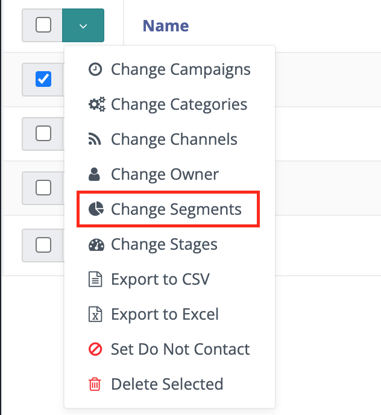

5. Choose the **Segments** to add or remove Contacts from.

6. Click **Save**.

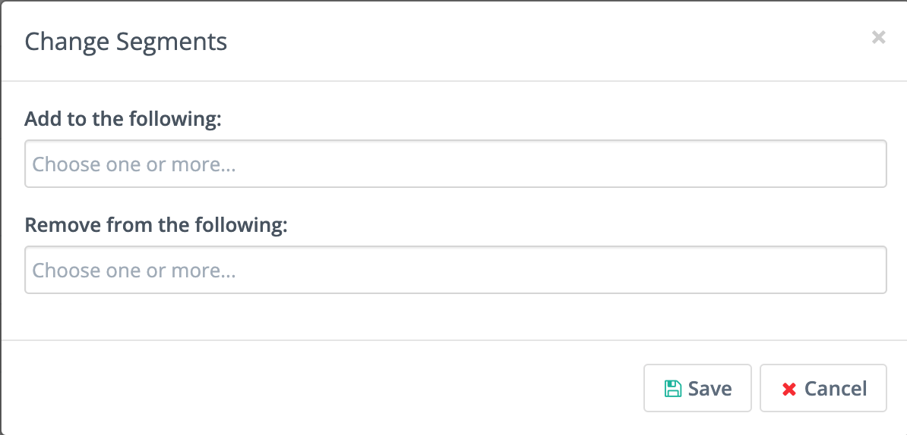

.. vale off

Adding individual Contacts
--------------------------

.. vale on

1. Navigate to the Contact record you want to change.
  
2. Click the arrow in the top right, next to **Edit/Send Email/Close**.

3. Select **Preference**.

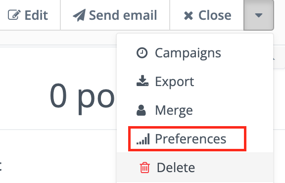

4. Click **Segments**.

5. Choose the Segments you’d like to add the Contacts to or remove Contacts from.

6. Click **Save**.

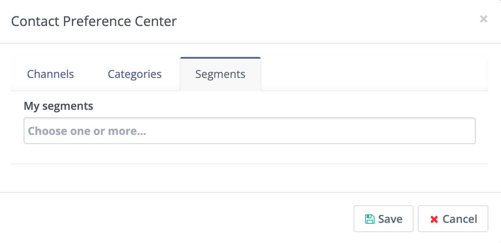

.. vale off

Campaign action
===============

.. vale on

Inside a :ref:`Campaign<campaigns overview>`, you can add or remove Contacts from Segments using the **Modify Contact’s Segment** action. To add Contacts to a Segment, you must have already created the Segment and set it to **Public Segment = Yes**.

1. In the Campaign builder, click the bottom connector.

  .. image:: images/campaign-builder-connector.png
    :alt: Screenshot Campaign builder connector.

2. Select **Action**.
   
3. In the list of actions, select **Modify Contact’s Segments**.

4. Choose from the list of existing Segments you want to add or remove your Contact from.

  .. image:: images/modify-segments.png
    :alt: Screenshot showing list of existing Segments.

5. Click Save and close.

.. vale off

Form submit action
==================

.. vale on

**Modify Contact’s Segment** is available as a submit action on :ref:`Standalone Forms<creating a new form>`. With a Campaign Form, create a Campaign with a **Modify Contact’s Segment** action.

1. Click **Actions**.

2. From the **Add new submit action** menu, select **Modify Contact’s Segments.**

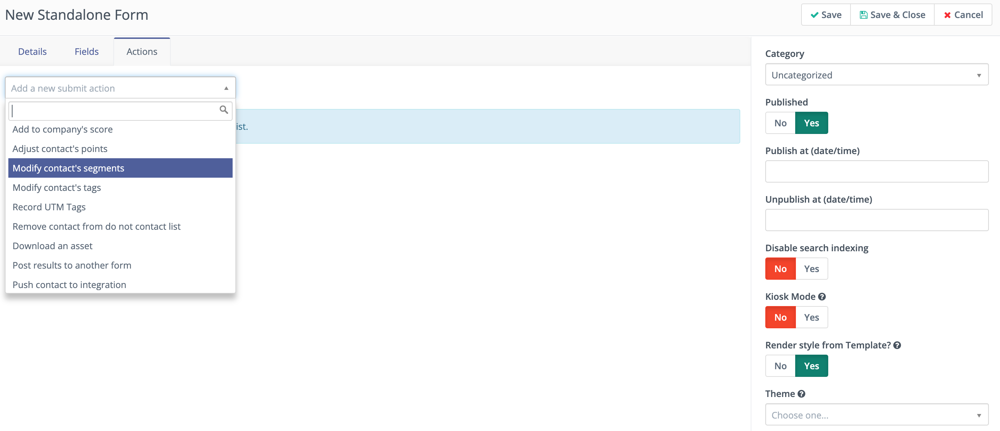

3. Add a Title for the submit action and add a **Description** (optional).

4. Select the Segments you’d like to add the Contact to or remove the Contact from.

5. Click **Add**.

.. vale off

Points trigger
==============

.. vale on

Once a Contact has accrued an assigned number of Points, the system can add them to a Segment. This may be a Segment for your most engaged Contacts who become eligible for special offers, or a Segment your sales team reviews to find strong prospects.

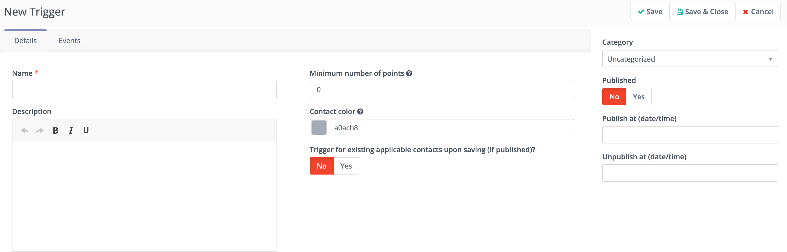

1. In the **Points** section of the platform, select **Manage Triggers**.

2. Click **+New**.

3. Give your trigger a **Name** and **Description**.

4. Enter the **Minimum number of Points** for adding a Contact to your Segment.

5. Decide if you’d like to add all Contacts with at least that number of Points to the Segment:

.. tip:: 
     
    * If you only want to add new Contacts who reach the threshold to this Segment, select **No** (default).
    
    * To add all existing Contacts with at least a certain number of Points to the Segment, toggle the switch to **Yes**.

6. Click **Events**.

7. Click the menu for **Add an event** and select **Modify Contact’s Segments**.

8.  Add a **Title** for the event and a **Description** (optional).

9.  Select the Segments you’d like to add to or remove the Contact from.

10. Click **Add**.

11. Click **Save & Close**.

This accomplishes the same thing as creating a Dynamic Segment with a filter for Points, the operator ``greater than (or equal to)``, and the minimum number of Points. The difference is if you only want to add Contacts to a Segment who reach the point value after creating this trigger to a Segment, you can.

.. vale off

CSV upload
===========

.. vale on

If you have a list outside of Mautic, saved as a UTF-8 encoded CSV file, you can upload the list directly into a Mautic Segment.

1. Click **Contact**.

2. Click the menu in the upper-right hand corner and select **Import**.

3. Ensure the file is in a UTF-8 CSV format. Select your file then click **Upload**.

4. At the top of the next screen, select the Segment you want to add the Contacts to.

5. Map the appropriate fields from the file. Remember to always map the unique identifier, so you don’t create duplicates.

6. Click **Import**.

If your file is larger than 1,000 rows, the system changes screens and informs you once the file has uploaded. After the upload is complete, click the Segments section of the platform to see the added Contacts.

.. vale off

Dynamic Segments
****************

.. vale on

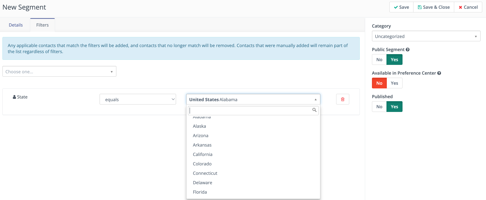

Mautic moves Contacts into and out of dynamic Segments based on the filters applied to the Segment. As the data associated with the Contact updates, including Company associations and behaviors, Mautic updates Segment membership.

Segment filters
===============

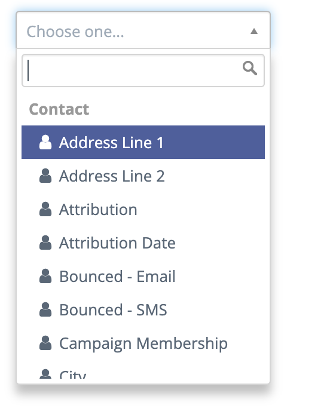

1. Create a new Segment by clicking the **+New** button.

2. In the **Details** tab, add a **Name**, **Public name** and **Description** to your Segment.

3. Click the **Filters** tab to add filters.

4. Click the **Choose one**… menu and search for the field you’d like to Segment by. 

.. attention:: 

  Listed below are three types of fields:

  * Contact fields
  
    * Set Fields to **Available for Segments = Yes** in your Custom Field manager to display here.

  * Contact behavior and actions
  * Primary Company fields
    
    * Set Fields to **Available for Segments = Yes** in your Custom Field manager to appear here.
    
    * Contacts associates with multiple Companies, but Mautic adds them to Segments based on fields for the primary Company.

5. Add more filters, using the **And** and **Or** operators. An **Or** operator creates a new group of filters which can include And operators.

6. Click **Save and close**.

.. note:: 
    
    Segments are rebuilt according to how frequently you fire your :ref:`cron jobs<segment cron jobs>`.

    * If a Segment fails to rebuild for a predetermined length of time, Mautic displays a notification alerting you of an error. For information on defining this time period, see Segment settings 
    * The include/exclude operators with pipe-separated values are supported in the Text field types in Segment filters. The values can also be pasted from the spreadsheet.

.. vale off

Using Date Filters
==================

.. vale on

You can create dynamic Segments by using date filters.

.. note:: 
  
  The date format for values stored in the database is ``YYYY-MM-DD``. For example, December 11, 2020 is stored as 2020-12-11 and November 12, 2020 is stored as 2020-11-12. To update the display format for dates, go to **Settings > Configuration > System Settings > System Defaults**. However, this doesn’t alter the format in which dates are stored in the database.

.. vale off

Operators
=========

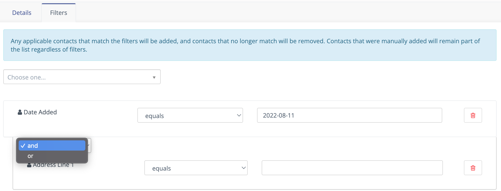

.. vale on

You must ensure that you use the correct operator and time frame to build an effective Segment.

Once you’ve selected a date field as your filter, such as the default **Date last active** field or a custom **Birthday** field, you’ll have a list of operators to choose from:

* **Equals** - The value on the Contact record exactly matches the filter value.

* **Not Equal** - The value on the Contact record is any value that doesn’t match the filter value.

* **Greater than** - The value on the Contact record is at a later date in time than X date. For example, ``Greater than`` today means anytime from tomorrow until the end of time.

* **Greater than or equal** - The value on the Contact record is either at a later date in time than or including X date. For example, ``Greater than or equal`` today means anytime from today until the end of time

* **Less than** - The value on the Contact record is at an earlier date in time than X date. For example, ``Less than today`` means anytime from the beginning of time until yesterday.

* **Less than or equal** - The value on the Contact record is at an earlier date in time than X date. For example, ``Less than or equal today`` means anytime from the beginning of time until today.

* **Empty** - No value exists in the field on the Contact record.

* **Not empty** - A value exists in the field on the Contact record.

* **Like** - This operator isn't supported in date or date-time fields, and shouldn’t be used.

* **Not like** - This operator isn't supported in date or date-time fields, and shouldn’t be used.

* **Regexp** - Segment includes Contacts with values that match the specified regular expression pattern. If you aren't proficient with regular expression, don’t use this operator.

* **Not regexp** - Segment includes Contacts with values that don’t match the specified regular expression pattern. If you aren't proficient with regular expressions, don’t use this operator.

* **Starts with** - Segment includes Contacts whose field values begin with the specified numbers. These filter values should generally reference years (or years and months).

  *For example, A value of 19 matches any Contacts whose field value has a year in the 1900s. A value of 200 matches Contacts with a year value between 2000 and 2009 and a value of 2020-11 matches Contacts with a field value in November 2020.*

* **Ends with** - Segment includes Contacts whose field values end with the specified numbers. These filter values should generally reference days (or months and days).

  *For example, A value of 1 matches anyone whose field value is on the 1st, 21st, or 31st of any month but a value of 01 matches the 1st of a month. A value of 01-01 finds Contacts whose value is for January 1 of any year.*

* **Contains** - Segment includes Contacts with the specified filter value anywhere in the field value. 

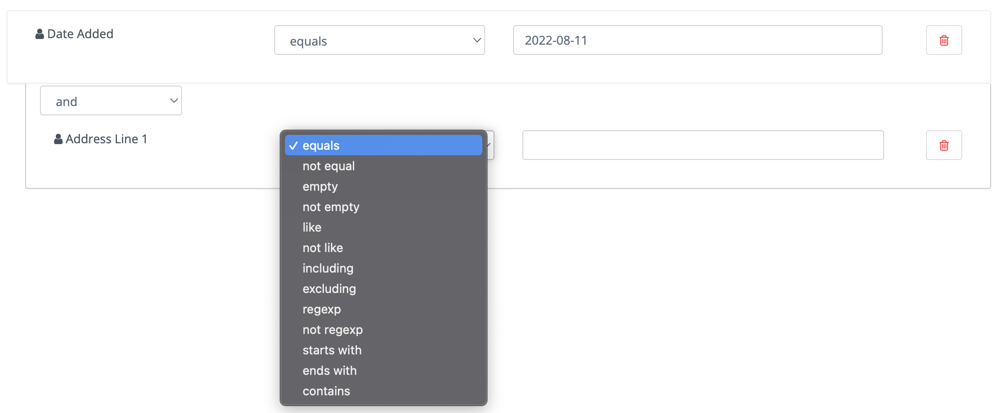

Once you have selected the field you can then choose the type of operation to perform. These vary depending on the way you wish to filter your Contacts.

.. vale off 

Matching part of a string
=========================

.. vale on

There are 5 filters you can use for matching part of a string - ``starts with``, ``ends with``, ``contains``, ``like`` and ``regexp``.
First three filters match strings as you enter it. ``like`` filter is for advanced Users - you can specify which type you want to use with ``%`` character:

* ``My string%`` is the same as ``starts with`` filter with ``My string`` value.

* ``%My string`` is the same as ``ends with`` filter with ``My string`` value.

* ``%My string%`` is the same as ``contains`` filter with ``My string`` value.

* ``My string`` is the same as ``contains`` filter with ``My string`` value.

A few notes for text filters:

* ``starts with``, ``ends with``, ``contains`` filters should be used rather than ``like`` as they're more specific, and therefore can be more effective.
  
*  A ``%`` character in the middle of the string has no special meaning. A ``contains`` filter with ``my % string`` will search for a string with ``%`` in the middle. The same is TRUE for a ``like`` filter with ``%my % string%`` value. There is no need to escape this character.

* Mautic searches for the ``%`` character in a value for the ``like`` filter and no modification is performed if at least one ``%`` is found.

You can use regular expressions in a ``regexp`` filter. Mautic recognises all common operators like ``|`` for OR (``first string|second string``), character sets (``[0-9]``, ``[a-z0-9]`` etc.), repetitions (``+``, ``*``, ``?``) and more. 
You have to escape special characters with ``\`` if you want to use them as matching character. 
Learn more about :xref:`Regex`. 

.. note:: 

  MySQL (and Mautic) uses POSIX regex, which could behave differently from other types of Regex.

.. vale off

Date options
============

.. vale on

Date filters allow you to choose a date via DatePicker:

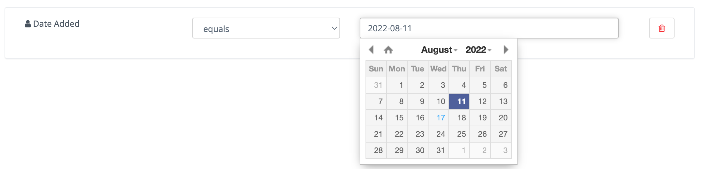

However, you can specify much more here. Mautic recognizes relative formats too (these string aren't translatable):

* ``+1 day`` (you can also use ``1 day``)
* ``-2 days`` (you can also use ``2 days ago``)
* ``+1 week`` / ``-2 weeks`` / ``3 weeks ago``
* ``+5 months`` / ``-6 months`` / ``7 months ago``
* ``+1 year`` / ``-2 years`` / ``3 years ago``

Example (Consider that today is ``2022-03-05``):

* ``Date identified equals -1 week`` returns all Contacts identified on 2022-02-26.
* ``Date identified less than -1 week`` returns all Contacts identified before 2022-02-26.
* ``Date identified equals -1 months`` returns all Contacts identified on 2022-02-05.
* ``Date identified greater or equal -1`` year returns all Contacts identified 2021-03-05 and after.
* ``Date identified greater than -1`` year returns all Contacts identified after 2021-03-05.
  
Beside this you can specify your date with text. These formulas are **translatable**, so make sure you use them in correct format.

* ``birthday`` / ``anniversary``
* ``birthday -7 days`` / ``anniversary -7 days``
* ``today`` / ``tomorrow`` / ``yesterday``
* ``this week`` / ``last week`` / ``next week``
* ``this month`` / ``last month`` / ``next month``
* ``this year`` / ``last year`` / ``next year``

Example (Consider that today is ``2022-03-05``):

* ``Date identified equals last week`` returns all Contacts identified between 2022-03-01 and 2022-03-07 (Monday - Sunday).
* ``Date identified less than last week`` returns all Contacts identified before 2022-02-22.
* ``Date identified equals last month`` returns all Contacts identified between 2022-02-01 and 2022-02-28.
* ``Date identified greater or equal last year`` returns all Contacts identified 2021-01-01 and after.
* ``Date identified greater than last year`` returns all Contacts identified after 2021-12-31.
* ``Custom Contact date field equal birthday -1 day`` returns all Contacts identified every year on 03-04 (4th march).
* ``Custom Contact date field equal anniversary -1 month`` returns all Contacts identified every year on 02-04 (4th february)

Once you have created your Segment, any applicable Contact will be automatically added through the execution of a :ref:`cron job<import contacts cron job>`. This is the essence of Segments.

To keep the Segments current, create a cron job that executes the :ref:`command<segment cron jobs>` at the desired interval.

Through the execution of that command, Mautic adds Contacts that match the filters and removes Contacts that no longer match. Any Contacts that were manually added will remain part of the list regardless of filters.

.. vale off

Delete all Contacts in a Segment
********************************

.. vale on

It's possible to delete all Contacts in a Segment manually rather than with a Campaign action. To do this, first create a Segment with filters that picks up all the Contacts you want to delete.

This is a performance precaution since deleting more Contacts at one time could cause issues. You can, however, delete multiple batches of 100 Contacts to delete larger lists.

1. Select the checkboxes next to those Contacts.

2. Click the green arrow which appears at the top of the column.

3. Select **Delete Selected** from the list.

4. Click **Delete**.

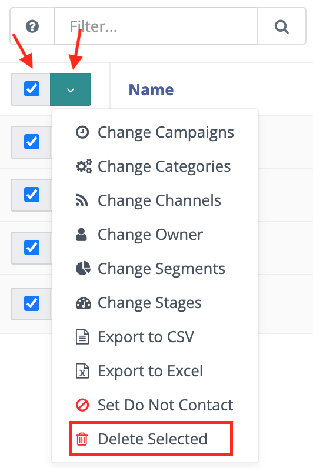

Deleting thousands of Contacts this way in one Segment becomes a tedious task. Luckily, there is a trick how to let the background workers do the job for you.

1. Create a simple Campaign which has the Segment as the source

2. Use the :ref:`Delete contact action<using the campaign builder>`.

This way the ``mautic:campaign:update`` and ``mautic:campaign:trigger`` commands delete all the Contacts in the Segment, and all the Contacts added to the Segment in the future. 
It's all done automatically in the background.
It's necessary to configure the :ref:`cron jobs<segment cron jobs>`.

.. danger:: 

 Deleted Contacts can't be recovered.

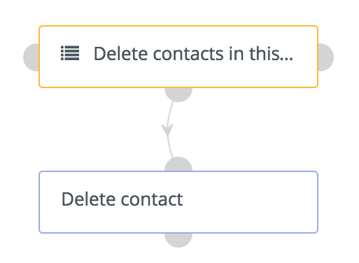

.. vale off

Deleting or unpublishing a Segment
**********************************

.. vale on

Since :xref:`Mautic 4` there is a check when deleting or unpublishing a Segment to ensure that it's not required as a filter by an existing Segment.

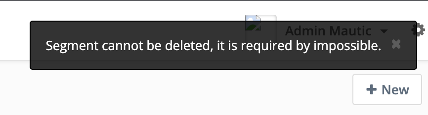

If you attempt to delete or unpublish a Segment which is in use by a filter in another Segment, before you delete the Segment, you get an alert message informing you that it needs to be edited.