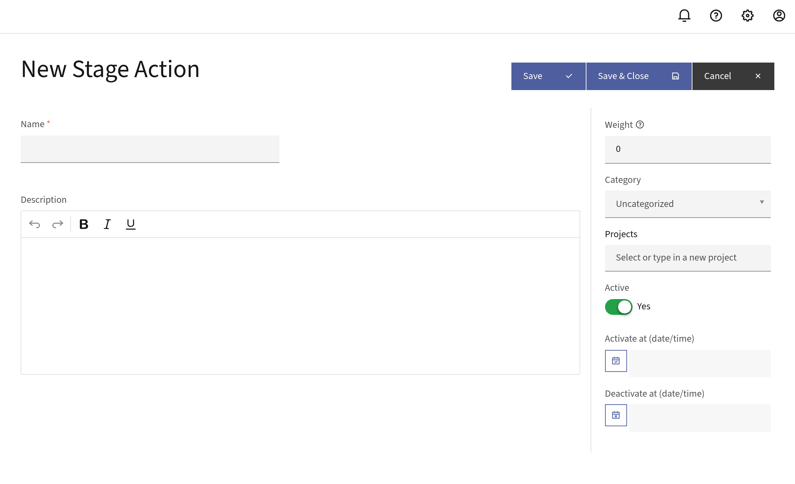
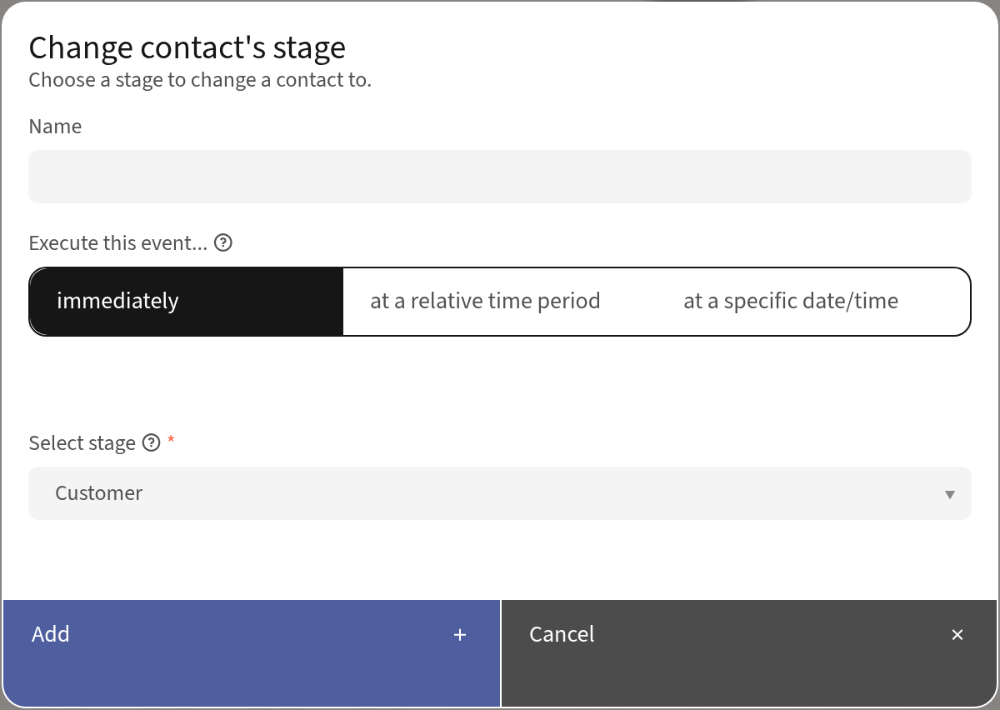
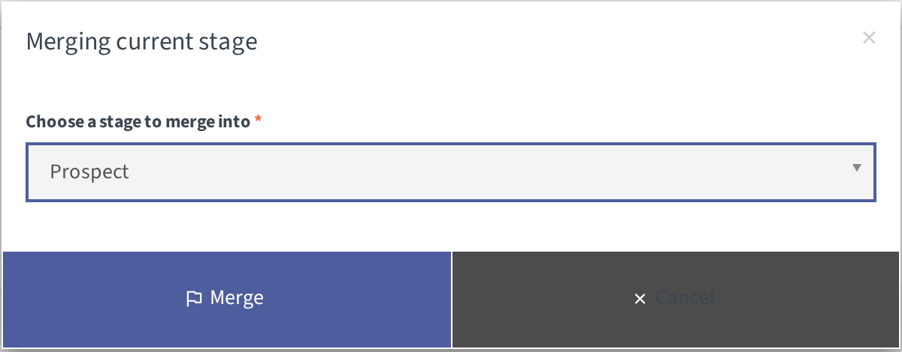
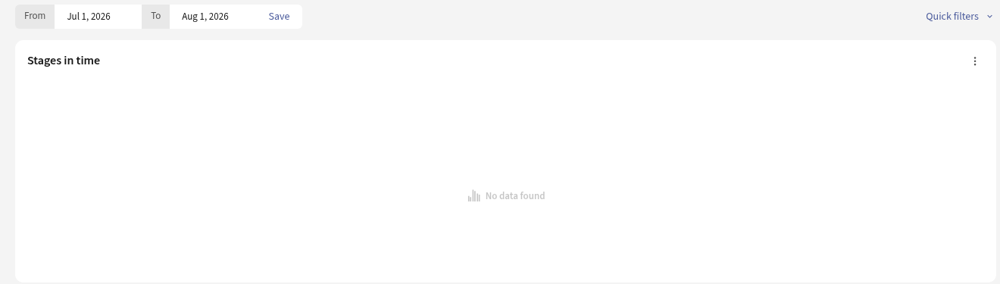

Stages
######

Mautic Stages provide a means for Users to track and manage the progress of their Contacts through the various phases of the marketing lifecycle or funnel. 

By categorizing Contacts into different Stages, you can better understand their engagement with the brand and tailor your marketing strategies accordingly. 

Once you have created your Stages, you can easily move Contacts from one Stage to another based on their behavior or other criteria. 

.. vale off

Creating Stages
***************

.. vale on

Navigate to the **Stages** section in the left side menu, and then click **+New**.

   
|

**Name** - While most Companies have similar Stage structures, each Company uses them differently. Come up with the Stages you want to track different parts of your marketing funnel with.

**Description** - To help you and other Users easily identify what qualifies a Contact for that Stage, it's recommended to add a description.

**Weight** - Determines the progression of your Stages. The higher the weight number, the further along in the funnel a Contact is. Contacts can't move backwards to Stages with lower weights. Each Stage must have a unique weight. When creating or editing a Stage, a reference table shows existing Stages and their weights to help you choose an available value. If you enter a weight that's already in use, Mautic displays a validation error.

**Category** - Assign a Category to help you organize your Stages. For more information, see :ref:`categories`.

**Activation options** - The dashboard widget doesn't display data for an inactive Stage. In addition, the Segment filters or Campaign conditions don't display the Stage. To avoid using the Stage while building it, set a future activation date and time. If you want the Stage to become unavailable after a certain time, set the date and time for deactivating.

.. vale off

Moving Contacts between Stages
******************************

.. vale on

Moving Contacts between Stages requires a Campaign action. 

Depending on how you define your Contact lifecycle and Stages, there may be different triggers for a Contact to move between Stages. Examples include behaviors within a Campaign, or moving between Segments which have criteria set up for each Stage. 

In any Campaign where you want to have Contacts move between new Stages:

   
|

1. Add a new **Action**.

2. Select **Change Contact's Stage** as the action type.

3. Select the Stage you want to move the Contacts to. You can base this on a prior event, or on a Segment that Contacts are in based on filters matching your requirements for a Stage.

For more information on setting up Campaigns, see :ref:`triggering campaign events`

.. note:: 

    You can have multiple funnels with different Stages, and multiple Stages across those funnels with the same weight. A Contact can only ever be in one Stage at a time. It's not possible to move a Contact to a Stage which has a lesser weight than their current Stage. For example if they're currently in Stage B which has a weight of 50, you can't move them to Stage A which has a weight of 25. 

.. vale off

Merging Stages
**************

.. vale on

If two Stages serve the same purpose, you can merge one into the other. Merging moves every Contact from the merged Stage into the Stage you choose, transfers the related Stage history, and then permanently deletes the merged Stage.

Merging a Stage requires both edit and delete permissions for Stages. Without both, the **Merge Stage** doesn't appear in the **Options** menu.

.. vale off

#. Navigate to the **Stages** section in the left side menu.
#. Find the Stage you want to merge into another, and then click the three-dots icon to open the **Options** menu.
#. Select **Merge Stage**.

   .. image:: images/merge_stage_option.png
      :align: center
      :alt: Options menu open on a Stage row showing Edit, Clone, Merge Stage, and Delete, with Merge Stage highlighted

   |

#. In the **Merging current stage** window, use the **Choose a stage to merge into** dropdown to select the target Stage.
#. Select **Merge** to complete the merge, or **Cancel** to close the window without making any changes.

.. vale on

|

Mautic confirms the merge with the message **Stage 'name' was successfully merged into 'target'**.

.. warning::

   Merging a Stage can't be undone. Mautic reassigns every Contact from the merged Stage to the target Stage, moves the related Stage change history, and then permanently deletes the merged Stage.

.. vale off

Visualizing Stage movement
**************************

.. vale on

The Mautic dashboard features two widgets to help Users see how Contacts are moving between Stages.

   
|

The Stages in time widget shows how often Contacts change Stages. More change indicates more velocity through your funnel.

Lifecycle
*********

The lifecycle widget enables marketers to see the number of Contacts within a specified Segment in each Stage. You may include multiple Segments on the widget. It's possible to have more than one lifecycle widget to break down the information into separate graphs, but still display the data on the dashboard for multiple Segments.