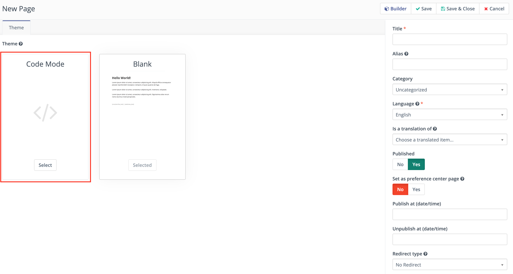

.. vale off

Code mode
##########

.. vale on

Code Mode is an option available in the Email and Landing Page edit Form. It allows you to create/insert/edit your content in HTML code. It's helpful for situations where you don't want to use a Mautic Theme and you want to use an HTML Theme copied from a ``3rd`` party Theme builder or if you enjoy editing HTML code so much.

With Mautic 2.3.0, Code Mode replaced the full-page Froala (WYSIWYG) editor that sometimes altered the HTML code. Code Mode won't modify any of the code you paste in. The other option to edit a page/email content is to use the Builder. It uses Froala editor only to edit the text/image content, not the full page, so that it won't modify the page layout.

Select the Code mode
********************

After creating or editing the page/email, you can select the Code Mode from the Theme selector. To open the Code Mode Builder, click the Builder button after selecting the Code Mode Theme option.

Limitations
===========

If you use a Mautic Theme to create the page/email and you want to edit the HTML code of it in the Code Mode Builder, you can do so, but you can't switch back to the Theme again. Code Mode Builder requires editing of all content. Selecting a Theme refreshes the content to the default Theme HTML, so you'll lose your modifications.

.. vale off

Edit the HTML content in the code mode Builder
==============================================

.. vale on

In the Code Mode Builder, you can see the preview on the left and the HTML code editor on the right. As soon as a change is made to the code, the preview automatically updates every 10 seconds.

Mautic tokens
=============

You can use the tokens in the Code Mode Builder when you type them directly. For example when you type ``{contactfield=firstname}`` or you can select them from the dropdown. The dropdown opens when you press ``CTRL`` + ``SPACE BAR``. You can type to search for the token you wish to insert.

.. image:: images/code-mode-builder.png
    :width: 600
    :alt: Screenshot of Code mode builder

Media manager
=============

There is a button at the top of code area where you can open the Media Manager to upload and/or select an image or other file. When you select a file, the URL of that file appears at the cursor position. Use this to create links and ``IMG`` tags.

Code formatter
==============

It might happen that your older Emails or Landing Pages appear as HTML code on one line or if you insert an HTML code with odd formatting, use the Format Code button. It automatically goes through the code and Format it so it's easier to navigate in it.

