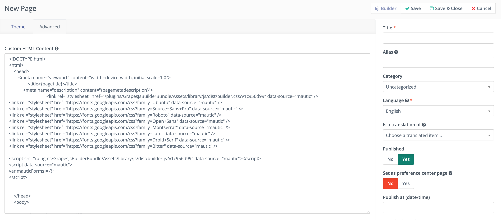

.. vale off

Code mode
##########

.. vale on

Code Mode is an option available in the Email and Landing Page edit Form. It allows you to create/insert/edit your content in HTML code. It's helpful for situations where you don't want to use a Mautic Theme and you want to use an HTML Theme copied from a third party Theme builder, or if you prefer editing HTML code directly.

The other option to edit Landing Page/Email content is to use the built-in drag-and-drop GrapesJS Builder. Read more in the :doc:`/builders/email_landing_page` section.

Select the Code mode
********************

If you want to work with existing HTML, select code mode from the Theme selector. To open the code mode Builder, click the advanced tab which appears.

Limitations
===========

If you use a Mautic Theme to create the Landing Page/Email and you subsequently want to edit the HTML code, you should think carefully about doing this.

Once you switch from a Theme to Code Mode, content becomes HTML and you can't switch back to the Theme again. 

Selecting a Theme replaces the content with that of the default Theme, so you'll lose your modifications. 

Instead, to make small code changes to an existing Theme, it's recommended to use the code mode built into the GrapesJS Builder.

.. image:: images/theme-list.png
    :width: 600
    :alt: Screenshot of code mode

.. vale off

Edit the HTML content in the code mode Builder
==============================================

.. vale on

In code mode, you can see the HTML content in the text area under the Advanced tab. There is no preview at this time.

Mautic tokens
=============

You can use the tokens in the code mode Builder by typing them directly into your code. For example when you type ``{contactfield=firstname}``.