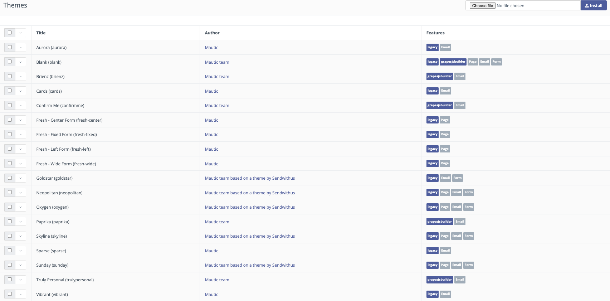
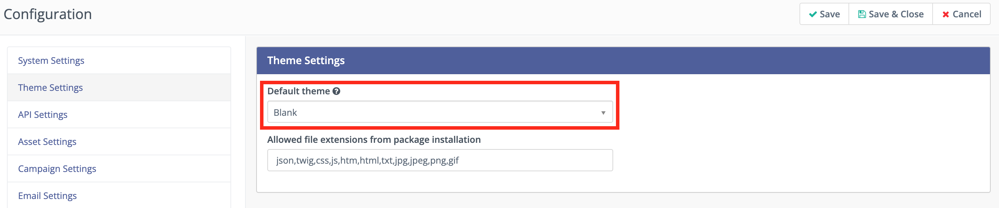
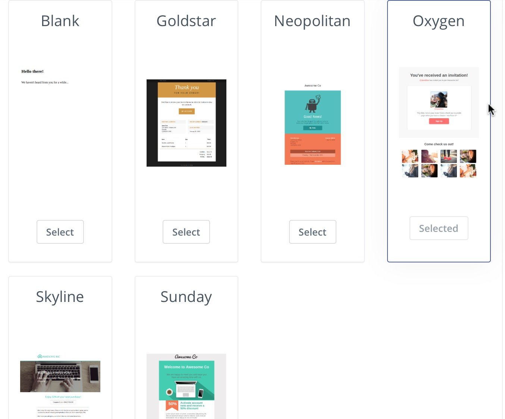

.. vale off

Manage Themes
#############

.. vale on

Themes control the look and feel of the Mautic Landing Pages, Emails, Forms and Message screens. 

A basic Mautic installation comes pre-packaged with a number of Themes for you to use 'as-is' or adapt to suit specific projects. 

It's also possible to :xref:`create a Theme` for Mautic from scratch.

Access the Theme Manager via the Admin Menu. Click the cog icon in the top right corner to open it and select the Theme menu item.

The Themes section displays the list of Themes with the following details:

**Title** - The name or title of the Theme.

**Author** - The name of the author or creator of the Theme.

**Feature** - The list of features and Builders that the Theme supports.

This list of Themes appears as selectable options in Forms, as this allows you to provide styling for Forms. 

Additionally, you can edit and customize Themes in the Email and Landing Page builders to meet your needs. 

With the Email and Landing Page builders, you can start from a template and build your own variations using the drag-and-drop Builder. For more information, see :doc:`Email builder</builders/email_landing_page>` and :doc:`Landing Pages</components/landing_pages>`.

.. vale off

Installing a Theme
******************

.. vale on

It's necessary to install a new or edited Theme as a zip package. The zip package must have the same structure as the preinstalled Themes and the config.json file must be present in the root folder of the zip package. The :xref:`themes developer documentation` contains more on that.

.. note:: 

    You must select and zip all the files when creating the zip package. Ensure that you don't zip the files within a folder, otherwise the Theme won't install.

You can build and install your own Forms Theme using Twig, and you can also install BeeFree templates as Themes.

To install a Theme:

1. Log in to Mautic.

2. Click the **Settings** icon.

3. Click **Themes**.

4. On the Themes section, in the top-right corner, click **Choose file**.

5. Browse and select the Theme.

6. Click **Install**.

.. vale off

Deleting a Theme
****************

.. vale on

To delete a User-created Theme:

1. Log in to Mautic.

2. Click the **Settings** icon.

3. Click **Themes**.

4. In the Themes section, locate the Theme that you want to delete.

5. Select the drop-down before the Theme, and click **Delete**.

6. In the confirmation dialog box, click **Delete**.

.. vale off

Previewing a Theme
******************

.. vale on

To preview a Theme:

1. Log in to Mautic.

2. Click the **Settings** icon.

3. Click **Themes**.

4. In the Themes section, locate the Theme that you want to preview.

5. Select the drop-down before the Theme, and click **Preview**.

6. Mautic displays the preview of the Theme.

.. vale off

Hiding a Theme
******************

.. vale on

Users can't remove defautl Themes, but they can hide them from the list of Themes in the Email and Landing Page builders.

To hide a Theme:

1. Log in to Mautic.

2. Click the **Settings** icon.

3. Click **Themes**.

4. In the Themes section, locate the Theme that you want to hide.

5. Select the drop-down before the Theme, and click **Hide**.

6. Mautic moves the Theme to the bottom of the table and show it in grey. This means the Theme is hidden in the builders.

To revert this change open the context menu of the hidden Theme and click **Unhide**.

.. vale off

Downloading a Theme
*******************

.. vale on

To download a Theme:

1. Log in to Mautic.

2. Click the **Settings** icon.

3. Click **Themes**.

4. In the Themes section, locate the Theme that you want to download.

5. Select the drop-down before the Theme, and click **Download**.

Upon downloading a Theme on your local machine, you can modify it following the structure outlined in the :xref:`create a Theme` section of the Developer Documentation before reinstalling it for use in your instance.

.. vale off

Update an old Theme
*******************

.. vale on

Mautic overwrites old Theme files when installing a Theme which already exists in Mautic. Therefore, the Theme updates can be also done by uploading the Theme with the new changes.

Pre-installed Themes can't be overwritten, because the changes would return again after a Mautic update. If you want to change these Themes, download them and modify them to create a new, custom Theme, as outlined previously.

.. vale off

Assigning a default Theme
*************************

.. vale on

You can assign your Mautic instance a default Theme for Landing Pages. Then use the Landing Page Builder to fill in the content for each new Landing Page you create.

.. note:: 

    Changing the Theme after building the Landing Page may cause content to not display if the two Themes don't use the same placeholders.

To assign a default Theme:

1. Log in to Mautic.

2. Click the **Settings** icon.

3. Click **Configuration**.

4. Click Theme **Settings**.

5. From the dropdown menu, select the Theme that you want to use as default.

6. Click **Save & Close**.

Themes are available to select for Emails and Landing Pages when creating them - this setting pre-selects the Theme chosen by default.

