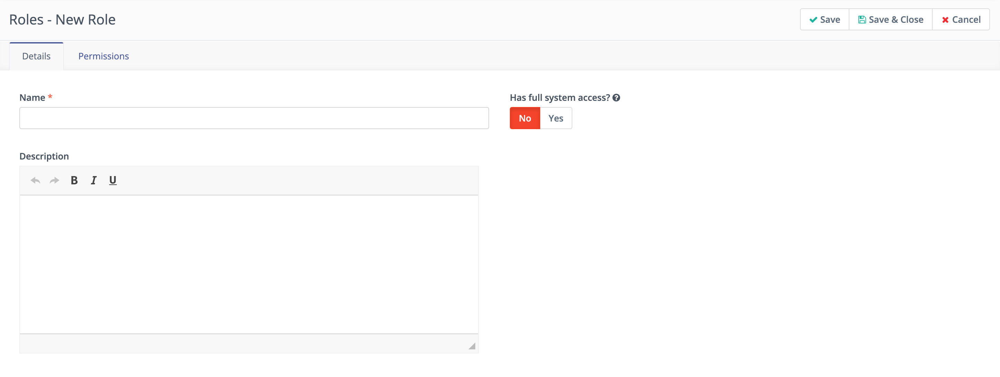
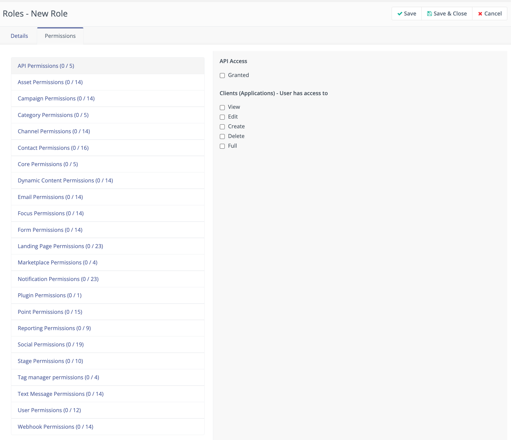

Roles
#####

You can control access to Mautic instances by creating accounts for Users and associating them with a Role.

:doc:`Users</users_roles/managing_users>` are the accounts an individual uses to access Mautic, whereas :ref:`Roles<roles>` allow or deny access to various features within Mautic.

Mautic uses Roles to control which resources and actions Users can access. When team members have different responsibilities, you may not want some team members working in certain parts of Mautic. 

By default, Mautic creates new Users with the Administrator Role with full system access. You can change that when manually creating a User, or select a different Role when importing a User by API.

.. vale off

Creating a new Role
*******************

.. vale on

Full system access
==================

If you select **Yes** on the **Full System Access** switch, you are creating an Administrator account which has the highest level of access to your Mautic instance.

1. Navigate to **Settings** > **Roles**.

2. Click **+New** in the top right corner.

3. In the **Details** tab, add a **Title** and **Description**.

4. Select **Yes** on the **Full System Access** switch.

5. Click **Save & Close**

Limit these accounts, and ensure that their credentials are secure.

If you select this option, you won't be able to configure anything under **Permissions** because by default, this account has full access to everything.

Setting granular permissions
============================

Mautic allows you to create Roles with granular permissions for each bundle - or part - of Mautic.

To configure a Role, leave the **Full System Access** switch at **No** and click the **Permissions** tab to start building the Role.

1. Navigate to **Settings** > **Roles**.

2. Click **+New** in the top right corner.

3. In the **Details** tab, add a **Title** and **Description**.

4. Click the Permissions tab. The list of User permissions displays.

5. Most permission Categories have options for **View**, **Edit**, **Create**, **Delete**, and **Active**. Select checkboxes for the appropriate permissions for this Role. To select every checkbox and grant the User all permissions, select the **Full** option.

Explaining the permission options
~~~~~~~~~~~~~~~~~~~~~~~~~~~~~~~~~

There are several options for selecting permissions:

* **View** - this allows the Users with this Role to view this part of Mautic

* **Edit** - this allows the Users with this Role to make changes to this part of Mautic

* **Create** - this allows the Users with this Role to create new resources in this part of Mautic

* **Delete** - this allows the Users with this Role to delete resources in this part of Mautic

* **Activate** - this allows the Users with this Role to make resources in this part of Mautic available by activating them

* **Full** - this allows the Users with this Role all of the permissions.

There are permission levels relating to resources the User has created themselves, and those created by others:

* **Own** - this allows the Users with this Role to ``view/edit/delete/activate`` their own resources in this part of Mautic, but not those created by others

* **Others** - this allows the Users with this Role to ``view/edit/delete/activate`` their own resources in this part of Mautic, and those created by others

There are permission levels relating to being able to manage resources:

* **Manage** - this allows the Users with this Role to manage resources in this area of Mautic for example, managing Custom Fields or Plugins.

There are permission levels relating to the editable fields in the Users section:

* **Specified fields** - allow or deny the Users with this Role to edit specified fields in the Users section for example, Name, Username, Email, Position.

* **All** - this allows the Users with this Role to edit all fields relating to the Users section

Since Mautic 5.1 there is an additional permission relating to allowing Users of Mautic to export information. You can set this permission within the Contact, Forms, and Reports Permissions. If this permission isn't set, the User won't see the options for, or be able to export, information - such as lists of Contacts, Form submissions and Report data - from Mautic.

.. note:: 

  User permissions restrict their view of dashboard widgets, resulting in them only seeing widgets for items or feature bundles they have permission to see. 
  
  For example, if a User's Role doesn't have Asset permissions, they can't create or view widgets on the dashboard for Asset data.

You can also :xref:`create Roles using the API`.