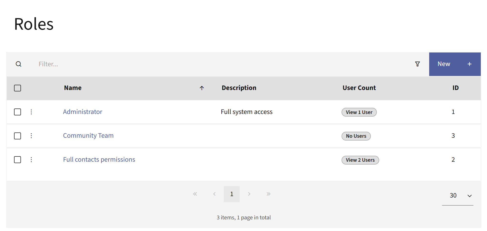
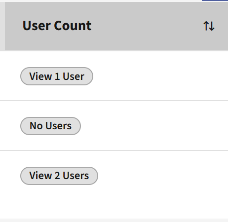

Roles
#####

You can control access to Mautic instances by creating accounts for Users and associating them with a Role.

:doc:`Users</users_roles/managing_users>` are the accounts an individual uses to access Mautic, whereas Roles allow or deny access to various features within Mautic.

Mautic uses Roles to control which resources and actions Users can access. When team members have different responsibilities, you may not want some team members working in certain parts of Mautic.

By default, Mautic creates new Users with the Administrator Role with full system access. You can change that when manually creating a User, or select a different Role when importing a User by API.

.. _Roles overview:

Roles overview
**************

To view Roles, navigate to **Settings** > **Roles**. The Roles listing shows every Role in your Mautic instance, with a short description and the number of Users assigned to each one.

The listing includes these columns:

* **Name** - The name of the Role. Click a Role name to open and edit it.
* **Description** - The optional description you added when creating the Role.
* **User Count** - A badge showing how many Users have this Role. Select **View X Users** to open a filtered list of the Users assigned to the Role. Roles with no assigned Users show a 'No Users' badge.
* **ID** - The internal identifier Mautic assigns to the Role.

.. vale off

Sorting Roles by the number of Users
====================================

.. vale on

You can sort the Roles listing by the number of Users assigned to each Role. Click the **User Count** column header to sort in ascending order, then click it again to switch to descending order.

This makes it easy to find the Roles that most Users depend on, or to spot Roles that no longer have any Users assigned.

.. vale off

Creating a new Role
*******************

.. vale on

Full system access
==================

If you select **Yes** on the **Full System Access** switch, you are creating an Administrator account which has the highest level of access to your Mautic instance.

.. image:: images/full-access-roles.png
  :alt: Screenshot showing Mautic Roles

1. Navigate to **Settings** > **Roles**.

2. Click **+New** in the top right corner.

3. In the **Details** tab, add a **Title** and **Description**.

4. Select **Yes** on the **Full System Access** switch.

5. Click **Save & Close**

Limit these accounts, and ensure that their credentials are secure.

If you select this option, you won't be able to configure anything under **Permissions** because by default, this account has full access to everything.

.. _setting granular permissions:

Setting granular permissions
============================

Mautic allows you to create Roles with granular permissions for each bundle - or part - of Mautic.

To configure a Role, leave the **Full System Access** switch at **No** and click the **Permissions** tab to start building the Role.

1. Navigate to **Settings** > **Roles**.

2. Click **+New** in the top right corner.

3. In the **Details** tab, add a **Title** and **Description**.

4. Click the Permissions tab. The list of User permissions displays.

.. image:: images/mautic-roles.png
  :width: 800
  :alt: Screenshot showing Mautic Roles

5. Most permission Categories have options for **View**, **Edit**, **Create**, **Delete**, and **Active**. Select checkboxes for the appropriate permissions for this Role. To select every checkbox and grant the User all permissions, select the **Full** option.

Explaining the permission options
~~~~~~~~~~~~~~~~~~~~~~~~~~~~~~~~~

There are several options for selecting permissions:

* **View** - this allows the Users with this Role to view this part of Mautic

* **Edit** - this allows the Users with this Role to make changes to this part of Mautic

* **Create** - this allows the Users with this Role to create new resources in this part of Mautic

* **Delete** - this allows the Users with this Role to delete resources in this part of Mautic

* **Activate** - this allows the Users with this Role to make resources in this part of Mautic available by activating them

* **Full** - this allows the Users with this Role all of the permissions.

There are permission levels relating to resources the User has created themselves, and those created by others:

* **Own** - this allows the Users with this Role to ``view/edit/delete/activate`` their own resources in this part of Mautic, but not those created by others

* **Same Role** - this allows the Users with this Role to ``view/edit/delete/activate`` resources created by themselves and by other Users who share the same Role, but not those created by Users with different Roles

* **Others** - this allows the Users with this Role to ``view/edit/delete/activate`` their own resources in this part of Mautic, and those created by others

There are permission levels relating to being able to manage resources:

* **Manage** - this allows the Users with this Role to manage resources in this area of Mautic for example, managing Custom Fields or Plugins.

There are permission levels relating to the editable fields in the Users section:

* **Specified fields** - allow or deny the Users with this Role to edit specified fields in the Users section for example, Name, Username, Email, Position.

* **All** - this allows the Users with this Role to edit all fields relating to the Users section

There are additional permissions for specific features:

.. vale off

* **Export** - This permission controls whether Users can export information. You can set this permission within Contact, Forms, and Reports permissions. If you don't set the permission, the User won't see the options for, or be able to export, information - such as lists of Contacts, Form submissions, and Report data - from Mautic.
* **Send to unsubscribed contacts** - This Email permission allows Users to enable the **Send to unsubscribed contacts** toggle on Emails. This allows sending Emails to Contacts who have unsubscribed, which is necessary for transactional communications such as legal notices or account updates. Without this permission, the toggle isn't editable in the Email's **Advanced** settings.

.. vale on

Contact permissions
~~~~~~~~~~~~~~~~~~~

.. vale off

The Contact Permissions section includes several permission categories:

.. vale on

* **Contacts - User has access to** - determines which Contact records a User can view, edit, create, and delete.

* **Notes - User has access to** - determines which Notes attached to Contacts a User can access. This is separate from Contact permissions, giving you fine-grained control over note management. For example, a User might view all Contacts but only edit their own Notes on those Contacts.

* **Segments - User has access to** - determines which Segments a User can access.

* **Custom Fields - User has access to** - determines whether a User can manage Custom Fields.

* **Import - User has access to** - determines whether a User can import Contacts.

.. note::

   * **Notes permissions** determine which Notes a User can view, edit, and delete based on Note ownership - not Contact ownership. A User with ``Edit own`` Notes permission can edit Notes they created, even on Contacts owned by other Users. See :ref:`Notes<notes>` for more details.

   * **User permissions** restrict their view of dashboard widgets, resulting in them only seeing widgets for items or feature bundles they have permission to see.

     For example, if a User's Role doesn't have Asset permissions, they can't create or view widgets on the dashboard for Asset data.

.. note::

   When you upgrade from an earlier version, Mautic grants each non-administrator Role the same Notes access it already had for Contacts. Existing Roles keep working as before, so anyone who could view or edit a Contact's Notes still can. From there, you can refine each Role's Notes permissions independently of its Contact permissions.

.. _cloning a role:

.. vale off

Cloning a Role
**************

.. vale on

Cloning lets you create a new Role based on an existing one, copying its settings so you can reuse a configuration instead of building a Role from scratch. The clone icon - which looks like a file-copy icon - appears on each Role's row in the Roles listing at **Settings** > **Roles**.

Clicking the clone icon opens the new Role's edit screen, pre-filled with the source Role's settings. Mautic pre-fills the **Title** as 'Clone of [Original Role Name]' and copies the **Description**, the **Full System Access** setting, and all **Permissions** from the source Role. Clicking the clone icon doesn't create anything yet. Mautic creates the new Role only when you save it, so you can edit any field first.

#. Navigate to **Settings** > **Roles**.

#. In the Roles listing, find the Role you want to clone and click the clone icon on its row.

#. Mautic opens the new Role's edit screen, pre-filled with the source Role's settings. The **Title** shows 'Clone of [Original Role Name]'.

#. Edit the **Title**, **Description**, **Full System Access** setting, or **Permissions** as needed. For details on adjusting permissions, see :ref:`Setting granular permissions <setting granular permissions>`.

#. Click **Save & Close** to create the cloned Role.

.. note::

   The clone icon only appears for Users whose Role has the Roles **Create** permission.

You can also create :xref:`Roles using the API`.

.. vale off

Using 'Same Role' permissions
=============================

.. vale on

Same Role permissions provide an intermediate access level between **Own** and **Others**. This allows team-based collaboration where Users can share resources within their team without granting access to resources from other teams.

.. vale off

Where 'Same Role' permissions apply
~~~~~~~~~~~~~~~~~~~~~~~~~~~~~~~~~~~

.. vale on

Same Role permissions apply to the following areas of Mautic:

* Assets
* Campaigns
* Channels - Marketing Messages
* Dynamic Content
* Emails
* Focus Items
* Forms
* Landing Pages
* Reports
* Segments

.. vale off

For each area, you can set **View Same Role**, **Edit Same Role**, **Delete Same Role**, and **Publish Same Role** permissions.

.. vale on

Example: regional teams sharing content
~~~~~~~~~~~~~~~~~~~~~~~~~~~~~~~~~~~~~~~

.. vale off

A company has marketing teams in multiple countries. Each team needs to collaborate on shared content, but shouldn't access other teams' work.

.. vale on

.. vale off

#. Create a Role called ``Italy`` and assign all Italian team members to it.
#. Create a Role called ``Germany`` and assign all German team members to it.
#. For each Role, enable the Same Role permissions. For example, select **View Same Role**, **Edit Same Role**, and **Publish Same Role** for Emails and Campaigns.

.. vale on

With this setup:

* Italian Users can view, edit, and send Emails created by other Italian Users.
* Italian Users can't see or modify Emails created by German Users.
* German Users can view, edit, and send Emails created by other German Users.
* German Users can't see or modify Emails created by Italian Users.

This pattern works for any scenario where groups need internal collaboration with isolation from other groups, such as regional offices, product lines, client accounts, or business units.

Combining permission levels
~~~~~~~~~~~~~~~~~~~~~~~~~~~

Same Role permissions work alongside **Own** and **Others** permissions. Mautic checks permissions in this order:

#. If a User has **Others** permission, they can access all resources regardless of who created them.
#. If a User has **Same Role** permission, they can access resources created by themselves and by other Users sharing the same Role.
#. If a User has only **Own** permission, they can access only resources they created themselves.

You can grant broader access to specific Users by assigning them to a Role with **Others** permissions, such as a manager or administrator Role that can oversee all teams.