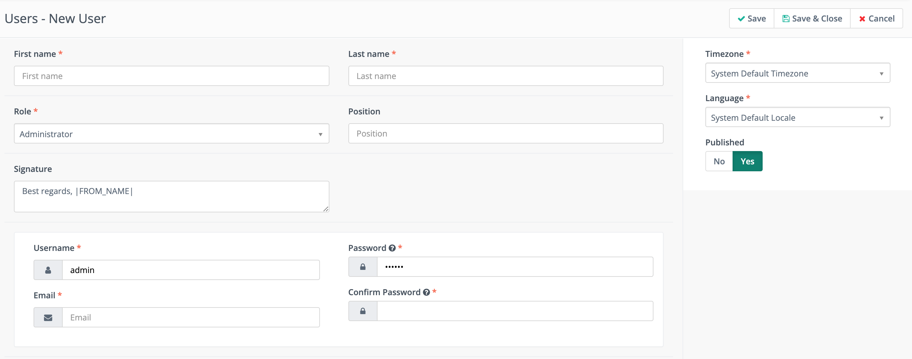

.. vale off

Managing Users
##############

.. vale on

An Administrator can manage Users with appropriate permissions in Mautic by accessing the settings cog wheel at the top right of the screen.

Create the User by completing all the mandatory fields, adding a signature if required, and assigning them a username and password. Always use a secure password for Users with access to your Mautic instance.

You can set up new Users in Mautic manually or through the API.

To set up a User manually:

1. Navigate to **Settings** > **Users**.

2. Click **+New** in the top right corner.

3. Fill in the appropriate fields for your User:
   
   * **First name** and **Last name** - Your User's first and last name.

   * **Roles** assigned based on permissions you grant.
  
   * **Signature** is only necessary if you're using the Mailer is owner feature in Mautic. 

   * **Position - optional** - Your User's job title.
  
   * **Username, Email, Password** are the login credentials. If a User forgets their password, they can use the Forgot password link, but you can manually change their password here.
  
.. note:: 

    Passwords must be at least six characters in length. Ensure that you use a combination of upper and lower case alphabets, special characters, and numbers.

* **Time zone** - Set the User's time zone, or use the default. Adding the User's time zone enables them to account for time zone differences for Email scheduling and other features.

* **Language** - Select a language for each User, to improve their experience in Mautic. 

When creating your Users, inform them of the credentials. Mautic doesn't send an Email notifying Users of their login information. Manually informing them is necessary.