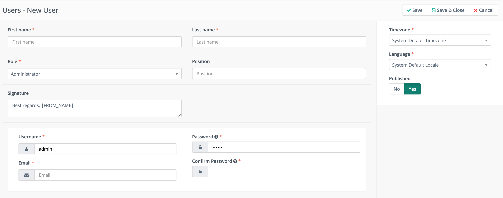

.. vale off

Managing Users
##############

.. vale on

An Administrator can manage Users with appropriate permissions in Mautic by accessing the settings cog wheel at the top right of the screen.

Create the User by completing all the mandatory fields, adding a signature if required, and assigning them a username and password. Always use a secure password for Users with access to your Mautic instance.

You can set up new Users in Mautic manually or through the API.

To set up a User manually:

1. Navigate to **Settings** > **Users**.

2. Click **+New** in the top right corner.

3. Fill in the appropriate fields for your User:
   
   * **First name** and **Last name** - Your User's first and last name.

   * **Roles** assigned based on permissions you grant.
  
   * **Signature** is only necessary if you're using the Mailer is owner feature in Mautic. 

   * **Position - optional** - Your User's job title.
  
   * **Username, Email, Password** are the login credentials. If a User forgets their password, they can use the Forgot password link, but you can manually change their password here.
  
.. note::

    Passwords must be at least six characters in length. Ensure that you use a combination of upper and lower case alphabets, special characters, and numbers.

.. note::

   .. vale off

   When you log in through SAML, Mautic hides the password fields on the User add and edit forms. SAML Users manage their passwords in the identity provider, not in Mautic. For more information, see :doc:`SAML Single Sign On </authentication/authentication>`.

   .. vale on

* **Time zone** - Set the User's time zone, or use the default. Adding the User's time zone enables them to account for time zone differences for Email scheduling and other features.

* **Language** - Select a language for each User, to improve their experience in Mautic. 

When creating your Users, inform them of the credentials. Mautic doesn't send an Email notifying Users of their login information. Manually informing them is necessary.

.. vale off

Inviting a User by Email
************************

.. vale on

Instead of creating a User manually and sharing credentials yourself, you can invite someone by Email. Mautic sends them an invitation link, and the invitee sets up their own account by choosing a username and password. This requires the **Create** permission for Users.

To invite a User:

.. vale off

#. Navigate to **Settings** > **Users**.
#. Click **Invite your team** at the top right of the table.

   |

   .. image:: images/invite_your_team_button_users_page.png
     :alt: Users page with the Invite your team button highlighted at the top right of the table.

   You can also find and select it from the profile menu.

   .. image:: images/invite_your_team_button_profile_menu.png
     :height: 300
     :alt: Profile menu in the top right of the screen with the Invite your team option highlighted.

   |

#. In the 'Collaborate with your organization' window, enter the **Email address** of the person you want to invite.
#. Select a **Role** to assign to the invited User.
#. Click **Send invite**.

   |

   .. image:: images/invite_your_team.png
     :width: 600
     :alt: Collaborate with your organization window showing the Email address field, the Role selector, and the Send invite button.

   |

.. vale on

Mautic sends an invitation Email to that address with a link to create an account. The link expires after 48 hours. If you invite the same Email address again, any earlier invitation for that address stops working.

.. note::

   You can only invite an Email address that doesn't already belong to an existing User. If the address is already in use, ask that person to sign in with their existing account instead.

.. vale off

Completing the invitation
=========================

When the invited person opens the link in the Email, Mautic shows a registration form where they finish setting up their account. The form pre-fills the Email address and Role from the invitation, and the invitee provides:

.. vale on

* **Username** - The name they use to log in.
* **First name** and **Last name** - The invitee's name.
* **Password** and **Confirm Password** - Their login password. Passwords must be at least six characters in length. Use a combination of upper and lower case letters, special characters, and numbers.
* **Language** - The language for their Mautic experience, or the system default.

.. vale off

After the invitee clicks **Create Account**, Mautic creates the User and redirects them to the login page, where they can sign in with their new credentials.

.. vale on